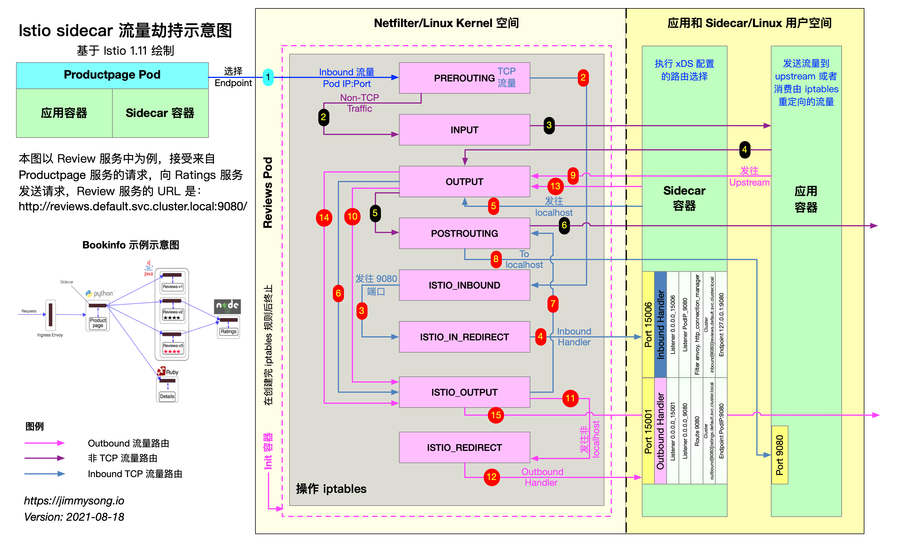

本文基于 Istio 1.11 版本，将为大家介绍以下内容：

- 什么是 sidecar 模式和它的优势在哪里。
- Istio 中是如何做 sidecar 注入的？
- Sidecar proxy 是如何做透明流量劫持的？
- 流量是如何路由到 upstream 的？

在此之前我曾写过基于 Istio 1.1 版本的[理解 Istio Service Mesh 中 Envoy 代理 Sidecar 注入及流量劫持](/blog/envoy-sidecar-injection-in-istio-service-mesh-deep-dive/)，Istio 1.11 与 Istio 1.1 中的 sidecar 注入和流量劫持环节最大的变化是：

- iptables 改用命令行工具，不再使用 shell 脚本。
- sidecar inbound 和 outbound 分别指定了端口，而之前是使用同一个端口（15001）。

## Sidecar 模式

将应用程序的功能划分为单独的进程运行在同一个最小调度单元中（例如 Kubernetes 中的 Pod）可以被视为 **sidecar 模式**。如下图所示，sidecar 模式允许您在应用程序旁边添加更多功能，而无需额外第三方组件配置或修改应用程序代码。


就像连接了 Sidecar 的三轮摩托车一样，在软件架构中， Sidecar 连接到父应用并且为其添加扩展或者增强功能。Sidecar 应用与主应用程序松散耦合。它可以屏蔽不同编程语言的差异，统一实现微服务的可观察性、监控、日志记录、配置、断路器等功能。

### 使用 Sidecar 模式的优势

使用 sidecar 模式部署服务网格时，无需在节点上运行代理，但是集群中将运行多个相同的 sidecar 副本。在 sidecar 部署方式中，每个应用的容器旁都会部署一个伴生容器（如 Envoy 或 MOSN），这个容器称之为 sidecar 容器。Sidecar 接管进出应用容器的所有流量。在 Kubernetes 的 Pod 中，在原有的应用容器旁边注入一个 Sidecar 容器，两个容器共享存储、网络等资源，可以广义的将这个包含了 sidecar 容器的 Pod 理解为一台主机，两个容器共享主机资源。

因其独特的部署结构，使得 sidecar 模式具有以下优势：

- 将与应用业务逻辑无关的功能抽象到共同基础设施，降低了微服务代码的复杂度。
- 因为不再需要编写相同的第三方组件配置文件和代码，所以能够降低微服务架构中的代码重复度。
- Sidecar 可独立升级，降低应用程序代码和底层平台的耦合度。

## Istio 中的 sidecar 注入

Istio 中提供了以下两种 sidecar 注入方式：

- 使用 `istioctl` 手动注入。
- 基于 Kubernetes 的 [突变 webhook 入驻控制器（mutating webhook addmission controller](https://kubernetes.io/docs/reference/access-authn-authz/admission-controllers/) 的自动 sidecar 注入方式。

不论是手动注入还是自动注入，sidecar 的注入过程都需要遵循如下步骤：

1. Kubernetes 需要了解待注入的 sidecar 所连接的 Istio 集群及其配置；
1. Kubernetes 需要了解待注入的 sidecar 容器本身的配置，如镜像地址、启动参数等；
1. Kubernetes 根据 sidecar 注入模板和以上配置填充 sidecar 的配置参数，将以上配置注入到应用容器的一侧；

使用下面的命令可以手动注入 sidecar。

```bash
istioctl kube-inject -f ${YAML_FILE} | kuebectl apply -f -
```

该命令会使用 Istio 内置的 sidecar 配置来注入，下面使用 Istio详细配置请参考 [Istio 官网](https://istio.io/latest/docs/setup/additional-setup/sidecar-injection/#manual-sidecar-injection)。

注入完成后您将看到 Istio 为原有 pod template 注入了 `initContainer` 及 sidecar proxy相关的配置。

### Init 容器

Init 容器是一种专用容器，它在应用程序容器启动之前运行，用来包含一些应用镜像中不存在的实用工具或安装脚本。

一个 Pod 中可以指定多个 Init 容器，如果指定了多个，那么 Init 容器将会按顺序依次运行。只有当前面的 Init 容器必须运行成功后，才可以运行下一个 Init 容器。当所有的 Init 容器运行完成后，Kubernetes 才初始化 Pod 和运行应用容器。

Init 容器使用 Linux Namespace，所以相对应用程序容器来说具有不同的文件系统视图。因此，它们能够具有访问 Secret 的权限，而应用程序容器则不能。

在 Pod 启动过程中，Init 容器会按顺序在网络和数据卷初始化之后启动。每个容器必须在下一个容器启动之前成功退出。如果由于运行时或失败退出，将导致容器启动失败，它会根据 Pod 的 `restartPolicy` 指定的策略进行重试。然而，如果 Pod 的 `restartPolicy` 设置为 Always，Init 容器失败时会使用 `RestartPolicy` 策略。

在所有的 Init 容器没有成功之前，Pod 将不会变成 `Ready` 状态。Init 容器的端口将不会在 Service中进行聚集。 正在初始化中的 Pod 处于 `Pending` 状态，但应该会将 `Initializing` 状态设置为 true。Init 容器运行完成以后就会自动终止。

关于 Init 容器的详细信息请参考 [Init 容器 - Kubernetes 中文指南/云原生应用架构实践手册](https://jimmysong.io/kubernetes-handbook/concepts/init-containers.html)。

## Sidecar 注入示例分析

以 Istio 官方提供的 `bookinfo` 中 `productpage` 的 YAML 为例，关于 `bookinfo` 应用的详细 YAML 配置请参考 [bookinfo.yaml](https://github.com/istio/istio/blob/master/samples/bookinfo/platform/kube/bookinfo.yaml)。

下文将从以下几个方面讲解：

- Sidecar 容器的注入
- iptables 规则的创建
- 路由的详细过程

```yaml
apiVersion: apps/v1
kind: Deployment
metadata:
  name: productpage-v1
  labels:
    app: productpage
    version: v1
spec:
  replicas: 1
  selector:
    matchLabels:
      app: productpage
      version: v1
  template:
    metadata:
      labels:
        app: productpage
        version: v1
    spec:
      serviceAccountName: bookinfo-productpage
      containers:
      - name: productpage
        image: docker.io/istio/examples-bookinfo-productpage-v1:1.15.0
        imagePullPolicy: IfNotPresent
        ports:
        - containerPort: 9080
        volumeMounts:
        - name: tmp
          mountPath: /tmp
      volumes:
      - name: tmp
        emptyDir: {}
```

再查看下 `productpage` 容器的 [Dockerfile](https://github.com/istio/istio/blob/master/samples/bookinfo/src/productpage/Dockerfile)。

```docker
FROM python:3.7.4-slim

COPY requirements.txt ./
RUN pip install --no-cache-dir -r requirements.txt

COPY test-requirements.txt ./
RUN pip install --no-cache-dir -r test-requirements.txt

COPY productpage.py /opt/microservices/
COPY tests/unit/* /opt/microservices/
COPY templates /opt/microservices/templates
COPY static /opt/microservices/static
COPY requirements.txt /opt/microservices/

ARG flood_factor
ENV FLOOD_FACTOR ${flood_factor:-0}

EXPOSE 9080
WORKDIR /opt/microservices
RUN python -m unittest discover

USER 1

CMD ["python", "productpage.py", "9080"]
```

我们看到 `Dockerfile` 中没有配置 `ENTRYPOINT`，所以 `CMD` 的配置 `python productpage.py 9080` 将作为默认的 `ENTRYPOINT`，记住这一点，再看下注入 sidecar 之后的配置。

```bash
$ istioctl kube-inject -f samples/bookinfo/platform/kube/bookinfo.yaml
```

我们只截取其中与 `productpage` 相关的 `Deployment` 配置中的部分 YAML 配置。

```yaml
      containers:
      - image: docker.io/istio/examples-bookinfo-productpage-v1:1.15.0 # 应用镜像
        name: productpage
        ports:
        - containerPort: 9080
      - args:
        - proxy
        - sidecar
        - --domain
        - $(POD_NAMESPACE).svc.cluster.local
        - --configPath
        - /etc/istio/proxy
        - --binaryPath
        - /usr/local/bin/envoy
        - --serviceCluster
        - productpage.$(POD_NAMESPACE)
        - --drainDuration
        - 45s
        - --parentShutdownDuration
        - 1m0s
        - --discoveryAddress
        - istiod.istio-system.svc:15012
        - --zipkinAddress
        - zipkin.istio-system:9411
        - --proxyLogLevel=warning
        - --proxyComponentLogLevel=misc:error
        - --connectTimeout
        - 10s
        - --proxyAdminPort
        - "15000"
        - --concurrency
        - "2"
        - --controlPlaneAuthPolicy
        - NONE
        - --dnsRefreshRate
        - 300s
        - --statusPort
        - "15020"
        - --trust-domain=cluster.local
        - --controlPlaneBootstrap=false
        image: docker.io/istio/proxyv2:1.5.1 # sidecar proxy
        name: istio-proxy
        ports:
        - containerPort: 15090
          name: http-envoy-prom
          protocol: TCP
      initContainers:
      - command:
        - istio-iptables
        - -p
        - "15001"
        - -z
        - "15006"
        - -u
        - "1337"
        - -m
        - REDIRECT
        - -i
        - '*'
        - -x
        - ""
        - -b
        - '*'
        - -d
        - 15090,15020
        image: docker.io/istio/proxyv2:1.5.1 # init 容器
        name: istio-init
```

Istio 给应用 Pod 注入的配置主要包括：

- Init 容器 `istio-init`：用于 pod 中设置 iptables 端口转发
- Sidecar 容器 `istio-proxy`：运行 sidecar 代理，如 Envoy 或 MOSN。

接下来将分别解析下这两个容器。

## Init 容器解析

Istio 在 pod 中注入的 Init 容器名为 `istio-init`，我们在上面 Istio 注入完成后的 YAML 文件中看到了该容器的启动命令是：

```bash
istio-iptables -p 15001 -z 15006 -u 1337 -m REDIRECT -i '*' -x "" -b '*' -d 15090,15020
```

我们再检查下该容器的 [Dockerfile](https://github.com/istio/istio/blob/master/pilot/docker/Dockerfile.proxyv2) 看看 `ENTRYPOINT` 是怎么确定启动时执行的命令。

```docker
# 前面的内容省略
# The pilot-agent will bootstrap Envoy.
ENTRYPOINT ["/usr/local/bin/pilot-agent"]
```

我们看到 `istio-init` 容器的入口是 `/usr/local/bin/istio-iptables` 命令行，该命令行工具的代码的位置在 Istio 源码仓库的 [tools/istio-iptables](https://github.com/istio/istio/tree/master/tools/istio-iptables) 目录。

注意：在 Istio 1.1 版本时还是使用 `isito-iptables.sh` 命令行来操作 IPtables。

### Init 容器启动入口

Init 容器的启动入口是 `istio-iptables` 命令行，该命令行工具的用法如下：

```bash
$ istio-iptables [flags]
  -p: 指定重定向所有 TCP 流量的 sidecar 端口（默认为 $ENVOY_PORT = 15001）
  -m: 指定入站连接重定向到 sidecar 的模式，“REDIRECT” 或 “TPROXY”（默认为 $ISTIO_INBOUND_INTERCEPTION_MODE)
  -b: 逗号分隔的入站端口列表，其流量将重定向到 Envoy（可选）。使用通配符 “*” 表示重定向所有端口。为空时表示禁用所有入站重定向（默认为 $ISTIO_INBOUND_PORTS）
  -d: 指定要从重定向到 sidecar 中排除的入站端口列表（可选），以逗号格式分隔。使用通配符“*” 表示重定向所有入站流量（默认为 $ISTIO_LOCAL_EXCLUDE_PORTS）
  -o：逗号分隔的出站端口列表，不包括重定向到 Envoy 的端口。
  -i: 指定重定向到 sidecar 的 IP 地址范围（可选），以逗号分隔的 CIDR 格式列表。使用通配符 “*” 表示重定向所有出站流量。空列表将禁用所有出站重定向（默认为 $ISTIO_SERVICE_CIDR）
  -x: 指定将从重定向中排除的 IP 地址范围，以逗号分隔的 CIDR 格式列表。使用通配符 “*” 表示重定向所有出站流量（默认为 $ISTIO_SERVICE_EXCLUDE_CIDR）。
  -k：逗号分隔的虚拟接口列表，其入站流量（来自虚拟机的）将被视为出站流量。
  -g：指定不应用重定向的用户的 GID。(默认值与 -u param 相同)
  -u：指定不应用重定向的用户的 UID。通常情况下，这是代理容器的 UID（默认值是 1337，即 istio-proxy 的 UID）。
  -z: 所有进入 pod/VM 的 TCP 流量应被重定向到的端口（默认 $INBOUND_CAPTURE_PORT = 15006）。
```

以上传入的参数都会重新组装成 [`iptables` ](https://wangchujiang.com/linux-command/c/iptables.html)规则，关于该命令的详细用法请访问 [tools/istio-iptables/pkg/cmd/root.go](https://github.com/istio/istio/blob/master/tools/istio-iptables/pkg/cmd/root.go)。

该容器存在的意义就是让 sidecar 代理可以拦截所有的进出 pod 的流量，15090 端口（Mixer 使用）和 15092 端口（Ingress Gateway）除外的所有入站（inbound）流量重定向到 15006 端口（sidecar），再拦截应用容器的出站（outbound）流量经过 sidecar 处理（通过 15001 端口监听）后再出站。关于 Istio 中端口用途请参考 [Istio 官方文档](https://istio.io/latest/zh/docs/ops/deployment/requirements/)。

**命令解析**

这条启动命令的作用是：

- 将应用容器的所有流量都转发到 sidecar 的 15006 端口。
- 使用 `istio-proxy` 用户身份运行， UID 为 1337，即 sidecar 所处的用户空间，这也是 `istio-proxy` 容器默认使用的用户，见 YAML 配置中的 `runAsUser` 字段。
- 使用默认的 `REDIRECT` 模式来重定向流量。
- 将所有出站流量都重定向到 sidecar 代理（通过 15001 端口）。

因为 Init 容器初始化完毕后就会自动终止，因为我们无法登陆到容器中查看 iptables 信息，但是 Init 容器初始化结果会保留到应用容器和 sidecar 容器中。

## iptables 注入解析

为了查看 iptables 配置，我们需要登陆到 sidecar 容器中使用 root 用户来查看，因为 `kubectl` 无法使用特权模式来远程操作 docker 容器，所以我们需要登陆到 `productpage` pod 所在的主机上使用 `docker` 命令登陆容器中查看。

如果您使用 minikube 部署的 Kubernetes，可以直接登录到 minikube 的虚拟机中并切换为 root 用户。查看 iptables 配置，列出 NAT（网络地址转换）表的所有规则，因为在 Init 容器启动的时候选择给 `istio-iptables` 传递的参数中指定将入站流量重定向到 sidecar 的模式为 `REDIRECT`，因此在 iptables 中将只有 NAT 表的规格配置，如果选择 `TPROXY` 还会有 `mangle` 表配置。`iptables` 命令的详细用法请参考 [iptables](https://wangchujiang.com/linux-command/c/iptables.html) 命令。

我们仅查看与 `productpage` 有关的 iptables 规则如下。

```bash
# 进入 minikube 并切换为 root 用户，minikube 默认用户为 docker
$ minikube ssh
$ sudo -i

# 查看 productpage pod 的 istio-proxy 容器中的进程
$ docker top `docker ps|grep "istio-proxy_productpage"|cut -d " " -f1`
UID                 PID                 PPID                C                   STIME               TTY                 TIME                CMD
1337                10576               10517               0                   08:09               ?                   00:00:07            /usr/local/bin/pilot-agent proxy sidecar --domain default.svc.cluster.local --configPath /etc/istio/proxy --binaryPath /usr/local/bin/envoy --serviceCluster productpage.default --drainDuration 45s --parentShutdownDuration 1m0s --discoveryAddress istiod.istio-system.svc:15012 --zipkinAddress zipkin.istio-system:9411 --proxyLogLevel=warning --proxyComponentLogLevel=misc:error --connectTimeout 10s --proxyAdminPort 15000 --concurrency 2 --controlPlaneAuthPolicy NONE --dnsRefreshRate 300s --statusPort 15020 --trust-domain=cluster.local --controlPlaneBootstrap=false
1337                10660               10576               0                   08:09               ?                   00:00:33            /usr/local/bin/envoy -c /etc/istio/proxy/envoy-rev0.json --restart-epoch 0 --drain-time-s 45 --parent-shutdown-time-s 60 --service-cluster productpage.default --service-node sidecar~172.17.0.16~productpage-v1-7f44c4d57c-ksf9b.default~default.svc.cluster.local --max-obj-name-len 189 --local-address-ip-version v4 --log-format [Envoy (Epoch 0)] [%Y-%m-%d %T.%e][%t][%l][%n] %v -l warning --component-log-level misc:error --concurrency 2

# 进入 nsenter 进入 sidecar 容器的命名空间（以上任何一个都可以）
$ nsenter -n --target 10660
```

在该进程的命名空间下查看其 iptables 规则链。

```bash
# 查看 NAT 表中规则配置的详细信息。
$ iptables -t nat -L -v
# PREROUTING 链：用于目标地址转换（DNAT），将所有入站 TCP 流量跳转到 ISTIO_INBOUND 链上。
Chain PREROUTING (policy ACCEPT 2701 packets, 162K bytes)
 pkts bytes target     prot opt in     out     source               destination
 2701  162K ISTIO_INBOUND  tcp  --  any    any     anywhere             anywhere

# INPUT 链：处理输入数据包，非 TCP 流量将继续 OUTPUT 链。
Chain INPUT (policy ACCEPT 2701 packets, 162K bytes)
 pkts bytes target     prot opt in     out     source               destination

# OUTPUT 链：将所有出站数据包跳转到 ISTIO_OUTPUT 链上。
Chain OUTPUT (policy ACCEPT 79 packets, 6761 bytes)
 pkts bytes target     prot opt in     out     source               destination
   15   900 ISTIO_OUTPUT  tcp  --  any    any     anywhere             anywhere

# POSTROUTING 链：所有数据包流出网卡时都要先进入POSTROUTING 链，内核根据数据包目的地判断是否需要转发出去，我们看到此处未做任何处理。
Chain POSTROUTING (policy ACCEPT 79 packets, 6761 bytes)
 pkts bytes target     prot opt in     out     source               destination

# ISTIO_INBOUND 链：将所有入站流量重定向到 ISTIO_IN_REDIRECT 链上，目的地为 15090（mixer 使用）和 15020（Ingress gateway 使用，用于 Pilot 健康检查）端口的流量除外，发送到以上两个端口的流量将返回 iptables 规则链的调用点，即 PREROUTING 链的后继 POSTROUTING。
Chain ISTIO_INBOUND (1 references)
 pkts bytes target     prot opt in     out     source               destination
    0     0 RETURN     tcp  --  any    any     anywhere             anywhere             tcp dpt:ssh
    2   120 RETURN     tcp  --  any    any     anywhere             anywhere             tcp dpt:15090
 2699  162K RETURN     tcp  --  any    any     anywhere             anywhere             tcp dpt:15020
    0     0 ISTIO_IN_REDIRECT  tcp  --  any    any     anywhere             anywhere

# ISTIO_IN_REDIRECT 链：将所有的入站流量跳转到本地的 15006 端口，至此成功的拦截了流量到 sidecar 中。
Chain ISTIO_IN_REDIRECT (3 references)
 pkts bytes target     prot opt in     out     source               destination
    0     0 REDIRECT   tcp  --  any    any     anywhere             anywhere             redir ports 15006

# ISTIO_OUTPUT 链：选择需要重定向到 Envoy（即本地） 的出站流量，所有非 localhost 的流量全部转发到 ISTIO_REDIRECT。为了避免流量在该 Pod 中无限循环，所有到 istio-proxy 用户空间的流量都返回到它的调用点中的下一条规则，本例中即 OUTPUT 链，因为跳出 ISTIO_OUTPUT 规则之后就进入下一条链 POSTROUTING。如果目的地非 localhost 就跳转到 ISTIO_REDIRECT；如果流量是来自 istio-proxy 用户空间的，那么就跳出该链，返回它的调用链继续执行下一条规则（OUTPUT 的下一条规则，无需对流量进行处理）；所有的非 istio-proxy 用户空间的目的地是 localhost 的流量就跳转到 ISTIO_REDIRECT。
Chain ISTIO_OUTPUT (1 references)
 pkts bytes target     prot opt in     out     source               destination
    0     0 RETURN     all  --  any    lo      127.0.0.6            anywhere
    0     0 ISTIO_IN_REDIRECT  all  --  any    lo      anywhere            !localhost            owner UID match 1337
    0     0 RETURN     all  --  any    lo      anywhere             anywhere             ! owner UID match 1337
   15   900 RETURN     all  --  any    any     anywhere             anywhere             owner UID match 1337
    0     0 ISTIO_IN_REDIRECT  all  --  any    lo      anywhere            !localhost            owner GID match 1337
    0     0 RETURN     all  --  any    lo      anywhere             anywhere             ! owner GID match 1337
    0     0 RETURN     all  --  any    any     anywhere             anywhere             owner GID match 1337
    0     0 RETURN     all  --  any    any     anywhere             localhost
    0     0 ISTIO_REDIRECT  all  --  any    any     anywhere             anywhere

# ISTIO_REDIRECT 链：将所有流量重定向到 Sidecar（即本地） 的 15001 端口。
Chain ISTIO_REDIRECT (1 references)
 pkts bytes target     prot opt in     out     source               destination
    0     0 REDIRECT   tcp  --  any    any     anywhere             anywhere             redir ports 15001
```

下图展示的是 `productpage` 服务请求访问 `http://reviews.default.svc.cluster.local:9080/`，当流量进入 `reviews` 服务内部时，`reviews` 服务内部的 sidecar proxy 是如何做流量拦截和路由转发的。



第一步开始时，`productpage` Pod 中的 sidecar 已经通过 EDS 选择出了要请求的 `reviews` 服务的一个 Pod，知晓了其 IP 地址，发送 TCP 连接请求。

`reviews` 服务有三个版本，每个版本有一个实例，三个版本中的 sidecar 工作步骤类似，下文只以其中一个 Pod 中的 sidecar 流量转发步骤来说明。

### 理解 iptables

`iptables` 是 Linux 内核中的防火墙软件 netfilter 的管理工具，位于用户空间，同时也是 netfilter 的一部分。Netfilter 位于内核空间，不仅有网络地址转换的功能，也具备数据包内容修改、以及数据包过滤等防火墙功能。

在了解 Init 容器初始化的 iptables 之前，我们先来了解下 iptables 和规则配置。

下图展示了 iptables 调用链。


### iptables 中的表

Init 容器中使用的的 iptables 版本是 `v1.6.0`，共包含 5 张表：

1. `raw` 用于配置数据包，`raw` 中的数据包不会被系统跟踪。
1. `filter` 是用于存放所有与防火墙相关操作的默认表。
1. `nat` 用于 [网络地址转换](https://en.wikipedia.org/wiki/Network_address_translation)（例如：端口转发）。
1. `mangle` 用于对特定数据包的修改（参考[损坏数据包](https://en.wikipedia.org/wiki/Mangled_packet)）。
1. `security` 用于[强制访问控制](https://wiki.archlinux.org/index.php/Security#Mandatory_access_control) 网络规则。

**注**：在本示例中只用到了 `nat` 表。

不同的表中的具有的链类型如下表所示：

| 规则名称    | raw  | filter | nat  | mangle | security |
| ----------- | ---- | ------ | ---- | ------ | -------- |
| PREROUTING  | ✓    |        | ✓    | ✓      |          |
| INPUT       |      | ✓      | ✓    | ✓      | ✓        |
| OUTPUT      |      | ✓      | ✓    | ✓      | ✓        |
| POSTROUTING |      |        | ✓    | ✓      |          |
| FORWARD     | ✓    | ✓      |      | ✓      | ✓        |

### 理解 iptables 规则

查看 `istio-proxy` 容器中的默认的 iptables 规则，默认查看的是 filter 表中的规则。

```bash
$ iptables -L -v
Chain INPUT (policy ACCEPT 350K packets, 63M bytes)
 pkts bytes target     prot opt in     out     source               destination

Chain FORWARD (policy ACCEPT 0 packets, 0 bytes)
 pkts bytes target     prot opt in     out     source               destination

Chain OUTPUT (policy ACCEPT 18M packets, 1916M bytes)
 pkts bytes target     prot opt in     out     source               destination
```

我们看到三个默认的链，分别是 INPUT、FORWARD 和 OUTPUT，每个链中的第一行输出表示链名称（在本例中为INPUT/FORWARD/OUTPUT），后跟默认策略（ACCEPT）。

下图是 iptables 的建议结构图，流量在经过 INPUT 链之后就进入了上层协议栈，比如

每条链中都可以添加多条规则，规则是按照顺序从前到后执行的。我们来看下规则的表头定义。

- **pkts**：处理过的匹配的报文数量
- **bytes**：累计处理的报文大小（字节数）
- **target**：如果报文与规则匹配，指定目标就会被执行。
- **prot**：协议，例如 `tdp`、`udp`、`icmp` 和 `all`。
- **opt**：很少使用，这一列用于显示 IP 选项。
- **in**：入站网卡。
- **out**：出站网卡。
- **source**：流量的源 IP 地址或子网，后者是 `anywhere`。
- **destination**：流量的目的地 IP 地址或子网，或者是 `anywhere`。

还有一列没有表头，显示在最后，表示规则的选项，作为规则的扩展匹配条件，用来补充前面的几列中的配置。`prot`、`opt`、`in`、`out`、`source` 和 `destination` 和显示在 `destination` 后面的没有表头的一列扩展条件共同组成匹配规则。当流量匹配这些规则后就会执行 `target`。

**target 支持的类型**

`target` 类型包括 ACCEPT`、REJECT`、`DROP`、`LOG` 、`SNAT`、`MASQUERADE`、`DNAT`、`REDIRECT`、`RETURN` 或者跳转到其他规则等。只要执行到某一条链中只有按照顺序有一条规则匹配后就可以确定报文的去向了，除了 `RETURN` 类型，类似编程语言中的 `return` 语句，返回到它的调用点，继续执行下一条规则。`target` 支持的配置详解请参考 [iptables 详解（1）：iptables 概念](http://www.zsythink.net/archives/1199)。

从输出结果中可以看到 Init 容器没有在 iptables 的默认链路中创建任何规则，而是创建了新的链路。

## 流量路由过程详解

流量路由分为 Inbound 和 Outbound 两个过程，下面将根据上文中的示例及 sidecar 的配置为读者详细分析此过程。

### 理解 Inbound Handler

Inbound handler 的作用是将 iptables 拦截到的 downstream 的流量转交给 localhost，与 Pod 内的应用程序容器建立连接。假设其中一个 Pod 的名字是 `reviews-v1-54b8794ddf-jxksn`，运行 `istioctl proxy-config listener reviews-v1-54b8794ddf-jxksn` 查看该 Pod 中的具有哪些 Listener。

```ini
ADDRESS            PORT      TYPE
172.17.0.15        9080      HTTP <--- 接收所有 Inbound HTTP 流量，该地址即为业务进程的真实监听地址
172.17.0.15        15020     TCP <--- Ingress Gateway，Pilot 健康检查
10.109.20.166      15012     TCP <--- Istiod http dns
10.103.34.135      14250     TCP <--+
10.103.34.135      14267     TCP    |
10.103.34.135      14268     TCP    |
10.104.122.175     15020     TCP    |
10.104.122.175     15029     TCP    |
10.104.122.175     15030     TCP    |
10.104.122.175     15031     TCP    |
10.104.122.175     15032     TCP    |
10.104.122.175     15443     TCP    |
10.104.122.175     31400     TCP    | 接收与 0.0.0.0:15001 监听器配对的 Outbound 流量
10.104.122.175     443       TCP    |
10.104.62.18       15443     TCP    |
10.104.62.18       443       TCP    |
10.106.201.253     16686     TCP    |
10.109.20.166      443       TCP    |
10.96.0.1          443       TCP    |
10.96.0.10         53        TCP    |
10.96.0.10         9153      TCP    |
10.98.184.149      15011     TCP    |
10.98.184.149      15012     TCP    |
10.98.184.149      443       TCP    |
0.0.0.0            14250     TCP    |
0.0.0.0            15010     TCP    |
0.0.0.0            15014     TCP    |
0.0.0.0            15090     HTTP   |
0.0.0.0            20001     TCP    |
0.0.0.0            3000      TCP    |
0.0.0.0            80        TCP    |
0.0.0.0            8080      TCP    |
0.0.0.0            9080      TCP    |
0.0.0.0            9090      TCP    |
0.0.0.0            9411      TCP <--+
0.0.0.0            15001     TCP <--- 接收所有经 iptables 拦截的 Outbound 流量并转交给虚拟监听器处理
0.0.0.0            15006     TCP <--- 接收所有经 iptables 拦截的 Inbound 流量并转交给虚拟监听器处理
```

当来自 `productpage` 的流量抵达 `reviews` Pod 的时候，downstream 已经明确知道 Pod 的 IP 地址为 `172.17.0.16` 所以才会访问该 Pod，所以该请求是 `172.17.0.15:9080`。

**`virtualInbound` Listener**

从该 Pod 的 Listener 列表中可以看到，`0.0.0.0:15006/TCP` 的 Listener（其实际名字是 `virtualInbound`）监听所有的 Inbound 流量，下面是该 Listener 的详细配置。

```json
{
    "name": "virtualInbound",
    "address": {
        "socketAddress": {
            "address": "0.0.0.0",
            "portValue": 15006
        }
    },
"filterChains": [
    {
        "filters": [
        /*省略部分内容*/
              {
            "filterChainMatch": {
                "destinationPort": 9080,
                "prefixRanges": [
                    {
                        "addressPrefix": "172.17.0.15",
                        "prefixLen": 32
                    }
                ],
                "applicationProtocols": [
                    "istio-peer-exchange",
                    "istio",
                    "istio-http/1.0",
                    "istio-http/1.1",
                    "istio-h2"
                ]
            },
            "filters": [
                {
                    "name": "envoy.filters.network.metadata_exchange",
                    "config": {
                        "protocol": "istio-peer-exchange"
                    }
                },
                {
                    "name": "envoy.http_connection_manager",
                    "typedConfig": {
                        "@type": "type.googleapis.com/envoy.config.filter.network.http_connection_manager.v2.HttpConnectionManager",
                        "statPrefix": "inbound_172.17.0.15_9080",
                        "routeConfig": {
                            "name": "inbound|9080|http|reviews.default.svc.cluster.local",
                            "virtualHosts": [
                                {
                                    "name": "inbound|http|9080",
                                    "domains": [
                                        "*"
                                    ],
                                    "routes": [
                                        {
                                            "name": "default",
                                            "match": {
                                                "prefix": "/"
                                            },
                                            "route": {
                                                "cluster": "inbound|9080|http|reviews.default.svc.cluster.local",
                                                "timeout": "0s",
                                                "maxGrpcTimeout": "0s"
                                            },
                                            "decorator": {
                                                "operation": "reviews.default.svc.cluster.local:9080/*"
                                            }
                                        }
                                    ]
                                }
                            ],
                            "validateClusters": false
                        }
  /*省略部分内容*/
}
```

Inbound handler 的流量被 `virtualInbound` Listener 转移到 `172.17.0.15_9080` Listener，我们在查看下该 Listener 配置。

运行 `istioctl pc listener reviews-v1-54b8794ddf-jxksn --address 172.17.0.15 --port 9080 -o json` 查看。

```json
[
    {
        "name": "172.17.0.15_9080",
        "address": {
            "socketAddress": {
                "address": "172.17.0.15",
                "portValue": 9080
            }
        },
        "filterChains": [
            {
                "filterChainMatch": {
                    "applicationProtocols": [
                        "istio-peer-exchange",
                        "istio",
                        "istio-http/1.0",
                        "istio-http/1.1",
                        "istio-h2"
                    ]
                },
            "filters": [
                {
                    "name": "envoy.http_connection_manager",
                    "config": {
                        ... 
                    "routeConfig": {
                                "name": "inbound|9080|http|reviews.default.svc.cluster.local",
                                "virtualHosts": [
                                    {
                                        "name": "inbound|http|9080",
                                        "domains": [
                                            "*"
                                        ],
                                        "routes": [
                                            {
                                                "name": "default",
                                                "match": {
                                                    "prefix": "/"
                                                },
                                                "route": {
                                                    "cluster": "inbound|9080|http|reviews.default.svc.cluster.local",
                                                    "timeout": "0s",
                                                    "maxGrpcTimeout": "0s"
                                                },
                                                "decorator": {
                                                    "operation": "reviews.default.svc.cluster.local:9080/*"
                                                }
                                            }
                                        ]
                                    }
                                ],
            }
        ...
        },
        {
            "filterChainMatch": {
                "transportProtocol": "tls"
            },
            "tlsContext": {...
            },
            "filters": [...
            ]
        }
    ],
...
}]
```

我们看其中的 `filterChains.filters` 中的 `envoy.http_connection_manager` 配置部分，该配置表示流量将转交给Cluster`inbound|9080|http|reviews.default.svc.cluster.local` 处理。

**[Cluster](https://www.servicemesher.com/istio-handbook/GLOSSARY.html#cluster) `inbound|9080|http|reviews.default.svc.cluster.local`**

运行 `istioctl proxy-config cluster reviews-v1-54b8794ddf-jxksn --fqdn reviews.default.svc.cluster.local --direction inbound -o json` 查看该Cluster的配置如下。

```json
[
    {
        "name": "inbound|9080|http|reviews.default.svc.cluster.local",
        "type": "STATIC",
        "connectTimeout": "1s",
        "loadAssignment": {
            "clusterName": "inbound|9080|http|reviews.default.svc.cluster.local",
            "endpoints": [
                {
                    "lbEndpoints": [
                        {
                            "endpoint": {
                                "address": {
                                    "socketAddress": {
                                        "address": "127.0.0.1",
                                        "portValue": 9080
                                    }
                                }
                            }
                        }
                    ]
                }
            ]
        },
        "circuitBreakers": {
            "thresholds": [
                {
                    "maxConnections": 4294967295,
                    "maxPendingRequests": 4294967295,
                    "maxRequests": 4294967295,
                    "maxRetries": 4294967295
                }
            ]
        }
    }
]
```

可以看到该Cluster的 Endpoint 直接对应的就是 localhost，再经过 iptables 转发流量就被应用程序容器消费了。

### 理解 Outbound Handler

因为 `reviews` 会向 `ratings` 服务发送 HTTP 请求，请求的地址是：`http://ratings.default.svc.cluster.local:9080/`，Outbound handler 的作用是将 iptables 拦截到的本地应用程序发出的流量，经由 sidecar 判断如何路由到 upstream。

应用程序容器发出的请求为 Outbound 流量，被 iptables 劫持后转移给 Outbound handler 处理，然后经过 `virtualOutbound` Listener、`0.0.0.0_9080` Listener，然后通过 Route 9080 找到 upstream 的 cluster，进而通过 EDS 找到 Endpoint 执行路由动作。

**Route `ratings.default.svc.cluster.local:9080`**

`reviews` 会请求 `ratings` 服务，运行 `istioctl proxy-config routes reviews-v1-54b8794ddf-jxksn --name 9080 -o json` 查看 route 配置，因为 sidecar 会根据 HTTP header 中的 domains 来匹配 VirtualHost，所以下面只列举了 `ratings.default.svc.cluster.local:9080` 这一个 VirtualHost。

```json
[{
  {
      "name": "ratings.default.svc.cluster.local:9080",
      "domains": [
          "ratings.default.svc.cluster.local",
          "ratings.default.svc.cluster.local:9080",
          "ratings",
          "ratings:9080",
          "ratings.default.svc.cluster",
          "ratings.default.svc.cluster:9080",
          "ratings.default.svc",
          "ratings.default.svc:9080",
          "ratings.default",
          "ratings.default:9080",
          "10.98.49.62",
          "10.98.49.62:9080"
      ],
      "routes": [
          {
              "name": "default",
              "match": {
                  "prefix": "/"
              },
              "route": {
                  "cluster": "outbound|9080||ratings.default.svc.cluster.local",
                  "timeout": "0s",
                  "retryPolicy": {
                      "retryOn": "connect-failure,refused-stream,unavailable,cancelled,resource-exhausted,retriable-status-codes",
                      "numRetries": 2,
                      "retryHostPredicate": [
                          {
                              "name": "envoy.retry_host_predicates.previous_hosts"
                          }
                      ],
                      "hostSelectionRetryMaxAttempts": "5",
                      "retriableStatusCodes": [
                          503
                      ]
                  },
                  "maxGrpcTimeout": "0s"
              },
              "decorator": {
                  "operation": "ratings.default.svc.cluster.local:9080/*"
              }
          }
      ]
  },
..]
```

从该 Virtual Host 配置中可以看到将流量路由到Cluster`outbound|9080||ratings.default.svc.cluster.local`。

**Endpoint `outbound|9080||ratings.default.svc.cluster.local`**

运行 `istioctl proxy-config endpoint reviews-v1-54b8794ddf-jxksn --port 9080 -o json` 查看 Endpoint 配置，我们只选取其中的 `outbound|9080||ratings.default.svc.cluster.local`Cluster的结果如下。

```json
{
  "clusterName": "outbound|9080||ratings.default.svc.cluster.local",
  "endpoints": [
    {
      "locality": {

      },
      "lbEndpoints": [
        {
          "endpoint": {
            "address": {
              "socketAddress": {
                "address": "172.33.100.2",
                "portValue": 9080
              }
            }
          },
          "metadata": {
            "filterMetadata": {
              "istio": {
                  "uid": "kubernetes://ratings-v1-8558d4458d-ns6lk.default"
                }
            }
          }
        }
      ]
    }
  ]
}
```

Endpoint 可以是一个或多个，sidecar 将根据一定规则选择适当的 Endpoint 来路由。至此 Review 服务找到了它 upstream 服务 Rating 的 Endpoint。

## 小结

本文使用了 Istio 官方提供的 bookinfo 示例，按图索骥得带领读者了解了 sidecar 注入、iptables 透明流量劫持及 sidecar 中流量路由背后的实现细节。Sidecar 模式和流量透明劫持是 Istio 服务网格的特色和基础功能，理解该功能的背后过程及实现细节，将有助于大家理解 Service Mesh 的原理和 [Istio Handbook](https://www.servicemesher.com/istio-handbook/) 后面章节中的内容，因此希望读者可以在自己的环境中从头来试验一遍以加深理解。

使用 iptables 做流量劫持只是 service mesh 的数据平面中做流量劫持的方式之一，还有更多的流量劫持方案，下面引用自 [云原生网络代理 MOSN 官网中给出的流量劫持](https://mosn.io/docs/concept/traffic-hijack/)部分的描述。

### 使用 iptables 做流量劫持时存在的问题

目前 Istio 使用 iptables 实现透明劫持，主要存在以下三个问题：

1. 需要借助于 conntrack 模块实现连接跟踪，在连接数较多的情况下，会造成较大的消耗，同时可能会造成 track 表满的情况，为了避免这个问题，业内有关闭 conntrack 的做法。
1. iptables 属于常用模块，全局生效，不能显式的禁止相关联的修改，可管控性比较差。
1. iptables 重定向流量本质上是通过 loopback 交换数据，outbond 流量将两次穿越协议栈，在大并发场景下会损失转发性能。

上述几个问题并非在所有场景中都存在，比方说某些场景下，连接数并不多，且 NAT 表未被使用到的情况下，iptables 是一个满足要求的简单方案。为了适配更加广泛的场景，透明劫持需要解决上述三个问题。

### 透明劫持方案优化

**使用 tproxy 处理 inbound 流量**

tproxy 可以用于 inbound 流量的重定向，且无需改变报文中的目的 IP/端口，不需要执行连接跟踪，不会出现 conntrack 模块创建大量连接的问题。受限于内核版本，tproxy 应用于 outbound 存在一定缺陷。目前 Istio 支持通过 tproxy 处理 inbound 流量。

**使用 hook connect 处理 outbound 流量**

为了适配更多应用场景，outbound 方向通过 hook connect 来实现，实现原理如下：


无论采用哪种透明劫持方案，均需要解决获取真实目的 IP/端口的问题，使用 iptables 方案通过 getsockopt 方式获取，tproxy 可以直接读取目的地址，通过修改调用接口，hook connect 方案读取方式类似于 tproxy。

实现透明劫持后，在内核版本满足要求（4.16以上）的前提下，通过 sockmap 可以缩短报文穿越路径，进而改善 outbound 方向的转发性能。

## 参考

- [Debugging Envoy and Istiod - istio.io](https://istio.io/latest/docs/ops/diagnostic-tools/proxy-cmd/)
- [揭开 Istio Sidecar 注入模型的神秘面纱 - istio.io](https://istio.io/latest/zh/blog/2019/data-plane-setup/)
- [MOSN 作为 Sidecar 使用时的流量劫持方案 - mosn.io](https://mosn.io/docs/concept/traffic-hijack/)
