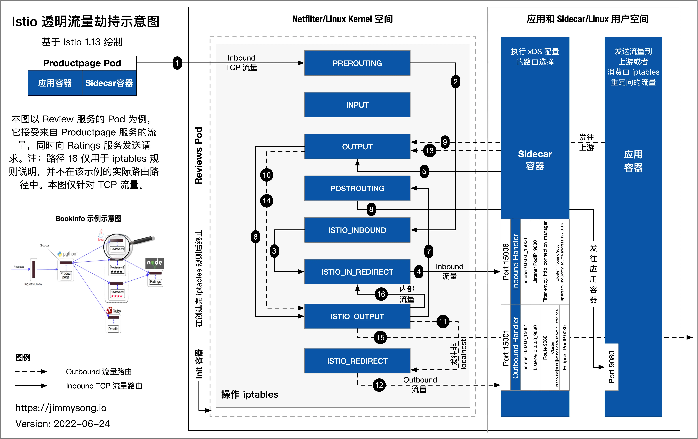
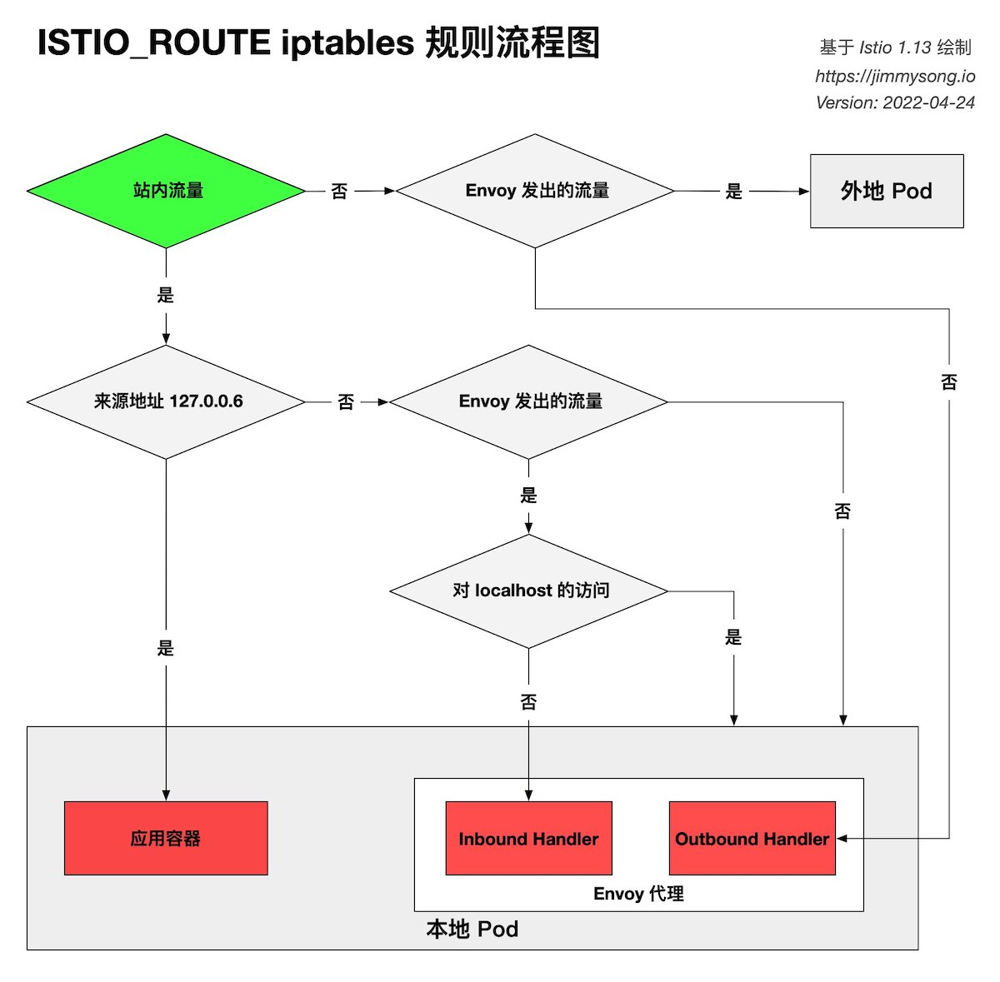
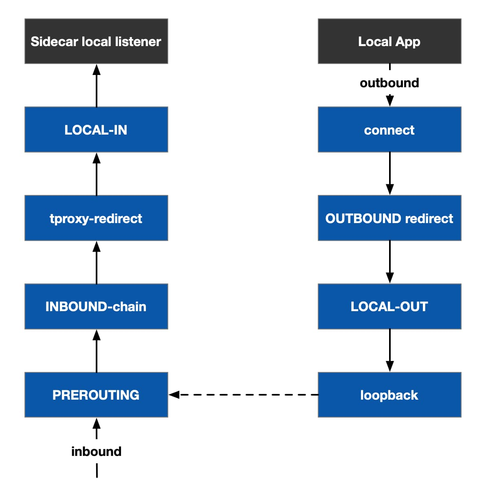

本文最早是基于 Istio 1.11 撰写，之后随着 Istio 的版本陆续更新，最新更新时间为 2022 年 5 月 12 日，关于本文历史版本的更新说明请见文章最后。本文记录了详细的实践过程，力图能够让读者复现，因此事无巨细，想要理解某个部分过程的读者可以使用目录跳转到对应的小节阅读。

为了使读者能够更加直观的了解本文中执行的操作，在阅读本文前你也可以先观看下 [Istio Workshop 第八讲视频](https://bilibili.com/video/BV1cF411T72o/)。

[](https://bilibili.com/video/BV1cF411T72o/)

为了理解本文希望你先阅读以下内容：

- [理解 iptables](/blog/understanding-iptables/)
- [Istio 数据平面 Pod 启动过程详解](/blog/istio-pod-process-lifecycle/)

## 内容介绍

本文基于 Istio 1.13 版本，将为大家介绍以下内容：

- 什么是 sidecar 模式和它的优势在哪里。
- Istio 中是如何做 sidecar 注入的。
- Sidecar 代理是如何做透明流量劫持的。
- iptables 的路由规则。
- Envoy 代理是如何路由流量到上游的。

请大家结合下图理解本文中的内容，本图基于 Istio 官方提供的 Bookinfo 示例绘制，展示的是 `reviews` Pod 的内部结构，包括 Linux Kernel 空间中的 iptables 规则、Sidecar 容器、应用容器。



`productpage` 访问 `reviews` Pod，入站流量处理过程对应于图示上的步骤：1、2、3、4、Envoy Inbound Handler、5、6、7、8、应用容器。

`reviews` Pod 访问 `rating` 服务的出站流量处理过程对应于图示上的步骤是：9、10、11、12、Envoy Outbound Handler、13、14、15。

注意：图中的路径 16 近用于路由规则说明，它不不出现在当前示例中。实际上仅当 Pod 内发出的对当前 Pod 内的服务访问的时候才会途径它。

上图中关于流量路由部分，包含：

-  `productpage` 服务请求访问 `http://reviews.default.svc.cluster.local:9080/`，当流量进入 `reviews` Pod 内部时，流量是如何被 iptables 劫持到 Envoy 代理被 Inbound Handler 处理的；
- `reviews` 请求访问 `ratings` 服务的 Pod，应用程序发出的出站流量被 iptables 劫持到 Envoy 代理的 Outbound Handler 的处理。

在阅读下文时，请大家确立以下已知点：

- 首先，`productpage` 发出的对 `reivews` 的访问流量，是在 Envoy 已经通过 EDS 选择出了要请求的 `reviews` 服务的某个 Pod，知晓了其 IP 地址，直接向该 IP 发送的 TCP 连接请求。
- `reviews` 服务有三个版本，每个版本有一个实例，三个版本中的 sidecar 工作步骤类似，下文只以其中一个 Pod 中的 sidecar 流量转发步骤来说明。
- 所有进入 `reviews` Pod 的 TCP 流量都根据 Pod 中的 iptables 规则转发到了 Envoy 代理的 15006 端口，然后经过 Envoy 的处理确定转发给 Pod 内的应用容器还是透传。

## Sidecar 模式

将应用程序的功能划分为单独的进程运行在同一个最小调度单元中（例如 Kubernetes 中的 Pod）可以被视为 **sidecar 模式**。如下图所示，sidecar 模式允许您在应用程序旁边添加更多功能，而无需额外第三方组件配置或修改应用程序代码。


就像连接了 Sidecar 的三轮摩托车一样，在软件架构中， Sidecar 连接到父应用并且为其添加扩展或者增强功能。Sidecar 应用与主应用程序松散耦合。它可以屏蔽不同编程语言的差异，统一实现微服务的可观察性、监控、日志记录、配置、断路器等功能。

### 使用 Sidecar 模式的优势

使用 sidecar 模式部署服务网格时，无需在节点上运行代理，但是集群中将运行多个相同的 sidecar 副本。在 sidecar 部署方式中，每个应用的容器旁都会部署一个伴生容器（如 Envoy 或 MOSN），这个容器称之为 sidecar 容器。Sidecar 接管进出应用容器的所有流量。在 Kubernetes 的 Pod 中，在原有的应用容器旁边注入一个 Sidecar 容器，两个容器共享存储、网络等资源，可以广义的将这个包含了 sidecar 容器的 Pod 理解为一台主机，两个容器共享主机资源。

因其独特的部署结构，使得 sidecar 模式具有以下优势：

- 将与应用业务逻辑无关的功能抽象到共同基础设施，降低了微服务代码的复杂度。
- 因为不再需要编写相同的第三方组件配置文件和代码，所以能够降低微服务架构中的代码重复度。
- Sidecar 可独立升级，降低应用程序代码和底层平台的耦合度。

## Sidecar 注入示例分析

以 Istio 官方提供的 `bookinfo` 中 `productpage` 的 YAML 为例，关于 `bookinfo` 应用的详细 YAML 配置请参考 [bookinfo.yaml](https://github.com/istio/istio/blob/master/samples/bookinfo/platform/kube/bookinfo.yaml)。

下文将从以下几个方面讲解：

- Sidecar 容器的注入
- iptables 规则的创建
- 路由的详细过程

```yaml
apiVersion: apps/v1
kind: Deployment
metadata:
  name: productpage-v1
  labels:
    app: productpage
    version: v1
spec:
  replicas: 1
  selector:
    matchLabels:
      app: productpage
      version: v1
  template:
    metadata:
      labels:
        app: productpage
        version: v1
    spec:
      serviceAccountName: bookinfo-productpage
      containers:
      - name: productpage
        image: docker.io/istio/examples-bookinfo-productpage-v1:1.15.0
        imagePullPolicy: IfNotPresent
        ports:
        - containerPort: 9080
        volumeMounts:
        - name: tmp
          mountPath: /tmp
      volumes:
      - name: tmp
        emptyDir: {}
```

再查看下 `productpage` 容器的 [Dockerfile](https://github.com/istio/istio/blob/master/samples/bookinfo/src/productpage/Dockerfile)。

```docker
FROM python:3.7.4-slim

COPY requirements.txt ./
RUN pip install --no-cache-dir -r requirements.txt

COPY test-requirements.txt ./
RUN pip install --no-cache-dir -r test-requirements.txt

COPY productpage.py /opt/microservices/
COPY tests/unit/* /opt/microservices/
COPY templates /opt/microservices/templates
COPY static /opt/microservices/static
COPY requirements.txt /opt/microservices/

ARG flood_factor
ENV FLOOD_FACTOR ${flood_factor:-0}

EXPOSE 9080
WORKDIR /opt/microservices
RUN python -m unittest discover

USER 1

CMD ["python", "productpage.py", "9080"]
```

我们看到 `Dockerfile` 中没有配置 `ENTRYPOINT`，所以 `CMD` 的配置 `python productpage.py 9080` 将作为默认的 `ENTRYPOINT`，记住这一点，再看下注入 sidecar 之后的配置。

```bash
$ istioctl kube-inject -f samples/bookinfo/platform/kube/bookinfo.yaml
```

我们只截取其中与 `productpage` 相关的 `Deployment` 配置中的部分 YAML 配置。

```yaml
      containers:
      - image: docker.io/istio/examples-bookinfo-productpage-v1:1.15.0 # 应用镜像
        name: productpage
        ports:
        - containerPort: 9080
      - args:
        - proxy
        - sidecar
        - --domain
        - $(POD_NAMESPACE).svc.cluster.local
        - --configPath
        - /etc/istio/proxy
        - --binaryPath
        - /usr/local/bin/envoy
        - --serviceCluster
        - productpage.$(POD_NAMESPACE)
        - --drainDuration
        - 45s
        - --parentShutdownDuration
        - 1m0s
        - --discoveryAddress
        - istiod.istio-system.svc:15012
        - --zipkinAddress
        - zipkin.istio-system:9411
        - --proxyLogLevel=warning
        - --proxyComponentLogLevel=misc:error
        - --connectTimeout
        - 10s
        - --proxyAdminPort
        - "15000"
        - --concurrency
        - "2"
        - --controlPlaneAuthPolicy
        - NONE
        - --dnsRefreshRate
        - 300s
        - --statusPort
        - "15020"
        - --trust-domain=cluster.local
        - --controlPlaneBootstrap=false
        image: docker.io/istio/proxyv2:1.5.1 # sidecar proxy
        name: istio-proxy
        ports:
        - containerPort: 15090
          name: http-envoy-prom
          protocol: TCP
      initContainers:
      - command:
        - istio-iptables
        - -p
        - "15001"
        - -z
        - "15006"
        - -u
        - "1337"
        - -m
        - REDIRECT
        - -i
        - '*'
        - -x
        - ""
        - -b
        - '*'
        - -d
        - 15090,15020
        image: docker.io/istio/proxyv2:1.5.1 # init 容器
        name: istio-init
```

Istio 给应用 Pod 注入的配置主要包括：

- Init 容器 `istio-init`：用于 pod 中设置 iptables 端口转发
- Sidecar 容器 `istio-proxy`：运行 sidecar 代理，如 Envoy 或 MOSN。

## iptables 规则注入解析

为了查看 iptables 配置，我们需要登陆到 sidecar 容器中使用 root 用户来查看，因为 `kubectl` 无法使用特权模式来远程操作 docker 容器，所以我们需要登陆到 `productpage` pod 所在的主机上使用 `docker` 命令登陆容器中查看。

如果您使用 minikube 部署的 Kubernetes，可以直接登录到 minikube 的虚拟机中并切换为 root 用户。查看 iptables 配置，列出 NAT（网络地址转换）表的所有规则，因为在 Init 容器启动的时候选择给 `istio-iptables` 传递的参数中指定将入站流量重定向到 sidecar 的模式为 `REDIRECT`，因此在 iptables 中将只有 NAT 表的规格配置，如果选择 `TPROXY` 还会有 `mangle` 表配置。`iptables` 命令的详细用法请参考 [iptables](https://wangchujiang.com/linux-command/c/iptables.html) 命令。

我们仅查看与 `productpage` 有关的 iptables 规则如下，因为这些规则是运行在该容器特定的网络空间下，因此需要使用 `nsenter` 命令进入其网络空间。进入的时候需要指定进程 ID（PID），因此首先我们需要找到 `productpage` 容器的 PID。对于在不同平台上安装的 Kubernetes，查找容器的方式会略有不同，例如在 GKE 上，执行 `docker ps -a` 命令是查看不到任何容器进程的。下面已 minikube 和 GKE 两个典型的平台为例，指导你如何进入容器的网络空间。

### 在 minikube 中查看容器中的 iptabes 规则

对于 minikube，因为所有的进程都运行在单个节点上，因此你只需要登录到 minikube 虚拟机，切换为 root 用户然后查找 `productpage` 进程即可，参考下面的步骤。

```bash
# 进入 minikube 并切换为 root 用户，minikube 默认用户为 docker
$ minikube ssh
$ sudo -i

# 查看 productpage pod 的 istio-proxy 容器中的进程
$ docker top `docker ps|grep "istio-proxy_productpage"|cut -d " " -f1`
UID                 PID                 PPID                C                   STIME               TTY                 TIME                CMD
1337                10576               10517               0                   08:09               ?                   00:00:07            /usr/local/bin/pilot-agent proxy sidecar --domain default.svc.cluster.local --configPath /etc/istio/proxy --binaryPath /usr/local/bin/envoy --serviceCluster productpage.default --drainDuration 45s --parentShutdownDuration 1m0s --discoveryAddress istiod.istio-system.svc:15012 --zipkinAddress zipkin.istio-system:9411 --proxyLogLevel=warning --proxyComponentLogLevel=misc:error --connectTimeout 10s --proxyAdminPort 15000 --concurrency 2 --controlPlaneAuthPolicy NONE --dnsRefreshRate 300s --statusPort 15020 --trust-domain=cluster.local --controlPlaneBootstrap=false
1337                10660               10576               0                   08:09               ?                   00:00:33            /usr/local/bin/envoy -c /etc/istio/proxy/envoy-rev0.json --restart-epoch 0 --drain-time-s 45 --parent-shutdown-time-s 60 --service-cluster productpage.default --service-node sidecar~172.17.0.16~productpage-v1-7f44c4d57c-ksf9b.default~default.svc.cluster.local --max-obj-name-len 189 --local-address-ip-version v4 --log-format [Envoy (Epoch 0)] [%Y-%m-%d %T.%e][%t][%l][%n] %v -l warning --component-log-level misc:error --concurrency 2

# 使用 nsenter 进入 sidecar 容器的命名空间（以上任何一个都可以）
$ nsenter -n --target 10660

# 查看 NAT 表中规则配置的详细信息。
$ iptables -t nat -L
```

### 在 GKE 中查看容器的 iptables 规则

如果你在 GKE 中安装的多节点的 Kubernetes 集群，首先你需要确定这个 Pod 运行在哪个节点上，然后登陆到那台主机，使用下面的命令查找进程的 PID，你会得到类似下面的输出。

```bash
$ ps aux|grep "productpage"
chronos     4268  0.0  0.6  43796 24856 ?        Ss   Apr22   0:00 python productpage.py 9080
chronos     4329  0.9  0.6 117524 24616 ?        Sl   Apr22  13:43 /usr/local/bin/python /opt/microservices/productpage.py 9080
root      361903  0.0  0.0   4536   812 pts/0    S+   01:54   0:00 grep --colour=auto productpage
```

然后在终端中输出 `iptables -t nat -L` 即可查看 iptables 规则。

## iptables 流量劫持过程详解

经过上面的步骤，你已经可以查看到 init 容器向 Pod 中注入的 iptables 规则，如下所示。

```bash
# PREROUTING 链：用于目标地址转换（DNAT），将所有入站 TCP 流量跳转到 ISTIO_INBOUND 链上。
Chain PREROUTING (policy ACCEPT 2701 packets, 162K bytes)
 pkts bytes target     prot opt in     out     source               destination
 2701  162K ISTIO_INBOUND  tcp  --  any    any     anywhere             anywhere

# INPUT 链：处理输入数据包，非 TCP 流量将继续 OUTPUT 链。
Chain INPUT (policy ACCEPT 2701 packets, 162K bytes)
 pkts bytes target     prot opt in     out     source               destination

# OUTPUT 链：将所有出站数据包跳转到 ISTIO_OUTPUT 链上。
Chain OUTPUT (policy ACCEPT 79 packets, 6761 bytes)
 pkts bytes target     prot opt in     out     source               destination
   15   900 ISTIO_OUTPUT  tcp  --  any    any     anywhere             anywhere

# POSTROUTING 链：所有数据包流出网卡时都要先进入 POSTROUTING 链，内核根据数据包目的地判断是否需要转发出去，我们看到此处未做任何处理。
Chain POSTROUTING (policy ACCEPT 79 packets, 6761 bytes)
 pkts bytes target     prot opt in     out     source               destination

# ISTIO_INBOUND 链：将所有入站流量重定向到 ISTIO_IN_REDIRECT 链上。目的地为 15090（Prometheus 使用）和 15020（Ingress gateway 使用，用于 Pilot 健康检查）端口的流量除外，发送到以上两个端口的流量将返回 iptables 规则链的调用点，即 PREROUTING 链的后继 POSTROUTING 后直接调用原始目的地。
Chain ISTIO_INBOUND (1 references)
 pkts bytes target     prot opt in     out     source               destination
    0     0 RETURN     tcp  --  any    any     anywhere             anywhere             tcp dpt:ssh
    2   120 RETURN     tcp  --  any    any     anywhere             anywhere             tcp dpt:15090
 2699  162K RETURN     tcp  --  any    any     anywhere             anywhere             tcp dpt:15020
    0     0 ISTIO_IN_REDIRECT  tcp  --  any    any     anywhere             anywhere

# ISTIO_IN_REDIRECT 链：将所有的入站流量跳转到本地的 15006 端口，至此成功的拦截了流量到 sidecar 代理的 Inbound Handler 中。
Chain ISTIO_IN_REDIRECT (3 references)
 pkts bytes target     prot opt in     out     source               destination
    0     0 REDIRECT   tcp  --  any    any     anywhere             anywhere             redir ports 15006

# ISTIO_OUTPUT 链：规则比较复杂，将在下文解释
Chain ISTIO_OUTPUT (1 references)
 pkts bytes target     prot opt in     out     source               destination
    0     0 RETURN     all  --  any    lo      127.0.0.6            anywhere #规则1
    0     0 ISTIO_IN_REDIRECT  all  --  any    lo      anywhere            !localhost            owner UID match 1337 #规则2
    0     0 RETURN     all  --  any    lo      anywhere             anywhere             ! owner UID match 1337 #规则3
   15   900 RETURN     all  --  any    any     anywhere             anywhere             owner UID match 1337 #规则4
    0     0 ISTIO_IN_REDIRECT  all  --  any    lo      anywhere            !localhost            owner GID match 1337 #规则5
    0     0 RETURN     all  --  any    lo      anywhere             anywhere             ! owner GID match 1337 #规则6
    0     0 RETURN     all  --  any    any     anywhere             anywhere             owner GID match 1337 #规则7
    0     0 RETURN     all  --  any    any     anywhere             localhost #规则8
    0     0 ISTIO_REDIRECT  all  --  any    any     anywhere             anywhere #规则9

# ISTIO_REDIRECT 链：将所有流量重定向到 Envoy 代理的 15001 端口。
Chain ISTIO_REDIRECT (1 references)
 pkts bytes target     prot opt in     out     source               destination
    0     0 REDIRECT   tcp  --  any    any     anywhere             anywhere             redir ports 15001
```

这里着重需要解释的是 `ISTIO_OUTPUT` 链中的 9 条规则，为了便于阅读，我将以上规则中的部分内容使用表格的形式来展示如下：

| **规则** | **target**        | **in** | **out** | **source** | **destination**                 |
| -------- | ----------------- | ------ | ------- | ---------- | ------------------------------- |
| 1        | RETURN            | any    | lo      | 127.0.0.6  | anywhere                        |
| 2        | ISTIO_IN_REDIRECT | any    | lo      | anywhere   | !localhost owner UID match 1337 |
| 3        | RETURN            | any    | lo      | anywhere   | anywhere !owner UID match 1337  |
| 4        | RETURN            | any    | any     | anywhere   | anywhere owner UID match 1337   |
| 5        | ISTIO_IN_REDIRECT | any    | lo      | anywhere   | !localhost owner GID match 1337 |
| 6        | RETURN            | any    | lo      | anywhere   | anywhere !owner GID match 1337  |
| 7        | RETURN            | any    | any     | anywhere   | anywhere owner GID match 1337   |
| 8        | RETURN            | any    | any     | anywhere   | localhost                       |
| 9        | ISTIO_REDIRECT    | any    | any     | anywhere   | anywhere                        |

下图展示了 `ISTIO_ROUTE` 规则的详细流程。



我将按照规则的出现顺序来解释每条规则的目的、对应文章开头图示中的步骤及详情。其中规则 5、6、7 是分别对规则 2、3、4 的应用范围扩大（从 UID 扩大为 GID），作用是类似的，将合并解释。注意，其中的规则是按顺序执行的，也就是说排序越靠后的规则将作为默认值。出站网卡（out）为 `lo` （本地回环地址，loopback 接口）时，表示流量的目的地是本地 Pod，对于 Pod 向外部发送的流量就不会经过这个接口。所有 `review` Pod 的出站流量只适用于规则 4、7、8、9。

**规则 1**

- 目的：**透传** Envoy 代理发送到本地应用容器的流量，使其绕过 Envoy 代理，直达应用容器。
- 对应图示中的步骤：6 到 7。
- 详情：该规则使得所有来自 `127.0.0.6`（该 IP 地址将在下文解释） 的请求，跳出该链，返回 iptables 的调用点（即 `OUTPUT`）后继续执行其余路由规则，即 `POSTROUTING` 规则，把流量发送到任意目的地址，如本地 Pod 内的应用容器。如果没有这条规则，由 Pod 内 Envoy 代理发出的对 Pod 内容器访问的流量将会执行下一条规则，即规则 2，流量将再次进入到了 Inbound Handler 中，从而形成了死循环。将这条规则放在第一位可以避免流量在 Inbound Handler 中死循环的问题。

**规则 2、5**

- 目的：处理 Envoy 代理发出的站内流量（Pod 内部的流量），但不是对 localhost 的请求，通过后续规则将其转发给 Envoy 代理的 Inbound Handler。该规则适用于 Pod 对自身 IP 地址调用的场景，即 Pod 内服务之间的访问。
- 详情：如果流量的目的地非 localhost，且数据包是由 1337 UID（即 `istio-proxy` 用户，Envoy 代理）发出的，流量将被经过 `ISTIO_IN_REDIRECT` 最终转发到 Envoy 的 Inbound Handler。

**规则 3、6**

- 目的：**透传** Pod 内的应用容器的站内流量。该规则适用于容器内部的流量。例如在 Pod 内对 Pod IP 或 localhost 的访问。
- 对应图示中的步骤：6 到 7。
- 详情：如果流量不是由 Envoy 用户发出的，那么就跳出该链，返回 `OUTPUT` 调用 `POSTROUTING`，直达目的地。

**规则 4、7**

- 目的：**透传**  Envoy 代理发出的出站请求。
- 对应图示中的步骤：14 到 15。
- 详情：如果请求是由 Envoy 代理发出的，则返回 `OUTPUT` 继续调用 `POSTROUTING` 规则，最终直接访问目的地。

**规则 8**

- 目的：**透传** Pod 内部对 localhost 的请求。
- 详情：如果请求的目的地是 localhost，则返回 OUTPUT 调用 `POSTROUTING`，直接访问 localhost。

**规则 9**

- 目的：所有其他的流量将被转发到 `ISTIO_REDIRECT` 后，最终达到 Envoy 代理的 Outbound Handler。
- 对应图示中的步骤：10 到 11。

以上规则避免了 Envoy 代理到应用程序的路由在 iptables 规则中的死循环，保障了流量可以被正确的路由到 Envoy 代理上，也可以发出真正的出站请求。

**关于 RETURN target**

你可能留意到上述规则中有很多 RETURN target，它的意思是，指定到这条规则时，跳出该规则链，返回 iptables 的调用点（在我们的例子中即 `OUTPUT`）后继续执行其余路由规则，在我们的例子中即 `POSTROUTING` 规则，把流量发送到任意目的地址，你可以把它直观的理解为**透传**。

**关于 127.0.0.6 IP 地址**

127.0.0.6 这个 IP 是 Istio 中默认的 `InboundPassthroughClusterIpv4`，在 Istio 的代码中指定。即流量在进入 Envoy 代理后被绑定的 IP 地址，作用是让 Outbound 流量重新发送到  Pod 中的应用容器，即 **Passthought（透传），绕过 Outbound Handler**。该流量是对 Pod 自身的访问，而不是真正的对外流量。至于为什么选择这个 IP 作为流量透传，请参考 [Istio Issue-29603](https://github.com/istio/istio/issues/29603)。

## 流量路由过程详解

通过上文，你已经了解了 Istio 是如何在 Pod 中做透明流量劫持的，那么流量被劫持到 Envoy 代理中之后是如何被处理的呢？流量路由分为 Inbound 和 Outbound 两个过程，下面将根据上文中的示例及 sidecar 的配置为读者详细分析此过程。

### 理解 Inbound Handler

Inbound Handler 的作用是将 iptables 拦截到的 downstream 的流量转发给 Pod 内的应用程序容器。在我们的实例中，假设其中一个 Pod 的名字是 `reviews-v1-545db77b95-jkgv2`，运行 `istioctl proxy-config listener reviews-v1-545db77b95-jkgv2 --port 15006` 查看该 Pod 中 15006 端口上的监听器情况 ，你将看到下面的输出。

```ini
ADDRESS PORT  MATCH                                                                                           DESTINATION
0.0.0.0 15006 Addr: *:15006                                                                                   Non-HTTP/Non-TCP
0.0.0.0 15006 Trans: tls; App: istio-http/1.0,istio-http/1.1,istio-h2; Addr: 0.0.0.0/0                        InboundPassthroughClusterIpv4
0.0.0.0 15006 Trans: raw_buffer; App: http/1.1,h2c; Addr: 0.0.0.0/0                                           InboundPassthroughClusterIpv4
0.0.0.0 15006 Trans: tls; App: TCP TLS; Addr: 0.0.0.0/0                                                       InboundPassthroughClusterIpv4
0.0.0.0 15006 Trans: raw_buffer; Addr: 0.0.0.0/0                                                              InboundPassthroughClusterIpv4
0.0.0.0 15006 Trans: tls; Addr: 0.0.0.0/0                                                                     InboundPassthroughClusterIpv4
0.0.0.0 15006 Trans: tls; App: istio,istio-peer-exchange,istio-http/1.0,istio-http/1.1,istio-h2; Addr: *:9080 Cluster: inbound|9080||
0.0.0.0 15006 Trans: raw_buffer; Addr: *:9080                                                                 Cluster: inbound|9080||
```

下面列出了以上输出中各字段的含义：

- ADDRESS：下游地址
- PORT：Envoy 监听器监听的端口
- MATCH：请求使用的传输协议或匹配的下游地址
- DESTINATION：路由目的地

`reviews` Pod 中的 Iptables 将入站流量劫持到 15006 端口上，从上面的输出我们可以看到 Envoy 的 Inbound Handler 在 15006 端口上监听，对目的地为任何 IP 的 9080 端口的请求将路由到 `inbound|9080||` Cluster 上。

从该 Pod 的 Listener 列表的最后两行中可以看到，`0.0.0.0:15006/TCP` 的 Listener（其实际名字是 `virtualInbound`）监听所有的 Inbound 流量，其中包含了匹配规则，来自任意 IP 的对 `9080` 端口的访问流量，将会路由到 `inbound|9080||` Cluster，如果你想以 Json 格式查看该 Listener 的详细配置，可以执行 `istioctl proxy-config listeners reviews-v1-545db77b95-jkgv2 --port 15006 -o json` 命令，你将获得类似下面的输出。

```json
[
    /*省略部分内容*/
    {
        "name": "virtualInbound",
        "address": {
            "socketAddress": {
                "address": "0.0.0.0",
                "portValue": 15006
            }
        },
        "filterChains": [
            /*省略部分内容*/
            {
                "filterChainMatch": {
                    "destinationPort": 9080,
                    "transportProtocol": "tls",
                    "applicationProtocols": [
                        "istio",
                        "istio-peer-exchange",
                        "istio-http/1.0",
                        "istio-http/1.1",
                        "istio-h2"
                    ]
                },
                "filters": [
                    /*省略部分内容*/
                    {
                        "name": "envoy.filters.network.http_connection_manager",
                        "typedConfig": {
                            "@type": "type.googleapis.com/envoy.extensions.filters.network.http_connection_manager.v3.HttpConnectionManager",
                            "statPrefix": "inbound_0.0.0.0_9080",
                            "routeConfig": {
                                "name": "inbound|9080||",
                                "virtualHosts": [
                                    {
                                        "name": "inbound|http|9080",
                                        "domains": [
                                            "*"
                                        ],
                                        "routes": [
                                            {
                                                "name": "default",
                                                "match": {
                                                    "prefix": "/"
                                                },
                                                "route": {
                                                    "cluster": "inbound|9080||",
                                                    "timeout": "0s",
                                                    "maxStreamDuration": {
                                                        "maxStreamDuration": "0s",
                                                        "grpcTimeoutHeaderMax": "0s"
                                                    }
                                                },
                                                "decorator": {
                                                    "operation": "reviews.default.svc.cluster.local:9080/*"
                                                }
                                            }
                                        ]
                                    }
                                ],
                                "validateClusters": false
                            },
                            /*省略部分内容*/
                        }
                    }
                ],
            /*省略部分内容*/
        ],
        "listenerFilters": [
        /*省略部分内容*/
        ],
        "listenerFiltersTimeout": "0s",
        "continueOnListenerFiltersTimeout": true,
        "trafficDirection": "INBOUND"
    }
]
```

既然 Inbound Handler 的流量中将来自任意地址的对该 Pod `9080` 端口的流量路由到 `inbound|9080||` Cluster，那么我们运行 `istioctl pc cluster reviews-v1-545db77b95-jkgv2 --port 9080 --direction inbound -o json` 查看下该 Cluster 配置，你将获得类似下面的输出。

```json
[
    {
        "name": "inbound|9080||",
        "type": "ORIGINAL_DST",
        "connectTimeout": "10s",
        "lbPolicy": "CLUSTER_PROVIDED",
        "circuitBreakers": {
            "thresholds": [
                {
                    "maxConnections": 4294967295,
                    "maxPendingRequests": 4294967295,
                    "maxRequests": 4294967295,
                    "maxRetries": 4294967295,
                    "trackRemaining": true
                }
            ]
        },
        "cleanupInterval": "60s",
        "upstreamBindConfig": {
            "sourceAddress": {
                "address": "127.0.0.6",
                "portValue": 0
            }
        },
        "metadata": {
            "filterMetadata": {
                "istio": {
                    "services": [
                        {
                            "host": "reviews.default.svc.cluster.local",
                            "name": "reviews",
                            "namespace": "default"
                        }
                    ]
                }
            }
        }
    }
]
```

我们看其中的 `TYPE` 为 `ORIGINAL_DST`，将流量发送到原始目标地址（Pod IP），因为原始目标地址即当前 Pod，你还应该注意到 `upstreamBindConfig.sourceAddress.address` 的值被改写为了 `127.0.0.6`，而且对于 Pod 内流量是通过 `lo` 网卡发送的，这刚好呼应了上文中的 iptables `ISTIO_OUTPUT` 链中的第一条规则，根据该规则，流量将被透传到 Pod 内的应用容器。

### 理解 Outbound Handler

在本示例中 `reviews` 会向 `ratings` 服务发送 HTTP 请求，请求的地址是：`http://ratings.default.svc.cluster.local:9080/`，Outbound Handler 的作用是将 iptables 拦截到的本地应用程序向外发出的流量，经由 Envoy 代理路由到上游。

Envoy 监听在 15001 端口上监听所有 Outbound 流量，Outbound Handler 处理，然后经过 `virtualOutbound` Listener、`0.0.0.0_9080` Listener，然后通过 Route 9080 找到上游的 cluster，进而通过 EDS 找到 Endpoint 执行路由动作。

**`ratings.default.svc.cluster.local:9080` 路由**

运行 `istioctl proxy-config routes reviews-v1-545db77b95-jkgv2 --name 9080 -o json` 查看 route 配置，因为 sidecar 会根据 HTTP header 中的 domains 来匹配 VirtualHost，所以下面只列举了 `ratings.default.svc.cluster.local:9080` 这一个 VirtualHost。

```json
[
  {
    "name": "9080",
    "virtualHosts": [
       {
           "name": "ratings.default.svc.cluster.local:9080",
           "domains": [
               "ratings.default.svc.cluster.local",
               "ratings.default.svc.cluster.local:9080",
               "ratings",
               "ratings:9080",
               "ratings.default.svc",
               "ratings.default.svc:9080",
               "ratings.default",
               "ratings.default:9080",
               "10.8.8.106",
               "10.8.8.106:9080"
           ],
           "routes": [
               {
                   "name": "default",
                   "match": {
                       "prefix": "/"
                   },
                   "route": {
                       "cluster": "outbound|9080||ratings.default.svc.cluster.local",
                       "timeout": "0s",
                       "retryPolicy": {
                           "retryOn": "connect-failure,refused-stream,unavailable,cancelled,retriable-status-codes",
                           "numRetries": 2,
                           "retryHostPredicate": [
                               {
                                   "name": "envoy.retry_host_predicates.previous_hosts"
                               }
                           ],
                           "hostSelectionRetryMaxAttempts": "5",
                           "retriableStatusCodes": [
                               503
                           ]
                       },
                       "maxStreamDuration": {
                           "maxStreamDuration": "0s",
                           "grpcTimeoutHeaderMax": "0s"
                       }
                   },
                   "decorator": {
                       "operation": "ratings.default.svc.cluster.local:9080/*"
                   }
               }
           ],
           "includeRequestAttemptCount": true
       },
       /*省略部分内容*/
     ],
     "validateClusters": false
    }
]
```

从该 Virtual Host 配置中可以看到将流量路由到`outbound|9080||ratings.default.svc.cluster.local` 集群。

**`outbound|9080||ratings.default.svc.cluster.local` 集群的端点**

运行 `istioctl proxy-config endpoint reviews-v1-545db77b95-jkgv2 --port 9080 -o json --cluster "outbound|9080||ratings.default.svc.cluster.local"` 查看集群的 Endpoint 配置，结果如下。

```json
[
    {
        "name": "outbound|9080||ratings.default.svc.cluster.local",
        "addedViaApi": true,
        "hostStatuses": [
            {
                "address": {
                    "socketAddress": {
                        "address": "10.4.1.12",
                        "portValue": 9080
                    }
                },
                "stats": [
                    {
                        "name": "cx_connect_fail"
                    },
                    {
                        "name": "cx_total"
                    },
                    {
                        "name": "rq_error"
                    },
                    {
                        "name": "rq_success"
                    },
                    {
                        "name": "rq_timeout"
                    },
                    {
                        "name": "rq_total"
                    },
                    {
                        "type": "GAUGE",
                        "name": "cx_active"
                    },
                    {
                        "type": "GAUGE",
                        "name": "rq_active"
                    }
                ],
                "healthStatus": {
                    "edsHealthStatus": "HEALTHY"
                },
                "weight": 1,
                "locality": {
                    "region": "us-west2",
                    "zone": "us-west2-a"
                }
            }
        ],
        "circuitBreakers": {
            "thresholds": [
                {
                    "maxConnections": 4294967295,
                    "maxPendingRequests": 4294967295,
                    "maxRequests": 4294967295,
                    "maxRetries": 4294967295
                },
                {
                    "priority": "HIGH",
                    "maxConnections": 1024,
                    "maxPendingRequests": 1024,
                    "maxRequests": 1024,
                    "maxRetries": 3
                }
            ]
        },
        "observabilityName": "outbound|9080||ratings.default.svc.cluster.local"
    }
]
```

我们看到端点的地址是 `10.4.1.12`。实际上，Endpoint 可以是一个或多个，sidecar 将根据一定规则选择适当的 Endpoint 来路由。至此 `review` Pod找到了它上游服务 `rating` 的 Endpoint。

## 小结

本文使用了 Istio 官方提供的 bookinfo 示例，按图索骥得带领读者了解了 sidecar 注入、iptables 透明流量劫持及 sidecar 中流量路由背后的实现细节。Sidecar 模式和流量透明劫持是 Istio 服务网格的特色和基础功能，理解该功能的背后过程及实现细节，将有助于大家理解 Service Mesh 的原理和 [Istio Handbook](https://www.servicemesher.com/istio-handbook/) 后面章节中的内容，因此希望读者可以在自己的环境中从头来试验一遍以加深理解。

使用 iptables 做流量劫持只是 service mesh 的数据平面中做流量劫持的方式之一，还有更多的流量劫持方案，下面引用自 [云原生网络代理 MOSN 官网中给出的流量劫持](https://mosn.io/docs/products/structure/traffic-hijack/)部分的描述。

### 使用 iptables 做流量劫持时存在的问题

目前 Istio 使用 iptables 实现透明劫持，主要存在以下三个问题：

1. 需要借助于 conntrack 模块实现连接跟踪，在连接数较多的情况下，会造成较大的消耗，同时可能会造成 track 表满的情况，为了避免这个问题，业内有关闭 conntrack 的做法。
1. iptables 属于常用模块，全局生效，不能显式的禁止相关联的修改，可管控性比较差。
1. iptables 重定向流量本质上是通过 loopback 交换数据，outbond 流量将两次穿越协议栈，在大并发场景下会损失转发性能。

上述几个问题并非在所有场景中都存在，比方说某些场景下，连接数并不多，且 NAT 表未被使用到的情况下，iptables 是一个满足要求的简单方案。为了适配更加广泛的场景，透明劫持需要解决上述三个问题。

### 透明劫持方案优化

为了优化 Istio 中的透明流量劫持的性能，业界提出了以下方案。

**使用 Merbridge 开源项目利用 eBPF 劫持流量**

[Merbridge](https://github.com/merbridge/merbridge) 是由 DaoCloud 在 2022 年初开源的的一款利用 eBPF 加速 Istio 服务网格的插件。使用 Merbridge 可以在一定程度上优化数据平面的网络性能。

Merbridge 利用 eBPF 的 `sockops` 和 `redir` 能力，可以直接将数据包从 inbound socket 传输到 outbound socket。eBPF 提供了 `bpf_msg_redirect_hash` 函数可以直接转发应用程序的数据包。

详见 [Istio 服务网格 —— 云原生应用网络构建指南](https://jimmysong.io/istio-handbook/ecosystem/merbridge.html)。

**使用 tproxy 处理 inbound 流量**

tproxy 可以用于 inbound 流量的重定向，且无需改变报文中的目的 IP/端口，不需要执行连接跟踪，不会出现 conntrack 模块创建大量连接的问题。受限于内核版本，tproxy 应用于 outbound 存在一定缺陷。目前 Istio 支持通过 tproxy 处理 inbound 流量。

**使用 hook connect 处理 outbound 流量**

为了适配更多应用场景，outbound 方向通过 hook connect 来实现，实现原理如下：



无论采用哪种透明劫持方案，均需要解决获取真实目的 IP/端口的问题，使用 iptables 方案通过 getsockopt 方式获取，tproxy 可以直接读取目的地址，通过修改调用接口，hook connect 方案读取方式类似于 tproxy。

实现透明劫持后，在内核版本满足要求（4.16以上）的前提下，通过 sockmap 可以缩短报文穿越路径，进而改善 outbound 方向的转发性能。

## 更新说明

下面是本文的几次更新说明。

**2020 年 4 月 27 日，第一版，基于 Istio 1.5**

本文的第一版，基于 Istio 1.5 创作，在此之前，我曾写过基于 Istio 1.1 版本的[理解 Istio Service Mesh 中 Envoy 代理 Sidecar 注入及流量劫持](/blog/envoy-sidecar-injection-in-istio-service-mesh-deep-dive/)，为了更细致的理解 Istio 中透明流量劫持的全过程，专门创作本文。

**2022 年  1 月 17 日，第二版，基于 Istio 1.11**

本文第一版发布后，在社区里获得了比较大的反响，收到了很多读者的评论和留言。基于这些评论，我也发现了第一版中的很多错误，在加上 Istio 版本发布频繁，在近两年的时间内，Istio 已经作出了众多更新，其中不乏重大更新。因此笔者撰写了本文的第二版，修改了之前版本中的纰漏并根据时下 Istio 的最新版本更新了本文。

Istio 1.11 与 Istio 1.1 中的 sidecar 注入和流量劫持环节最大的变化是：

- iptables 改用命令行工具，不再使用 shell 脚本。
- sidecar inbound 和 outbound 分别指定了端口，而之前是使用同一个端口（15001）。

**2022 年 4 月 24，第三版，基于 Istio  1.13**

这个版本的文章主要是根据当时 Istio 的最新版本更新了文章的部分内容，并重新排版，增加更新说明。

Istio 1.13 相比 Istio 1.11 的变化是 `istioctl proxy-config` 命令的输出有了较大变化。

**2022 年 5 月 6 日，第四版，基于 Istio 1.13**

- 修改了对 `ISTIO_ROUTE` iptables 规则 2、5 的解释
- 在示意图中增加了路径 16

**2022 年 5 月 12 日，第五版，基于 Istio 1.13**

- 将 iptables 说明和 sidecar 注入、init 容器部分独立成了两篇单独的博客，以缩减博客的篇幅，见 [Istio 数据平面 Pod 启动过程详解](/blog/istio-pod-process-lifecycle/)和[理解 iptables](/blog/understanding-iptables/)。

## 参考

- [Debugging Envoy and Istiod - istio.io](https://istio.io/latest/docs/ops/diagnostic-tools/proxy-cmd/)
- [揭开 Istio Sidecar 注入模型的神秘面纱 - istio.io](https://istio.io/latest/zh/blog/2019/data-plane-setup/)
- [MOSN 作为 Sidecar 使用时的流量劫持方案 - mosn.io](https://mosn.io/docs/products/structure/traffic-hijack/)
