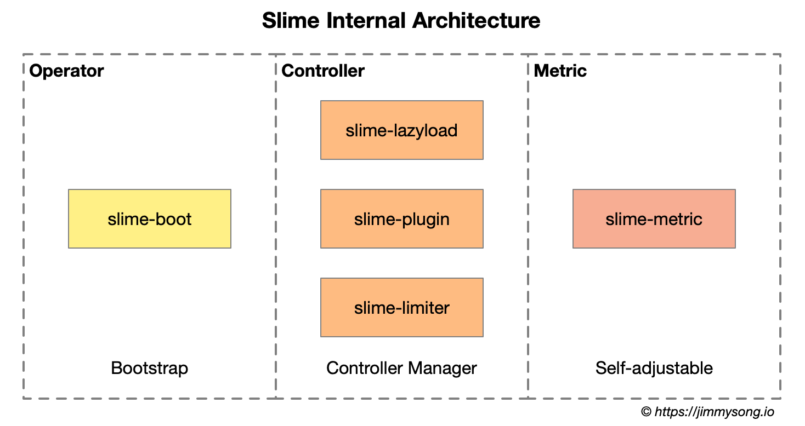
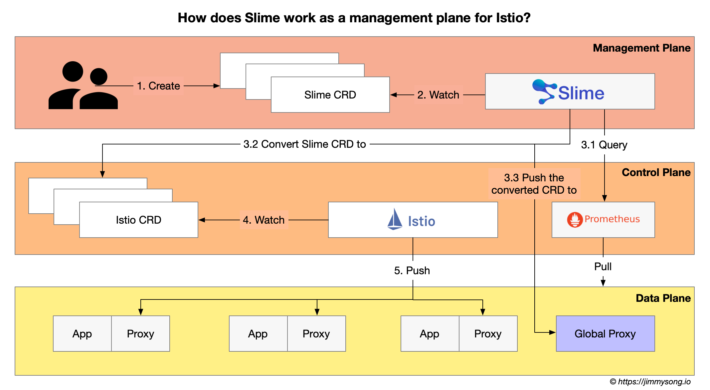
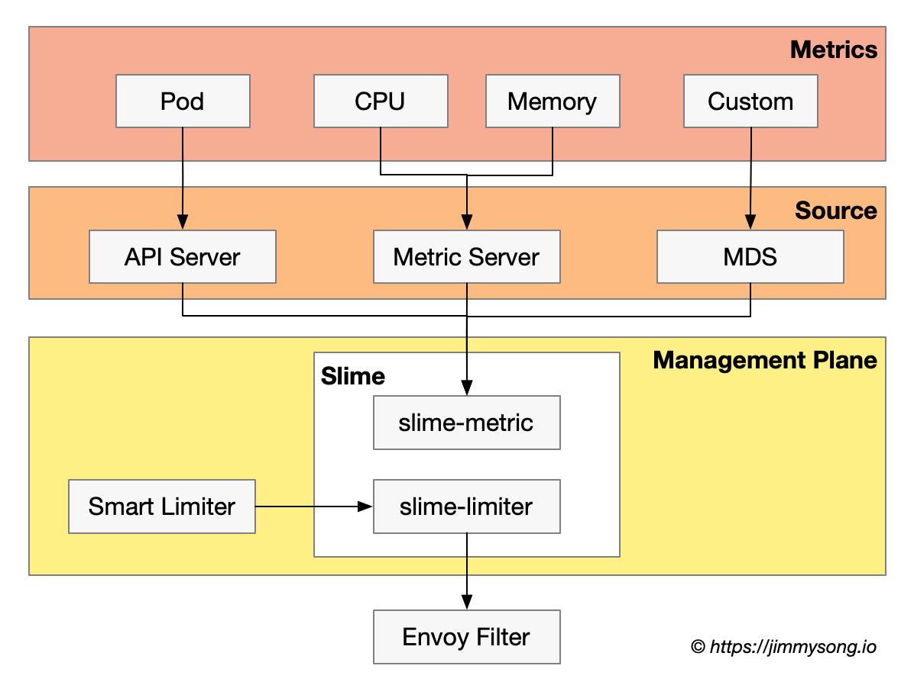

最近我在研究 Istio 生态中的开源项目，[Slime](https://github.com/slime-io/slime/) 这个项目开源与 2021 年初，是由网易数帆微服务团队开源的一款基于 Istio 的智能网格管理器。Slime 基于 Kubernetes Operator 实现，可作为 Istio 的 CRD 管理器，无须对 Istio 做任何定制化改造，就可以定义动态的服务治理策略，从而达到自动便捷使用 Istio 和 Envoy 高阶功能的目的。

## Slime 试图解决的问题

Slime 项目的诞生主要为了解决以下问题：

1. 网格内所有服务配置全量下到所有 Sidecar Proxy，导致其消耗大量资源使得应用性能变差的问题
2. 如何在 Istio 中实现高阶扩展的问题：比如扩展 HTTP 插件；根据服务的资源使用率做到自适应限流

Slime 解决以上问题的答案是构建 Istio 的控制平面，具体做法是：

- 构建可拔插控制器
- 数据平面监控
- CRD 转换

通过以上方式 Slime 可以实现**配置懒加载**和**插件管理器**。

## Slime 架构

Slime 内部分为三大模块，其架构图如下所示。



Slime 内部三大组件为：

1. `slime-boot`：在 Kubernetes 上部署 Slime 模块的 operator。
2. `slime-controller`：Slime 的核心组件，监听 Slime CRD 并将其转换为Istio CRD。
3. `slime-metric`：用于获取服务 metrics 信息的组件，`slime-controller` 会根据其获取的信息动态调整服务治理规则。

目前 Slime 内置了三个控制器子模块：

1. **配置懒加载（按需加载）**：用户无须手动配置 `SidecarScope`，Istio 可以按需加载服务配置和服务发现信息；
2. **HTTP 插件管理**：使用新的 CRD——`pluginmanager/envoyplugin` 包装了可读性，摒弃了可维护性较差的 `envoyfilter`，使得插件扩展更为便捷；
3. **自适应限流**：结合监控信息自动调整限流策略；

> **什么是 SidecarScope？**
>
> SidecarScope 是在 Istio 1.1 版本中引入的，它并不是一个直接面向用户的配置项，而是 Sidecar 资源的包装器，具体来说就是 [Sidecar 资源](../config/networking/sidecar.md)中的 `egress` 选项。通过该配置可以减少 Istio 向 Sidecar 下发的数据量，例如只向某个命名空间中的某些服务下发某些 hosts 的访问配置，从而提高应用提高性能。

## 使用 Slime 作为 Istio 的控制平面

为了解决这些问题，Slime 在 Istio 之上构建了更高层次的抽象，相当于为 Istio 构建了一层管理平面，其工作流程图如下所示。



具体步骤如下：

1. Slime Operator 根据管理员的配置在 Kubernetes 中完成 Slime 组件的初始化；
2. 开发者创建符合 Slime CRD 规范的配置并应用到 Kubernetes 集群中；
3. Slime 查询 Prometheus 中保存的相关服务的监控数据，结合 Slime CRD 中自适应部分的配置，将 Slime CRD 转换为 Istio CRD，同时将其推送到 Global Proxy 中；
4. Istio 监听 Istio CRD 的创建；
5. Istio 将 Sidecar Proxy 的配置信息推送到数据平面相应的 Sidecar Proxy 中；

以上只是一个对 Slime 工作流程的一个笼统的介绍，更多详细信息请参考 [Slime GitHub](https://github.com/slime-io/slime/)。

## 配置懒加载

为了解决数据平面中 Sidecar Proxy 资源消耗过大及网络延迟问题，Slime 使用了配置懒加载（按需加载 Sidecar 配置）的方案。该方案的核心思想是向每个 Sidecar Proxy 中只下发其所 Pod 中服务所需的配置，而不是将网格中的所有服务信息全量下发。所以 Slime 需要获取每个服务的调用关系这样才能得到其所需的 Sidecar Proxy 配置。

Slime 实现 Sidecar Proxy 配置懒加载的方法是：

- 让数据平面中的所有服务的首次调用都通过一个 Global Proxy，该 Proxy 可以记录所有服务的调用和依赖信息，根据该依赖信息更新 Istio 中 Sidecar 资源的配置；
- 当某个服务的调用链被 VirtualService 中的路由信息重新定义时， Global Proxy 原有记录就失效了，需要一个新的数据结构来维护该服务的调用关系。Slime 创建了名为 `ServiceFence`  的 CRD 来维护服务调用关系以解决服务信息缺失问题。

### 使用 Global Proxy 初始化服务调用拓扑

Slime 在数据平面中部署 Global Proxy（也叫做 Global Sidecar，但其与应用的 Pod 不是一对一的关系，笔者更倾向于称其为 Global Proxy），该代理同样使用 Envoy 构建，在每个需要启动配置懒加载的命名空间中部署一个或在整个网格中只部署一个，所有缺失服务发现信息的调用（你也可以手动配置服务调用关系），都会被兜底路由劫持到 Global Proxy，经过其首次转发后，Slime 便可感知到被调用方的信息，然后根据其对应服务的 VirtualService，找到服务名和真实后端的映射关系，将两者的都加入 SidecarScope，以后该服务的调用就不再需要经过 Global Proxy 了。

### 使用 ServiceFence 维护服务调用拓扑

在使用 Global Proxy 初始化服务调用拓扑后，一旦服务调用链有变动的话怎么办？对此 Slime 创建了 ServiceFence 的 CRD。使用 ServiceFence 可以维护服务名和后端服务的映射关系。Slime 根据其对应服务的 VirtualService，找到 Kubernetes 服务名和真实后端（host）的映射关系，将两者的都加入 Sidecar 的配置中。ServiceFence 管理生成的 SidecarScope 的生命周期，自动清理长时间不用的调用关系，从而避免上述问题。

### 如何开启配置懒加载

配置懒加载功能对于终端用户是透明的，只需要 Kubernetes  Service 上打上 `istio.dependency.servicefence/status:"true"` 的标签，表明该服务需要开启配置懒加载，剩下的事情交给 Slime Operator 来完成即可。

## HTTP 插件管理

Istio 中的插件扩展只能通过 EnvoyFilter 来实现，因为它是 xDS 层面的配置，管理和维护这样的配置需要耗费大量的精力，也极容易出错。因此，Slime 在 EnvoyFilter 的基础上做了一层面向插件的抽象。

Slime 共有两个 CRD 用于 HTTP 插件管理，分别是：

- **PluginManager**：配置为哪些负载开启哪些插件，插件的配置顺序即为执行顺序；
- **EnvoyPlugin**：EnvoyPlugin 不关心每个插件的具体配置，具体配置会被放在 EnvoyFilter 资源的 `patch.typed_config` 结构中透传），EnvoyPlugin 的核心思想是将插件配置在需要的维度中做聚合，从而限定插件的生鲜范围。这样做一方面更加贴合插件使用者的习惯，另一方面也降低了上层配置的冗余，

关于 Slime 中插件管理的详细使用方式请见 [Slime GitHub](https://github.com/slime-io/slime/blob/master/doc/zh/plugin_manager.md)。

## 自适应限流

Envoy 内置的限流组件功能单一，只能以实例维度配置限流值，无法做到根据应用负载的自适应限流。Slime 通过与 Prometheus metric server 对接，实时的获取监控情况，来动态配置限流值。

Slime 自适应限流的流程图如下所示。



Slime 的自适应限流的流程分为两部分，一部分为 SmartLimiter 到 EnvoyFilter 的转换，另一部分为获取监控数据。目前 Slime 支持从 Kubernetes Metric Server 获取服务的CPU、内存、副本数等数据。Slime 还对外提供了一套监控数据接口（Metric Discovery Server），通过 MDS，可以将自定义的监控指标同步给限流组件。

Slime 创建的 CRD `SmartLimiter` 用于配置自适应限流。其的配置是接近自然语义，例如希望在 CPU 超过 80% 时触发服务 A 的访问限制，限额为 30QPS，对应的SmartLimiter 定义如下：

```yaml
apiVersion: microservice.netease.com/v1alpha1
kind: SmartLimiter
metadata:
  name: a
  namespace: default
spec:
  descriptors:
  - action:
      fill_interval:
        seconds: 1
      quota: "30/{pod}"    # 30为该服务的额度，将其均分给每个 pod，加入有 3 个 pod，则每个 pod 的限流为 10
    condition: "{cpu}>0.8" # 根据监控项{cpu}的值自动填充该模板
```

## 更多

Slime 开源于 2021 年初，本文发稿时该项目仍处于初级阶段，本文大量参考了杨笛航在云原生社区中的分享 [Slime：让 Istio 服务网格变得更加高效与智能](https://cloudnative.to/blog/netease-slime/) 及 Slime 的 [GitHub](https://github.com/slime-io/slime)。感兴趣的读者可以关注下这个项目的 GitHub，进一步了解它。

另外欢迎关注服务网格和 Istio 的朋友加入[云原生社区 Istio SIG](https://cloudnative.to/sig-istio/)，一起参与讨论和交流。

## 参考

- [Slime：让 Istio 服务网格变得更加高效与智能 - cloudnative.to](https://cloudnative.to/blog/netease-slime/)
- [Slime GitHub 文档 - github.com](https://github.com/slime-io/slime/blob/master/README_ZH.md)
- [Sidecar - istio.io](https://istio.io/latest/docs/reference/config/networking/sidecar/)
