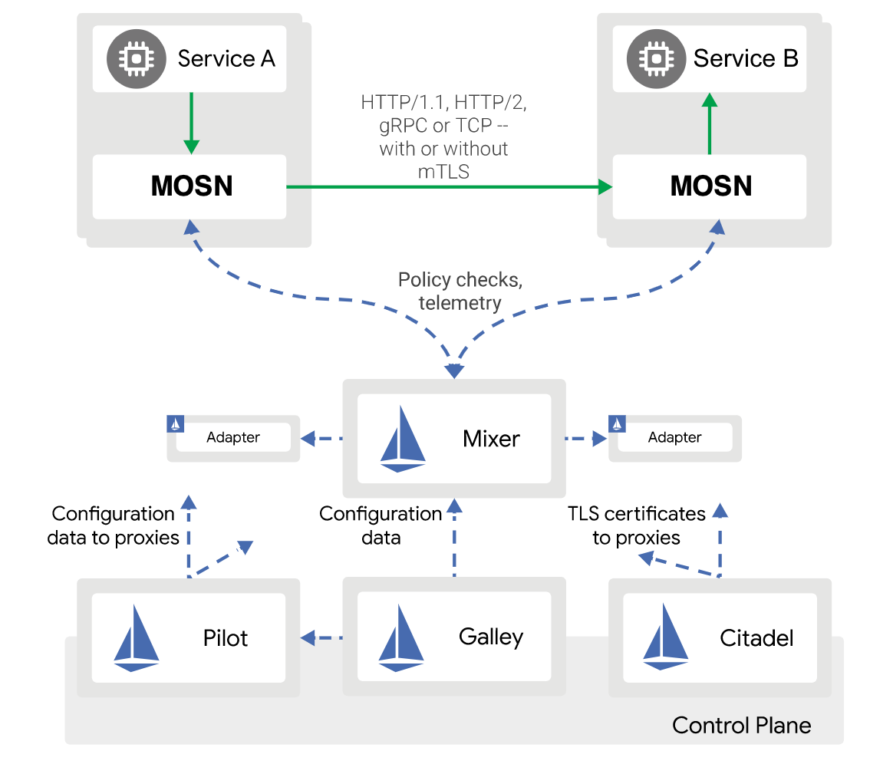



SOFAMesh 已闭源，本文已过时。



4 月，蚂蚁集团自主研发的分布式中间件（Scalable Open Financial Architecture，以下简称 SOFA ）启动开源计划，并开放多个组件，（相关背景请点击链接阅读《[开源 | 蚂蚁集团启动分布式中间件开源计划，用于快速构建金融级云原生架构](http://mp.weixin.qq.com/s?__biz=MzI0Nzc3MTQyMw==&mid=2247484729&idx=1&sn=0d8dbee2739fb0eef3e4ad699661fd13&chksm=e9abbd49dedc345fd5d6898fd1989710f249d6386bf3d52ae1603365a4a1c3696538bc8b9a8f&scene=21#wechat_redirect) 》、《[开源 | 蚂蚁集团分布式中间件开源第二弹：丰富微服务架构体系](http://mp.weixin.qq.com/s?__biz=MzI0Nzc3MTQyMw==&mid=2247485026&idx=1&sn=0a367bc67d5fe3a268e3715b17e020ab&chksm=e9abbe12dedc370489102d9307b832457891fdb0530eec5c35c0fb82bc2a3e6dbbc7db8436c4&scene=21#wechat_redirect) 》），这一系列的动作受到大家的关注和支持，SOFA 社区也日益壮大。

在两轮开源之后，蚂蚁集团自主研发的分布式中间件（Scalable Open Financial Architecture，以下简称 SOFA ）在今天推出了**第三轮的开源产品：SOFAMesh**。和前两轮开源的历经多年沉淀和打磨的成熟产品不同，本轮的开源主角 SOFAMesh，将探索一条和以往产品有所不同的开源道路。下面我们就来看看到底有哪些不同吧！

## SOFAMesh 的开源探索之路

SOFAMesh 尝试在以下几个方面进行自我突破和勇敢探索：

**全新的技术领域**

Service Mesh 是目前技术社区最为炙手可热的新技术方向，有下一代微服务的明显趋势。但是目前 Service Mesh 技术还处于发展早期，暂时还没有成熟的产品，尤其缺乏大规模的落地实践。

**较早的开源时间**

在上述背景下，我们选择了将启动不久的 Service Mesh 产品开源在开发早期，也就是还未成熟之时，就对社区开放，开放源码并寻求社区合作。

**更加开放的态度**

在 SOFAMesh 上，我们愿意以开源共建的方式来和社区一起推进 Service Mesh 技术的更好发展和实现落地实践，共同打造一个技术先进，功能丰富，具备良好的性能和稳定性，可以实实在在的生产落地的优秀产品。欢迎国内技术社区的朋友们和我们开展不同层面的交流与合作。

**务实的产品路线**

SOFAMesh 在产品路线上，选择了跟随社区主流，我们选择了目前 Service Mesh 中最有影响力和前景的 Istio。SOFAMesh 会在 Istio 的基础上，提升性能，增加扩展性，并在落地实践上做探索和补充，以弥补目前 Istio 的不足，同时保持与 Istio 社区的步骤一致和持续跟进。

## SOFAMesh 介绍

SOFAMesh 将在兼容 Istio 整体架构和协议的基础上，做出部分调整：

1. 使用 Golang 语言开发全新的 Sidecar，替代 Envoy
2. 为了避免 Mixer 带来的性能瓶颈，合并 Mixer 部分功能进入 Sidecar
3. Pilot 和 Citadel 模块进行了大幅的扩展和增强

我们的目标：打造一个更加务实的 Istio 落地版本！



以上架构调整的细节以及我们做调整的出发点和原因，请浏览 [蚂蚁集团大规模微服务架构下的 Service Mesh 探索之路](http://www.servicemesher.com/blog/the-way-to-service-mesh-in-ant-financial/) 一文，有非常详尽的解释。



## 开源内容

在本轮开源中，我们将推出 SOFAMesh 目前正在开发的两大模块：MOSN 和 SOFAPilot。

## MOSN

SOFAMesh 中 Golang 版本的 Sidecar，是一个名为 MOSN (Modular Observable Smart Netstub) 的全新开发的模块，实现 Envoy 的功能，兼容 Envoy 的 API，可以和 Istio 集成。

此外，我们会增加对 SOFARPC、Dubbo 等通讯协议的支持，以便更好的迎合国内用户包括我们自身的实际需求。

由于 Sidecar 相对独立，而且我们也预期会有单独使用 MOSN 的场景，因此 MOSN 的代码仓库是独立于 SOFAMesh 的，地址为： https://github.com/mosn/mosn

欢迎大家使用，提供需求、反馈问题、贡献代码或者合作开发。

## SOFAPilot

我们将大幅扩展和增强 Istio 中的 Pilot 模块：

1. 增加 SOFARegistry 的 Adapter，提供超大规模服务注册和发现的解决方案
2. 增加数据同步模块，以实现多个服务注册中心之间的数据交换。
3. 增加 Open Service Registry API，提供标准化的服务注册功能

MOSN 和 SOFAPilot 配合，将可以提供让传统侵入式框架（如 Spring Cloud，Dubbo，SOFA RPC 等）和 Service Mesh 产品可以相互通讯的功能，以便可以平滑的向 Service Mesh 产品演进和过渡。

**Pilot 和后面会陆续开放的 Mixer，Citadel 等 Istio 模块**，会统一存放在同一个从 Istio Fork 出来的代码仓库中。未来会持续更新 Istio 最新代码，以保持和 Istio 的一致。

## 附录

本文中提到的链接地址集合：

- [MOSN](https://github.com/mosn/mosn)
- [蚂蚁集团大规模微服务架构下的 Service Mesh 探索之路](https://www.servicemesher.com/blog/the-way-to-service-mesh-in-ant-financial/)
