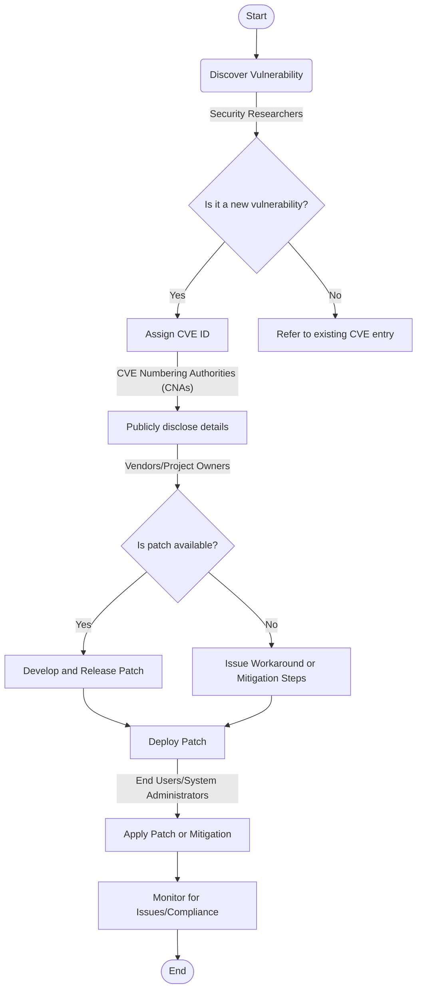
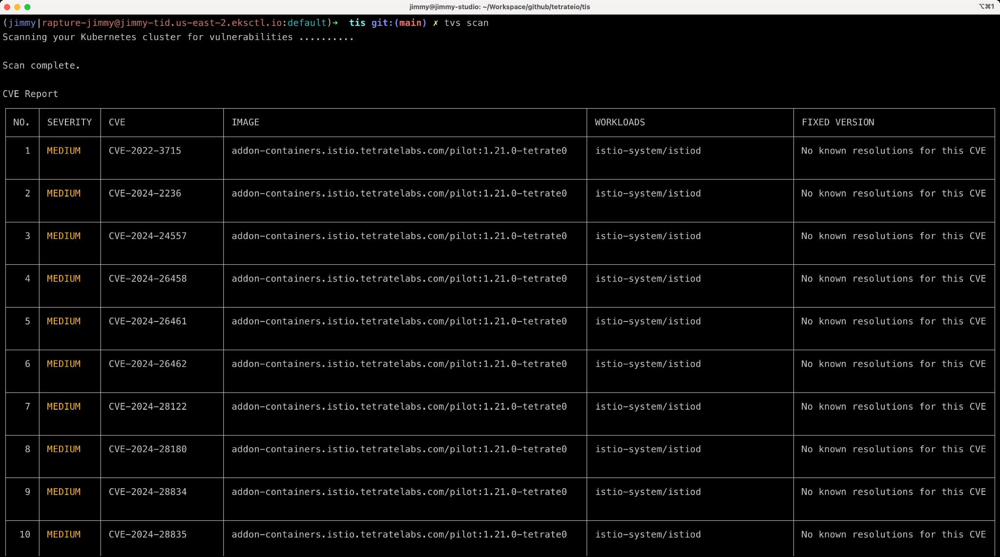
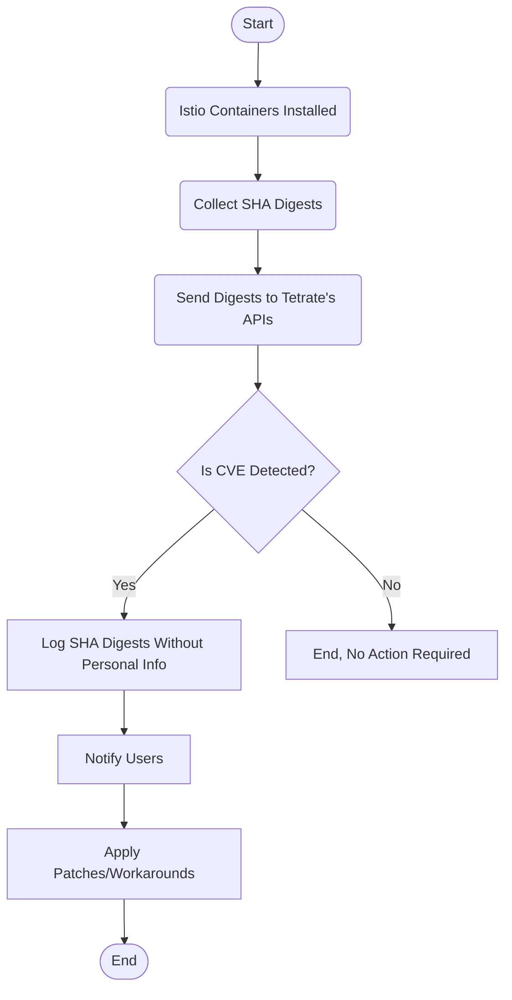

本文将介绍 Tetrate 新推出的工具——[Tetrate Vulnerability Scanner (TVS)](https://docs.tetrate.io/istio-subscription/tools/tvs/)，一款针对 Istio 和 Envoy 定制的 CVE 扫描器。在深入了解 TVS 的具体功能前，我们先简要回顾 CVE 的概念及其在软件安全性中的核心作用。

## CVE 概览

CVE，即通用漏洞和暴露，是一个公开的漏洞数据库，由 MITRE 公司负责维护。它旨在为软件中的漏洞提供一个标准化的命名体系，包含了漏洞的标识号、详细描述及参考链接。虽然 CVE 本身不提供漏洞的严重性评分，但它为网络安全专家、开发人员和企业提供了一个获取关键安全信息的重要平台。每个 CVE 记录的唯一标识号便于追踪漏洞相关信息，诸如受影响的软件系统、修复措施等。例如，2021 年著名的 Log4j 漏洞（CVE-2021-44228）由于影响广泛，严重程度评级为 10。

## CVE 的实用场景

一个典型的 CVE 使用案例是将 CVE 扫描功能集成到 CI/CD 管道中，以自动化安全测试，从而阻止带有已知漏洞的代码合并到代码库并接收警报。这一过程有助于确保应用程序不会使用带有漏洞的包或库，从而提高了软件的安全性。

例如 Github 将 CVE 检测和处理作为[供应链安全](https://docs.github.com/en/code-security/supply-chain-security/understanding-your-software-supply-chain/about-supply-chain-security#what-is-dependabot)的关键一环，如果你在 Github 上托管了开源项目，并开启了 Dependabot，每当你的 PR 或 commit 存在漏洞时，你就可能收到类似下面的 CVE 通知：[jQuery Cross Site Scripting vulnerability](https://github.com/advisories/GHSA-257q-pv89-v3xv)。收到通知后你可以选择容忍该漏洞或者应用 patch。下图展示了 CVE 的处理流程。

## TVS 功能介绍

Istio 经常在其官网发布 CVE 通知，例如 [ISTIO-SECURITY-2024-001](https://istio.io/latest/news/security/istio-security-2024-001/)。以前，你必须手动跟踪这些通知，但现在你可以使用 TVS 自动执行 CVE 扫描任务，从而显着减少安全团队的工作量。

目前 TVS 仅提供命令行工具，未来将作为服务集成到 TIS 中。下图展示了 TVS 运行结果。

下图说明了 TVS 的工作流程。

1. 在 Istio 容器安装后开始。
2. 收集安装的 Istio 容器的 SHA 摘要。
3. 将摘要发送到 Tetrate 的 API。
4. API 检测是否存在 CVE。
   - 如果检测到 CVE，记录 SHA 摘要但不包含任何个人信息，并通知用户。
   - 如果未检测到 CVE，则不需要采取任何行动。
5. 用户收到通知后，应用补丁或缓解措施。
6. 流程结束。

所有人都可以免费下载和使用 TVS，不过在执行 CVE 扫描之前你需要先注册，详见 [TIS 文档](https://docs.tetrate.io/istio-subscription/tools/tvs/)。

## 供应链安全建议

有[报告](https://www.slim.ai/blog/container-report-2023)指出，现在即使最流行的容器最新版本也有数百个 CVE，下面是为了保证的一些建议：

- 尽早开始漏洞扫描和处理，而不是等到最后
- 在 CI/CD 中集成漏洞扫描工具
- 定期更新 Istio 和 Envoy 到最新版本
- 使用 Istio 官方推出的 [distroless 镜像](https://istio.io/latest/docs/ops/configuration/security/harden-docker-images/)，可以有效的减少攻击面并包含尽可能少的漏洞
- 遵循 CNCF 推出的[软件供应链最佳实践](https://github.com/cncf/tag-security/blob/main/supply-chain-security/supply-chain-security-paper/sscsp.md)
- 遵循 [Istio 安全最佳实践](https://istio.io/latest/docs/ops/best-practices/security/)

## TVS 的独特价值

TVS 通过其命令行工具提供简便的 CVE 扫描操作，未来还计划在 Kubernetes 和 Tetrate Istio Subscription (TIS) 中集成，以进一步简化 Istio 和 Envoy 的 CVE 管理过程。TIS 提供自 Istio 发布起 14 个月内的 CVE 补丁和向后兼容支持，帮助用户及时获得安全更新，同时保持系统的稳定运行。

TVS 为所有用户免费开放下载使用，使用前需进行简单的注册。更多信息请参阅 [TIS 文档](https://docs.tetrate.io/istio-subscription/tools/tvs/)。

通过采纳 TVS 这一自动化的 CVE 扫描工具，企业能够更有效地识别和处理 Istio 及 Envoy 中的安全漏洞，提升基础设施的安全性，同时减轻安全团队的负担，推动安全管理流程的高效运作。
