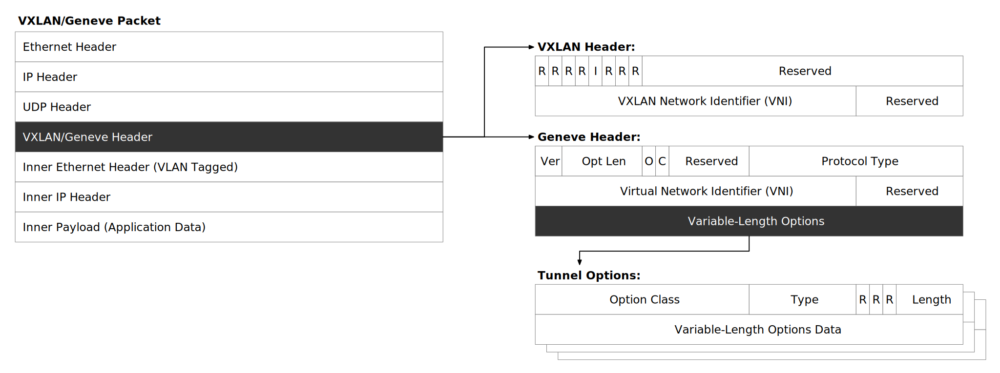
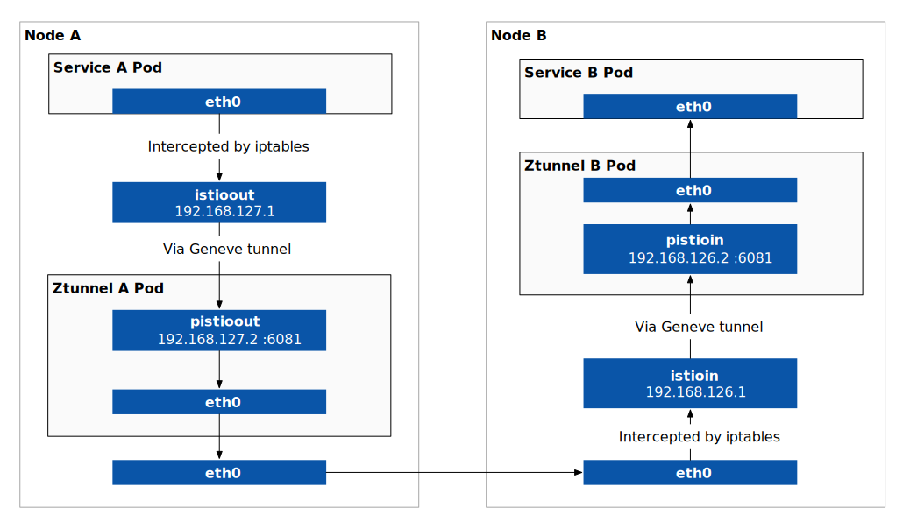
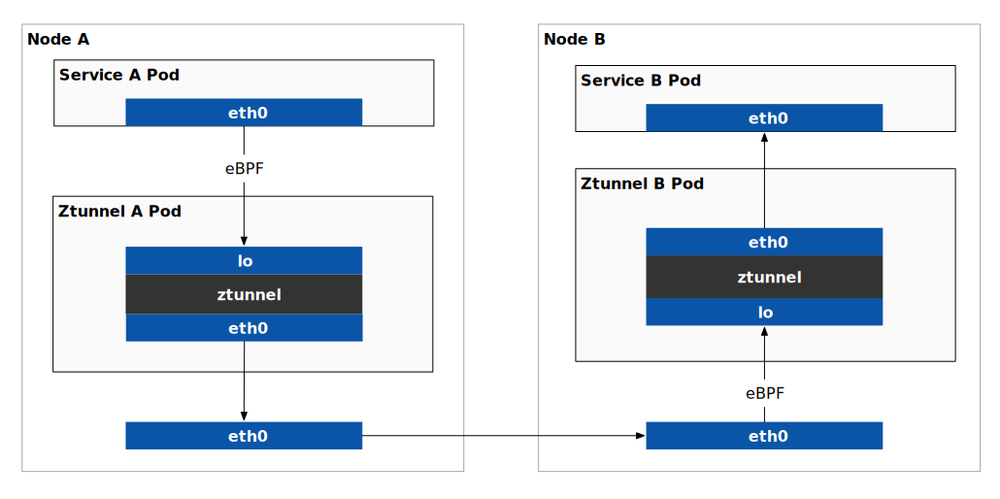

在我[之前的博客](/blog/ambient-mesh-l4-traffic-path/)分享中提到 Istio Ambient Mesh 使用 iptables 和 Geneve 隧道将应用程序 Pod 中的流量拦截到 Ztunnel 中。很多读者可能还不了解这种隧道协议，本文将为你介绍 Geneve 隧道的定义，报文结构，以及与 VXLAN 协议的比较有哪些优势。最后，本文将介绍 Istio Ambient Mesh 如何应用 Geneve 隧道来实现流量拦截，以及 Istio 1.18 中新推出的 eBPF 模式。

## Geneve 隧道简介

GENEVE（Generic Network Virtualization Encapsulation）是一种网络虚拟化封装（隧道）协议，它的设计的初衷是为了解决当前数据传输缺乏灵活性和安全性的问题。Geneve 只定义了一种数据封装格式，不包括控制平面的信息。GENEVE 相较于 VXLAN 封装的关键优势在于其通过添加 TLV 格式的选项来扩展可封装的协议类型。

## Geneve vs VXLAN

VXLAN 和 Geneve 都是网络虚拟化协议，它们之间有很多共同点。虚拟化协议是一种将虚拟网络与物理网络分离的技术，它允许网络管理员在虚拟环境中创建多个虚拟网络，每个虚拟网络都可以拥有自己的 VLAN 标识符、IP 地址和路由。此外，VXLAN 和 Geneve 协议都使用 UDP 封装，这使得它们能够通过现有网络基础设施进行扩展。VXLAN 和 Geneve 协议还具有灵活性，它们可以在不同的网络拓扑结构中使用，并且可以与不同的虚拟化平台兼容。

图 1 展示了 VXLAN 与 Geneve 协议的报文结构及其各自的 Header 区别。



从图中我们可以看到，VXLAN 与 Geneve 隧道报文的结构类似，其主要区别在于使用不同的 UDP 端口号和协议头 ——VXLAN 使用 4789 端口，Geneve 使用 6081 端口；Geneve 协议头比 VXLAN 更具扩展性。

Geneve 隧道协议比 VXLAN 更加可扩展是因为 Geneve 隧道协议中增加了变长选项，它可以包含零或多个 TLV 格式的选项数据。TLV 是指类型 - 长度 - 值（Type-Length-Value）格式，用于传输和解析网络包的元数据信息。在 Geneve 协议中，每个元数据信息都由一个 TLV 格式的字段组成，以便于灵活地添加、删除和修改这些元数据。

具体来说，TLV 格式的字段包括：

- Type：8 位的类型字段。
- Length：5 位的选项长度字段，以 4 字节倍数表示，不包括选项头。
- Data：可变长的选项数据字段，可以不存在或者为 4 到 128 字节之间。

通过使用 TLV 格式，Geneve 协议可以轻松地扩展和修改元数据信息，同时保持兼容性和灵活性。

关于 VXLAN 隧道报文的详细信息请参考 [RFC 7348 Virtual eXtensible Local Area Network (VXLAN): A Framework for Overlaying Virtualized Layer 2 Networks over Layer 3 Networks](https://tools.ietf.org/html/rfc7348) 。

关于 Geneve 隧道报文的详细信息请参考 [RFC 8926 Geneve: Generic Network Virtualization Encapsulation](https://www.rfc-editor.org/rfc/rfc8926#name-geneve-packet-format-over-i) 。

### 工作原理

Geneve 隧道主要应用在云计算和虚拟机化场景，它可以将数据包封装在一个新的数据包中，以便在虚拟网络中传输。Geneve 隧道使用一个 24 位的虚拟网络标识符 (VNI)，将数据包从一个物理网络传输到另一个物理网络。Geneve 隧道还可以使用安全性协议，如 IPsec、TL，来保护数据包的传输。

当数据包到达目的主机时，Geneve 隧道协议会将数据包从 Geneve 协议头中解封装出来，并将其传递给虚拟网络中的目的地。在解封装过程中，Geneve 协议头中的 VNI 信息会被来判断数据包的目的地，以确保数据包被正确地路由到虚拟网络中的目的地。

假设有一个虚拟网络，其 VNI 为 1001。当数据包从一个物理网络传输到另一个物理网络时，可以使用隧道将数据包从一个物理网络传输到另一个物理网络。在这种情况下，隧道将源物理网络和目标物理网络之间的虚拟网络标识符 (VNI) 设置为 1001，以便在传输期间跟踪数据包。当数据包到达目标物理网络时，隧道将 VNI 从数据包中删除，并将数据包传递给目标物理网络。

### 安全性

Geneve 隧道协议本身并没有提供任何安全机制，因此在 Geneve 隧道中传输的数据包可能会受到威胁，例如数据包被篡改、截获、重放等。

为了保障 Geneve 隧道中传输的数据包的安全性，可以使用一些安全协议。以下是一些常见的安全协议：

1. IPsec（Internet Protocol Security）：IPsec 是一种网络层安全协议，可以对 Geneve 隧道中的数据包进行加密、认证和完整性保护。使用 IPsec 可以提供端到端的安全性。
2. TLS（Transport Layer Security）：TLS 是一种基于传输层的加密协议，可以对 Geneve 隧道中的数据包进行加密和认证。使用 TLS 可以提供端到端的安全性。
3. MACSec（Media Access Control Security）：MACSec 是一种数据链路层的安全协议，可以对 Geneve 隧道中的数据包进行加密和认证。使用 MACSec 可以提供链路层的安全性。

需要注意的是，以上安全协议都需要进行相应的配置和部署，且可能会对性能产生一定的影响。在选择合适的安全协议时，需要考虑安全性、性能、可管理性等方面的因素。

### 为什么选择 Geneve？

下表对比了 VXLAN 与 Geneve 在多个方面的特点。

| 特性 | VXLAN | Geneve |
| --- | --- | --- |
| 头部格式 | 固定格式 | 可扩展格式 |
| 可扩展性 | 更多地专注于L2扩展 | 更好地支持新兴网络服务 |
| 可操作性 | 较难管理和扩展 | 更容易管理和扩展 |
| 性能 | 头部较短，性能较高 | 头部较长，性能略低 |

使用 Geneve 协议的主要原因是将目前网络虚拟化封装技术（例如VXLAN、NVGRE 和 STT）中的优点合并到一个协议中。我们通过多年的网络虚拟化开发经验得知，其中一个重要的需求是可扩展性。Geneve 协议使用可扩展的 TLV 结构对元数据进行编码，因此可以独立地发展软件和硬件端点的功能，以满足不断增长的需求。

## Istio Ambient Mesh 如何应用 Geneve 隧道

在[之前的博客](https://jimmysong.io/blog/ambient-mesh-l4-traffic-path/)中，我讲解了 Istio Ambient Mesh 如何使用 Ztunnel 实现 L4 代理的，图 2 展示使用 iptables 和 Geneve 隧道的 L4 透明流量劫持路径。



从图中我们可以看到：

- Istio CNI 在节点上创建 `istioout` 网卡和 iptables 规则，将节点中的出站流量透明劫持到 `pistioout` 虚拟网卡；
- Istio CNI 在节点上创建 `istioin` 网卡和 iptables 规则，将节点中的入站流量透明劫持到 `pistioin` 虚拟网卡；
- Istio CNI 在 ztunnel 中创建 `pistioin` 和 `pistioout` 网卡，用于接收 Geneve 隧道中的发来的数据包；

`pistioin` 和 `pistioout` 这两个网卡是由 ztunnel 中的 init 容器或 Istio CNI（见 [`CreateRulesWithinNodeProxyNS`](https://github.com/istio/istio/blob/master/cni/pkg/ambient/net_linux.go#L910) 函数）创建的，其 IP 地址和端口也是固定的。应用容器发出的数据包需要经过 `istioout` 网卡并使用 Geneve 隧道封装后转发给 ztunnel 容器。

## 使用 eBPF 进行透明流量劫持

eBPF（extended Berkeley Packet Filter）是一个功能强大的技术，它可以在 Linux 内核中运行安全的用户态程序。eBPF 最初是一种用于过滤网络数据包的技术，但现在已经扩展到其他领域，如跟踪系统调用、性能分析和安全监控等。eBPF 的优势在于其轻量级、高效、安全和可编程性。它可以被用于实时监控、网络安全、应用程序调试和优化、容器网络等多个领域。

在 Istio 1.18 之前，Ambient 模式中使用 iptables 和 Geneve 隧道将应用程序流量透明劫持到 ztunnel 中。在 Istio 1.18 中，增加了 eBPF 选项，你可以选择使用 iptables 或 eBPF 来做流量劫持。如图 3 所示，eBPF 程序直接运行在宿主机内核，将应用程序的流量转发到 ztunnel 中。



图 3：使用 eBPF 劫持应用程序的流量

| 对比项 | eBPF 方式 | 使用 iptables 和 Geneve 隧道 |
| --- | --- | --- |
| 效率 | 更高 | 略低 |
| 兼容性 | 需要较高的 Linux 内核版本 | 更好 |
| 实现难度 | 较高 | 较低 |
| 扩展性 | 较好 | 较差 |

根据 Istio 官方博客，使用 eBPF 方式避免了部分 iptables 规则和隧道封装，相比使用 iptables 和 Geneve 隧道更加高效。然而，eBPF 对 Linux 内核版本的要求更高（至少 4.20），而 iptables 方式则具有更好的兼容性。此外，eBPF 方式的实现难度较高，但扩展性较好。

要想使用 eBPF 模式运行 Ambient Mesh，只需要在安装 Istio 时设置 `values.cni.ambient.redirectMode` 参数即可，如下：

```bash
istioctl install --set profile=ambient --set values.cni.ambient.redirectMode="ebpf"
```

## 总结

本文介绍了 Geneve 隧道协议的工作原理、安全性和与 VXLAN 的比较。此外，还介绍了 Istio Ambient Mesh 如何使用 Geneve 隧道实现流量拦截，并讨论了使用 eBPF 进行透明流量劫持的优缺点。Geneve 隧道协议是一种通用的隧道协议，可以在虚拟网络中传输数据包，具有更多的优势，因此在选择隧道协议时，用户可以考虑使用 Geneve 隧道。在 Istio 1.18 中新推出了 Ambient Mesh 的的 eBPF 模式，可以提供网络效率，但对 Linux 内核版本有更高要求，用户可以根据自己的实际情况选用。

## 参考

- [RFC 7348 Virtual eXtensible Local Area Network (VXLAN): A Framework for Overlaying Virtualized Layer 2 Networks over Layer 3 Networks](https://tools.ietf.org/html/rfc7348)
- [RFC 8926 Geneve: Generic Network Virtualization Encapsulation](https://www.rfc-editor.org/rfc/rfc8926#name-geneve-packet-format-over-i)
- [Istio Ambient Mesh](https://istio.io/latest/docs/ops/deployment/architecture/#istio-ambient-mesh)
- [Open vSwitch Geneve(8) man page](https://www.mankier.com/8/ovs-vswitchd.conf.db(5))