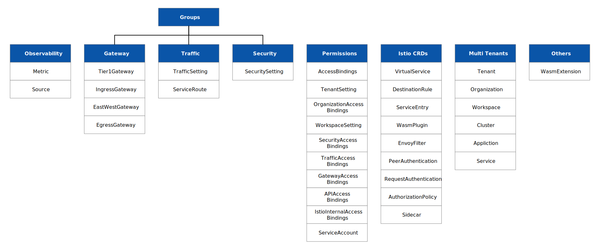
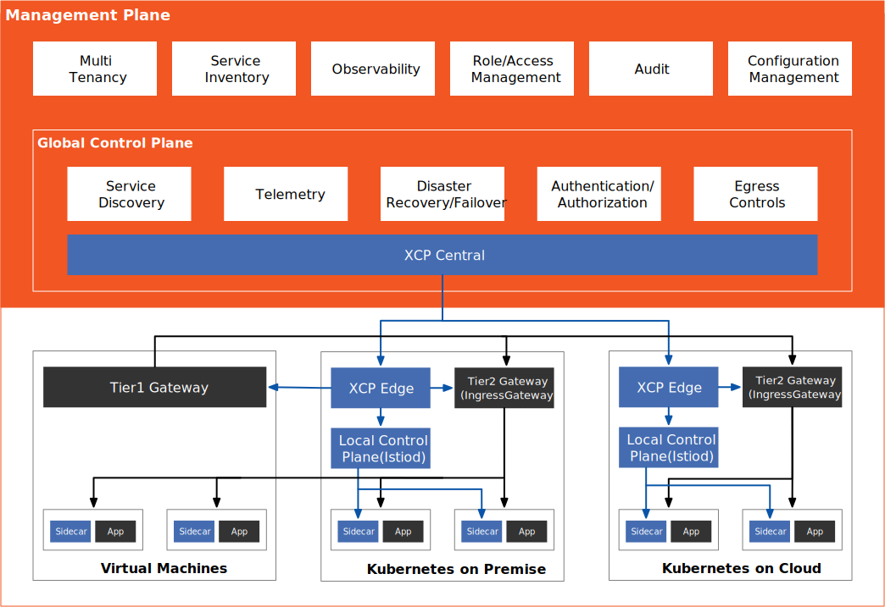
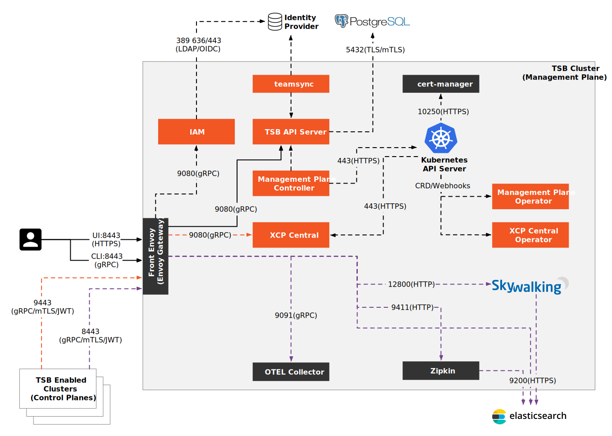
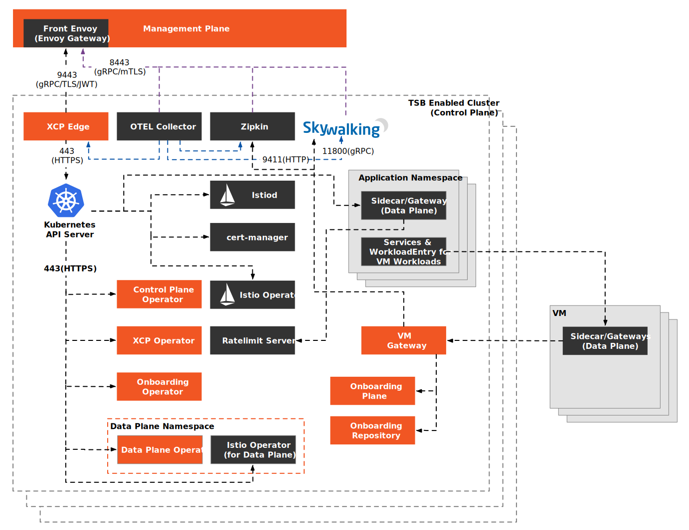
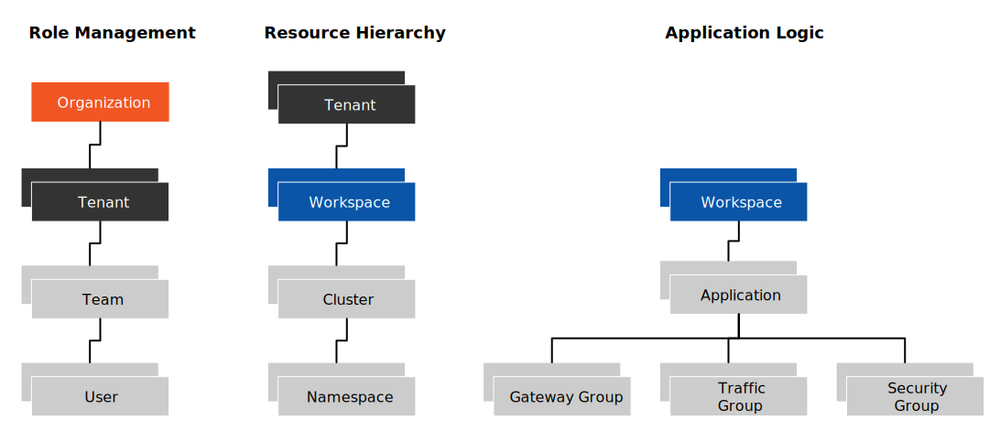

本文假设你熟悉服务网格和 Istio，对 Tetrate 出品的商业化服务网格管理工具 Tetrate Service Bridge 感兴趣，那么这篇文章可以解答你心中的一些困惑。

本文中包含了：

- 关于 TSB 的一些 FAQ
- TSB 的一些基本资源对象
- TSB 实现的一些细节

## TSB FAQ

笔者将罗列一些关于 TSB 的知识点，主要是关于它与 Istio 之间的不同点：

1. TSB 全称 Tetrate Service Bridge，是 Tetrate 公司的旗舰产品，首发于 2018 年，目前版本是 1.7，这是一款商业化产品，你需要购买才能使用，如果想要了解更多或请求试用请在[这里](https://tetrate.io/tetrate-service-bridge/)登记；
2. TSB 可以私有化部署也可以在 GKE、AWS、Azure、OpenShift、EKS Anywhere 等平台中单独或跨平台部署；
3. TSB 并不是对 Istio 的改进版，它是在 Istio 之上建立的管理平面，它可以与 Istio 完全兼容，并适配最新版的 Istio；
4. TSB 并不是 Kubernetes 管理平台，它不能用于管理 Kubernetes 中的资源；
5. TSB 是基于 Istio、Envoy 和 Apache SkyWalking 构建；
6. TSB 通过定义 Tenant、Workspace 等资源对象为 Istio 增加了多租户和多集群管理功能；
7. 为了实现多集群服务网格的管理，TSB 中定义了一系列 Group 资源，如 Traffic、Security、Gateway 等，这些 CRD 最终将转化为 Istio 中的 CRD 应用到服务网格；
8. TSB 定义了 Tier1Gateway CRD 实现了跨集群的二层网关；
9. TSB 部署和管理比较复杂，Tetrate 即将推出轻量级的 Tetrate Service Express（TSE）简化服务网格管理；

## TSB 中的资源对象 {#tsb-resources}

图 1 展示了 TSB 的基本资源对象，其中只要分为五大类：

- 为了实现多租户和多集群管理的资源对象，如 Tenant、Organization、Workspace 等；
- 主要功能对象配置组，如 Traffic、Security、Gateway 等；
- Istio 原生 CRD；
- 角色和权限管理；
- 其他扩展；

TSB 是建立在 Istio 之上的，下表中列出了 TSB 中的可以通过 tctl 命令获取的资源对象，其中部分名称与 Kubernetes 中原生资源对象重复，但它们并不相同：

| **名称**                    | **说明**                                                     |
| --------------------------- | ------------------------------------------------------------ |
| ApplicationAccessBindings   | 配置应用程序用户访问权限。                                   |
| AccessBindings              | 为 TSB 中任何资源的用户分配访问角色的配置。                  |
| AuthorizationPolicy         | 同 Istio 中的授权策略。                                      |
| APIAccessBindings           | 配置 API 用户访问权限。                                      |
| Application                 | 应用程序的配置，应用程序表示一组相互关联的服务逻辑分组，并公开一组实现完整业务逻辑的 API。 |
| Cluster                     | Kubernetes 集群。要想将 Kubernetes 集群纳入 TSB 管理，首先需要声明 Cluster 添加，然后是部署 TSB Agent 和控制平面（包括 Istio、XCP、GitOps、OAP 等组件）。 |
| DestinationRule             | Istio 原生 CRD，主要用来划分可路由的集群及负载均衡规则。     |
| EnvoyFilter                 | Istio 原生 CRD，主要用来扩展 Envoy 的功能。                  |
| EgressGateway               | 配置工作负载作为出口网关。                                   |
| GatewayAccessBindings       | 配置网关组用户访问权限。                                     |
| GatewayGroup                | 网关组。                                                     |
| Gateway                     | 管理 TSB 中设置的网关，而非 Istio 中的原生 Gateway CRD。     |
| IstioInternalAccessBindings | 为 Istio 内部组的用户分配访问角色的配置。                    |
| IngressGateway              | 配置负载作为入口网关，类似于 Istio 中的原生 Gateway。        |
| IstioInternalGroup          | 配置 Istio 内部的 TSB 资源。                                 |
| OrganizationAccessBindings  | 配置组织用户访问权限。                                       |
| Organization                | 组织。                                                       |
| OrganizationSetting         | 组织的默认配置，如区域 Failover、安全、流量、网络配置等。    |
| Metric                      | 运行时获取的服务度量。                                       |
| Source                      | Sources 服务公开了管理来自资源的遥测源。                     |
| PeerAuthentication          | Istio 原生 CRD，配置对等认证（配置 mTLS）。                  |
| RequestAuthentication       | Istio 原生 CRD，配置请求认证（JWT 规则配置）。               |
| ServiceAccount              | 不同于 Kubernetes 中的原生资源对象，TSB 自定义的服务账号配置。 |
| SecurityAccessBindings      | 配置安全组用户访问权限。                                     |
| Sidecar                     | 配置预安装的 Istio Sidecar。                                 |
| ServiceEntry                | Istio 原生 CRD，添加服务对象。                               |
| SecurityGroup               | 安全配置组。                                                 |
| ServiceRoute                | 配置服务路由。                                               |
| SecuritySetting             | 安全设置将配置应用于 SecurityGroup 或 Workspace 中的一组代理工作负载。当应用于 SecurityGroup 时，缺失的字段将从 Workspace 范围设置继承值 (如果有的话)。 |
| ServiceSecuritySetting      | 安全组配置。                                                 |
| Service                     | 注册中心中的服务，表示所有这些单独服务的聚合和逻辑视图，并提供聚合指标等高级功能。 |
| Tier1Gateway                | TSB 一级网关配置，指定网关负载。                             |
| TrafficAccessBindings       | 流量访问角色配置。                                           |
| TrafficGroup                | 流量管理组。                                                 |
| TenantAccessBindings        | 租户角色配置。                                               |
| TenantSetting               | 租户配置。                                                   |
| TrafficSetting              | 流量配置。                                                   |
| VirtualService              | Istio 原生 CRD，配置流量路由。                               |
| WorkspaceAccessBindings     | Workspace 角色配置。                                         |
| WasmExtension               | 配置管理 Wasm 扩展。                                         |
| WasmPlugin                  | Istio 原生 CRD，配置 Wasm 插件。                             |
| Workspace                   | 划定工作空间。                                               |
| WorkspaceSetting            | 配置工作空间。                                               |

你可以使用 tctl 命令行工具来管理 TSB，它的使用方法与 kubectl 类似，上面的列表是使用 `tctl get` 命令可以列出的资源对象。实际上 TSB 中的资源对象不止这些，关于 TSB 中 API 资源的详细说明请参考 [TSB 文档](https://docs.tetrate.io/service-bridge/1.6.x/en-us/reference)。

## TSB 架构 {#tsb-arch}

我在上文中提到，TSB 是在 Istio 之上构建的管理平面，为 Istio 增加了多租户和多集群管理功能，TSB 的组件架构及其功能如图 2 所示。

TSB 的全局控制平面可以和管理平面部署在同一个 Kubernetes 集群中，也可以单独部署。

TSB 管理平面的架构如图 3 所示。

管理平面与各个 Kubernetes 集群中的 Istio 联系，管理多集群环境下的服务网格。

TSB 控制平面的架构如图 4 所示。

为了实现跨集群的多租户管理，TSB 定义了一系列逻辑对象，如图 5 所示。

## 更多 {#more}

如果您不熟悉服务网格和 Kubernetes 安全性，我们在 [Tetrate Academy](https://tetr8.io/academy) 提供了一系列免费在线课程，可以让您快速了解 Istio 和 Envoy。

如果您正在寻找一种快速将 Istio 投入生产的方法，请查看 [Tetrate Istio Distribution (TID)](https://tetr8.io/tid)。TID 是 Tetrate 的强化、完全上游的 Istio 发行版，具有经过 FIPS 验证的构建和支持。这是开始使用 Istio 的好方法，因为您知道您有一个值得信赖的发行版，有一个支持您的专家团队，并且如果需要，还可以选择快速获得 FIPS 合规性。

一旦启动并运行 Istio，您可能需要更简单的方法来管理和保护您的服务，而不仅仅是 Istio 中可用的方法，这就是 Tetrate Service Bridge 的用武之地。您可以[在这里](https://tetr8.io/tsb)详细了解 Tetrate Service Bridge 如何使服务网格更安全、更易于管理和弹性，或[联系我们进行快速演示](https://tetr8.io/contact)。 

## 参考 {#refrence}

- [TSB 简介 - tetrate.io](https://tetrate.io/tetrate-service-bridge/)
- [TSB 文档 - docs.tetrate.io](https://docs.tetrate.io/service-bridge/)
- [TSB API 参考 - docs.tetrate.io](https://docs.tetrate.io/service-bridge/1.6.x/en-us/reference)
