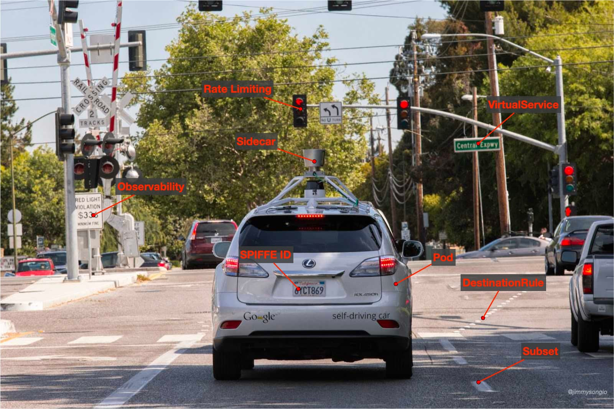

Istio 在刚开源的时候就定义了几十个 CRD，其中用于流量治理的有 `RouteRule`、`DestinationPolicy`、`EgressRule` 等，后来推出了 [v1alpha3 API](https://istio.io/v1.13/blog/2018/v1alpha3-routing/) 使用 `VirtualService` 和 `DestinationRule` 等取代了之前的 API。但是这些资源对象的定义，并不像 Kubernetes 中那么直观，反而会有些难以理解，比如 `VirtualService`，只看名字你可能认为只是第一个了一个“虚拟的服务”，但实际并非如此。

本文将为你通过与实际的交通做类比，直观简要的介绍 Istio 中的两个核心的用于流量治理的对象——`VirtualService` 和 `DestinationRule`。

## 流量 vs 交通

很多刚接触 Istio 的人可能对 `VirtualService` 和 `DestinationRule` 和两个资源对象不是很理解，如果我们将环境仅限定于 Kubernetes 集群，我们可以将路由比喻成现实世界中的交通，有很多车辆在道路上行驶，这就是流量。`DestinationRule` 相当于开辟了道路/路径/车道，确保了两点之间可达并控制车道的数量、宽度等。而 `VirtualService` 就像是红绿灯和道路标线，指挥车辆向哪行驶和如何行驶。也就是说如果你只定义了 DR 将不会对流量产生任何影响，因为你没有指挥流量怎么走，所以你必须定义 VirtualService 才可以控制流量的走向。

一句话来概括：DestinationRule 打通了两地之间的通路，犹如修路架桥通隧道，同时控制车道设路障；VirtualService 做车辆指挥调度。

请看下面这张将流量与交通的对比图，可以帮助你更直观的理解这种比喻。

## 流量治理

下面列举了你分别可以在这两个资源对象上做的流量治理行为。

**VirtualService**

- 路由：金丝雀发布、基于用户身、URI、Header 等匹配路由等；
- 错误注入：HTTP 错误代码注入、HTTP 延时注入；
- 流量切分：基于百分比的流量切分路由；
- 流量镜像：将一定百分比的流量镜像发送到其他集群；
- 超时：设置超时时间，超过设置的时间请求将失败；
- 重试：设置重试策略，如触发条件、重试次数、间隔时间等；

**DestinationRule**

- 负载均衡：设置负载均衡策略，如简单负载均衡、区域感知负载均衡、区域权重负载均衡；
- 熔断（Circuit Breaking）：通过异常点检测（Outlier Detection）和连接池设置将异常节点从负载均衡池中剔除；

## 总结

本文将抽象的流量治理与现实中的交通管理相类比，帮助你更直观的理解 Istio 中的流量管理对象 `VirtualService` 和 `DestinationRule`。同时介绍了基于它们可以进行的流量治理功能。`VirtualService` 主要用于设置路由规则，而服务弹性（超时、重试、熔断等）需要靠它和 DestinationRule 来共同维持。

## 参考

- [Introducing the Istio v1alpha3 routing API - istio.io](https://istio.io/v1.13/blog/2018/v1alpha3-routing/)
- [Traffic Management - istio.io](https://istio.io/latest/docs/tasks/traffic-management/)
