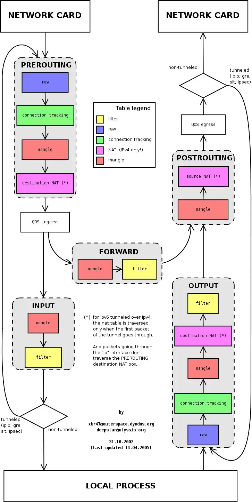

iptables 作为 Linux 内核中的重要功能，有着广泛的应用，在 Istio 中默认就是利用 iptables 做透明流量劫持的。理解 iptables，对于我们理解 Istio 的运作有十分重要的作用。本文将为大家简单介绍下 iptbles。

## iptables 简介

`iptables` 是 Linux 内核中的防火墙软件 netfilter 的管理工具，位于用户空间，同时也是 netfilter 的一部分。Netfilter 位于内核空间，不仅有网络地址转换的功能，也具备数据包内容修改、以及数据包过滤等防火墙功能。

在了解 Init 容器初始化的 iptables 之前，我们先来了解下 iptables 和规则配置。

下图展示了 iptables 调用链。



## iptables 中的表

Init 容器中使用的的 iptables 版本是 `v1.6.0`，共包含 5 张表：

1. `raw` 用于配置数据包，`raw` 中的数据包不会被系统跟踪。
1. `filter` 是用于存放所有与防火墙相关操作的默认表。
1. `nat` 用于 [网络地址转换](https://en.wikipedia.org/wiki/Network_address_translation)（例如：端口转发）。
1. `mangle` 用于对特定数据包的修改（参考[损坏数据包](https://en.wikipedia.org/wiki/Mangled_packet)）。
1. `security` 用于[强制访问控制](https://wiki.archlinux.org/index.php/Security#Mandatory_access_control) 网络规则。

**注**：在本示例中只用到了 `nat` 表。

不同的表中的具有的链类型如下表所示：

| 规则名称    | raw  | filter | nat  | mangle | security |
| ----------- | ---- | ------ | ---- | ------ | -------- |
| PREROUTING  | ✓    |        | ✓    | ✓      |          |
| INPUT       |      | ✓      | ✓    | ✓      | ✓        |
| OUTPUT      |      | ✓      | ✓    | ✓      | ✓        |
| POSTROUTING |      |        | ✓    | ✓      |          |
| FORWARD     | ✓    | ✓      |      | ✓      | ✓        |

## 理解 iptables 规则

查看 `istio-proxy` 容器中的默认的 iptables 规则，默认查看的是 filter 表中的规则。

```bash
$ iptables -L -v
Chain INPUT (policy ACCEPT 350K packets, 63M bytes)
 pkts bytes target     prot opt in     out     source               destination

Chain FORWARD (policy ACCEPT 0 packets, 0 bytes)
 pkts bytes target     prot opt in     out     source               destination

Chain OUTPUT (policy ACCEPT 18M packets, 1916M bytes)
 pkts bytes target     prot opt in     out     source               destination
```

我们看到三个默认的链，分别是 INPUT、FORWARD 和 OUTPUT，每个链中的第一行输出表示链名称（在本例中为INPUT/FORWARD/OUTPUT），后跟默认策略（ACCEPT）。

下图是 iptables 的建议结构图，流量在经过 INPUT 链之后就进入了上层协议栈，比如

每条链中都可以添加多条规则，规则是按照顺序从前到后执行的。我们来看下规则的表头定义。

- **pkts**：处理过的匹配的报文数量
- **bytes**：累计处理的报文大小（字节数）
- **target**：如果报文与规则匹配，指定目标就会被执行。
- **prot**：协议，例如 `tdp`、`udp`、`icmp` 和 `all`。
- **opt**：很少使用，这一列用于显示 IP 选项。
- **in**：入站网卡。
- **out**：出站网卡。
- **source**：流量的源 IP 地址或子网，或者是 `anywhere`。
- **destination**：流量的目的地 IP 地址或子网，或者是 `anywhere`。

还有一列没有表头，显示在最后，表示规则的选项，作为规则的扩展匹配条件，用来补充前面的几列中的配置。`prot`、`opt`、`in`、`out`、`source` 和 `destination` 和显示在 `destination` 后面的没有表头的一列扩展条件共同组成匹配规则。当流量匹配这些规则后就会执行 `target`。

**target 支持的类型**

`target` 类型包括 ACCEPT`、REJECT`、`DROP`、`LOG` 、`SNAT`、`MASQUERADE`、`DNAT`、`REDIRECT`、`RETURN` 或者跳转到其他规则等。只要执行到某一条链中只有按照顺序有一条规则匹配后就可以确定报文的去向了，除了 `RETURN` 类型，类似编程语言中的 `return` 语句，返回到它的调用点，继续执行下一条规则。`target` 支持的配置详解请参考 [iptables 详解（1）：iptables 概念](http://www.zsythink.net/archives/1199)。

## 总结

以上就是对 iptables 的简要介绍，你已经了解了 iptables 是怎样运行的，规则链及其执行顺序。
