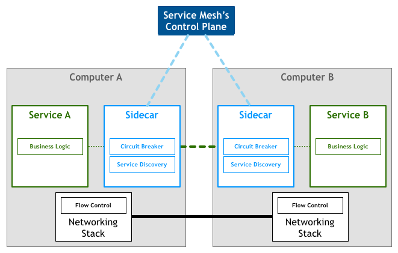

Service Mesh 又译作 “服务网格”，作为服务间通信的基础设施层。Buoyant 公司的 CEO Willian Morgan 在他的这篇文章 [WHAT’S A Service Mesh? AND WHY DO I NEED ONE?](https://buoyant.io/2017/04/25/whats-a-service-mesh-and-why-do-i-need-one/) 中解释了什么是 Service Mesh，为什么云原生应用需要 Service Mesh。

下面是 [Willian Morgan](https://twitter.com/wm) 对 Service Mesh 的解释。

> A Service Mesh is a dedicated infrastructure layer for handling service-to-service communication. It’s responsible for the reliable delivery of requests through the complex topology of services that comprise a modern, cloud native application. In practice, the Service Mesh is typically implemented as an array of lightweight network proxies that are deployed alongside application code, without the application needing to be aware.

翻译成中文是：

> 服务网格（Service Mesh）是处理服务间通信的基础设施层。它负责构成现代云原生应用程序的复杂服务拓扑来可靠地交付请求。在实践中，Service Mesh 通常以轻量级网络代理阵列的形式实现，这些代理与应用程序代码部署在一起，对应用程序来说无需感知代理的存在。

## Service Mesh的特点

Service Mesh 有如下几个特点：

- 应用程序间通信的中间层
- 轻量级网络代理
- 应用程序无感知
- 解耦应用程序的重试/超时、监控、追踪和服务发现

目前两款流行的 Service Mesh 开源软件 [Istio](https://istio.io) 和 [Linkerd](https://linkerd.io) 都可以直接在 Kubernetes 中集成，其中 Linkerd 已经成为 CNCF 中的项目。

## 理解 Service Mesh

如果用一句话来解释什么是 Service Mesh，可以将它比作是应用程序或者说微服务间的 TCP/IP，负责服务之间的网络调用、限流、熔断和监控。对于编写应用程序来说一般无须关心 TCP/IP 这一层（比如通过 HTTP 协议的 RESTful 应用），同样使用 Service Mesh 也就无须关心服务之间的那些原本通过服务框架实现的事情，比如 Spring Cloud、Netflix OSS 和其他中间件，现在只要交给 Service Mesh 就可以了。

[Phil Calçado](http://philcalcado.com/) 在他的这篇博客 [Pattern: Service Mesh](http://philcalcado.com/2017/08/03/pattern_service_mesh.html) 中详细解释了 Service Mesh 的来龙去脉：

1. 从最原始的主机之间直接使用网线相连
2. 网络层的出现
3. 集成到应用程序内部的控制流
4. 分解到应用程序外部的控制流
5. 应用程序的中集成服务发现和断路器
6. 出现了专门用于服务发现和断路器的软件包/库，如 [Twitter 的 Finagle](https://finagle.github.io/) 和 [Facebook  的 Proxygen](https://code.facebook.com/posts/1503205539947302)，这时候还是集成在应用程序内部
7. 出现了专门用于服务发现和断路器的开源软件，如 [Netflix OSS](http://netflix.github.io/)、Airbnb 的 [synapse](https://github.com/airbnb/synapse) 和 [nerve](https://github.com/airbnb/nerve)
8. 最后作为微服务的中间层 Service Mesh 出现

Service Mesh 的架构如下图所示：

图片来自：[Pattern: Service Mesh](http://philcalcado.com/2017/08/03/pattern_service_mesh.html)

Service Mesh 作为 sidecar 运行，对应用程序来说是透明，所有应用程序间的流量都会通过它，所以对应用程序流量的控制都可以在 serivce mesh 中实现。

## Service Mesh如何工作？

下面以 Istio 为例讲解 Service Mesh 如何工作，后续文章将会详解 Istio 如何在 Kubernetes 中工作。

1. Sidecar（Istio 中使用 [Envoy](https://envoyproxy.io) 作为 sidecar 代理）将服务请求路由到目的地址，根据请求中的参数判断是到生产环境、测试环境还是 staging 环境中的服务（服务可能同时部署在这三个环境中），是路由到本地环境还是公有云环境？所有的这些路由信息可以动态配置，可以是全局配置也可以为某些服务单独配置。这些配置是由服务网格的控制平面推送给各个 sidecar 的，
2. 当 sidecar 确认了目的地址后，将流量发送到相应服务发现端点，在 Kubernetes 中是 service，然后 service 会将服务转发给后端的实例。
3. Sidecar 根据它观测到最近请求的延迟时间，选择出所有应用程序的实例中响应最快的实例。
4. Sidecar 将请求发送给该实例，同时记录响应类型和延迟数据。
5. 如果该实例挂了、不响应了或者进程不工作了，sidecar 会将把请求发送到其他实例上重试。
6. 如果该实例持续返回 error，sidecar 会将该实例从负载均衡池中移除，稍后再周期性得重试。
7. 如果请求的截止时间已过，sidecar 主动标记该请求为失败，而不是再次尝试添加负载。
8. SIdecar 以 metric 和分布式追踪的形式捕获上述行为的各个方面，这些追踪信息将发送到集中 metric 系统。

## 为何使用 Service Mesh？

Service Mesh 并没有给我们带来新功能，它是用于解决其他工具已经解决过的问题，只不过这次是在以 Kubernetes 为基础的云原生生态环境下的实现。

在传统的 MVC 三层 Web 应用程序架构下，服务之间的通讯并不复杂，在应用程序内部自己管理即可，但是在现今的复杂的大型网站情况下，单体应用被分解为众多的微服务，服务之间的依赖和通讯十分复杂，出现了 twitter 开发的 [Finagle](https://twitter.github.io/finagle/)、Netflix 开发的 [Hystrix](https://github.com/Netflix/Hystrix) 和 Google 的 Stubby 这样的 “胖客户端” 库，这些就是早期的 Service Mesh，但是它们都仅适用于特定的环境和特定的开发语言，并不能作为平台级的 Service Mesh 支持。

在 Cloud Native 架构下，容器的使用赋予了异构应用程序更多的可能性，Kubernetes 增强了应用的横向扩容能力，用户可以快速的编排出复杂环境、复杂依赖关系的应用程序，同时开发者又无须过分关心应用程序的监控、扩展性、服务发现和分布式追踪这些繁琐的事情，进而专注于程序开发，赋予开发者更多的创造性。

## 参考

- [What's a Service Mesh? And why do I need one?](https://buoyant.io/2017/04/25/whats-a-service-mesh-and-why-do-i-need-one/)
- [So what even is a Service Mesh? Hot take on Istio and Linkerd](http://redmonk.com/jgovernor/2017/05/31/so-what-even-is-a-service-mesh-hot-take-on-istio-and-linkerd)
- [linkerd: A Service Mesh for AWS ECS](https://medium.com/attest-engineering/linkerd-a-service-mesh-for-aws-ecs-937f201f847a)
- [Introducing Istio: A robust Service Mesh for microservices](https://istio.io/blog/istio-service-mesh-for-microservices.html)
- [Application Network Functions With ESBs, API Management, and Now.. Service Mesh?](http://blog.christianposta.com/microservices/application-network-functions-with-esbs-api-management-and-now-service-mesh/)
- [Pattern: Service Mesh](http://philcalcado.com/2017/08/03/pattern_service_mesh.html)
- [Envoy 官方文档](https://envoyproxy.io)
- [Istio 官方文档](https://istio.io/)
- [Istio Handbook - Istio 服务网格进阶实战](https://www.servicemesher.com/istio-handbook/)

