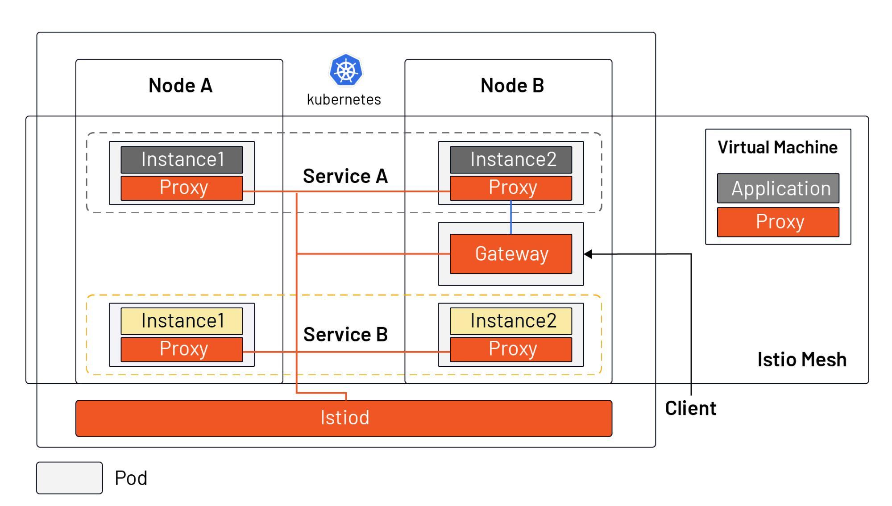

Istio 是当前[最流行的服务网格实现](https://www.cncf.io/blog/2020/03/04/2019-cncf-survey-results-are-here-deployments-are-growing-in-size-and-speed-as-cloud-native-adoption-becomes-mainstream/)，它是在 Kubernetes 的基础上开发的，它跟 Kubernetes 在云原生应用的生态中拥有着不同的定位。本文不是直接为你介绍 Istio 具有哪些功能，而是先向你介绍 Istio 诞生的历史条件，然后带你从 Kubernetes 与 Istio 的分工开始，了解什么是 Istio。

要想解释什么是 Istio，还得先了解 Istio 是在什么样的情况下出现的——即为什么会有 Istio？

容器作为云原生应用的交付物，既解决了环境一致性的问题，又可以更细粒度的限制应用资源，但是随着微服务和 DevOps 的流行，容器作为微服务的载体得以广泛应用。2014 年，Google 开源了 Kubernetes，随后几年得到迅猛发展，在 2017 年奠定了容器编排调度标准的地位。Kubernetes 作为一种容器编排调度工具，解决了分布式应用程序的部署和调度问题。因为一台单机的资源有限，而互联网应用可能因为用户规模的急速扩张，或用户属性的不同在不同时间段会出现流量洪峰，因此对计算资源的弹性要求比较高。而一台单机显然无法满足一个如何规模庞大的应用，反之，对于一个规模很小的应用也没必要占用整台主机，那将导致巨大的浪费。

简而言之，Kubernetes 定义服务的最终状态，并使系统自动地达到和维持在该状态。那么在应用部署完成后，如何管理服务上的流量呢？下面我们将看下 Kubernetes 中如何做服务管理，及在 Istio 中的变化。

## Kubernetes 中如何做服务管理？

下图展示的是 Kubernetes 中的服务模型。

从上图中我们可以看出：

- 同一个服务的的不同示例可能被调度到不同的节点上；
- Kubernetes 通过 Service 对象将一个服务的多个实例组合在了一起，统一对外服务；
- Kubernetes 在每个 node 中安装了 `kube-proxy`  组件来转发流量，它拥有的简单的负载均衡功能；
- Kubernetes 集群外部流量可以通过 Ingress 进入集群中（Kubernetes 还有其他几种暴露服务的方式，如 NodePort、LoadBalancer 等）；

Kubernetes 是用于资源集约管理的工具。但在为应用分配好资源后，如何保证应用的健壮性、冗余性，如何实现更细粒度的流量划分（不是根据服务中实例个数来实现），如何保障服务的安全性，如何进行多集群管理等，这些问题 Kubernetes 都不能很好地解决。

服务具有多个版本，需要迭代和上线，在新版发布的时候需要切分流量，实现金丝雀发布；同时我们应该假定服务是不可靠的，可能因为各种原因导致请求失败，需要面向失败来编程，如何监控应用程序的指标，了解每个请求的耗时和状态？Istio 的发起这们就想到了在每个 pod 中注入一个代理，将代理的配置通过一个控制平面集中分发，然后将从 pod 中应用容器发起的每个请求都劫持到 sidecar 代理中，然后转发，这样不就可以完美的解决以上问题了吗？Kubernetes 优秀的架构和可扩展性，例如 CRD，pod 内的部署模式，可以完美的解决大量 sidecar 的注入和管理问题，使得 Istio 的实现成为可能。

## Istio 的基本原理

下图是 Istio 中的服务模型，它既可以支持 Kubernetes 中的工作负载，又可以支持虚拟机。

从图中我们可以看出：

- Istiod 作为控制平面，将配置下发给所有的 sidecar proxy 和 gateway（为了美观，图中没有画 Istiod 及 sidecar 之间的连接）
- Istio 不再使用 `kube-proxy` 组件做流量转发，而是依托在每个 pod 中注入的 sidecar proxy，所有的 proxy 组成了 Istio 的数据平面；
- 应用程序管理员可以和管理 Kubernetes 中的工作负载一样，通过声明式 API 操作 Istio mesh 中流量的行为；
- Ingress 被 Gateway 资源所替代，Gateway 是一种特殊的 proxy，实际上也是复用的 Sidecar proxy；
- 可以在虚拟机中安装 sidecar proxy，将虚拟机引入的 Istio mesh 中；

实际上在 Istio 之前，人们可以使用 SpringCloud、Netflix OSS 等，通过在应用程序中集成 SDK，编程的方式来管理应用程序中的流量。但是这通常会有编程语言限制，而且在 SDK 升级的时候，需要修改代码并重新上线应用，会增大人力负担。Istio 使得流量管理变得对应用程序透明，使这部分功能从应用程序中转移到了平台层，成为了云原生基础设施。

正是因为 Istio 补足了 Kubernetes 对于云原生应用的流量管理、可观察性和安全方面的短板，在 2017 年由 Google、IBM 和 Lyft 共同发起的这个服务网格开源项目，并在三年来取得了长足的发展。关于 Istio 核心功能的介绍可以参考 [Istio 文档](https://istio.io/latest/docs/concepts/what-is-istio/)。

## 总结

- Service Mesh 相当于云原生时代的 TCP/IP，解决应用程序网络通信、安全及可见性问题；
- Istio 是目前最流行的 service mesh 实现，依托于 Kubernetes，但也可以扩展到虚拟机负载；
- Istio 的核心由控制平面和数据平面组成，Envoy 是默认的数据平面代理；
- Istio 作为云原生基础设施的网络层，对应用透明。

  