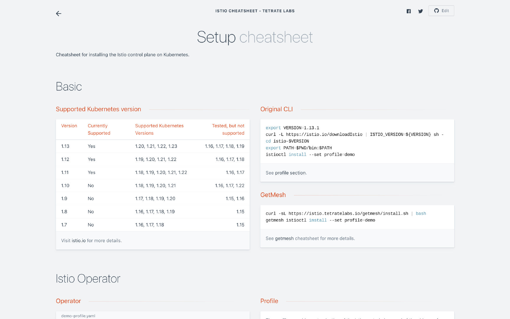

2022 年 2 月 Istio 发布 [1.13.0](https://istio.io/latest/news/releases/1.13.x/announcing-1.13/) 和 [1.13.1](https://istio.io/latest/news/releases/1.13.x/announcing-1.13.1/)，这篇博客将想你介绍这两个版本中有哪些值得注意的新特性。

Istio 1.13 是 2022 年的第一个版本，不出意外的话，Istio 团队会依然按照每个季度的频率发布新版本。总体来看，这个版本中的新特性包括：

- 对 Kubernetes 更新版本的支持
- 引入了一个新的 API——ProxyConfig，用来配置 sidecar proxy
- 完善了 Telemetry API
- 支持多网络网关的基于主机名的负载均衡器

## 对 Kubernetes 版本的支持

我经常看到有人在社区里问 Istio 支持哪些 Kubernetes 版本，其实 Istio 官网中已经明确列出了支持的 Kubernetes 版本，你可以在[这里](https://istio.io/latest/docs/releases/supported-releases/#support-status-of-istio-releases)看到，Istio 1.13 支持 Kubernetes 1.20、1.21、1.22 和 1.23 版本，并在 Kubernetes 1.16、1.17、1.18、1.19 中测试过，但并得到官方支持。

在配置 Istio 的时候，其实还有很多检查列表，我将他们都记录到了 [Istio cheatsheet](https://github.com/tetratelabs/istio-cheatsheet) 中，这个项目中整理了很多关于配置 Istio、资源对象的使用、常见问题处理等相关的 cheatsheet，将于近期上线，敬请期待。



## 引入新的 ProxyConfig API

在 Istio 1.13 版本之前，如果你想自定义 sidecar proxy 的配置，有两种方式。

**`方式一：MeshConfig`**

使用 `MeshConfig`，在 Mesh 级别使用 IstioOperator 来修改。例如，使用下面的配置来修改 `istiod` 的默认发现端口。

```yaml
apVersion: install.istio.io/v1alpha1
kind: IstioOperator
spec:
  meshConfig:
	  defaultConfig:
      discoveryAddress: istiod:15012
```

**方式二：Pod 中的 annotation**

你也可以在 Pod 级别使用 annotation 的方式自定义配置，例如在 Pod 中增加下面的配置同样可以修改工作负载所有连接的 `istiod` 的默认端口。 

```yaml
anannotations:
  proxy.istio.io/config: |
    discoveryAddress: istiod:15012
```

当你同时使用了以上两种方式配置了 sidecar，`annotations` 中设置的字段将完全覆盖 `MeshConfig` 默认的字段。关于 `ProxyConfig` 的所有配置项请参考 [Istio 文档](https://istio.io/latest/docs/reference/config/istio.mesh.v1alpha1/#ProxyConfig)。

**新方式：`ProxyConfig` API**

但是在 1.13 版本中，新增了一个顶级自定义资源 `ProxyConfig`，你可以一站式的在一个地方来自定义 sidecar proxy 的配置，你可以通过指定 namespace、使用 `selector` 来选择工作负载的范围，就像其他 CRD 一样。目前 Istio 对该 API 的支持有限，关于 `ProxyConfig` API 的详细信息请参考 [Istio 文档](https://istio.io/latest/docs/reference/config/networking/proxy-config/)。

但是不论你用哪种方式自定义 sidecar proxy 的配置，该配置都无法动态生效，需要重启工作负载才可以生效。例如，对于上面的配置，因为你修改了 `istiod` 的默认端口，mesh 中的所有工作负载都需要重启才可以与 control plane 建立连接。

## Telemetry API

在 Istio 服务网格中，很多扩展和自定义的配置都是通过 [`MeshConfig`](https://istio.io/latest/docs/reference/config/istio.mesh.v1alpha1/#MeshConfig-ExtensionProvider) 的方式来完成的。可观察性的三种类型 Metric、遥测和日志，分别可以对接不同的提供者，[Telemetry API](https://istio.io/latest/docs/tasks/observability/telemetry/) 可以让你有一个一站式的灵活的配置它们。与 ProxyConfig API 类似，Telemetry API 也遵循着工作负载选择器>本地命名空间>根配置命名空间的配置层级关系。该 API 是在 Istio 1.11 中引入，在该版本中得到了进一步完善，增加了 `OpenTelemetry` 日志、过滤访问日志以及自定义跟踪服务名称的支持。详见 [Telemetry 配置](https://istio.io/latest/docs/reference/config/telemetry/)。

## 自动解析多网络网关主机名

2021 年 9 月，Istio 社区里[有人报告](https://szabo.jp/2021/09/22/multicluster-istio-on-eks/)，在 AWS EKS 中运行多集群多主的 Istio 时，出现 EKS 的负载均衡器无法解析的问题。对于多集群多网络的网格，跨集群边界的服务负载，需要通过专用的东西向网关，以间接的方式通讯。你可以按照 [Istio 官网上的说明](https://istio.io/latest/docs/setup/install/multicluster/multi-primary_multi-network/)配置多网络的 primary-remote 集群，Istio 会根据主机名自动解析负载均衡器的 IP 地址。

## Istio 1.13.1 修复重大安全漏洞

当月，Istio 1.13.1 发布，修复了一个已知的[重大漏洞](https://cve.mitre.org/cgi-bin/cvekey.cgi?keyword=CVE-2022-23635)，该漏洞可能导致未经认证的控制平面拒绝服务攻击。


在安装多网络的 [primary-remote](https://istio.io/latest/docs/setup/install/multicluster/multi-primary_multi-network/) 模式的 Istio 网格时，为了让 remote Kubernetes 集群能够访问控制平面，需要在 primary 集群中安装一个东西向的 Gateway，将控制平面 `istiod` 的 15012 端口暴露到互联网。攻击者可能向该端口发送特制的消息，导致控制平面崩溃。如果你设置了防火墙，只允许来自部分 IP 的流量访问该端口，将可以缩小该问题的影响范围。建议你立即升级到 Istio 1.13.1 来彻底解决该问题。

## IstioCon 2022


最后，作为上一届和本届 IstioCon 的筹备委员会成员之一，我号召大家报名参加 4 月 25 日在线上举行的 [IstioCon 2022](https://events.istio.io/istiocon-2022/)！IstioCon 2022是一个以行业为重点的活动，一个连接贡献者和用户的平台，讨论Istio在不同架构设置中的用途，有哪些限制，以及项目的下一步发展方向。主要的焦点将是在最终用户公司，因为我们期待着分享多样化的案例研究，展示如何在生产中使用Istio。
