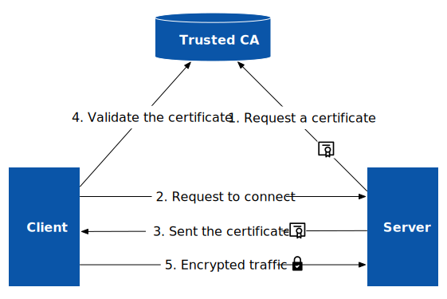

介绍下 TLS、TLS 终止和 mTLS 以及 Istio 中如何实现 mTLS。

## 什么是 TLS

TLS（Transport Layer Security，传输层安全性）是一种广泛采用的安全协议，用于在联网计算机之间建立经过身份验证和加密的链接，旨在促进互联网通信的私密性和数据安全性。TLS 作为 [SSL](https://www.ssl.com/faqs/faq-what-is-ssl/)（Secure Socket Layer，安全套接字层）的继任者，实际上是由 SSL 改名而来，因此人们经常将 TLS/SSL 混用，在本文中我们将统称为 TLS。 TLS 1.0 发布于 1999 年，最新版本为 1.3（发布于 2018 年 8 月），1.0 和 1.1 版本已弃用。

我们在浏览网页时看到的 HTTPS 实际上就使用了 TLS，如下图所示。TLS 是建立在 TCP 之上的，作为 OSI 模型中的会话层。为了保证兼容性，TLS 通常使用 443 端口，但是你也可以使用任意端口。

当客户端需要验证服务端身份，以防中间人攻击同时保证通信安全的情况下，在和服务端通信时会要求 TLS 加密。下图展示了的是 TLS 加密通信的流程。

1. 服务器向受信任的 CA（证书管理机构）申请并获得证书（X.509 证书）；
2. 客户端向服务端发起请求，其中包含客户端支持的 TLS 版本和密码组合等信息；
3. 服务器回应客户端请求并附上数字证书；
4. 客户端验证证书的状态、有效期和数字签名等信息，确认服务器的身份；
5. 客户端和服务器使用共享秘钥实现加密通信；

以上仅是对 TLS 通信流程的一个概要描述，实际的 TLS 握手过程比较复杂，请参考[这篇文档](https://www.cloudflare.com/learning/ssl/what-happens-in-a-tls-handshake/)。

从以上过程中你会发现，证书是代表服务器身份的关键要素，对于互联网公开服务，服务器需要使用权威认证的 CA 颁发的证书，而对于私有环境内部的服务，可以使用 PKI（Private Key Infrastructure，私钥基础设施）来管理证书。

## 什么是 TLS 终止？

TLS 终止（TLS Termination）指的是在将 TLS 加密流量传递给 Web 服务器之前对其进行解密的过程。将 TLS 流量卸载到入口网关或专用设备上，可以提高 Web 应用的性能，同时确保加密流量的安全性。一般运行在集群入口处，当流量到达入口处时实施 TLS 终止，入口与集群内服务器之间的通信将直接使用 HTTP 明文，这样可以提高服务性能。

## 什么是 mTLS？

应用 TLS 需要完成复杂的对称加密、解密过程，这将非常耗时且消耗大量的 CPU 资源。如果我们在流量入口处终止 TLS，就可以加快请求响应和减少计算资源消耗。

## 什么是 mTLS

## Istio 中如何实现自动 mTLS？

## 如何在 Istio 中为服务开启自动 mTLS？

对此，我们需要重点关注的 CRD 为 PeerAuthentication 和 DestinationRule。PeerAuthentication 将 会定义流量在 Sidecar 之间如何进行传输。DestinationRule 将定义在发生路由之后流量的相应策略。 我们主要关注其中的 TLS Settings，需要与 PeerAuthentication 配合进行设置。

实验将从默认的 PERMISSIVE 模式开始，再从 PERMISSIVE 模式转变为 STRICT 模式，最终将 部分的服务启用 DISABLE 模式。通过观察其返回内容，判断是否使用密文传输，从而熟悉在不同模 式下的行为模式。

参考：https://segmentfault.com/a/1190000038174837

### 指定作用域

在 Istio 中，可以通过三个粒度级别定义 mTLS 设置。对于每种服务，Istio 都会应用最窄的匹配策略。优先级为：服务特定 > 命名空间范围 > 网格范围。

- 网格范围：为根名称空间指定的策略，不带有或带有空的选择器字段。
- 命名空间范围：为没有或没有空选择器字段的非根名称空间指定的策略。
- 服务特定：在常规名称空间中定义的策略，带有非空选择器字段。

每个命名空间只能有一个网格范围的对等身份验证策略，并且只能有一个命名空间范围的对等身份验证策略。当您为同一网格或名称空间配置多个网格范围或命名空间范围的对等身份验证策略时，Istio 会忽略较新的策略。当多个特定于工作负载的对等身份验证策略匹配时，Istio 将选择最旧的策略。

### Istio 中的 TLS 模式

对等身份验证策略指定 Istio 对目标工作负载实施的双向 TLS 模式。支持以下模式：

- `PERMISSIVE`：工作负载接受双向 TLS 和纯文本流量。当没有 Sidecar 的工作负载无法使用双向 TLS 时，此模式在迁移过程中最有用。通过使用 sidecar 注入迁移工作负载后，您应该将模式切换为 `STRICT`。
- `STRICT`：工作负载仅接受双向 TLS 通信。、
- `DISABLE`：相互 TLS 已禁用。从安全角度来看，除非您提供自己的安全解决方案，否则不应使用此模式。

取消设置模式时，将继承父作用域的模式。缺省情况下，未设置模式的网格范围对等身份验证策略使用 `PERMISSIVE` 模式。

此时，	你可以在 Istio 中将任何服务设置为任意 mTLS 模式。但是，让我们看一下 **In mesh**(从网格内) 或 **out of mesh**(网格外) 调用服务时每种模式会发生什么情况？

> In mesh 表示 Sidecar 代理在应用程序容器旁边运行。Out of mesh 意味着没有 Sidecar 容器。

- `PERMISSIVE` 在网格内使用 mTLS，在网格外使用纯文本连接
- `STRICT` 在网格内使用 mTLS，但拒绝来自网格外的连接
- `DISABLED`：关闭 mTLS，在网格内外都使用纯文本连接
- `UNSET`：集成父级中的策略设置，如果父级没有设置则默认为 `PERMASSIVE`；

### Istio 中 mTLS 的过程 

mTLS 将经历如下的过程：

1. 客户端请求将 Pod 内的 sidecar 拦截；
2. 客户端 sidecar 与服务端 sidecar 开始 mTLS 握手。在握手的同时，客户端 sidecar 将进行 secure naming check 的额外操作，对服务端中的 Server Identity (存储在证书中的 SAN 中)进行检查，以确保它能够运行服务。该操作能够防止一些常见 HTTP/TCP 的流量劫持攻击。
3. 在完成身份认证和授权之后，客户端和服务端开始建立连接进行通信。

## 参考

- [什么是 TLS（传输层安全性）？- cloudflare.com](https://www.cloudflare.com/zh-cn/learning/ssl/transport-layer-security-tls/)
- [What happens in a TLS handshake? | SSL handshake - cloudflare.com](https://www.cloudflare.com/learning/ssl/what-happens-in-a-tls-handshake/)
