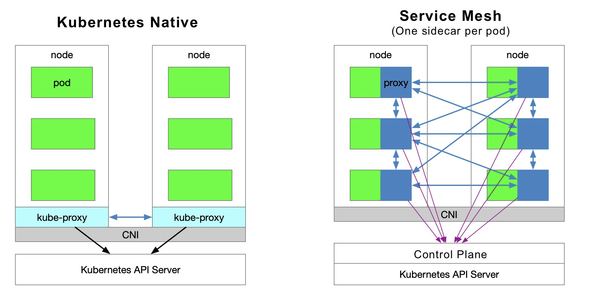
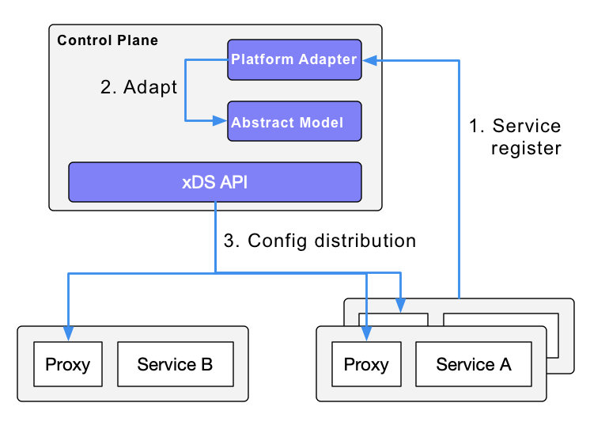
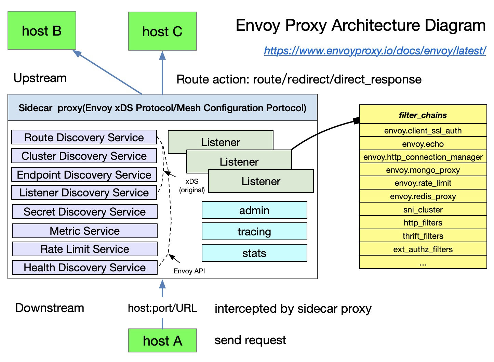

如果你听说过服务网格，并尝试过 [Istio](https://istio.io/)，你可能有以下问题。

1. 为什么 Istio 要在 Kubernetes 上运行？
2. Kubernetes 和服务网格在云原生应用架构中分别扮演什么角色？
3. Istio 扩展了 Kubernetes 的哪些方面？它解决了哪些问题？
4. Kubernetes、Envoy 和 Istio 之间是什么关系？

本文将带大家了解 Kubernetes 和 Istio 的内部工作原理。此外，我会介绍 Kubernetes 中的负载均衡方法，并解释为什么有了 Kubernetes 后还需要 Istio。

Kubernetes 本质上是通过声明式配置来实现应用生命周期管理，而服务网格本质上是提供应用间的流量、安全管理和可观察性。如果你已经使用 Kubernetes 搭建了一个稳定的应用平台，那么如何设置服务间调用的负载均衡和流量控制？这就是服务网格的作用。

Envoy 介绍了 xDS 协议，这个协议得到了各种开源软件的支持，比如 Istio、[MOSN](https://mosn.io/) 等。Envoy 将 xDS 贡献给服务网格或云原生基础设施。Envoy 本质上是一个现代版的代理，可以通过 API 进行配置，在此基础上衍生出许多不同的使用场景–比如 API Gateway、服务网格中的侧车代理和边缘代理。

本文包含以下内容。

- kube-proxy 的作用描述。
- Kubernetes 在微服务管理方面的局限性。
- Istio 服务网格的功能介绍。
- Kubernetes、Envoy 和 Istio 服务网格中一些概念的比较。

## Kubernetes vs Service Mesh

下图显示了 Kubernetes 中的服务访问关系和服务网格（每个 pod 模型一个 sidecar）。

### 流量转发

Kubernetes 集群中的每个节点都部署了一个 kube-proxy 组件，该组件与 Kubernetes API Server 进行通信，获取集群中的服务信息，然后设置 iptables 规则，将服务请求直接发送到对应的 Endpoint（属于同一组服务的 pod）。

### 服务发现

Istio 可以跟踪 Kubernetes 中的服务注册，也可以在控制平面中通过平台适配器与其他服务发现系统对接；然后生成数据平面的配置（使用 CRD，这些配置存储在 etcd 中），数据平面的透明代理。数据平面的透明代理以 sidecar 容器的形式部署在每个应用服务的 pod 中，这些代理都需要请求控制平面同步代理配置。代理之所以 “透明”，是因为应用容器完全不知道代理的存在。过程中的 kube-proxy 组件也需要拦截流量，只不过 kube-proxy 拦截的是进出 Kubernetes 节点的流量–而 sidecar 代理拦截的是进出 pod 的流量。

### 服务网格的劣势

由于 Kubernetes 的每个节点上都运行着很多 pod，所以在每个 pod 中放入原有的 kube-proxy 路由转发功能，会增加响应延迟–由于侧车拦截流量时跳数更多，消耗更多的资源。为了对流量进行精细化管理，将增加一系列新的抽象功能。这将进一步增加用户的学习成本，但随着技术的普及，这种情况会慢慢得到缓解。

### 服务网格的优势

kube-proxy 的设置是全局的，无法对每个服务进行细粒度的控制，而 service mesh 通过 sidecar proxy 的方式将 Kubernetes 中的流量控制从服务层中抽离出来–可以实现更大的弹性。

### Kube-proxy 的不足之处

首先，如果转发的 pod 不能正常服务，它不会自动尝试其他 pod。每个 pod 都有一个健康检查机制，当一个 pod 出现健康问题时，kubelet 会重启 pod，kube-proxy 会删除相应的转发规则。另外，节点 Port 类型的服务不能添加 TLS 或更复杂的消息路由机制。

Kube-proxy 实现了一个 Kubernetes 服务的多个 pod 实例之间的流量负载均衡，但如何对这些服务之间的流量进行精细化控制–比如将流量按百分比划分给不同的应用版本（这些应用版本都是同一个服务的一部分，但在不同的部署上），或者做金丝雀发布（灰度发布）和蓝绿发布？

Kubernetes 社区给出了一个使用 Deployment 做[金丝雀发布](https://kubernetes.io/docs/concepts/cluster-administration/manage-deployment/#canary-deployments)的方法，本质上是通过修改 pod 的标签来给部署的服务分配不同的 pod。

### Kubernetes Ingress vs Istio Gateway

如上所述，kube-proxy 只能在 Kubernetes 集群内路由流量。Kubernetes 集群的 pods 位于 CNI 创建的网络中。一个 ingress—— 一个在 Kubernetes 中创建的资源对象 - 被创建用于集群外部的通信。它由位于 Kubernetes 边缘节点上的入口控制器驱动，负责管理南北向流量。Ingress 必须与各种 Ingress 控制器对接，比如 [nginx ingress 控制器](https://github.com/kubernetes/ingress-nginx)和 [traefik](https://traefik.io/)。Ingress 只适用于 HTTP 流量，使用简单。它只能通过匹配有限的字段来路由流量–如服务、端口、HTTP 路径等。这使得它无法对 TCP 流量进行路由，如 MySQL、Redis 和各种 RPC。这就是为什么你会看到人们在 ingress 资源注释中写 nginx 配置语言的原因。直接路由南北流量的唯一方法是使用服务的 LoadBalancer 或 NodePort，前者需要云厂商支持，后者需要额外的端口管理。

Istio Gateway 的功能与 Kubernetes Ingress 类似，它负责进出集群的南北流量。Istio Gateway 描述了一个负载平衡器，用于承载进出网状结构边缘的连接。该规范描述了一组开放端口和这些端口所使用的协议，以及用于负载均衡的 SNI 配置等。Gateway 是一个 CRD 扩展，它也重用了 sidecar 代理的功能；详细配置请参见 [Istio 网站](https://istio.io/latest/docs/reference/config/networking/gateway/)。

## Envoy

Envoy 是 Istio 中默认的 sidecar 代理。Istio 基于 Enovy 的 xDS 协议扩展了其控制平面。在讨论 Envoy 的 xDS 协议之前，我们需要先熟悉 Envoy 的基本术语。以下是 Envoy 中的基本术语及其数据结构的列表，更多细节请参考 [Envoy 文档](https://envoyproxy.io/)。

### 基本术语

### 基础概念

以下是 Enovy 中你应该知道的基本术语。

- 下游。下游主机连接到 Envoy，发送请求，并接收响应，即发送请求的主机。
- 上游：上游主机。上游主机接收来自 Envoy 的连接和请求，并返回响应；即接收请求的主机。
- Listener：监听器。监听器是一个命名的网络地址（如端口、UNIX 域套接字等）；下游客户端可以连接到这些监听器。Envoy 将一个或多个监听器暴露给下游主机进行连接。
- 集群。集群是一组逻辑上相同的上游主机，Envoy 连接到它们。Envoy 通过服务发现来发现集群的成员。可以选择通过主动的健康检查来确定集群成员的健康状态。Envoy 通过负载均衡策略来决定集群中哪个成员的请求路由。

在 Envoy 中可以设置多个监听器，每个监听器可以设置一个过滤链（过滤链表），而且过滤链是可扩展的，这样我们可以更方便地操纵流量的行为–比如设置加密、私有 RPC 等。

xDS 协议是由 Envoy 提出的，是 Istio 中默认的 sidecar 代理，但只要实现了 xDS 协议，理论上也可以作为 Istio 中的 sidecar 代理 —— 比如蚂蚁集团开源的 [MOSN](https://mosn.io)。

Istio 是一个功能非常丰富的服务网格，包括以下功能。

- 流量管理。这是 Istio 最基本的功能。
- 策略控制。实现访问控制系统、遥测采集、配额管理、计费等功能。
- 可观察性。在 sidecar 代理中实现。
- 安全认证。由 Citadel 组件进行密钥和证书管理。

## Istio 中的流量管理

Istio 中定义了以下 CRD 来帮助用户进行流量管理。

- 网关。网关描述了一个运行在网络边缘的负载均衡器，用于接收传入或传出的 HTTP/TCP 连接。
- 虚拟服务（VirtualService）。VirtualService 实际上是将 Kubernetes 服务连接到 Istio 网关。它还可以执行额外的操作，例如定义一组流量路由规则，以便在主机寻址时应用。
- DestinationRule。DestinationRule 定义的策略决定了流量被路由后的访问策略。简单来说，它定义了流量的路由方式。其中，这些策略可以定义为负载均衡配置、连接池大小和外部检测（用于识别和驱逐负载均衡池中不健康的主机）配置。
- EnvoyFilter。EnvoyFilter 对象描述了代理服务的过滤器，可以自定义 Istio Pilot 生成的代理配置。这种配置一般很少被主用户使用。
- ServiceEntry。默认情况下，Istio 服务 Mesh 中的服务无法发现 Mesh 之外的服务。ServiceEntry 可以在 Istio 内部的服务注册表中添加额外的条目，从而允许 Mesh 中自动发现的服务访问并路由到这些手动添加的服务。

## Kubernetes vs xDS vs Istio

在回顾了 Kubernetes 的 kube-proxy 组件、xDS 和 Istio 对流量管理的抽象后，现在我们仅从流量管理的角度来看看这三个组件 / 协议的比较（注意，三者并不完全等同）。

| **Kubernetes** | **xDS**  | **Istio service mesh** |
| -------------- | -------- | ---------------------- |
| Endpoint       | Endpoint | WorkloadEntry          |
| Service        | Route    | VirtualService         |
| kube-proxy     | Route    | DestinationRule        |
| kube-proxy     | Listener | EnvoyFilter            |
| Ingress        | Listener | Gateway                |
| Service        | Cluster  | ServiceEntry           |

## 核心观点

- Kubernetes 的本质是应用生命周期管理，具体来说就是部署和管理（伸缩、自动恢复、发布）。
- Kubernetes 为微服务提供了一个可扩展、高弹性的部署和管理平台。
- 服务网格是基于透明代理，通过侧车代理拦截服务之间的流量，然后通过控制平面配置管理它们的行为。
- 服务网格将流量管理与 Kubernetes 解耦，不需要 kube-proxy 组件来支持服务网格内的流量；通过提供更接近微服务应用层的抽象来管理服务间的流量、安全性和可观察性。
- xDS 是服务网格的协议标准之一。
- 服务网格是 Kubernetes 中服务的一个更高层次的抽象。

## 总结

如果说 Kubernetes 管理的对象是一个 pod，那么服务网格管理的对象就是一个服务，所以用 Kubernetes 管理微服务，然后应用服务网格就可以了。如果你连服务都不想管理，那就用 [Knative](https://knative.dev/) 这样的无服务器平台，不过这是后话。
