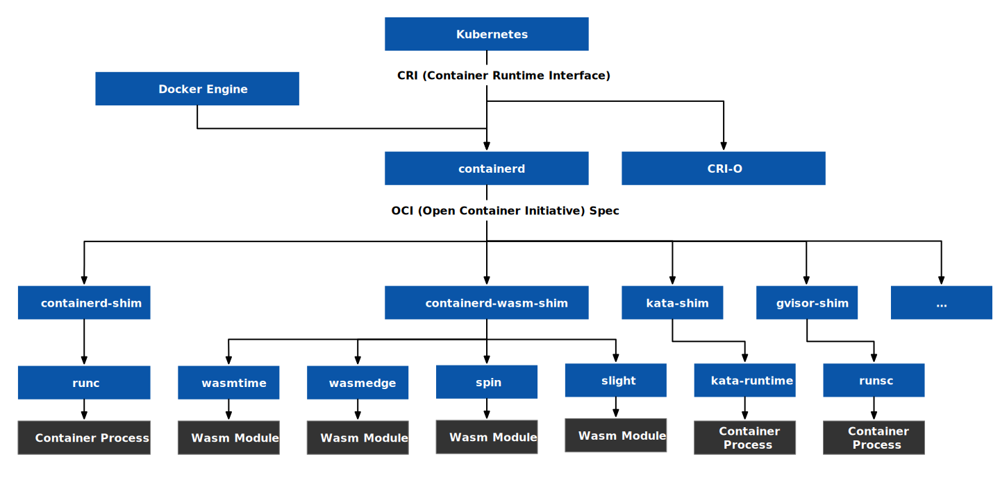

在 [Docker 发展史：四个重大举措，影响深远！](/blog/docker-four-milestones/) 这篇文章中我提到了 Docker 从一开始引领容器运行时，再到在容器编排这一维度上落后于 Kubernetes。为了在保住容器运行时的统治地位，Docker 公司提出了 OCI 并通过 [containerd-wasm-shim](https://github.com/deislabs/containerd-wasm-shims) 支持更多的 WebAssembly 运行时。

为了解决 Docker 在安全、稳定性、性能及可移植性方面的局限性，Kubernetes 社区开发了具有不同实现和功能的其他容器运行时，并为其制定了容器运行时接口（CRI）规范。目前实现该规范的容器运行时有 containerd、cri-o。还有 katacontainers、gvisor 等未实现 CRI 但是可以通过添加虚拟化层在 Kubernetes 上运行的其他容器运行时。

开放容器倡议 (OCI) 旨在定义容器镜像格式和运行时的行业标准，Docker 捐赠了其运行时 runc 作为该标准的第一个实现。最近，WASM 社区对 OCI 工具链表现出了兴趣，Docker 现在支持 WebAssembly 模块作为其工件之一。现在 Docker Hub 已经支持除了镜像以外的，Helm、Volume 和 WebAssembly 等常用工件。

使用 Docker 构建包含 WebAssembly 模块的镜像，并保存在 Docker Hub 中。通过 [containerd-wasm-shim](https://github.com/deislabs/containerd-wasm-shims)，可以让它们在 Kubernetes 中运行，如下图所示。



Containerd 是一种符合 CRI（Container Runtime Interface）规范的容器运行时，是由 Docker 公司开源并贡献给 CNCF 的。只要支持 CRI 规范的运行时都可以在 Kubernetes 中运行。

关于以上提到的名词 containerd、CRI、OCI 等的关系介绍，可以参考 [Docker，containerd，CRI，CRI-O，OCI，runc 分不清？看这一篇就够了](https://zhuanlan.zhihu.com/p/490585683)

## 在 Docker 中运行 WebAssembly 应用相对 Linux 镜像有什么优势？{#advantages}

使用 Docker 运行 WebAssembly 应用相对运行 Linux 镜像有以下优势。

**更高的性能**

WebAssembly 应用的启动时间更短，因为它不需要启动整个操作系统，而 Linux 容器需要。WebAssembly 模块的冷启动时间比 Docker 容器快 100 倍。WebAssembly 模块的内存占用更小，因为它是一个二进制格式，可以高效地压缩代码和依赖，而 Docker 容器需要打包整个镜像。WebAssembly 模块的大小一般在 1MB 以内，而 Docker 镜像的大小可以达到 100 或 200 MB。

**更高的可移植性**

WebAssembly 应用是一个架构中立的格式，只要有相应的运行时，就可以在任何底层架构上运行，而不需要考虑不同架构之间的兼容性问题。Docker 容器需要针对不同的架构构建不同的镜像，可能会存在一些潜在的安全风险或漏洞。

**更好的安全性和隔离性**

WebAssembly 应用可以提供代码级别的安全性，防止恶意代码访问系统资源，具体来说：

- WebAssembly 应用是运行在一个沙箱环境中的二进制字节码，不需要访问主机系统的资源，也不会受到主机系统的影响。Docker 容器虽然也是运行在一个隔离的环境中，但是仍然需要在主机系统上运行，可能会受到主机系统的攻击或干扰。
- WebAssembly 应用是通过 WebAssembly System Interface (WASI) 来与外部交互的，WASI 是一种标准化的 API 集合，可以提供一些基本的系统功能，比如文件操作、网络访问、环境变量等。WASI 可以限制 WebAssembly 应用的权限和能力，防止它们做一些危险的操作。Docker 容器虽然也可以通过设置一些安全选项来限制容器的权限和能力，但是仍然需要依赖主机系统提供的功能和服务。
- WebAssembly 应用是一个架构中立的格式，只要有相应的运行时，就可以在任何底层架构上运行，而不需要考虑不同架构之间的兼容性问题。Docker 容器需要针对不同的架构构建不同的镜像，可能会存在一些潜在的安全风险或漏洞。

因为有以上优势，WebAssembly 在一些场景下比 Docker 容器更有优势，例如边缘计算、云原生应用和微服务。当然，WebAssembly 应用也有一些局限性，比如不支持多线程、垃圾回收和二进制打包等。因此，并不是所有的场景都适合使用 WebAssembly 应用。你可以根据你的具体需求和偏好来选择合适的技术方案。

## 如何在 Docker 中运行 WebAssembly 应用？{#how-to-run-wasm-with-docker}

在 Docker 中运行 WebAssembly 应用的方式与普通的 Linux 镜像没有太大的不同，只是在运行时需要指定下平台和运行时。下面的例子来自 [Docker 官方文档](https://docs.docker.com/desktop/wasm/)，以在 Docker Desktop 中为例运行 WebAssembly 应用：

```bash
docker run -dp 8080:8080 --name=wasm-example --runtime=io.containerd.wasmedge.v1 --platform=wasi/wasm32 michaelirwin244/wasm-example
```

其中：

- `--runtime=io.containerd.wasmedge.v1` 指定使用 WasmEdge 运行时，替代默认的 Linux 容器运行时。
- `--platform=wasi/wasm32` 指定镜像的架构。通过利用 Wasm 架构，无需为不同的机器架构构建单独的镜像。 Wasm 运行时负责将 Wasm 二进制文件转换为机器指令的最后一步。

目前 Docker 支持四种 WebAssembly 运行时，分别为：

| 运行时名称 | API 名称 | 开发者 | 基金会托管 |
| --- | --- | --- | --- |
| [spin](https://github.com/fermyon/spin) | `io.containerd.spin.v1` | Fermyon | 无 |
| [SpiderLightning](https://github.com/deislabs/spiderlightning) | `io.containerd.slight.v1` | DeisLabs | 无 |
| [WasmEdge](https://github.com/WasmEdge/WasmEdge) | `io.containerd.wasmedge.v1` | SecondState | CNCF 沙箱项目 |
| [Wasmtime](https://github.com/bytecodealliance/wasmtime) | `io.containerd.wasmtime.v1` | Mozilla、Fastly、Intel、Red Hat 等公司 | 字节码联盟项目 |

在命令行终端中输入以下命令可以查看 WebAssembly 应用的运行情况：

```bash
curl http://localhost:8080/
```

你将看到如下输出：

```bash
Hello world from Rust running with Wasm! Send POST data to /echo to have it echoed back to you
```

你还可以向`/echo`端点发送 POST 测试请求：

```bash
curl localhost:8080/echo -d '{"message":"Hello"}' -H "Content-type: application/json"
```

你将看到如下输出：

```json
{"message":"hello"}
```

## 总结 {#summary}

本文介绍了 Docker 为什么要增加对 WebAssembly 的支持，以及在 Docker 中运行 WebAssembly 应用的优势和方法。WebAssembly 应用相对于 Linux 镜像有更高的性能、可移植性和安全性，适用于边缘计算、云原生应用和微服务等场景。Docker 支持四种 WebAssembly 运行时，分别为 spin、spiderlightning、WasmEdge 和 wasmtime。在接下来的文章中我将介绍如何开发一个 WebAssembly 应用，敬请期待。

## 参考 {#reference}

- [Announcing Docker Hub OCI Artifacts Support](https://www.docker.com/blog/announcing-docker-hub-oci-artifacts-support/)
- [Docker，containerd，CRI，CRI-O，OCI，runc 分不清？看这一篇就够了](https://zhuanlan.zhihu.com/p/490585683)
- [Build, Share, and Run WebAssembly Apps Using Docker](https://www.docker.com/blog/build-share-run-webassembly-apps-docker/)
- [Why Containers and WebAssembly Work Well Together](https://www.docker.com/blog/why-containers-and-webassembly-work-well-together/)
- [Docker + WebAssembly: a quick intro](https://medium.com/@guglielmino/docker-webassembly-a-quick-intro-730c38e8390c)
