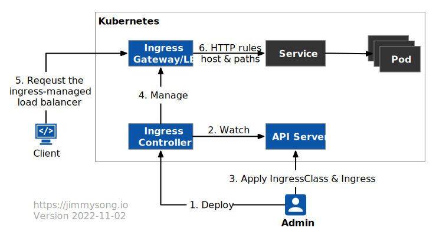
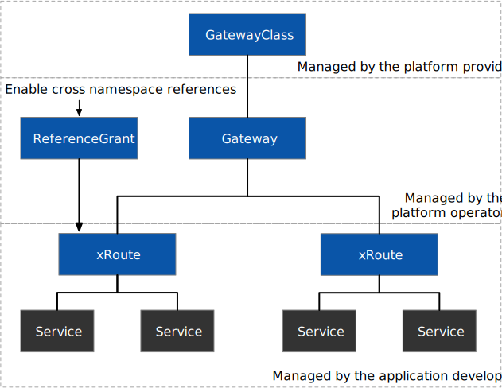
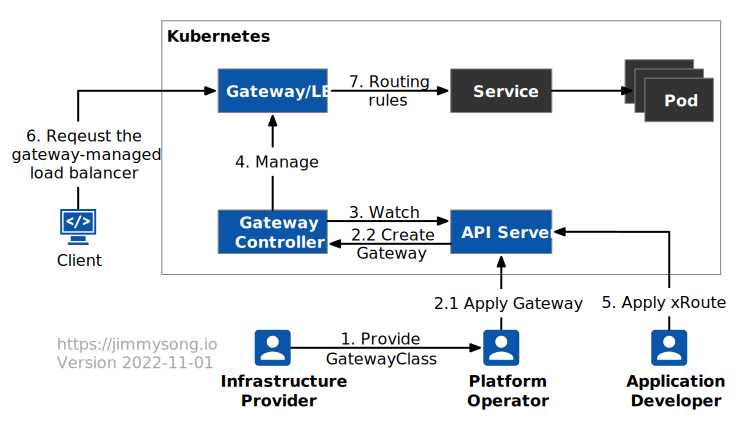
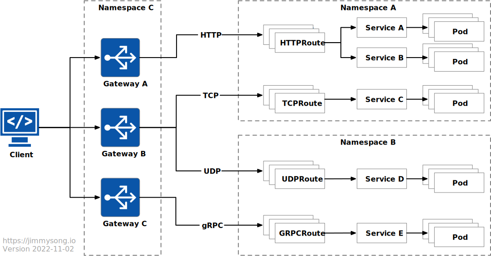
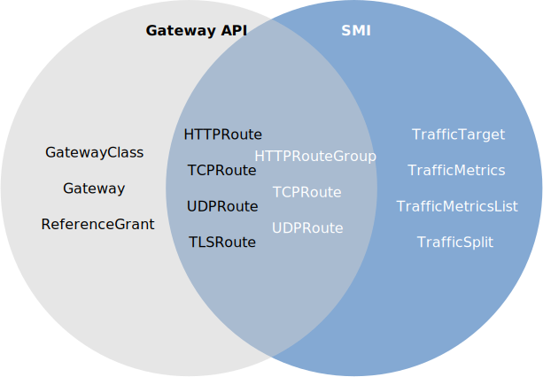
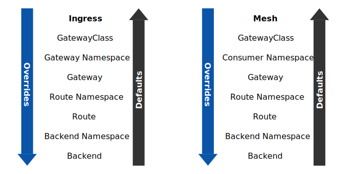
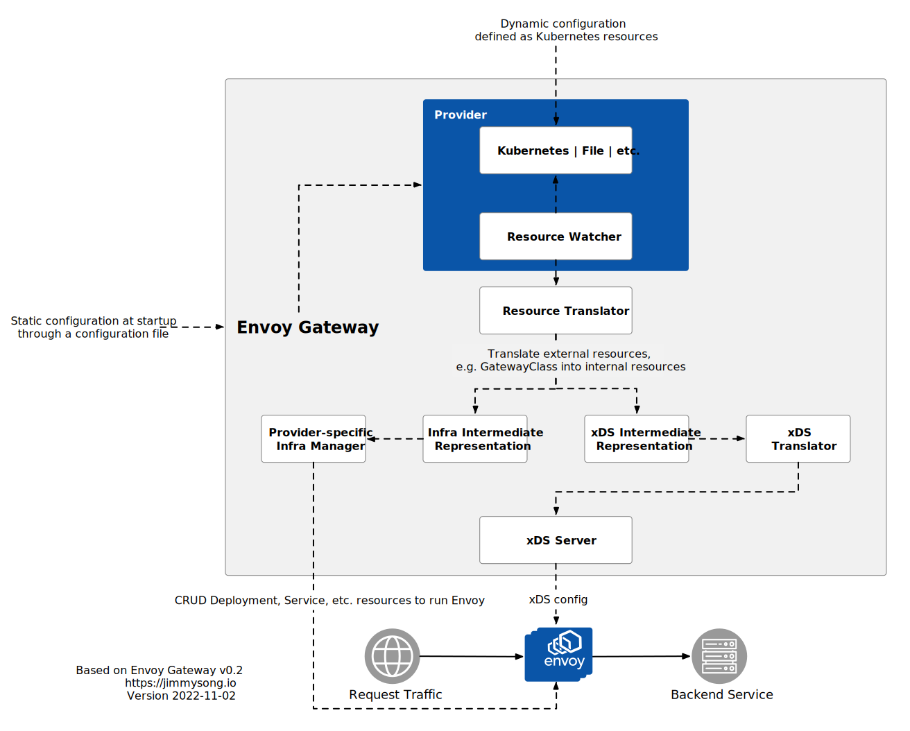

本文将以 Kubernetes Ingress、Istio 和 Envoy Gateway 为例，向你介绍 Kubernetes 中的入口网关和 Gateway API，同时介绍 Gateway API 使得 Kubernetes 和服务网格入口网关融合的新趋势。

## 本文观点

- Ingress 作为 Kubernetes 的初代入口网关，它的资源模型过于简单以致于无法适应当今的可编程网络；
- Gateway API 作为 Kubernetes 入口网关的最新成果，它通过角色划分将关注点分离，并提供跨 namespace 支持使其更适应多云环境，已获得大多数 API 网关的支持；
- 入口网关（南北向）与服务网格（东西向，集群内路由）存在部分功能重叠，Gateway API 为两者的融合提供了新的参考模型；

## Kubernetes 入口网关的历史

2014 年 6 月 Kubernetes 开源，起初只能使用 NodePort 和 LoadBalancer 类型的 Service 对象来暴露集群内服务，后来才诞生了 [Ingress](https://kubernetes.io/zh-cn/docs/concepts/services-networking/ingress/)，两年后（Kubernetes 1.2）Ingress API 进入 Beta 版本，随后为了保持其轻量和可移植的特性，Ingress API 相较于 Kubernetes 其他 API 发展得比较缓慢，直到 Kubernetes 1.19 它才升级到 GA。

Ingress 的主要目标是用简单的、声明性的语法来暴露 HTTP 应用。你可以在 Kubernetes 中部署多种 Ingress Controller，并在创建 Ingress 的时候通过 IngressClass 指定该网关使用的控制器，或者在 Kubernetes 中设置默认的默认的 IngressClass。Kubernetes 默认只支持 AWS、GCE 和 Nginx Ingress Controller，同时还支持大量的[第三方 Ingress Controller](https://kubernetes.io/docs/concepts/services-networking/ingress-controllers/#additional-controllers)。

下图展示了 Kubernetes Ingress 的工作流程。



详细流程如下：

1. Kubernetes 集群管理员在 Kubernetes 中部署 Ingress Controller；
2. Ingress Controller 会持续监视 Kubernetes  API Server 中的 IngressClass 和 Ingress 对象的变动；
3. 管理员应用 IngressClass 和 Ingress 来部署网关；
4. Ingress Controller 会根据管理员的配置来创建对应的入口网关并配置路由规则；
5. 如果在云中，客户端会访问该入口网关的负载均衡器；
6. 网关将根据 HTTP 请求中的 host 和 path 将流量路由到对应的后端服务；

Istio 同时支持 Ingress 和 Gateway API，下面是一个使用 Istio 入口网关的配置示例，在后文中会使用 Gateway API 创建该配置。

```yaml
apiVersion: networking.k8s.io/v1
kind: IngressClass
metadata:
  name: istio
spec:
  controller: istio.io/ingress-controller
---
apiVersion: networking.k8s.io/v1
kind: Ingress
metadata:
  name: ingress
spec:
  ingressClassName: istio
  rules:
  - host: httpbin.example.com
    http:
      paths:
      - path: /
        pathType: Prefix
        backend:
          service:
            name: httpbin
            port: 8000
```

注意：Ingress 的 spec 中必须在 `ingressClassName` 字段中指定使用的 `IngressClass`，否则将无法创建对应的入口网关。

## Kubernetes Ingress 的局限性

虽然 `IngressClass` 实现了入口网关与后台实现的解耦，但是它仍然有着巨大的局限性：

- Ingress 的配置过于简单，仅支持 HTTP 协议路由；
- HTTP 路由仅支持 host 和 path 匹配，对于高级路由功能没有通用配置，只能通过 annotation 来实现，比如[使用 Nginx Ingress Controller 实现 URL 重定向](https://help.aliyun.com/document_detail/86533.html#section-xsg-g5g-1uy)，需要配置 `nginx.ingress.kubernetes.io/rewrite-target` annotation，已经无法适应可编程路由的需求；
- 不同命名空间中的服务要绑定到同一个网关中的情况在实际情况下经常出现，而入口网关无法在多个命名空间中共享；
- 入口网关的创建和管理的职责没有划分界限，导致开发者不仅要配置网关路由，还需要自己创建和管理网关；

## Kubernetes Gateway API

Gateway API 是一个 API 资源的集合 —— `GatewayClass`、`Gateway`、`HTTPRoute`、`TCPRoute`、`ReferenceGrant` 等。Gateway API 暴露了一个更通用的代理 API，可以用于更多的协议，而不仅仅是 HTTP，并为更多的基础设施组件建模，为集群运营提供更好的部署和管理选项。

另外 Gateway API 通过将资源对象分离，实现配置上的解耦，可以由不同的角色的人员来管理，其中的 API 对象如下图所示。



下面是在 Istio 中使用 Gateway API 的示例。

```yaml
apiVersion: gateway.networking.k8s.io/v1alpha2
kind: Gateway
metadata:
  name: gateway
  namespace: istio-ingress
spec:
  gatewayClassName: istio
  listeners:
  - name: default
    hostname: "*.example.com"
    port: 80
    protocol: HTTP
    allowedRoutes:
      namespaces:
        from: All
---
apiVersion: gateway.networking.k8s.io/v1alpha2
kind: HTTPRoute
metadata:
  name: http
  namespace: default
spec:
  parentRefs:
  - name: gateway
    namespace: istio-ingress
  hostnames: ["httpbin.example.com"]
  rules:
  - matches:
    - path:
        type: PathPrefix
        value: /
    backendRefs:
    - name: httpbin
      port: 8000
```

与 Ingress 类似，Gateway 使用 `gatewayClassName` 声明其使用的控制器，该控制器需要平台管理员创建，并允许客户端对 `*.example.com` 域名的请求。应用开发者可以在其服务所在的命名空间中，在此示例中是 `default` 创建路由规则，并通过 `parentRefs` 绑定到 Gateway 上，当然这必须是在 Gateway 明确允许其绑定的情况下（通过 `allowRoutes` 字段中的规则设置）。

当你应用上面的配置后，Istio 会自动为你创建一个负载均衡网关，下图展示了 Gateway API 的工作流程。



详细流程如下：

1. 基础设施供应商提供了 `GatewayClass` 和 Gateway 控制器；
2. 平台运维部署 Gateway（可以部署多个，或使用不同的 `GatewayClass`）；
3. Gateway Controller 会持续监视 Kubernetes  API Server 中的 `GatewayClass` 和 `Gateway` 对象的变动；
4. Gateway Controller 会根据集群运维的配置来创建对应的网关；
5. 应用开发者应用 xRoute 并绑定服务上；
6. 如果在云中，客户端会访问该入口网关的负载均衡器；
7. 网关将根据流量请求中的匹配条件将路由到对应的后端服务；

从以上步骤中我们可以看出 Gateway API 相比 Ingress 有了明确的角色划分，而且路由规则可以与网关配置解耦，这大大增加了管理的灵活性。

下图展示了流量接入网关后经过处理的流程。



从图中我们可以看出路由是与网关绑定的，路由一般与其后端服务部署在同一个命名空间中，如果在不同的命名空间中时，需要在 [`ReferenceGrant`](https://gateway-api.sigs.k8s.io/api-types/referencegrant/) 中明确赋予该路由跨命名空间的引用权限，例如下面的 `foo` 命名空间中的 HTTPRoute `foo` 可以引用 `bar` 命名空间中的 `bar` 服务。

```yaml
kind: HTTPRoute
metadata:
  name: foo
  namespace: foo
spec:
  rules:
  - matches:
    - path: /bar
    forwardTo:
      backend:
      - name: bar
        namespace: bar
---
kind: ReferenceGrant
metadata:
  name: bar
  namespace: bar
spec:
  from:
  - group: networking.gateway.k8s.io
    kind: HTTPRoute
    namespace: foo
  to:
  - group: ""
    kind: Service
```

目前，Gateway API 仅支持 `HTTPRoute`，`TCPRoute`、`UDPRoute`、`TLSRoute` 和 `GRCPRoute` 还在实验阶段。Gateway API 已经得到了大量的网关和服务网格项目的支持，请[在 Gateway 官方文档中查看支持状况](https://gateway-api.sigs.k8s.io/implementations/)。

## 入口网关与服务网格

服务网格主要关注的是东西向流量，即 Kubernetes 集群内部的流量，但是大部分服务网格同样提供了入口网关功能，例如 Istio。但是 Istio 的功能和 API 过于复杂，在本文中我们就以 SMI 为例来说明入口网关和服务网格的关系。

[SMI](https://smi-spec.io/)（Service Mesh Interface）是 CNCF 的孵化项目，开源与 2019 年，它定义了独立于供应商的在 Kubernetes 中运行的服务网格通用标准。

下图说明 Gateway API 与服务网格 API 的重叠点。



从图中我们可以看到 Gateway API 与 SMI 在流量规范部分有明显的重叠。这些重叠导致同样的功能，需要在 Gateway API 和服务网格中重复实现。

### Istio 服务网格

当然，并不是所有的服务网格是完全符合 SMI 标准，Istio 是目前最流行的服务网格实现，它提供了丰富的流量管理功能，但是没有对这些功能制定单独的策略 API，而是耦合在 `VirtualService` 和 `DestinationRule` 中，如下所示。

**VirtualService**

- 路由：金丝雀发布、基于用户身、URI、Header 等匹配路由等；
- 错误注入：HTTP 错误代码注入、HTTP 延时注入；
- 流量切分：基于百分比的流量切分路由；
- 流量镜像：将一定百分比的流量镜像发送到其他集群；
- 超时：设置超时时间，超过设置的时间请求将失败；
- 重试：设置重试策略，如触发条件、重试次数、间隔时间等；

**DestinationRule**

- 负载均衡：设置负载均衡策略，如简单负载均衡、区域感知负载均衡、区域权重负载均衡；
- 熔断（Circuit Breaking）：通过异常点检测（Outlier Detection）和连接池设置将异常节点从负载均衡池中剔除；

`VirtualService` 主要处理路由相关功能，而 `DestinationRule` 负责集群节点的开合和负载均衡。

### Gateway API 融合 Kubernetes 和服务网格的入口网关

正如上文所述，Gateway API 与服务网格之间有部分功能交集，为了减少重复开发，促成对 Gateway API 与服务网格之间共同关注点的建模，Gateway API 工作组提出了 [GAMMA](https://gateway-api.sigs.k8s.io/contributing/gamma/)（Gateway API Mesh Management and Administration）倡议。

在该倡议的倡导下，那些在不同网关实现中的细节各不相同的高级流量管理功能，例如超时、重试、健康检查等，全部通过[策略附件](https://gateway-api.sigs.k8s.io/references/policy-attachment/)（Policy Attachment）的方式将由各个提供商来实现。你可以通过通过 `targetRef` 字段指定策略附件所附加到的资源对象，例如下所示：

```yaml
apiVersion: networking.acme.io/v1alpha1
kind: RetryPolicy
metadata:
  name: foo
spec:
  override:
    maxRetries: 10
  default:
    maxRetries: 5
  targetRef:
    group: gateway.networking.k8s.io/v1alpha2
    kind: HTTPRoute
    name: foo
```

在这里例子中重试策略被附加到了名为 `foo` 和 `HTTPRoute` 上。策略附件附加到不同的资源对象上，其生效的优先级也不同，例如 GatewayClass 是集群级的资源，如果策略附件覆盖在它上面的话，将优先生效。

你可以给附加策略指定 `override` 和 `default` 值，其在入口和网格内不同资源上的层次结构的优先级是如下图所示。



目前，Gateway API 正在探索用来处理网格流量，并提出了一些[设计方案](https://docs.google.com/document/d/1T_DtMQoq2tccLAtJTpo3c0ohjm25vRS35MsestSL9QU/edit#heading=h.6ks49gf06yii)。

## Envoy Gateway

2022 年 10 月 Envoy Gateway 首个开源版本 [v0.2 发布](/blog/envoy-gateway-release/)，这是一个基于 Envoy 代理的遵循 Gateway API 而创建的网关，[Tetrate](https://tetrate.io) 是该项目的核心发起者之一。Envoy Gateway 的目标是降低用户采用 Envoy 作为 API 网关的障碍，以吸引更多用户采用 Envoy。它通过入口和 L4/L7 流量路由，表达式、可扩展、面向角色的 API 设计，使其成为供应商建立 API 网关增值产品的基础。

早在 Envoy Gateway 发布之前，Envoy 作为最流行了云原生代理之一，已被大规模采用，有多款 Gateway 软件基于 Envoy 构建，Istio 服务网格使用它作为默认的 sidecar 代理，并通过 xDS 协议来配置这些分布式代理。在 Envoy Gateway 中，它同样使用 xDS 来配置 Envoy 机群，下图展示了 Envoy Gateway 的架构。



基础设施供应商会为你提供 `GatewayGlass`，你可以通过创建一个 Gateway 声明来创建一个 Envoy Gateway，你在 Gateway 中的路由和策略附件会通过 xDS 协议发送给 Envoy 机群。

关于 Envoy Gateway 的进一步介绍，请阅读：

- [使用 Envoy Gateway 0.2 体验新的 Kubernetes Gateway API](https://lib.jimmysong.io/blog/hands-on-with-envoy-gateway/)
- [面向未来的网关：新的 Kubernetes Gateway API 和 Envoy Gateway 0.2 介绍](https://lib.jimmysong.io/blog/envoy-gateway-to-the-future/)

## 总结

Gateway API 作为下一代 Kubernetes Ingress API，为 Kubernetes 网关供应商提供一定程度上的 API 规范，在保证其可移植性的前提下丰富了入口网关的功能，同时通过关注点分离方便不同角色的人员对网关进行管理。最后 GAMMA 倡议正在促进服务网格的入口网关与 Gateway API 的融合，策略附件可能将 Gateway API 的功能进一步扩展到东西向网关，我们拭目以待。

## 参考

- [Gateway API - lib.jimmysong.io](https://lib.jimmysong.io/kubernetes-handbook/service-discovery/gateway/)
- [一文搞懂 Kubernetes Gateway API 的 Policy Attachment - atbug.com](https://atbug.com/explore-k8s-gateway-api-policy-attachment/)
- [SMI 与 Gateway API 的 GAMMA 倡议意味着什么？- atbug.com](https://atbug.com/why-smi-collaborating-in-gateway-api-gamma/)
- [Evolving the Kubernetes Ingress APIs to GA and Beyond - Christopher M Luciano, IBM & Bowei Du, Google](https://kccncna19.sched.com/#)
