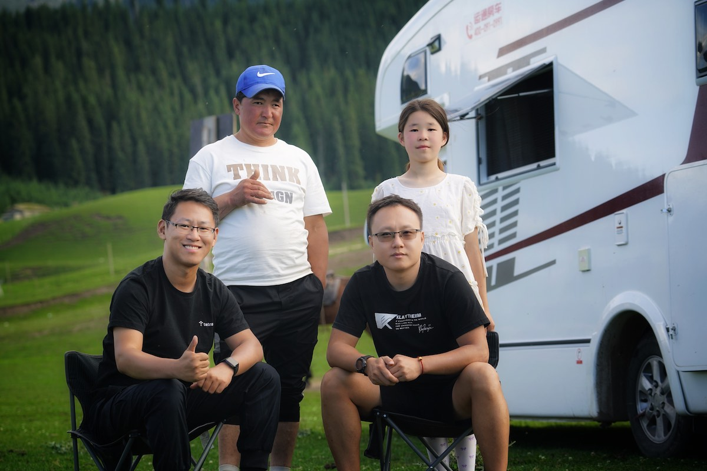
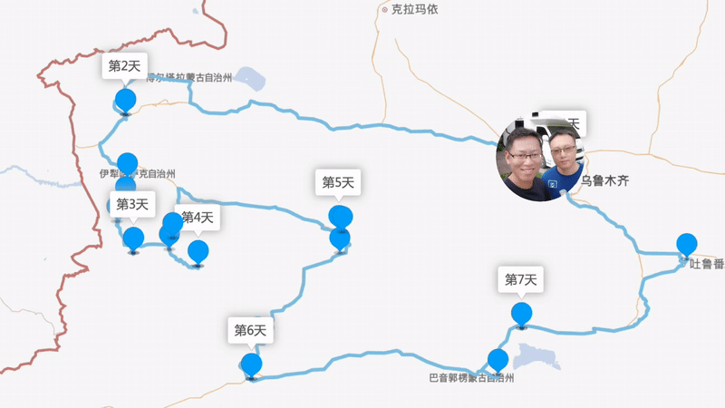
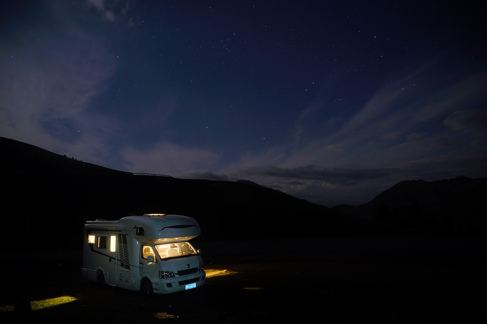
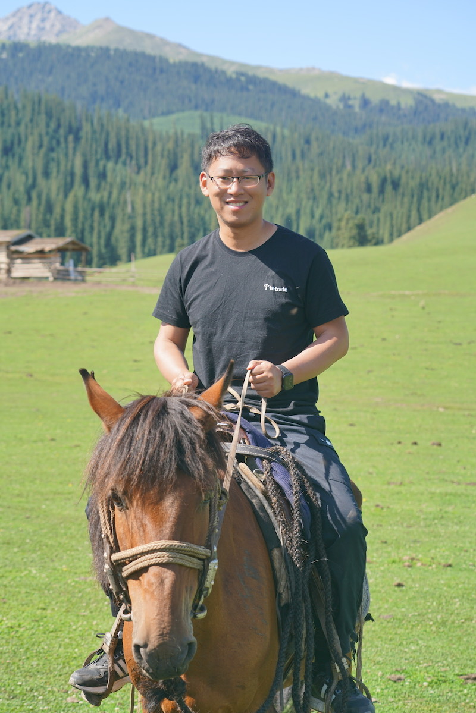

*摄于新疆维吾尔自治区伊犁哈萨克自治州特克斯县琼库什台村，晓辉和我与哈萨克族村民在一起*

> 我欲乘风破浪，踏遍黄沙海洋
>
> 与其误会一场，也要不负勇往
>
> ——Jam，《七月上》

今天是七月的最后的一天，从今天起我的博客将开通[旅行](/categories/旅行)专栏。距离我从新疆回到北京也快一个星期了，这篇博客用来记录我与[张晓辉（Addo Zhang](https://atbug.com/) 在新疆的七日之旅。

## 行程安排

因为晓辉最近处于工作变动空档期，而我又远程工作，今年元旦以来都没有到远游（上一次是元旦到云南大理、丽江），因此我们商议了为其七天的新疆北疆房车自驾之旅。	

我们将分别从北京和广州前往乌鲁木齐汇合然后提车出发，车是出发前就在网上预约好的，现场办手续，进行了 2 个小时的使用培训，然后就上路了。因为晓辉是老司机，而山路崎岖，房车又过于笨重，对于我这个新手难以驾驭，我就作为副驾，同时也会在路上工作。

我们基本是按照出发前预定的路线走的，整个旅程最精彩的部分应该是：

- 赛里木湖牧民家的烧烤晚餐
- 琼库什台原生态草原
- 独库公路

> 寄蜉蝣于天地，渺沧海之一粟。
>
> ——苏轼，《前赤壁赋》

夜宿在赛里木湖北门附近的牧民家旁边，夜晚可以看到璀璨的星空。

如果说有个地方我想再重走一遍的话，我会选择伊犁哈萨克自治州，如果一定要确定一个具体的村庄的话，那我会选择琼库什台。

我们在草原上工作，到哈萨克族老乡家吃饭一起庆祝古尔邦节，教小朋友玩无人机，一起骑马、打篮球，不亦乐乎。大美新疆，我一定会再来的！

> 人生处处知何似，恰似飞鸿踏雪泥。
>
> ——苏轼，《和子由渑池怀旧》

在琼库什台草原上骑马，这也是我第一次骑马，骑着骑着，马自己就跑起来了。

## 视频

下面是我为本次旅程所剪辑的[视频](https://www.bilibili.com/video/BV1Ab4y1z7TW/)，希望大家一键三连（点赞、投币、转发）。

## 贴士

对于去气候适宜或稳定的地域的短途旅行，建议租普通的 SUV 即可，如果想睡在野外可以搭帐篷，没必要租房车，因为在房车体积较大，大部分人没有驾驶过房车的经验，开起来会比较吃力，而且房车对于路况要求也比较高，很多沟沟坎坎、野路就没办法通过了。
