## 前言

我已就该话题已在 2016 年上海 Qcon 上发表过演讲。另外 InfoQ 网站上的文字版[数据中心的 YARN on Docker 集群方案](https://www.infoq.cn/article/YARNOnDocker-forDCCluster/)，即本文。

项目代码开源在 Github 上：[Magpie](https://github.com/rootsongjc/magpie)

## 当前数据中心存在的问题

数据中心中的应用一般独立部署，为了保证环境隔离与方便管理，保证应用最大资源  数据中心中普遍存在如下问题：

1. 主机资源利用率低
2. 部署和扩展复杂
3. 资源隔离无法动态调整
4. 无法快速响应业务

## 为何使用 YARN on Docker

**彻底隔离队列**

- 为了合理利用 Hadoop YARN 的资源，队列间会互相抢占计算资源，造成重要任务阻塞
- 根据部门申请的机器数量划分 YARN 集群方便财务管理
- 更细粒度的资源分配 

**统一的资源分配**

- 每个 NodeManager 和容器都可以限定 CPU、内存资源
- YARN 资源划分精确到 CPU 核数和内存大小 

**弹性伸缩性服务**

- 每个容器中运行一个 NodeManager，增减 YARN 资源只需增减容器个数
- 可以指定每个 NodeManager 拥有的计算资源多少，按需申请资源 

## 给我们带来什么好处？ 

**Swarm 统一集群资源调度**

- 统一资源
- 增加 Docker 虚拟化层，降低运维成本

**增加 Hadoop 集群资源利用率**

- 对于数据中心：避免了静态资源隔离

- 对于集群：加强集群内部资源隔离

## 系统架构

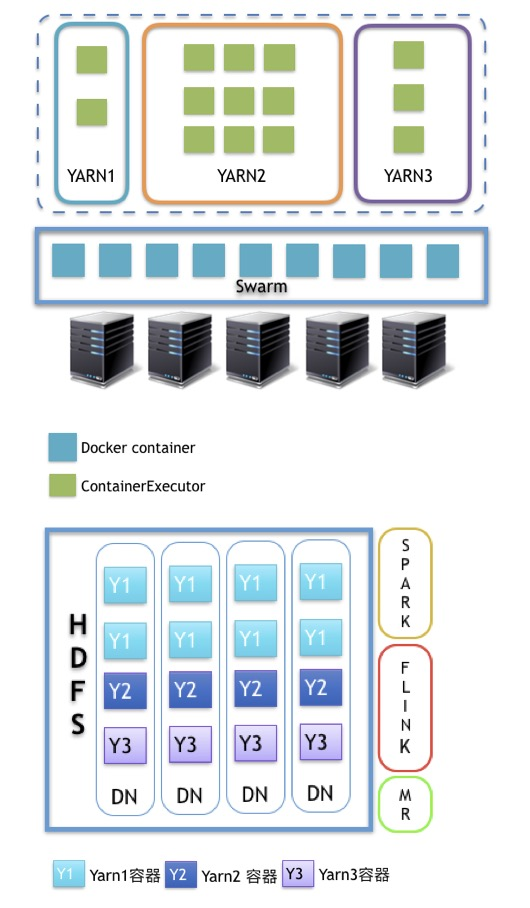

比如数据中心中运行的 Hadoop 集群，我们将 HDFS 依然运行在物理机上，即 DataNode 依然部署在实体机器上，将 YARN 计算层运行在 Docker 容器中，整个系统使用二层资源调度，Spark、Flink、MapReduce 等应用运行在 YARN 上。

Swarm 调度最底层的主机硬件资源，CPU 和内存封装为 Docker 容器，容器中运行 NodeManager，提供给 YARN 集群，一个 Swarm 集群中可以运行多个 YARN 集群，形成圈地式的 YARN 计算集群。

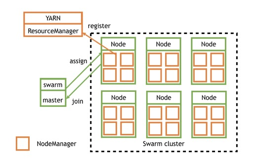

**具体流程**

1. swarm node 向 swarm master 注册主机资源并加入到 swarm cluster 中
2. swarm master 向 cluster 申请资源请求启动容器
3. swarm 根据调度策略选择在某个 node 上启动 docker container
4. swarm node 的 docker daemon 根据容器启动参数启动相应资源大小的 NodeManager
5. NodeManager 自动向 YARN 的 ResourceManager 注册资源一个 NodeManager 资源添加完成。

Swarm 为数据中心做容器即主机资源调度，每个 swarmnode 的节点结构如图：

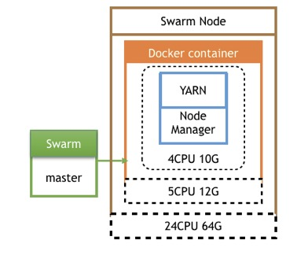

一个 Swarm node 就是一台物理机，每台主机上可以起多个同类型的 docker container，每个 container 的资源都有限制包括 CPU、内存 NodeManager 容器只需要考虑本身进程占用的资源和需要给主机预留资源。假如主机是 24 核 64G，我们可以分给一个容器 5 核 12G，NodeManager 占用 4 核 10G 的资源提供给 YARN。

**Kubernetes VS Swarm**

关于容器集群管理系统的选型，用 Kubernetes 还是 Swarm？我们结合自己的经验和业务需求，对比如下：

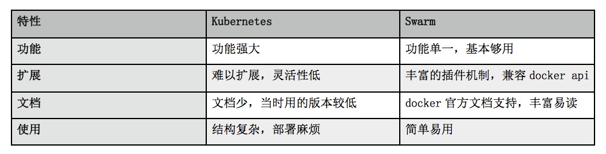

基于以上四点，我们当时选择了 Swarm，它基本满足我们的需求，掌握和开发时常较短。

## 镜像制作与发布

镜像制作和发布流程如下图：

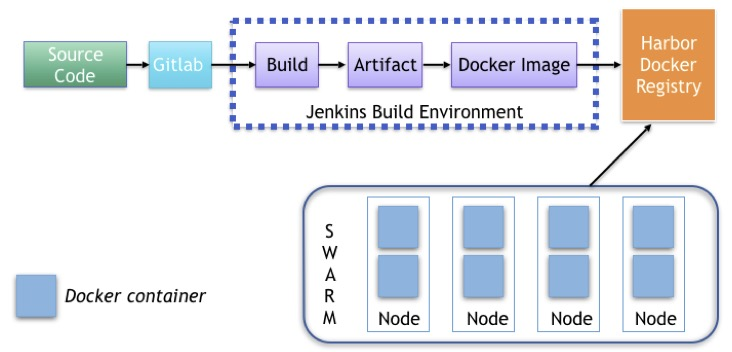

用户从客户端提交代码到 Gitlab 中，需要包含 Dockerfile 文件，通过集成了 docker 插件的 Jenkins 的自动编译发布机制，自动 build 镜像后 push 到 docker 镜像仓库中，同一个项目每提交一次代码都会重新 build 一次镜像，生成不同的 tag 来标识镜像，Swarm 集群使用该镜像仓库就可以直接拉取镜像。

### Dockerfile 的编写技巧

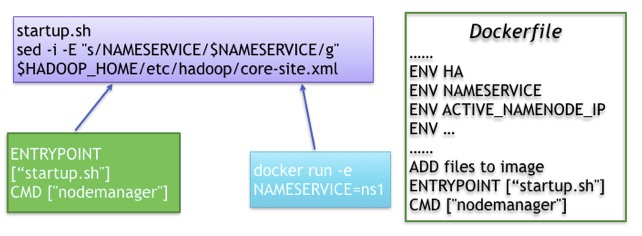

Dockerfile 相当于 docker 镜像的编译打包流程说明，其中也不乏一些技巧。     

很多应用需要配置文件，如果想为每次启动容器的时候使用不同的配置参数，可以通过传递环境变量的方式来修改配置文件，前提是需要写一个 bash 脚本，脚本中来处理配置文件，再将这个脚本作为 entrypoint 入口，每当容器启动时就会执行这个脚本从而替换配置文件中的参数，也可以通过 CMD 传递参数给该脚本。

启动容器的时候通过传递环境变量的方式修改配置文件：

```Shell
docker run -d 
--net=mynet 
-e NAMESERVICE=nameservice 
-e ACTIVE_NAMENODE_ID=namenode29 \
-e STANDBY_NAMENODE_ID=namenode63 \
-e HA_ZOOKEEPER_QUORUM=zk1:2181,zk2:2181,zk3:2181 \
-e YARN_ZK_DIR=rmstore \
-e YARN_CLUSTER_ID=yarnRM \
-e YARN_RM1_IP=rm1 \
-e YARN_RM2_IP=rm2 \
-e CPU_CORE_NUM=5
-e NODEMANAGER_MEMORY_MB=12288 \
-e YARN_JOBHISTORY_IP=jobhistory \
-e ACTIVE_NAMENODE_IP=active-namenode \
-e STANDBY_NAMENODE_IP=standby-namenode \
-e HA=yes \
docker-registry/library/hadoop-yarn:v0.1 resourcemanager
```

最后传递 Resource Manager 或者 Node Manager 参数指定启动相应的服务。

## 集群管理

我开发的命令行工具[magpie](https://github.com/rootsongjc/magpie)，也可以通过其他开源可视化页面来管理集群，比如 shipyard。

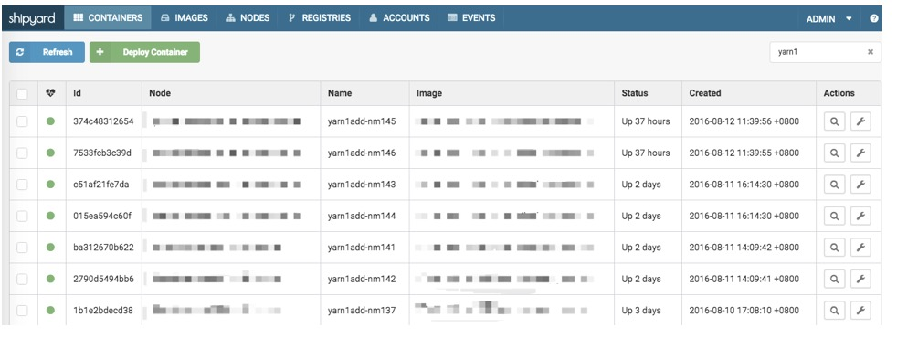

## 自定义网络

Docker 容器跨主机互访一直是一个问题，Docker 官方为了避免网络上带来的诸多麻烦，故将跨主机网络开了比较大的口子，而由用户自己去实现。我们开发并开源了 Shrike 这个 docker 网络插件，大家可以在这里下载到：[GitHub - docker-ipam-plugin](https://github.com/rootsongjc/docker-ipam-plugin)

目前 Docker 跨主机的网络实现方案也有很多种，主要包括端口映射、ovs、fannel 等。但是这些方案都无法满足我们的需求，端口映射服务内的内网 IP 会映射成外网的 IP，这样会给开发带来困惑，因为他们往往在跨网络交互时是不需要内网 IP 的，而 ovs 与 fannel 则是在基础网络协议上又包装了一层自定义协议，这样当网络流量大时，却又无端的增加了网络负载，最后我们采取了自主研发扁平化网络插件，也就是说让所有的容器统统在大二层上互通。架构如下：

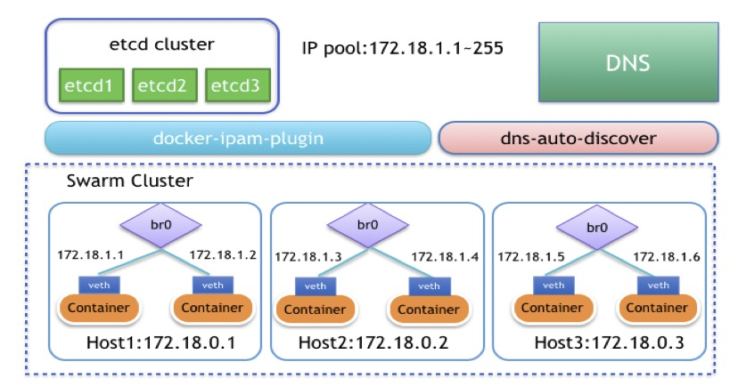

 

我们首先需要创建一个 br0 自定义网桥，这个网桥并不是通过系统命令手动建立的原始 Linux 网桥，而是通过 Docker 的 cerate network 命令来建立的自定义网桥，这样避免了一个很重要的问题就是我们可以通过设置 DefaultGatewayIPv4 参数来设置容器的默认路由，这个解决了原始 Linux 自建网桥不能解决的问题。用 Docker 创建网络时我们可以通过设置 subnet 参数来设置子网 IP 范围，默认我们可以把整个网段给这个子网，后面可以用 ipamdriver（地址管理插件）来进行控制。还有一个参数 gateway 是用来设置 br0 自定义网桥地址的，其实也就是你这台宿主机的地址。

```Shell
docker network create 
--opt=com.docker.network.bridge.enable_icc=true
--opt=com.docker.network.bridge.enable_ip_masquerade=false
--opt=com.docker.network.bridge.host_binding_ipv4=0.0.0.0
--opt=com.docker.network.bridge.name=br0
--opt=com.docker.network.driver.mtu=1500
--ipam-driver=talkingdata
--subnet=容器IP的子网范围
--gateway=br0网桥使用的IP,也就是宿主机的地址
--aux-address=DefaultGatewayIPv4=容器使用的网关地址
mynet
```


IPAM 驱动是专门管理 Docker 容器 IP 的，Docker 每次启停与删除容器都会调用这个驱动提供的 IP 管理接口，然后 IP 接口会对存储 IP 地址的 Etcd 有一个增删改查的操作。此插件运行时会起一个 UnixSocket, 然后会在`docker/run/plugins`目录下生成一个.sock 文件，Dockerdaemon 之后会和这个 sock 文件进行沟通去调用我们之前实现好的几个接口进行 IP 管理，以此来达到 IP 管理的目的，防止 IP 冲突。 

通过 Docker 命令去创建一个自定义的网络起名为`mynet`，同时会产生一个网桥 br0，之后通过更改网络配置文件（在`/etc/sysconfig/network-scripts/`下 ifcfg-br0、ifcfg-默认网络接口名）将默认网络接口桥接到 br0 上，重启网络后，桥接网络就会生效。Docker 默认在每次启动容器时都会将容器内的默认网卡桥接到 br0 上，而且宿主机的物理网卡也同样桥接到了 br0 上了。其实桥接的原理就好像是一台交换机，Docker 容器和宿主机物理网络接口都是服务器，通过 vethpair 这个网络设备像一根网线插到交换机上。至此，所有的容器网络已经在同一个网络上可以通信了，每一个 Docker 容器就好比是一台独立的虚拟机，拥有和宿主机同一网段的 IP，可以实现跨主机访问了。

## 性能瓶颈与优化

大家可能会担心自定义网络的性能问题，为此我们用 iperf 进行了网络性能测试。我们对比了不同主机容器间的网速，同一主机上的不同容器和不同主机间的网速，结果如下表：

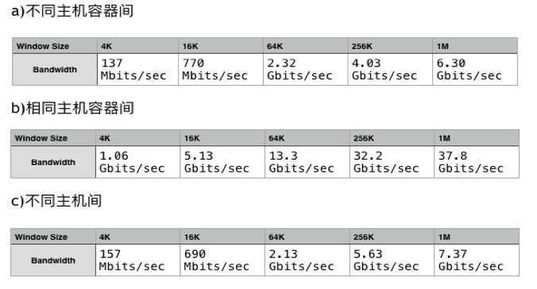

从表中我们可以看到，在这一组测试中，容器间的网速与容器是在想通主机还是在不同主机上的差别不大，说明我们的网络插件性能还是很优异的。 

## Hadoop 配置优化 

因为使用 docker 将原来一台机器一个 nodemanager 给细化为了多个，会造成 nodemanager 个数的成倍增加，因此 hadoop 的一些配置需要相应优化。
```ini
- yarn.nodemanager.localizer.fetch.thread-count 随着容器数量增加，需要相应调整该参数
- yarn.resourcemanager.amliveliness-monitor.interval-ms 默认1秒，改为10秒，否则时间太短可能导致有些节点无法注册
- yarn.resourcemanager.resource-tracker.client.thread-count 默认50，改为100，随着容器数量增加，需要相应调整该参数
- yarn.nodemanager.pmem-check-enabled 默认true，改为false，不检查任务正在使用的物理内存量
- 容器中hadoop ulimit值修改，默认4096，改成655350
```

**集群监控** 

如果使用 shipyard 管理集群会有一个单独的监控页面，可以看到一定时间段内的 CPU、内存、IO、网络使用状况。

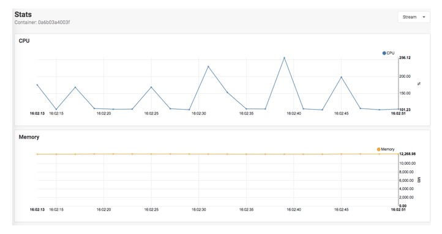

## 关于未来

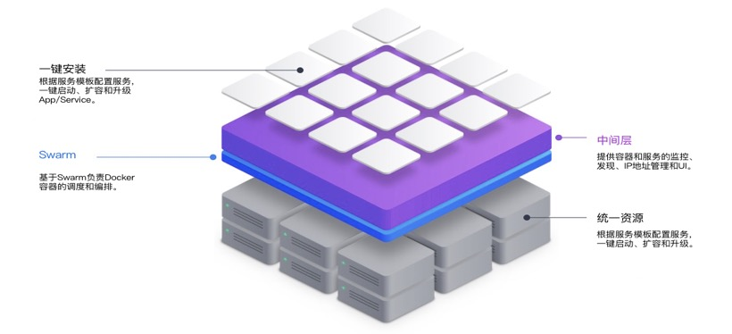 

我们未来规划做的是DC/OS，基于Docker的应用自动打包编译分发系统，让开发人员可以很便捷的申请资源，上下线服务，管理应用。要达到这个目标还有很多事情要做：

-  Service Control Panel：统一的根据服务来管理的 web 页面
-  Loadbalance：容器根据机器负载情况自动迁移
-  Scheduler：swarm 调度策略优化
-  服务配置文件：提供镜像启动参数的配置文件，所有启动参数可通过文件配置
-  监控：服务级别的监控

## 后记

这篇文章写好的时候是 2016 年 10 月，距离现在我添加**前言**和**后记**的已经快半年时间了，这段时间内业界也发生了很多变化，比如 docker 推出 CE 和 SE 版本，Kubernetes 发布了 1.6 版本，人工智能依然大热，在可预见的未来，可以说<u>Kubernetes 一定会远远超越 Docker 成为容器编排领域的王者</u>，这是毋庸置疑的，对于 docker 17.03-CE 我也研究过了一段时间，其 disgusting 的 plugin 让我对于 Docker 的编排已经失去信心。

其实当时容器在大数据场景下的应用并不是很多，毕竟 Hadoop 那套笨重的东西放在容器下运行，上生产环境实属不易。如果说做原型验证、研发测试那还可以。这样就大大限制了容器技术在大数据场景下的应用场景。使用容器的编排调度来实现大数据集群的资源优化有点舍本逐末，<u>如果真的要优化集群资源利用率的话，应该让不同的应用混跑，而不应该让集群之间资源隔离，比如 Web 应用跟大数据应用混布。</u>目前的这种**YARN on Docker**方案实质上是将原来的整体 Hadoop YARN 集群划分成多个不同的 YARN，将存储和计算分离了。其实这跟**Nutanix**的超融合架构有点像，Nutanix 是由前 Google 的工程师创立的，解决虚拟化计算环境下的存储问题，也是将存储和计算分离，共享存储，计算根据需要调度。事实上 Yahoo 已经有解决 Hadoop 集群的资源细粒度分配和调度问题的方案，这应该是从 YARN 的 scheduler 层来处理。

Swarm 已死，Swarmkit 将继续发展，Docker 的 Swarm Mode 还会在艰难中前行，目前看到的趋势仍然是模仿 Kubernentes 为主，没有自己鲜明的特色（除了部署管理方便意外，谁让它就集成在了 Docker 里呢，就像当年 Windows 集成 IE 打败 Netscape，不过这不会再此上演了），Kubernentes 又是一个通用的资源调度框架，它的最小资源划分是**Pod**而不是 Docker，它还可以运行 rkt、containerd。

上周起我开始将注意力全部转移到了 Kubernentes，以后请关注我的[Kuberentes 实践](https://jimmysong.io/tags/kubernetes/)相关文章。
