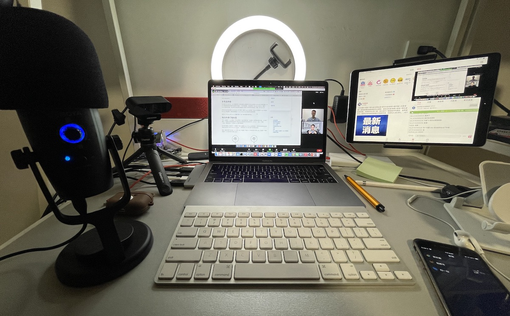
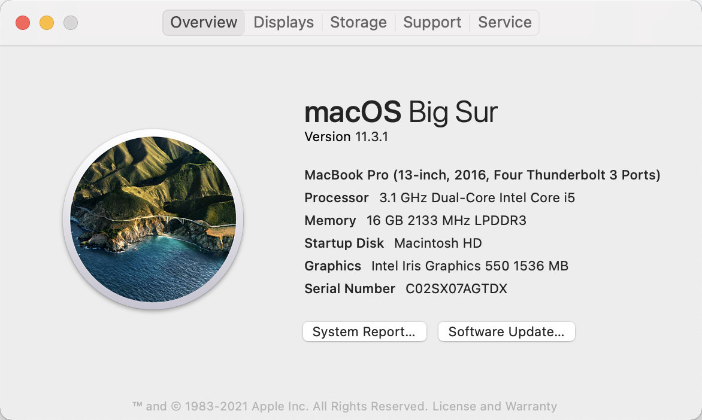
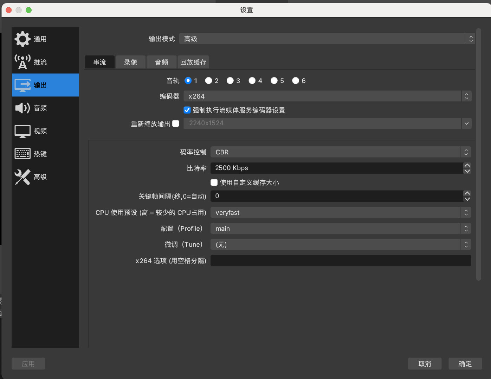
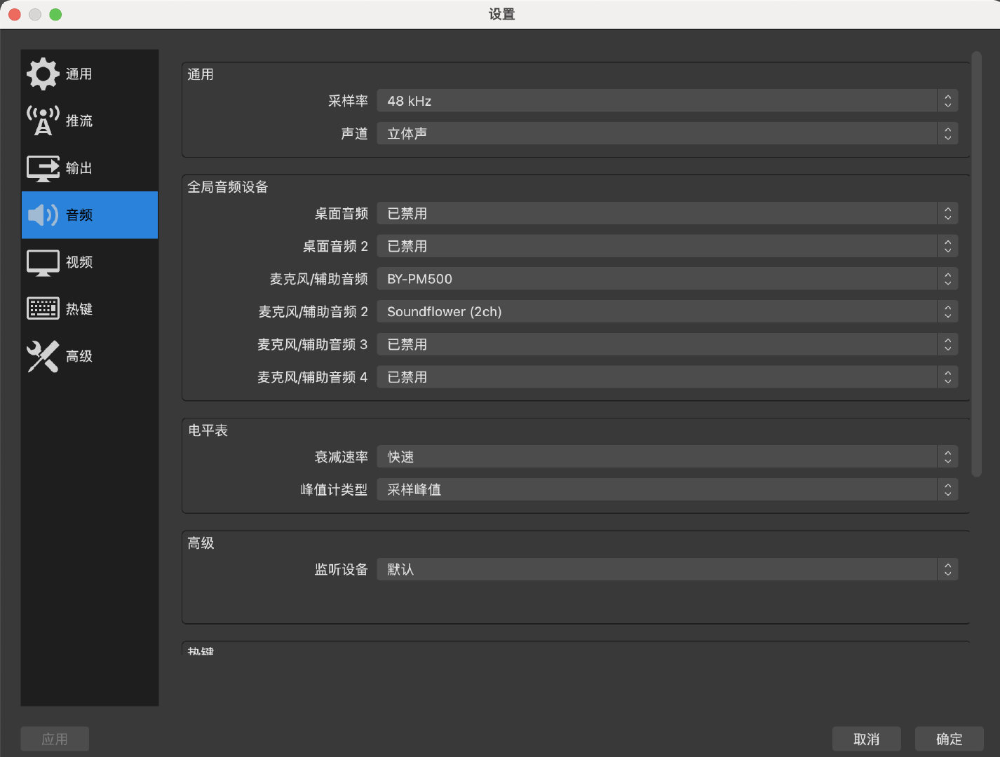
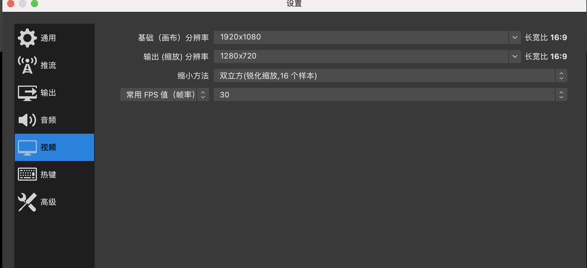
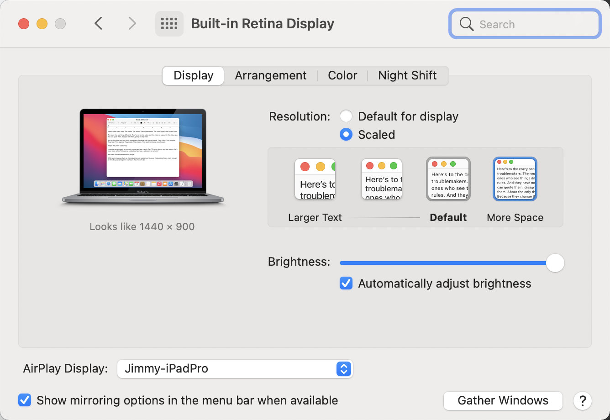
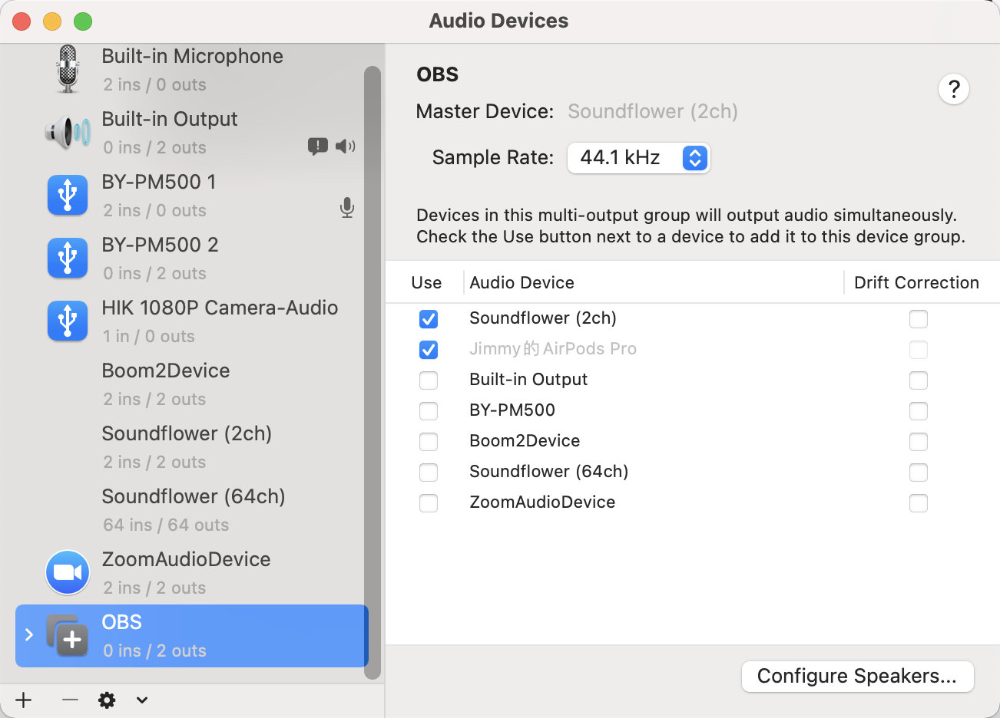
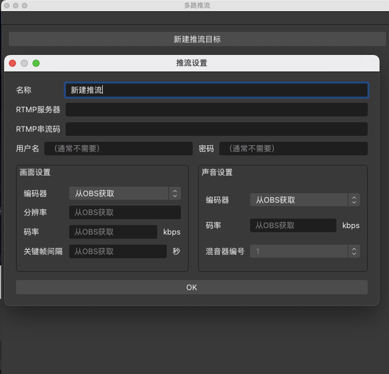
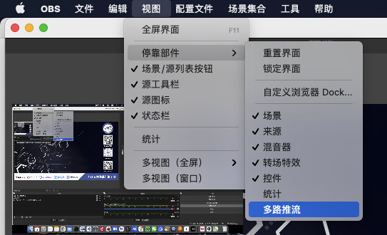

今晚我第一次使用 Zoom + OBS 和马若飞在 B 站上进行了[《Istio 大咖说》](https://space.bilibili.com/1698576814)栏目的第一期分享——「Istio 开源四周年回顾与展望」。考虑到很多社区、主播、调音台会有在 B 站或其他平台上直播的需求，特别将我的个人经验分享给大家，欢迎大家补充，我会不断优化直播体验。

下图是我直播时桌面的情况，使用的设备有：

- MacBook Pro，这个自不必说
- USB 麦克风博雅 BY-500，作为音频输入麦克风
- 海康威视外接摄像头，用作第二机位
- iPad，作为直播监视器，同时回答观众的弹幕
- 环形补光灯，直播通常是在晚上，光线太暗需要补光
- AirPods Pro，用于监听声音的，不作为音频输入
- 静音蓝牙键盘，防止键盘敲击声音影响直播的声音体验
- iPhone，用于和直播讲师私下沟通，这样不会被直播出去

以上这些不是全部都需要的，只要你有一台电脑和一个耳机就可以直播。

上面是直播时的桌面（请忽略我杂乱的被各种设备占满空间的桌面），下面是我的配置参考。

## 硬件准备

- 电脑：macOS、Windows 都可以，我是用的是Macbook Pro 2016 年产，配置如下：

 

- 外接麦克风：切勿直接使用电脑机身上自带的麦克风，那样会收录电脑风扇的声音，我使用的是博雅 BY-500（400 多块钱） 麦克风，电容式麦克风，指向性比较好，基本没有噪音。
- 摄像头：保证电脑上的摄像头可用，因为会议的时候需要开摄像头，或者用外接摄像头也可以。
- 网络：确保网速至少 100MB/s 的宽带，因为推流还是比较占用带宽的，而且还需要同时查看直播效果，对下行带宽也有要求。
- 另一台可联网设备：用来监控直播效果，可以是手机、iPad 等

## 软件准备

- Zoom：需要 Pro 版，这样才可以举行超过 45 分钟的线上会议，否则会在超时后打断再重新加入，需要准备好账号，中国大陆用户貌似不能再注册？如果没有 zoom，换成其他任何一个会议软件都可以，比如腾讯会议。
- OBS：用来做推流，到[官网](https://obsproject.com/)下载最新的版本。
- 音频插件 Sunflower：[点击跳转到下载页面](https://github.com/mattingalls/Soundflower/releases)，如果安装时遇到系统权限问题，请在命令行中执行 `sudo spctl --master-disable` 并在电脑的 `系统首选项` 的 `安全与隐私` 中批准来自任意途径的软件安装，如果看到有详情页面，点击进去批准软件发行商。
- Bilibili：需要一个 B 站账号，并开通直播间，经过实名认证。

## OBS 配置

下面是在 Macbook 中安装的 OBS 配置截图。

需要注意的是输出、音频和视频的配置。请参考图中的配置，尤其注意编码控制、比特率的配置。

请注意分辨率的配置，同时调整电脑屏幕的分辨率为 1440x900，**不要使用太大的分辨率，否则可能导致直播画面黑屏**。

## 会议直播

以上场景是仅限于本机画面的直播，还有中场景就是现场会议直播，你还需要录制现场画面，这时候你最好制作一个直播底板，例如下图。

该底板用于布局 PPT 和摄像头画面，同时底板上也包括了活动 logo 和主办方、赞助商信息。该图最好是 PNG 透明的格式，把图片放在布局最上层，这样就能很好地展示布局。

## 音频配置

安装 sunflower 后，在 Midi 设备中创建一个多输出设备，如图。

 

选择 Sunflower（2ch）和你想要用来监听系统声音的设备，我是用的是 AirPods，你也可以选择其他耳机，总之不要让麦克风录到这个系统输出的即可。

还要在 OBS 的麦克风配置里增加下新创建的这个输出设备，这样直播的时候就可以收录你的系统，也就是你的耳机听到的声音了，比如在视频会议中，所有人讲话的声音都会被直播出去。

### 使用独立音频硬件

如果安装 sunflower 有问题的话，你也可以购买一款独立的音频设备，要知道一台电脑是可以安装多块声卡的，这些声卡可以通过 USB 接口转接，而且价格都很便宜（只要几十块钱），一旦有了多个声卡，你就可以为不同的音频源选择不同的输出，而且可以对它们的音量进行单独单独控制。例如下面这款 USB 外置声卡（非利益相关），即插即用，不需要安装任何软件。

你也可以用 USB 外置声卡来转接其他的无线麦克风，比如我就转接了 Rode Wireless Go（你还需要买一根转接的音频线，红色的那根，用于连接声卡）。

## 多路推流（多渠道同步直播）

因为我们在直播时往往有多个渠道，比如多个 B 站直播间、微信视频号等，如何使用 OBS 同步推流到多个渠道呢？可以使用 [sorayuki/obs-multi-rtmp](https://github.com/sorayuki/obs-multi-rtmp) 插件（支持 Windows 和 macOS），注意需要将 OBS 升级到最新版本（至少 27.0.1 版本）。安装完插件，重启 OBS 后就可以看到一个窗口新建多路推流，如下图所示。

如果没有看到该窗口，请点击【视图】-【停靠部件】-【多路推流】即可显示。

## 直播效果

下面是当晚直播的 zoom 录制的视频直出，已上传到 [B 站](https://www.bilibili.com/video/BV1jK4y1R7Tk)，大家可以感受下画面的清晰度还有声音效果，我还是比较满意的。

其中只有几个小插曲：

- 因为我是用的是 AirPods 蓝牙耳机，戴上耳机的时候我无法确定它要连那个设备（我有两个 iPhone、1 个 iPad、1 个 MacBook 都有可能被脸上）活动开始的时候总是连不上 MacBook，一气之下把其他的苹果设备的蓝牙全关掉，只留下 MacBook 的蓝牙开启，这样可以保证连上 MacBook
- 说话的时候忘记了把麦克风静音了
- 直播大概进行了 1 个小时的时候，zoom 突然断开了 10 几秒钟后又自动重连，总体来说 zoom 会议还是比较稳定的，1 个小时左右的会议应该不会断连

## 直播开始前的检查

- 电脑屏幕分辨率调整为 1440 x 900
- 关闭与直播无关的 APP，减少系统资源占用
- 电脑设置为勿扰模式
- 使用外接麦克风，切勿直接使用电脑内置的麦克风，会收录风扇及键盘杂音，影响音质
- 使用外接耳机，如 AirPods
- 音频输出调整为多设备输出，其中包括 Sunflower（2ch）和耳机
- Zoom 会议开始前记得点击录像
- 会议开始后检查 B 站直播间，确保声音和画质没有问题
- OBS 推流的时候不用录像，因为 zoom 已经在录了
- 直播完成后检查 zoom 生成的视频文件并备份

## 最后

直播是除了在线下面对面交流以外，可以跟社区及开源爱好者交流最直接最友好的方式，我会时常发起，感谢大家的关注我主持的直播间：

- [云原生社区](https://live.bilibili.com/22230973)
- [Istio Service Mesh](https://live.bilibili.com/23095515)

关注上面的 B 站账号，获取直播推送提醒。关于 B 站直播，如果你有任何问题或者建议请在下面留言。