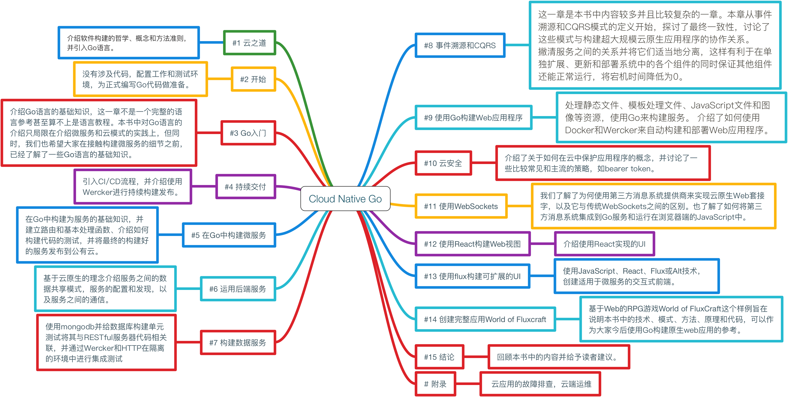

- 本书作者：Kevin Hoffman & Dan Nemeth
- 译者：宋净超、吴迎松、徐蓓、马超译
- 出版社：电子工业出版社
- 全名：Cloud Native Go - 基于Go和React的web云原生应用构建指南

本书已由电子工业出版社出版，可以[在京东上购买](https://item.m.jd.com/product/12123347.html)。

*照片拍摄于 2017 年 9 月 12 日，北京*

## 简介

Cloud Native Go向开发人员展示如何构建大规模云应用程序，在满足当今客户的强大需求的同时还可以动态扩展来处理几乎任何规模的数据量、流量或用户。

Kevin Hoffman和Dan Nemeth详细描述了现代云原生应用程序，阐明了与快速、可靠的云原生开发相关的因素、规则和习惯。他们还介绍了Go这种“简单优雅”的高性能语言，它特别适合于云开发。

在本书中你将使用Go语言创建微服务，使用ReactJS和Flux添加前端Web组件，并掌握基于Go的高级云原生技术。Hoffman和Nemeth展示了如何使用Wercker、Docker和Dockerhub等工具构建持续交付管道; 自动推送应用程序到平台上; 并系统地监控生产中的应用程序性能。

-  学习“云之道”：为什么开发好的云软件基本上是关于心态和规则
-  了解为什么使用Go语言是云本地微服务开发的理想选择
-  规划支持持续交付和部署的云应用程序
-  设计服务生态系统，然后以test-first的方式构建它们
-  将正在进行的工作推送到云
-  使用事件源和CQRS模式来响应大规模和高吞吐量
-  安全的基于云的Web应用程序：做与不做的选择
-  使用第三方消息传递供应商创建响应式云应用程序
-  使用React和Flux构建大规模，云友好的GUI
-  监控云中的动态扩展，故障转移和容错

章节简介如下图。

## 关于作者

**Kevin Hoffman**通过现代化和以多种不同语言构建云原生服务的方式帮助企业将其应用程序引入云端。他10岁时开始编程，在重新组装的CommodoreVIC-20上自习BASIC。从那时起，他已经沉迷于构建软件，并花了很多时间学习语言、框架和模式。他已经构建了从遥控摄影无人机、仿生性安全系统、超低延迟金融应用程序到移动应用程序等一系列软件。他在构建需要与Pivotal Cloud Foundry配合使用的自定义组件时爱上了Go语言。

Kevin 是流行的幻想书系列（[The Sigilord Chronicles](http://amzn.to/2fc8iES) ）的作者，他热切地期待着最终能够将自己对构建软件的热爱与对构建幻想世界的热爱结合起来。

**Dan Nemeth**目前在Pivotal担任咨询解决方案架构师，负责支持Pivotal Cloud Foundry。他从Commodore 64开始就一直在开发软件，从1995年起开始专业编码，使用ANSIC编写了用于本地ISP的CGI脚本。从那时起，他职业生涯的大部分时间里是作为独立顾问为从金融到制药行业提供解决方案，并使用当时流行的各种语言和框架。Dan最近接受了Go作为自己的归宿，并热情地将它用于所有的项目。

如果你发现Dan没在电脑前，他很可能就是在靠近安纳波利斯的水域玩帆船或飞钓。

## 目录

- 第1章 云之道
- 第2章  开始
- 第3章  Go入门
- 第4章  持续交付
- 第5章  在Go中构建微服务
- 第6章  运用后端服务
- 第7章  构建数据服务
- 第8章  事件溯源和CQRS
- 第9章  使用Go构建web应用程序
- 第10章  云安全
- 第11章  使用WebSockets
- 第12章  使用React构建Web视图
- 第13章  使用Flux构建可扩展的UI
- 第14章  创建完整应用World of FluxCraft
- 第15章  结论
- 附录A  云应用的故障排查
- 索引
