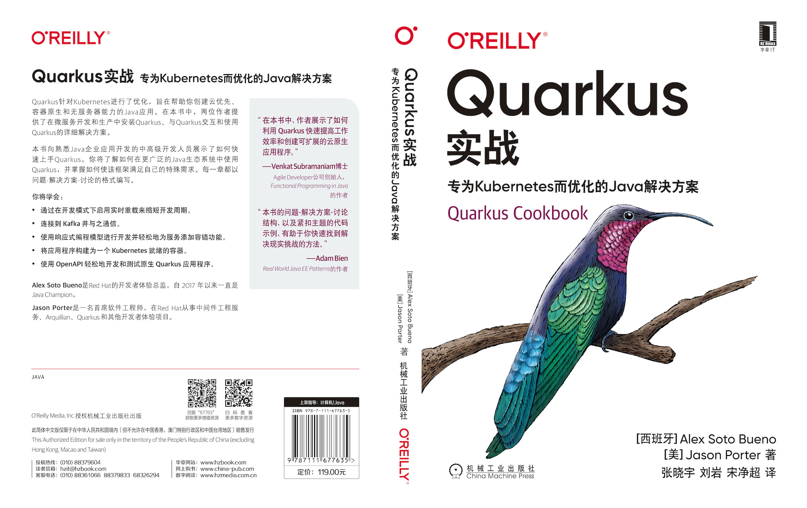
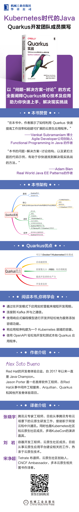

2021 年 3 月，《Quarkus 实战——专为 Kubernetes 而优化的 Java 解决方案》，已经由机械工业出版社出版上市，可点击查看详情[购买](https://item.jd.com/10028088987963.html)，下面是本书封面及封底。

## 译者序

Quarkus 是一款有别于传统 Java 架构的新技术框架，它是建立在我们熟知的技术栈上，使用了诸多成熟的技术，如 JPA，JAX-RS、Eclipse Vert.x、Eclipse MicroProfile 和 CDI 等，并将之和 Kubernetes 紧密融合在一起。用户可以借助 Kubernetes 的高效的调度运维能力，最大限度地节约资源。

云原生的星星之火，自社区 Kubernetes 爆红之后，变成燎原之势。云原生相关的技术如雨后春笋般涌出。刘岩，宋净超和我都是云原生社区的成员，也钟爱布道各种相关技术，是这一领域的狂热爱好者。我们共同的爱好之一，就是时刻关注有好的国外技术或者成熟技术的优秀书籍发布。

在这一过程中，我们机缘巧合地发现了这本书，恰好这本书在国内还没有进行翻译，满怀热情的我们就此踏上了研究 Quarkus 之旅。

这本采用十分简单的抛出问题，提出解决方案，和引发讨论的方式，将 Quarkus 的技术点描绘的细致透彻。通过本书，用户可以自学相关内容，借助 Quarkus，提高 Java 相关研发的工作效率，让你在快节奏的微服务构建和基于云的应用程序开发领域立于不败之地。

在整个翻译过程中，我们得到华章出版社和李忠明编辑的全力帮助，在此表示衷心感谢。

最后，感谢大家有缘阅读到此书，希望我们三人的绵薄之力可以帮助到崇尚云原生技术的你，在 Quarkus 的技术道路上，能够享受到和我们一样的欣喜。

译者：张晓宇、刘岩、宋净超

