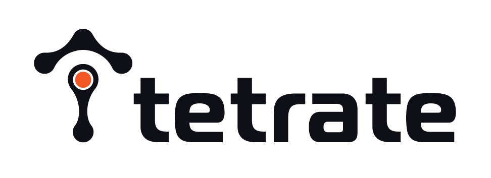
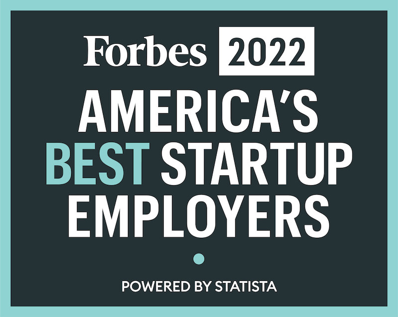
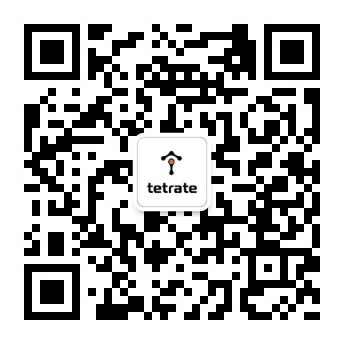

更新时间：2022年03月22日

我们正在中国招聘 Team Leader 和开发工程师，全球远程办公，让你工作更自由！

你想要加入由世界级工程师组成的团队吗？使用 [Istio](https://istio.io)、[Envoy](https://envoyproxy.io)、[Apache SkyWalking](https://skywalking.apache.org/) 等开源项目来定义下一代云原生网络。下面是我们正在招聘的部分职位。

## 分布式系统工程师 - Go 语言（管理平面团队）

我们正在为跨越传统和现代基础设施的关键任务企业应用建立一个安全、强大、高可用的服务网格平台。管理平面团队负责构建平台的主要负责：用户配置、观察和与网格交互的公共 API，为混合和多云服务网格结构提供多租户和安全性的主要工作流。

在复杂的大型基础设施和灵活但可管理的、有意义的 API 之间架起桥梁是具有挑战性的。我们正在寻找具有强大的分布式系统经验的工程师加入，帮助建立运行时，使平台能够扩展。

**职责**

- 在平台核心运行时及其 API 的架构方面进行合作。
- 设计并实现一个分布图的架构，特别关注数据复制、传播和 CAP 定理的挑战。
- 为 NGAC（下一代访问控制）的生产就绪的参考实施作出贡献。
- 设计和实施新的 NGAC 访问策略。
- 针对不同的使用情况进行图的优化，如图的遍历和图的减少。

**要求**

- 基于基本原理的问题解决能力；以职能驱动决策，以第一原则为基础的思维方式。我们不以 “职称 “为导向，我们重视结果而不是过程。
- 表现出对行动的偏爱；推动行动，高质量地按时完成。
- 在寻找最佳创意时，你没有自我意识；你在你的专业之外做出了有效的贡献；你从团队的最佳结果的角度来考虑解决问题。
- 充满好奇心，善于从模糊不清的地方看到机会。
- 理解关注细节与注重细节之间的区别。
- 重视自主性和结果而非过程。
- 有使用 Go 构建和测试软件的经验。
- 有编写 gRPC API 的经验。
- 有分布式系统的经验，了解 CAP 定理。
- 有分布式数据库的经验者优先。
- 对分布式系统技术，如复制日志或 CRDs 有深刻的理解。
- 熟悉 Kubernetes、Istio 和 Envoy 等服务网格技术。
- 对网络协议、概念、分布式系统的一致性属性、识别和协调配置漂移的技术有良好的理解。
- 有为开源项目做贡献的经验者优先。
- 有授权系统（如 RBAC、ABAC）方面的经验为佳。

**工作地点**

全球范围远程办公，也可在旧金山、波士顿、东京和印度尼西亚万隆 / 坦噶尔的办公室工作。

## 软件工程师（开发人员生产力团队）

Tetrate 的可维护性团队负责确保工程组织的许多其他部分不仅拥有成功所需的工具，而且在 5 年后他们将继续热爱他们的代码库。这包括评估我们的构建系统和工具来发展它们。与 Bazel、Rust 中的自定义工具以及用各种语言编写的各种质量的测试一起工作。

这个角色将用你的想法和工具不断提高 Tetrate 的基础设施的规模效率和开发人员的生产力。如果你关心开发人员的经验，对生产力的热情，以及在测试方面的工作经验，你会发现这个角色很适合你。

**职责**

- 了解开发人员的工作流程和构建系统，以改善构建时间，使用 Bazel 工作。
- 设计、开发和提供分布式工程构建工具和平台，用于各种代码库语言。
- 为代码库设计新的提示器，以帮助执行高质量的 API 使用。
- 修复脆弱的端到端测试，并确保我们的基础设施能够跟上我们的开发人员的步伐。

**要求**

- 熟悉 Rust、Go 或 JavaScript 任意一种语言。
- 熟练使用 Bazel，了解其可靠性 / 可追溯性。
- 你习惯于为 Build、云端缓存创建额外的工具，并帮助开发者使用他们的 IDE。
- 熟悉测试的挑战，并乐于使测试正确性和可靠性。
- 重视自主性和结果而非过程。
- 有系统的解决问题的方法，再加上出色的沟通技巧和主人翁意识。
- 表现出对行动的偏爱，推动行动，高质量地按时完成任务。

**工作地点**

全球范围远程办公，也可在旧金山、波士顿、东京和印度尼西亚万隆 / 坦噶尔的办公室工作。

## 软件工程师 / 站点可靠性工程师（云服务团队）

Tetrate 的云服务团队负责建立和运营基于 SaaS 的应用程序。包括 SRE 和软件工程的各个方面，如发布工程、消除劳累和建立基础设施抽象；使用现代工具，如 Pulumi 和主要在 AWS 上的无服务器优先方法。

**要求**

- 与应用团队合作，为关键任务的客户系统设计、开发和提供高可用性、安全的服务
- 建立变更管理管道
- 通过自动化识别和消除重复劳动
- 具有在任何一个公有云供应商上提供高可用性网络服务的经验
- 熟悉基础设施即代码的工具，如 Terraform 或 Pulumi
- 熟悉 Go、TypeScript 或 JavaScript
- 重视自主性和注重结果而非过程
- 有系统的解决问题的方法，加上优秀的沟通技巧和主人翁意识
- 表现出对行动的偏爱，推动行动，高质量地按时完成。

**工作地点**

全球范围内远程办公。

## 软件工程师 - Go 语言

加入一个由世界级工程师组成的团队，使用 Istio、Envoy 和一些开放项目来定义下一代的云原生网络服务。我们正在寻找在使用 Golang 和 gRPC 构建分布式系统方面有经验的后端软件工程师。

**职责**

- 设计和实现公共 API，用于配置服务网格的所有方面：网络、安全和可观察性。
- 实施将对客户产生直接影响的新产品功能。
- 帮助研究不同的新技术，如 NGAC（下一代访问控制）。

**要求**

- 基于基本原理的问题解决能力；以职能驱动决策，以第一原则为基础的思维方式。我们不以 “职称 “为导向，我们重视结果而不是过程。
- 表现出对行动的偏爱；推动行动，高质量地按时完成。
- 在寻找最佳创意时，你没有自我意识；你在你的专业之外做出了有效的贡献；你从团队的最佳结果的角度来考虑解决问题。
- 充满好奇心，善于从模糊不清的地方看到机会。
- 理解关注细节与注重细节之间的区别。
- 重视自主性和结果而非过程。
- 有使用 Go 构建和测试软件的经验。
- 有编写 gRPC API 的经验。
- 有使用 SQL 关系数据库和 Key/Value 数据存储的经验。
- 熟悉 Kubernetes，服务网格技术，如 Istio 和 Envoy
- 对网络协议、概念、分布式系统的一致性属性、识别和协调配置漂移的技术有良好的理解。
- 有为开源项目做贡献的经验者优先。
- 有认证技术（如 OIDC）和授权系统（如 RBAC、ABAC）的经验者优先。

**工作地点**

全球范围远程办公，也可在旧金山、波士顿、东京和印度尼西亚万隆 / 坦噶尔的办公室工作。

## Istio 上游贡献者（Go 语言）

我们的团队正物色在分布式系统方面拥有资深经验的工程师。我们正为众多无论对传统或现代建设来说皆首屈一指的企业级应用系统打造一个安全、稳固，且接触面广的服务网格平台。**如果你是 Istio 的支持者，并希望为社区贡献更多力量，你将能通过这份工作定期为 Istio 上游作出重大贡献，机会难得。**

**要求**

- 具备以基本面为基础的解决问题的能力、「第一性原理」思维，并能以功能为首要考虑，推动决策。
- 能以行动为先，避免分析瘫痪。能在工作结束前时刻保持动力，按时完成工作。
- 能不囿于自我地进行构想，以优秀的意念为先。
- 求知若渴，能时刻在不明朗的情境中发掘机遇。
- 明白「留意细节」和「注重细节」的区别。
- 注重自主性，结果导向。
- 能在专长以外作出有效贡献。
- 拥有运用 Go 语言建立分布式系统平台的经验。
- 熟悉 Kubernetes，以及 Istio 及 Envoy 等服务网格技术对网络协议、概念、分布式系统一致性的特质有透彻的了解及掌握，拥有分辨及抑制配置漂移的技巧。
- 如有贡献开源项目的经验则更佳。
- 如熟悉 WebAssembly 则更佳。
- 如熟悉 Go 语言、硬件 / 软件负载均衡（F5、NGINX）、HSM module、Active Directory/LDAP 更佳。

## 分布式系统工程师，企业基础架构（数据平面）Go 或 C++ 开发者

我们正在寻找有使用 Golang 和 gRPC 构建分布式系统经验的后端工程师。我们正在为财富 500 强企业的关键业务构建安全、高可用的服务网格（Service Mesh）平台，横跨传统和现代基础设施。您应具备较强的分布式系统和网络的基础知识。熟悉 Kubernetes、Istio 和 Envoy 等技术，有为开源项目做贡献的经验更佳。

**要求**

1. 有使用 C++、Golang、gRPC 构建分布式系统平台的经验。
2. 熟悉 Kubernetes，Istio、Envoy 等服务网格技术。
3. 对网络协议、概念、分布式系统的一致性、识别和协调配置漂移的技术有很好的理解。
4. 有为开源项目做贡献的经验更佳。
5. 熟悉以下内容更佳：WebAssembly、Authorization、NGAC、RBAC、ABAC。
6. 熟悉硬件 / 软件负载均衡器（F5、NGINX）、HSM 模块、Active Directory/LDAP 者更佳。

## 站点可靠性工程师（SRE）

站点可靠性工程（SRE）将软件和系统工程结合起来，构建和运行可扩展、大规模分布式、容错系统。作为团队的一员，你将致力于确保 Tetrate 平台具有适合用户需求的可靠性 / 正常运行时间，以及快速的改进速度。此外，我们的工程工作主要集中在建设基础设施，提高平台故障排除能力，并通过自动化减少人工干预。

**要求**

- 有系统的解决问题的方法，加上优秀的沟通技巧，有主人翁意识 / 完成感和自我导向的动力。
- 熟悉分布式系统（有状态和 / 或无状态）和网络的操作、调试和故障排除。
- 熟悉 Kubernetes、服务网格技术（如 Istio 和 Envoy）能够调试、优化代码、自动化日常任务。
- 至少有以下一种语言的编程经验：C++、Rust、Python、Go。
- 熟悉使用 SLO 和 SLI 以规范的方式量化故障和可用性的概念。
- 有性能分析和调优经验者优先。

## 工作地点

我们的产业遍布全球，在中国、印尼、印度、日本、美国、加拿大、爱尔兰、荷兰、西班牙和乌克兰都有业务。我们支持远程工作，并在旧金山、波士顿、巴塞罗那、 万隆 / 坦格朗（印尼）等地设有办公室。

## 对英语的要求

我们鼓励口头英语和书面英语的非同步沟通，除 Team Leader 外，受聘者不必操流利英语。

## 投递简历

请将展示你代码风格的 GitHub 或在线链接与你的**英文简历**一起发送至：[careers@tetrate.io](mailto:careers@tetrate.io)（并抄送给 [jimmy@tetrate.io](mailto:jimmy@tetrate.io)） 或联系 [Jimmy Song](/contact/) 了解详情。

## Tetrate 介绍

基于 Istio、Envoy、Apache SkyWalking 等开源项目，Tetrate 的旗舰产品 [Tetrate Service Bridge](https://tetrate.io/tetrate-service-bridge)（TSB）可以实现传统和现代工作负载的桥接。在任何环境下，客户都可以为所有工作负载获得一致的内置可观察性、运行时安全性和流量管理。

除了技术之外，Tetrate 还带来了一个世界级的团队，领导开放的 Istio、Envoy、Apache SkyWalking 等项目，提供企业可以用来实现人员和流程现代化的最佳实践。

### Tetrate 的工作氛围

Tetrate 被认定为2022 年福布斯美国最佳创业公司雇主

Tetrate 2018 年创立于硅谷，当年获得 1250 万美元 A 轮融资，2021 年获得 4000 万美元 [B 轮融资](/notice/tetrate-series-b/)。我们的团队主要来自加拿大、中国、印度、印尼、爱尔兰、日本、新西兰、新加坡、西班牙、荷兰和乌克兰。我们的招聘目的很简单，我们期望物色最佳人才，不论背景与居住地。我们并不提供一个头衔或角色，反而更着重于要解决的问题。若可透过实时通话，讨论彼此的交集和兴趣领域，则更为理想。你可以自由选择工作地点，弹性的休假时间和工作日程。我们每年会组织 3 到 4 次的线下团队聚会，最近几次分别举办于旧金山、西雅图、巴塞罗那、圣迭戈、华盛顿和万隆（2020 年以来因为疫情原因暂停）。团队建设活动能拉近团员间的距离，有利于你在远程工作时的协作。

### Tetrate 公司名称来历

Tetrate 是数学术语 [Tetration](https://en.wikipedia.org/wiki/Tetration)（迭代幂次） 的变体，Tetrate 员工自称 Tetrand。想要了解更多，请访问 [tetrate.io](https://tetrate.io)。

### Tetrate 创始团队

[Varun](https://loxo.co/email_tracking/click?id=9840111&url=https%3A%2F%2Fwww.linkedin.com%2Fin%2Fvaruntalwar%2F)，联合创始人，在任职 Google 时发起了 Istio 和 gRPC。我们是一个开业两年的初创公司，致力于开发高效的网络产品和服务，因为我们相信这会为行业带来飞跃式的改变。

[JJ](https://loxo.co/email_tracking/click?id=9840111&url=https%3A%2F%2Fwww.linkedin.com%2Fin%2Fpragashjj%2F)，联合创始人，在任职 Twitter 时组建了云基础设施团队（联合 Mesos、VM、OS 和供应架构团队，在平台团队中工作）。而驱使他离开 Twitter、创立我司的原因是，希望改变企业服务开发的方式。

扫描下面的公众号关注 Tetrate，获取 Istio、Envoy、Apache SkyWalking 的最新信息和 Tetrate 动态，也可以在公众号后台留言，与我们联系。

