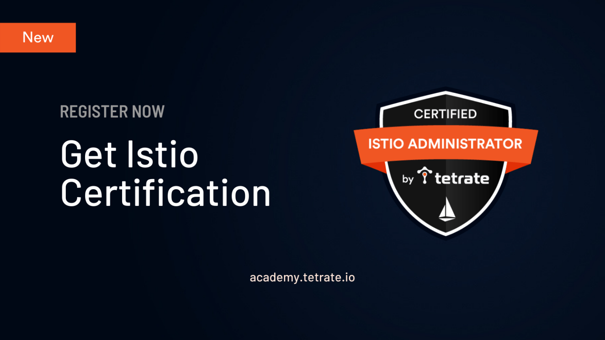

企业正在增加对数字化转型的投资，并雇用合适的人才来加速这一旅程。根据 Linux 基金会发布的 2020 年开源工作[报告](https://training.linuxfoundation.org/resources/2020-open-source-jobs-report/)，52% 的招聘经理更倾向于雇用有证书的人，而两年前只有 47%。不出所料 93% 的招聘经理表示难以找到足够的人才。Tetrate 今天宣布公开提供 [Tetrate 认证 Istio 管理员（CIAT）](https://academy.tetrate.io/courses/certified-istio-administrator)考试，该考试评估执行 Istio 服务网格安装和配置以及配置流量管理、弹性和故障注入的技能、知识和能力，以及使用 Istio 服务网格的安全功能。这是继 2 月份推出 [Istio 基础知识的](https://academy.tetrate.io/courses/istio-fundamentals)免费培训和认证课程之后的又一举措。自那时起，已有 600 多名 IT 专业人士参加了培训。

## 关于 Tetrate 的 Istio 认证管理员（CIAT）

CIAT 是由 [Tetrate](https://tetrate.io/) 开发的，以帮助认证个人成为认证 Istio 管理员。该考试是一个在线、监考、基于性能的测试，由一组需要在命令行中解决的问题和一组多选题组成。考试目前基于在 Kubernetes 上运行的 Istio 1.9.1，考生有 2 小时时间完成任务。

Tetrate 的 Istio 认证管理员包括以下内容：

1. [Istio 基础课程](https://academy.tetrate.io/courses/istio-fundamentals)（培训和认证）：注册 CIAT 的用户会自动加入 Istio 基础课程，以帮助他们准备 Istio 管理员认证考试。然而，对于 CIAT 来说，这并不是必须要经历的。
2. [CIAT 模拟考试](https://academy.tetrate.io/courses/certified-istio-administrator)：模拟考试旨在帮助用户在实际考试前熟悉考试环境。这是一个可选的步骤，不计入 CIAT 的最终得分。
3. [CIAT 考试](https://academy.tetrate.io/courses/certified-istio-administrator)：这是用户必须通过的最后一次（或跳过上述步骤的唯一一次）考试，以获得 Tetrate 认证 Istio 管理员的资格。

## 谁适合参加？

该认证适用于 Istio 服务网格管理员、运维和其他负责为 Kubernetes 内外运行的云原生工作负载配置流量路由、安全和其他服务网格功能的 IT 专业人士。该考试假定有基本的容器和 Kubernetes 知识，但不对其进行测试。候选人应该能够熟练使用：

- Kubernetes CLI
- Istio CLI
- Linux 命令行

## 评价的范围

该认证项目测试用户在命令行环境中展示其能力的能力。考试测试的领域和能力包括：

- Istio 安装、升级和配置
- 流量管理
- 弹性和故障注入
- 确保工作负载的安全
- Kubernetes 场景下的高级测试

经过认证的 Istio 管理员可以为运行在 Kubernetes 集群内外的工作负载安装和配置 Istio 资源。他们可以定义和配置 Istio 资源，控制流量路由、服务目的地、注入故障和使用弹性功能，以及确保工作负载的安全，并将外部和非 Kubernetes 工作负载引入现有的服务网格。

## 现已上线

CIAT [考试](https://academy.tetrate.io/courses/certified-istio-administrator)现在在 [Tetrate 学院](https://academy.tetrate.io/)上线，任何人都可以参加，费用为 299 美元。如果你想获得折扣，请[与我联系](/contact)。