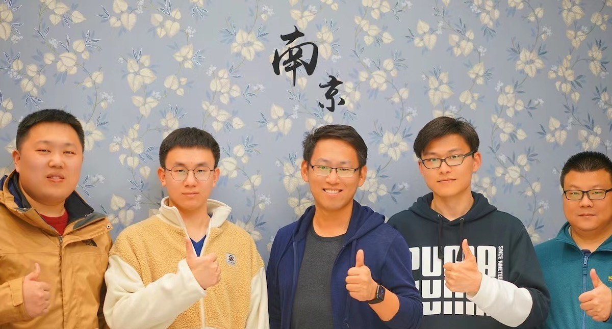

在刚刚过去的清明节，我去了趟苏州（[视频](https://www.bilibili.com/video/BV1qy4y1x7n4)）和南京（[视频](https://www.bilibili.com/video/BV1AV411H72e/)），还在南京跟南京站的朋友们吃了饭，聊了下南京站的发展。

### 南京站

下面是我在南京跟[云原生社区南京站](https://cloudnative.to/city/nanjing/)成员的合影。

这周六（4 月 10 日）云原生社区南京站会有一次线下聚会，欢迎大家报名参加，[点击报名南京站活动](https://www.huodongxing.com/event/6592325377700)，本次会议主要内容为交流云原生落地经验。

### 长沙站

在周日（4 月 11 日）云原生社区长沙站会有第一次线下聚会暨长沙站筹办会议，也欢迎大家报名参加，[点击报名长沙站聚会](https://www.huodongxing.com/event/2592482106500)。

### 关于云原生社区城市站

为了方便云原生社区成员的线下交流以及后期本地站活动开展，云原生社区城市站计划在全球各地创建城市站长，站长负责本地活动组织，详见[云原生社区城市站页面](https://cloudnative.to/city/)。