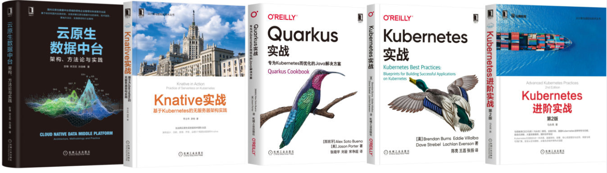

继 4 月 17 日杭州站 meetup 之后，云原生社区的第四次线下 meetup 来了，不仅有来自大厂的云原生工程师现场交流，更有《Knative 实战》、《Kubernetes 实战》、《Quarkus 实战》、《云原生数据中台》、《Kubernetes 进阶实战》书籍等你来拿，**5 月 22 日**云原生社区将在 广州举行，欢迎大家踊跃报名，报名方式：[活动行](https://3372087382093.huodongxing.com/event/4597232086200)！

本次活动的图书由机械工业出版社赞助，如下。

访问 https://cloudnative.to/city/guangzhou/ 了解关于云原生社区广州站的更多信息，扫码关注社区公众号，回复「广州站」即可加入广州站微信群。

- 主办方：云原生社区
- 赞助商：APISIX
- 承办方：云原生社区广州站
- 合作伙伴：CNCF、Linux Foundation、机械工业出版社

### 13:30 - 14:00 签到入场

### 14:00 - 14:05 主持人开场 

### 14:05 - 14:25 开场致辞

讲师：宋净超

个人介绍：Tetrate 布道师、CNCF Ambassador、云原生社区 创始人、电子工业出版社优秀译者、出品人。Kubernetes、Istio 等技术的早期使用及推广者。曾就职于科大讯飞、TalkingData 和蚂蚁集团。

### 14:25 - 15:05 死生之地不可不察：论 API 标准化对 Dapr 的重要性 

讲师：敖小剑

个人介绍：资深码农，十九年软件开发经验，微服务专家，Service Mesh布道师，Servicemesher社区联合创始人，Dapr Maintainer。专注于基础架构，Cloud Native 拥护者，敏捷实践者，坚守开发一线打磨匠艺的架构师。曾在亚信、爱立信、唯品会、蚂蚁金服等任职，对基础架构和微服务有过深入研究和实践。目前就职阿里云，在云原生应用平台全职从事 Dapr 开发。

**演讲概要**

Dapr作为新兴的云原生项目，以"应用运行时"之名致力于围绕云原生应用的各种分布式需求打造一个通用而可移植的抽象能力层。这个愿景有着令人兴奋而向往的美好前景：一个受到普通认可和遵循的云原生业界标准，基于此开发的云原生应用可以在不同的厂家的云上自由的部署和迁移，，恍惚间一派云原生下世界大同的美景。然而事情往往没这么简单，API的标准化之路异常的艰辛而痛苦，Dapr的分布式能力抽象在实践中会遇到各种挑战和困扰。

听众收益：

- 解Dapr的愿景和分布式能力抽象层的重要
- 了解Dapr API在抽象和实现时遇到的实际问题，尤其是取舍之间的艰难
- 了解目前Dapr在API抽象上正在进行的努力和新近准备增加的API

### 15:05 - 15:45 有了 Nginx 和 Kong，为什么还需要 Apache APISIX？

讲师：温铭

个人介绍：Apache member， Apache APISIX PMC 主席，Apache SkyWalking committer，支流科技 CEO

**演讲概要**

在云原生时代，k8s 和微服务已经成为主流，在带来巨大生产力提升的同时，也增加了系统的复杂度。如何发布、管理和可视化服务，成为了一个重要的问题。
每次修改配置都要reload的Nginx、依赖postgres才能工作的Kong，都不是云原生时代的理想之选。
这正是我们创造Apache APISIX的原因：没有reload、毫秒内全集群生效、不依赖数据库、极致性能、支持Java和Go开发插件。

**听众收益**

更好的理解API网关、服务网格，以及各个开源项目的优劣势

### 15:45 - 16:05 合影、茶歇

### 16:05 - 16:45 云原生时代的研发效能

讲师：黄国峰

个人介绍：腾讯 PCG 工程效能专家。10 多年的软件和互联网从业经验；现任腾讯工程效能部，负责持续集成、研发流程和构建系统等平台；曾任职唯品会高级经理，负责架构团队。在云原生平台下的研发效能方向有丰富的理论知识和实践经验。

**演讲概要**

云原生时代，软件研发的逻辑彻底改变了。传统的软件开发在本机编码/调试、部署到测试环境测试、再发布到生产环境；而云原生时代的开发，基于不可变设施，研发流程从编码、构建、持续测试、持续集成到持续部署，整个过程几乎完全代码化。

**听众收益**

* 了解云原生开发的新挑战和难点
* 了解腾讯云原生开发实践的流程和思路
* 了解腾讯云原生开发中的遇到的坑和解决思路

### 16:45 - 17:25 37 手游 Go 微服务架构演进和云原生实践

讲师：吴凌峰

个人介绍：任职于三七互娱集团 37 手游技术部基础架构组，负责平台 golang 基础框架以及 DevOps、CI/CD 生态建设，从业以来一直专注于云原生、DevOps 和容器化等技术应用和推广，在 golang 工程化领域有一定的心得。

**演讲概要**

Golang 微服务应用和云原生的概念近年越来越火热，传统技术栈公司随着业务规模增长，在云原生技术应用落地探索和转型的过程中一定会遇到很多共通的问题以及有各自不同的思考，包括如何更好地提升我们的开发效率、提升服务稳定性、降低运维成本？面对不断增长的服务数量和不断变长变复杂的调用关系网，怎样才能更好地观测、管理和保证核心服务高可用，本次演讲分享将会围绕 37 手游转型为 Go 微服务架构以及建设云原生DevOps体系的历程、过程中的领悟和思考展开。

**听众收益**

* 了解Golang云原生微服务框架的关键技术和优化实践经验
* 了解云原生观测体系如链路追踪、监控等Golang微服务落地实践经验
* 了解混合云混合部署DevOps和CI/CD体系的企业实践经验
