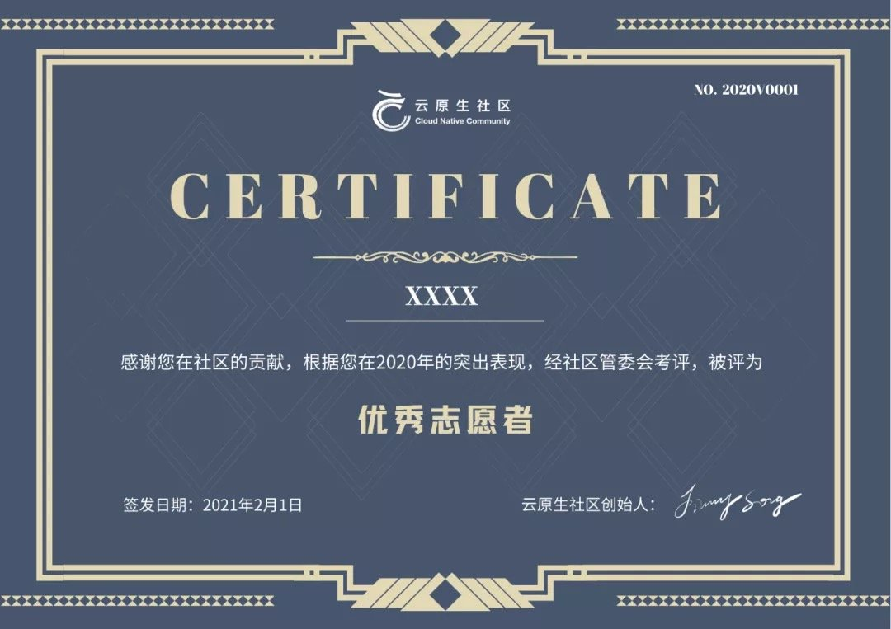

注意：该活动已结束，感谢大家的关注。

Envoy 中文文档地址：<https://cloudnative.to/envoy/>

## 先给大家拜个晚年

云原生社区 Envoy SIG 再次给众位云原生技术爱好者拜个晚年（毕竟正月十五还没过，也不算晚），祝愿大家牛年牛起来！！！

当然，技术也要搞起来，因此我们需要接着我们去年的任务 —— Envoy 1.16 版本的翻译，继续撸起袖子加油干。下面会回顾及发布一下翻译进度以及做出突出贡献的志愿者（证书年前已经发放）。

## 翻译进度

由云原生社区 Envoy SIG 发起的 Envoy 1.16 版本翻译，在几十位（登记信息的为 **64** 人）志愿者的共同努力下，经过了以下几个阶段的努力贡献：

- **第一阶段**：2020 年 11 月 4 日至 2020 年 11 月 28 日，共开放 **84** 个 issue。
- **第二阶段**：2020 年 11 月 28 日至 2020 年 12 月 6 日，共开放 **24** 个 issue。
- **第三阶段**：2020 年 12 月 6 日至 2021 年 1 月 10 日，共开放 **128** 个 issue。
- **第四阶段**：2021 年 1 月 10 日至 2021 年 1 月 17 日，共开放 **10** 个 issue。
- **第五阶段**：2021 年 1 月 17 日至 2021 年 2 月 9 日，共开放 **76** 个 issue。
- **第六阶段**：2021 年 2 月 9 日开始，共开放 **34** 个 issue。
- **现在已经到了决胜攻坚时刻**，最后的翻译任务已经开放。欢迎大家搭载翻译的末班车，为 Envoy 的翻译贡献自己的力量。

## 突出贡献人员

所有登记参与的人员可以[腾讯文档]( https://docs.qq.com/sheet/DYVJpRFdKbUVnQUZV?tab=BB08J2&_t=1614080989438)中查看，做出突出贡献（翻译至少 5 个 issue 或长期从事 Review 工作）已经收到了社区的证书：

收到证书的 Envoy 翻译志愿者如下：

| 人员   | GitHub 账号 | 人员   | GitHub 账号 |
| ------ | ----------- | ------ | ----------- |
| 许振文 | helight     | 张晓辉 | Addo.zhang  |
| 刘金欣 | scilla0531  | 梁斌   | hzliangbin  |
| 李云龙 | vgbhfive    | 王泓智 | wiswang     |
| 张海立 | webup       | 包仁义 | baobaoyeye  |
| 黄晓芬 | kkfinkkfin  | 孟显超 | smarkm      |
| 官余鹏 | 3ks         | 申红磊 | shenhonglei |

除了证书，集社区微薄之力，给突出贡献的部分人员送出了大会门票、云原生书籍等福利。名单会持续更新，大家都有机会。

## 小小剧透

在 Envoy 1.16 版本翻译结束后，Envoy SIG 将择一黄道吉日在线上（云原生学院直播平台）开一个发布会。具的流程，暂时保密。

欢迎感兴趣翻译的小伙伴，赶紧加入我们，一起努力来完成 Envoy 1.16 版本的翻译。

## 如何加入

关于如何加入 Envoy SIG 并加入翻译团队，可以查看 [Envoy 官方文档翻译工作组成员招募中](http://mp.weixin.qq.com/s?__biz=MzI1NTE2NDE2MA==&mid=2649383214&idx=1&sn=55abc3ec184dbaad0a4a1d2c2eb0d341&chksm=f224eb41c5536257b4158bff696a8297249b581b8cb6fc3e22961a2c9492beddd6badb228e4a&scene=21#wechat_redirect)；关于翻译要求及相关福利，可以查看 [Envoy 官方文档翻译进度更新及成员招募](http://mp.weixin.qq.com/s?__biz=MzI1NTE2NDE2MA==&mid=2649383618&idx=2&sn=02855bfd0df512686aa7ce2b3692e18e&chksm=f224e8adc55361bbade88f6dbbe08f04f4f096601671d838dda233314035a2e2a1121d2969aa&scene=21#wechat_redirect)。有任何疑问可以直接添加微信（jimmysongio 或者 majinghe11）进行咨询。
