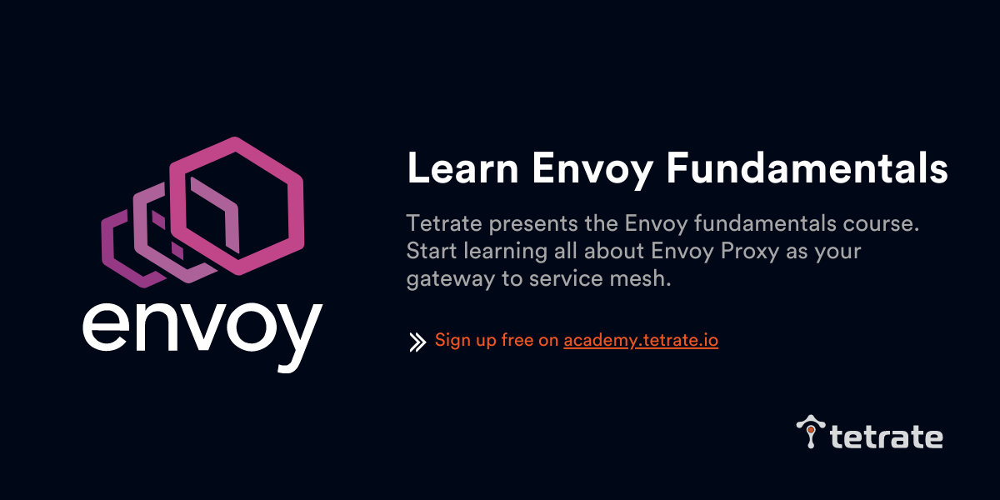
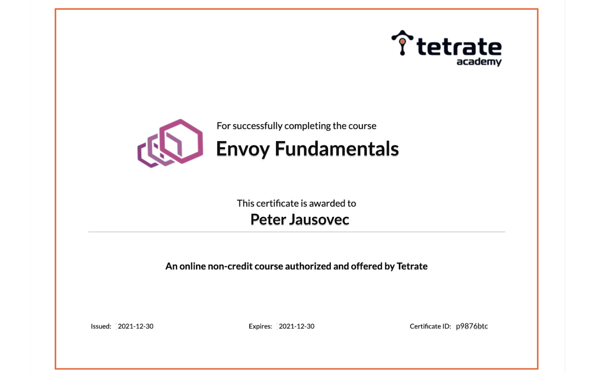
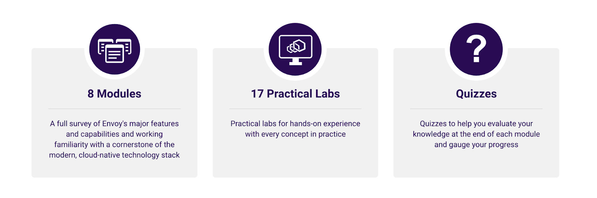
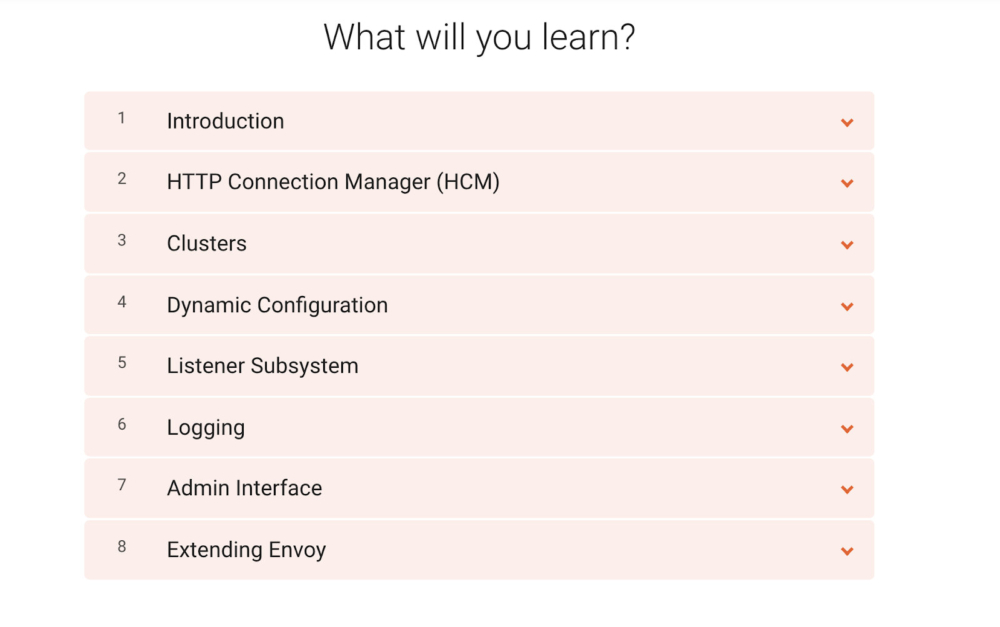
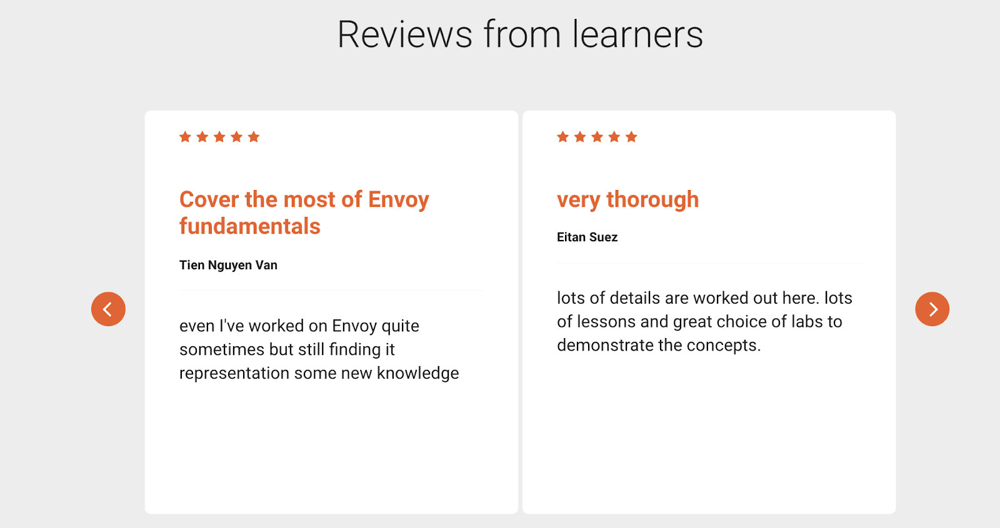

Envoy 代理是一个开源的边缘和服务代理，是当今现代云原生应用的重要组成部分，Booking.com、Pinterest 和 Airbnb 等大公司都在生产中使用了它。[Tetrate](https://www.tetrate.io/) 是 Envoy 的顶级贡献者，开发了 [Envoy 基础教程](https://academy.tetrate.io/courses/envoy-fundamentals)，这是一个免费的培训，有结业证书，以帮助企业更快地采用该技术。DevOps、SRE、开发人员和其他社区成员能够通过概念文本、实际实验和测验轻松学习 Envoy。Tetrate 也是受欢迎的 [Istio 基础教程](http://academy.tetrate.io/)和开源项目 [Func-e](https://www.func-e.io/) 的创建者，这使得采用 Envoy 更加容易。

“我对 Tetrate 的 Envoy 基础教程和认证感到兴奋”，Envoy Proxy 的创建者、Lyft 的高级工程师 Matt Klein 说。“该课程组织的很好，有关于 Envoy 应用的信息，以及带有逐步说明和测验的实验。完成全部课程后，你将获得一份证书的奖励。最重要的是，培训是完全免费的。我向想学习和使用 Envoy Proxy 的人强烈推荐这个课程”。

## Envoy 是构建服务网格的默认选择

CNCF 的项目 [Envoy Proxy](https://www.envoyproxy.io/) 是最流行的 sidecar 和 ingress 实现。它是多个服务网格项目的默认 sidecar，包括 Istio、Open Service Mesh 和 AppMesh。根据 [CNCF 的 2020 年调查](https://www.cncf.io/wp-content/uploads/2020/11/CNCF_Survey_Report_2020.pdf)，Envoy 作为 Ingress 提供者的使用率增加了 116%，共有 37% 的受访者在生产中使用 Envoy Proxy。

Envoy 最初是在 Lyft 建立的，作为一个代理，作为大规模微服务服务网格的通用数据平面。其理念是让 Envoy sidecar 在你的应用中的每个服务旁边运行，将网络从应用中抽象出来。它可以作为边缘网关、服务网格和混合网络的桥梁。有了 Envoy，公司可以通过提供更灵活的发布流程和高可用、高弹性的基础设施来扩展其微服务。

Envoy 具有丰富的网络相关功能，如重试、超时、流量路由和镜像、TLS 终止、可观察性等。由于所有的网络流量都流经 Envoy 代理，因此可以观察流量和问题区域，对性能进行微调，从中找出任何延迟来源。由于其众多的功能和[庞大的 API](https://www.envoyproxy.io/docs/envoy/latest/api-v3/api)，用户可能会对广泛而全面的 [文档](https://www.envoyproxy.io/docs/envoy/latest/start/start)感到不知所措，特别是对于不熟悉代理和刚刚开始 Envoy 之旅的初学者。因此，我们决定创建一个课程，介绍 Envoy 的基本概念和内部结构，使用户能够更快地学习。

“在过去几年中，Envoy 的采用率迅速提高。这意味着获得易于学习的资源，为用户提供快速扩展学习的能力，对保持 Envoy 的采用更加容易至关重要”，Tetrate 联合创始人 Varun Talwar 说。

## 关于 Envoy 基础教程

免费的 [Envoy 基础教程](https://academy.tetrate.io/courses/envoy-fundamentals)由 8 个模块组成，每个模块内有多个视频课程和实验。

 

该课程从介绍 Envoy 开始，解释了 HTTP 连接管理器过滤器、集群、监听器、日志、管理界面和扩展 Envoy 等概念。每个模块都包括带有分步说明的动手实验。实验使学习者能够练习所解释的概念，如

- Envoy 的动态配置
- 断路器
- 流量拆分
- 镜像请求
- 全局和局部速率限制
- HTTP tap filter
- 使用 Lua 脚本和 Wasm 扩展 Envoy 等

 

每个模块后的小测验帮助你评估自己对知识的掌握。完成课程和所有测验后，你会收到一份完成证书。在 [Tetrate Academy 网站](https://academy.tetrate.io/)上注册免费的 [Envoy 基础课程](https://academy.tetrate.io/courses/envoy-fundamentals)，开始学习。

**注意：该课程为英文版，中文版课程将在未来推出。**

## 更多 Envoy 学习资源

- [5 分钟内开始使用 Envoy（博客）](https://www.tetrate.io/blog/get-started-with-envoy-in-5-minutes/)
- [Envoy 和 Envoy 可扩展性的基础知识（博客）](https://www.tetrate.io/blog/the-basics-of-envoy-and-envoy-extensibility/)
- [Envoy 入门：基于文件的动态配置 (博客)](https://www.tetrate.io/blog/envoy-101-file-based-dynamic-configurations/)
- [Istio Weekly：Envoy 的基本原理（视频）](https://www.youtube.com/watch?v=f0QEHEm9ERc)
- [Istio Weekly：开发 Envoy Wasm 扩展（视频）](https://www.youtube.com/watch?v=JIq8wujlG9s&t=2s)
- [Envoy 详解（视频）](https://www.youtube.com/watch?v=spzfupads2o)
- [Lyft 的 Envoy：拥抱服务网格（视频）](https://www.youtube.com/watch?v=55yi4MMVBi4&t=0s)
- [人人都可以为 Envoy 做贡献（视频）](https://www.youtube.com/watch?v=mJAYHHKmLhU&t=0s)

## 关于 Tetrate

Tetrate 由 Istio 创始人和 Envoy 维护者创办，旨在重新构想应用网络，是一家管理现代混合云应用基础设施复杂性的企业级服务网格公司。其旗舰产品 [Tetrate Service Bridge](https://tetrate.io/tetrate-service-bridge) 为多集群、多租户和多云部署提供了一个全面的、企业就绪的服务网格平台。客户在任何环境下都能获得一致的、内嵌的可观察性、运行时的安全性和流量管理。Tetrate 仍然是开源项目 Istio 和 Envoy Proxy 的主要贡献者，其团队包括 Envoy 的高级维护人员。了解更多信息，请访问 [tetrate.io](https://tetrate.io/)。