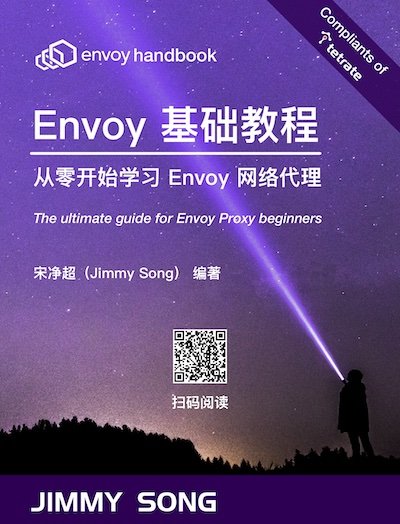

2月初，企业级服务网格提供商 Tetrate 发布了免费的《Envoy 基础教程》英文版，现中文版已上线，可以[免费在线阅读](https://jimmysong.io/envoy-handbook/)。

[Envoy](https://envoyproxy.io) 是一个开源的边缘和服务代理，专为云原生应用而设计。Envoy 与每个应用程序一起运行，通过提供网络相关的功能，如重试、超时、流量路由和镜像、TLS 终止等，以一种平台无关的方式抽象出网络。由于所有的网络流量都流经 Envoy 代理，因此很容易观察到流量和问题区域，调整性能，并准确定位延迟来源。

本书为 [Tetrate](https://tetrate.io) 出品的《Envoy 基础教程》的文字内容，其配套的 8 节实验及 19 个测试，请访问 [Tetrate 学院](https://academy.tetrate.io/courses/envoy-fundamentals-zh) 获取。

## 关于 Tetrate

Tetrate 由 Istio 创始人和 Envoy 维护者创办，旨在重新构想应用网络，是一家管理现代混合云应用基础设施复杂性的企业级服务网格公司。其旗舰产品 [Tetrate Service Bridge](https://tetrate.io/tetrate-service-bridge) 为多集群、多租户和多云部署提供了一个全面的、企业就绪的服务网格平台。客户在任何环境下都能获得一致的、内嵌的可观察性、运行时的安全性和流量管理。Tetrate 仍然是开源项目 Istio 和 Envoy Proxy 的主要贡献者，其团队包括 Envoy 的高级维护人员。了解更多信息，请访问 [tetrate.io](https://tetrate.io/)。