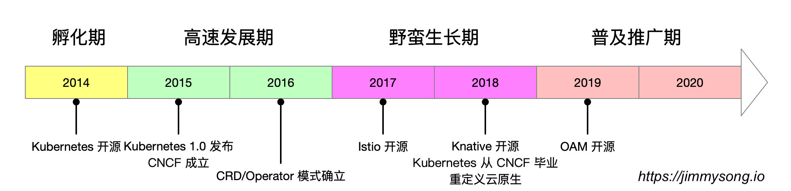

就在前几天，Java 刚度过了它的 [25 周岁生日](https://www.infoworld.com/article/3544229/java-programming-language-celebrates-25-years.html)，从它诞生时就在号称”一次编写，到处运行“，但是 20 多年过去了，从程序编写出来到真正交付生产还是有很深的 gap。IT 的世界从来就不缺概念，如果一个概念无法解决问题，那就再来一层概念。Kubernetes 诞生至今也有6 年时间了，已经来到了后 Kubernetes 时代了——云原生应用时代！

这本白皮书将带您探索后 Kubernetes 时代的云原生应用发展路径。

其中的重点传达的观点包括：

- 云原生已渡过了野蛮生长期，正朝着统一应用标准方向迈进。
- Kubernetes 的原语无法完整描述云原生应用体系，且在对资源的配置上开发与运维功能耦合严重。
- Operator 在扩展了 Kubernetes 生态的同时导致云原生应用碎片化，亟需一个统一的应用定义标准。
- OAM 的本质是将云原生应用的定义中的研发、运维关注点分离，资源对象进行进一步抽象，化繁为简，包罗万象。
- “Kubernetes 次世代”是指在 Kubernetes 成为基础设施层标准之后，云原生生态的关注点正在向应用层过度，近两年来火热的 Service Mesh 正式该过程中的一次有力探索，而基于 Kubernetes 之上的云原生**应用**架构的时代即将到来。

Kubernetes 已成为云原生应用的既定运行平台，本白皮书将以 Kubernetes 为默认平台展开，包括基于 OAM 的云原生应用的分层模型的解释。