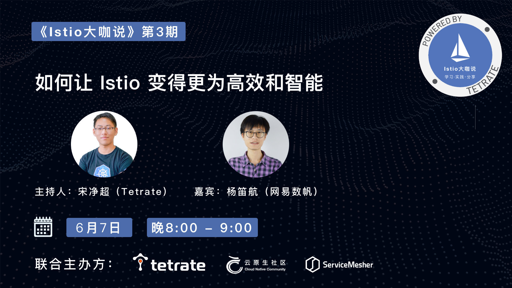

- 时间：6 月 9 日晚 8 点 -9 点
- 直播间：<https://live.bilibili.com/23095515>
- 主持人：宋净超
- 嘉宾：杨笛航
- 话题：如何让 Istio 变得更为高效和智能

**嘉宾简介**

杨笛航，Istio 社区成员，网易数帆架构师，负责网易轻舟 Service Mesh 配置管理，并主导 Slime 组件设计与研发，参与网易严选和网易传媒的 Service Mesh 建设。具有三年 Istio 控制面功能拓展和性能优化经验。

**话题介绍**

Istio 作为当前最火的 Service Mesh 框架，既有大厂背书，也有优秀的设计，及活跃的社区。但是随着 Mixer 组件的移除，我们无法通过扩展 mixer adapter 的方式实现高阶的流量管理功能，Istio 的接口扩展性成为亟待解决的问题。本次直播将分享本次分享将介绍网易自研的智能网格管理器 Slime，借助它，我们实现了配置懒加载，自适应限流，HTTP 插件管理等扩展功能，从而更为高效的使用 Istio。

**听众收益**

- 了解在实际业务中驾驭 Istio 框架的挑战
- 了解 Slime 的设计特点、技术路线及开源进展
- 了解网易解决 Service Mesh 架构成熟的经验