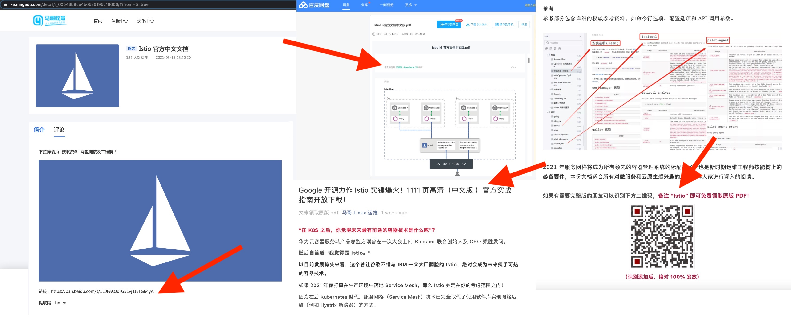

致关注 Istio 项目的学习者和网友们：

近日我们接到社区网友的举报，某教育机构（magedu）在提供 Istio 中文文档的下载，并基于该文档进行商业课程的宣传。以下是相关链接：

- [马哥教育网站下载链接](https://ke.magedu.com/detail/i_60543b9ce4b05a6195c16606/1?fromH5=true)
- [公众号宣传文章](https://mp.weixin.qq.com/s/BnLN6QB1MWvukjS6PiAluQ)
- 知乎宣传文章（已删除）

下面是相关的网页截图。

首先，ServiceMesher 是 Istio 官方的合作伙伴，是官方指定的唯一的中文文档的翻译组织，Istio 官方有明确的说明，请查看 [Istio 官方链接](https://istio.io/latest/about/community/join/)。

第二，大家在公网上看到的 Istio 官方中文文档是由社区发起，并组织社区成员共同参与完成的，倾注了上百人共同的心血，我们从 Istio1.2 版本就开始翻译，先后组织了 1.2、1.5 和目前正在进行的 1.9 版本的翻译工作，具体可参考 [GitHub](https://github.com/servicemesher/istio-official-translation)。

另外，Istio 的中文文档是可以直接访问的（具体链接为 https://istio.io/latest/zh/docs/），根本不需要下载，这会误导初学者的学习方式，令学习者无法获取到最新的内容。

我们强烈谴责这种将他人劳动成果据为己有、并用作商业用途（课程宣传）的行为。相信每个参与翻译的成员，以及整个社区都不会答应这种剽窃行为的存在！开源项目、社区都是以非盈利的方式无偿提供产品和交流学习的机会，让学习者共同成长。这种剽窃行为严重危害了所有开发者的利益，彻底违背了开源、开放的技术生态理念。这种行为必须要抵制，必须还技术分享领域一片干净的天空！

我们要求该机构立即删除其公众号、知乎、百度网盘、教育机构网站上关于所谓「Istio 官方中文文档」的分享，并在「马哥 Linux 运维」公众号上发布声明致歉！

最后 Istio 官方文档的翻译仍在进行中，欢迎大家参与进来，[点击查看详情](https://i.cloudnative.to/istio/event/istio-doc-translation)。

—— ServiceMesher，2021 年 3 月 31 日

## 更新

在 3 月 31 日，以上公告发布后，马哥教育第一时间联系了我，并承认错误，积极改正，并发布了公告（[关于 Istio官方文档使用声明](https://mp.weixin.qq.com/s?__biz=MzAxMTkwODIyNA==&mid=2247529088&idx=1&sn=3464684b245073d0f3641a37918e57f9&chksm=9bbbd76faccc5e794e2711cace08e77b7e63983448db65a9fb62891c567fd143c5f4431edc15&mpshare=1&scene=1&srcid=0331NBhdQ74wQn7Sxfjn6YmA&sharer_sharetime=1617170742413&sharer_shareid=6ebbb87f840417a73f21a9535bf0aa28#rd)）给马哥教育诚恳的态度点个赞，本次事件并非针对马哥教育，而是希望能够唤醒大家的版权保护意识，以正某些“利用”开源的不正之风。