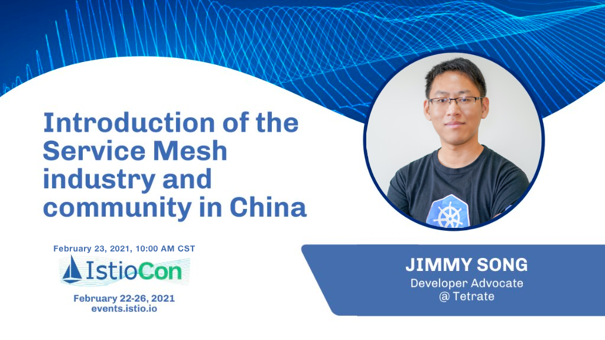

- 主题：Service Mesh in China
- 时间：北京时间 2 月 23 日，上午 10:00 - 10:10
- 参与方式：[IstioCon 2021 官网](https://events.istio.io/istiocon-2021/)
- 费用：免费

北京时间 2 月 22 日至 25 日，Istio 社区将在线上举办第一届 IstioCon，免费报名参加，欢迎大家踊跃参加！我将在 2 月 23 日（农历正月十二，星期二）发表闪电演讲，作为一个 Service Mesh 技术在中国的布道者和见证者，我将为大家介绍中国的 Service Mesh 行业及社区在中国的发展。

我与徐中虎（华为）、丁少君（Intel）都是首届 IstioCon 组委会成员，也是中国区的组织者，考虑到 Istio 在中国有大量的受众，我们特地安排对中国时区友好的中文演讲。本次活动一共有 14 场中文分享，另外还有几十场英文分享。演讲将分为闪电演讲（10 分钟）和 presentation（40 分钟）两种形式。

加入云原生社区 [Istio SIG](https://i.cloudnative.to/istio/)，参与本次大会的交流。关于 IstioCon 2021 的时间表，请访问 [IstioCon 2021 官网](https://events.istio.io/istiocon-2021/)，或点击查看详情。

