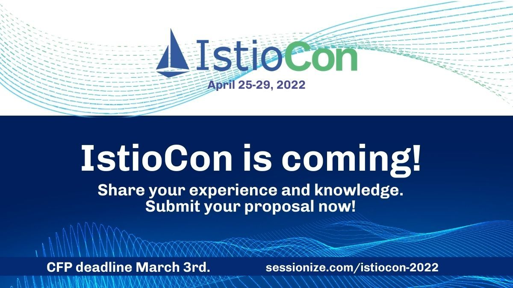

去年第一届 IstioCon 在线上成功举办，今天第二届 IstioCon 演讲议题也征集了，欢迎大家提交。

IstioCon 接受中文和英文议题，本次活动为线上分享，议题提交截止时间为 2022 年 3 月 3 日（北京时间，下同），提交及要求详见：<https://sessionize.com/istiocon-2022/>

其他重要日期有：

- 议题开放征集时间：2022 年 1 月 28 日
- 议题征集截止时间：2022 年 3 月 4 日
- 议程发布时间：2022 年 3 月 29 日
- 会议日期：2022 年 4 月 26 - 30 日

本次活动由 Istio 社区主办，我们期待您的精彩分享。
