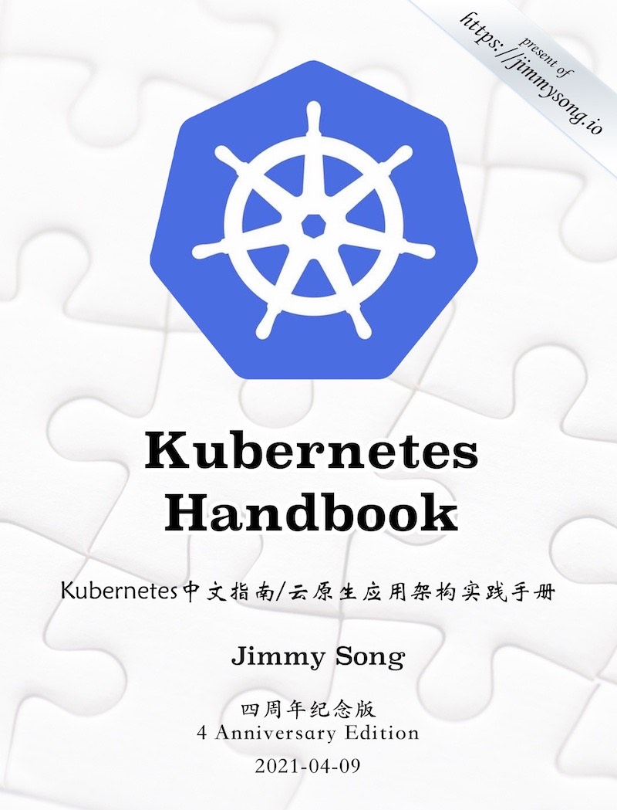

很高兴的通知大家，《Kubernetes Handbook——Kubernetes 中文指南/云原生架构实践手册》四周年纪念版发布了，你可以[在线浏览](https://jimmysong.io/kubernetes-handbook)或者[下载 PDF](https://github.com/rootsongjc/kubernetes-handbook/releases/tag/v20210409)。

### 感想

最近有两条新闻在朋友圈里刷屏：

- [《Mesos 已死，容器永生》](https://www.infoq.cn/article/dlr7vvRosiiNjPrwxGC8)
- [《Kubernetes 1.21: Power to the Community》](https://kubernetes.io/blog/2021/04/08/kubernetes-1-21-release-announcement/)

当着两篇看似不相关的新闻同时映入我的眼帘，让我感觉恍如隔世。我曾在 2017 年的分享过一篇文章——[《Kubernetes 与云原生 2017 年年终总结及 2018 年展望》](https://jimmysong.io/kubernetes-handbook/appendix/kubernetes-and-cloud-native-summary-in-2017-and-outlook-for-2018.html)，其中就已经断定 Kubernetes 的大局已定，最终连 Docker 都有可能黯然收场。蓦然回首，四年时间如白驹过隙，Kubernetes 已经在 PaaS 层占据了不可撼动的地位，社区里甚至高呼其为“云原生操作系统”。2019 年后实质上就已经进入了 [Kubernetes 次世代](https://jimmysong.io/blog/post-kubernetes-era/)，一个迈向全面云原生的新世代开启。

还记得四年前，2017 年 3 月，我开源了 [《Kubernetes Handbook——Kubernetes 中文指南/云原生架构实践手册》](https://jimmysong.io/kubernetes-handbook)，从开始的 Kubernetes 安装笔记到理论文档，再到工程实践，不断的丰富完善，其间有[上百人](https://github.com/rootsongjc/kubernetes-handbook/graphs/contributors)参与了本书的工作中，丰富和完善了本分内容，并形成了一个圈子，在其中不断交流碰撞着思维的火花，如今已形成了一个近万人规模的[云原生社区](https://cloudnative.to)。

### 为什么发布四周年纪念版

本书的上个 PDF 版本发布距今已经有两年多时间了，市面上已经流传了关于本书的无数种 PDF 版本，为了防止个别别有用心的人自篡改和传播未经核实的版本，使学习 Kubernetes 和云原生的同学误解，特此编译该四周年纪念版以正视听。

本书从诞生之初就一直使用 GitBook 来管理，发布在 GitHub Pages 上，社区里时不时会有人问我为什么编译成 PDF 时总出错？本书使用的 GitBook 版本过旧（CLI version: 2.3.2，GitBook version: 3.2.2），官方已经不再维护，且编译时对电脑的要求以及环境配置要求较高，我还特别制作了一个 Docker 镜像用来编译，但是编译依然是一个十分耗时的事情，在我的个人电脑上耗时近 5 分钟。但是因为旧版 GitBook 比较稳定，且可以在本地管理文章和编译发布到 GitHub，而且我已经配置了 GitHub Action，每次有 PR 合并会自动发布到网站上，因此将会继续沿用下去。

### 后续

该版本中删除了一些过时章节和与书籍内容关系不大的附录，并重新组织了章节，包括新增服务网格、社区与生态章节，还修复了书中的一些错误。本书会继续通过开源协作的方式来撰写，未来还会在最佳实践、领域应用等章节，跟社区取长补短，汇聚众家之长，也希望广大读者可以在云原生社区中积极[投稿](https://cloudnative.to/contribute/)，将云原生架构的最佳实践共同分享给读者。