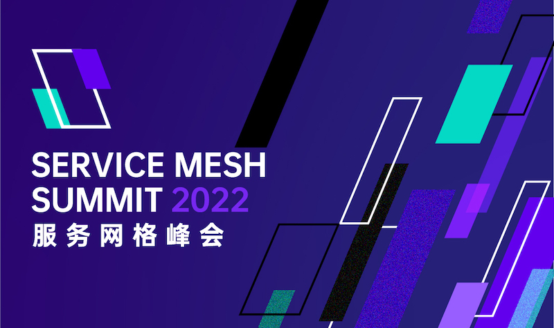
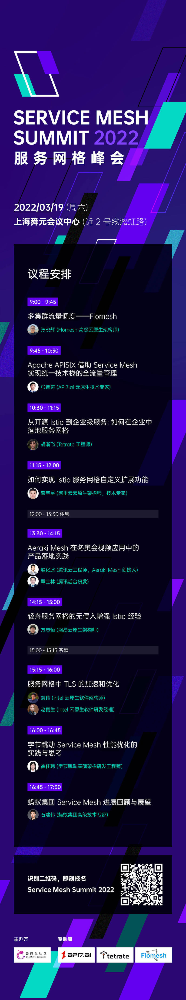

Service Mesh Summit 2022 首届服务网格峰会，将于 2022 年 3 月 19 日（星期六），在上海舜元会议中心（近 2 号线淞虹路）举行。请转到[活动行](https://www.huodongxing.com/event/8638606076200)免费报名。本次活动由云原生社区主办，赞助商有 [API7](https://www.apiseven.com/zh)、[Tetrate](https://tetrate.io/)、[Flomesh](https://flomesh.cn/)。

## 日程表

以下是详细日程。

### 多集群流量调度 ——Flomesh

**时间：9:00 - 9:45**

**讲师介绍**

张晓辉，Flomesh 高级云原生架构师。资深码农，有多年的微服务和基础架构的实践经验。主要工作涉及微服务、容器、Kubernetes、DevOps 等。目前在 Flomesh 负责流量相关产品和技术布道。

**话题大纲**

- 背景：集群数量增加带来的跨集群通信问题
- Flomesh 的跨集群服务治理方案介绍及原理
- 详细介绍服务治理的相关功能

**听众收获**

- 了解跨集群网络通信的整体架构及实现原理
- 了解可编程的统一数据面 Pipy 在方案中的角色
- 了解跨集群的服务治理方案及相关功能

### Apache APISIX 借助 Service Mesh 实现统一技术栈的全流量管理

**时间：9:45 - 10:30**

**讲师介绍**

张晋涛，API7.ai 云原生技术专家，Apache APISIX PMC，Kubernetes ingress-nginx reviewer，containerd/Docker/Helm/Kubernetes/KIND 等众多开源项目 contributor， 『K8S 生态周报』的维护者，微软 MVP。对 Docker 和 Kubernetes 等容器化技术有大量实践和深入源码的研究，业内多个知名大会讲师，PyCon China 核心组织者，著有《Kubernetes 上手实践》、《Docker 核心知识必知必会》和《Kubernetes 安全原理与实践》等专栏。公众号：MoeLove。

**话题大纲**

- Service Mesh 领域的现状
- 实践 Service Mesh 中遇到的问题
- Apache APISIX 在 Service Mesh 中实现全流量管理
- 面向未来的架构演进

**听众收获**

- 了解当前 Service Mesh 领域的现状及一些痛点
- 了解 Apache APISIX 如何在 Service Mesh 领域中实现统一的全流量管理
- Apache APISIX 在 Service Mesh 领域的探索和实践

### 从开源 Istio 到企业级服务：如何在企业中落地服务网格

**时间：10:30 - 11:15**

**讲师介绍**

胡渐飞，Tetrate 工程师，之前在 Google 从事 Istio 相关开发。

**话题大纲**

- Istio 在企业中的实际落地应用
- 企业级客户在面对开源 Istio 的时候有什么样的考量
- Tetrate 如何解决这些开源 Istio 中遇到的问题

**听众收获**

Tetrate 作为服务网格的顶级供应商之一，成立 4 年来服务大量的中大企业客户，通过本次分享，你了解到这些大型企业在考虑使用服务网格时候的顾虑和需求。以及作为一个商业化公司，Tetrate 对开源有什么样的经验和看法。

### 如何实现 Istio 服务网格自定义扩展功能

**时间：11:15 -12:00**

**讲师介绍**

曾宇星，阿里云云原生架构师，技术专家，长期从事服务端开发和架构工作，10 多年分布式领域后台开发经验，主要关注于云原生、高性能、高可用分布式架构。有多年 ServiceMesh、Envoy 网关、Kubernetes 容器平台等云原生领域相关开发工作经验。目前在阿里云服务网格团队从事 ServiceMesh 云产品研发和架构设计工作。

**话题大纲**

- 基于 Istio 的几种服务网格自定义扩展方式介绍，囊括 In-process 和 Out-Of-Process 的几种实现方式，具体包括 wasm (WebAssembly)、lua、golang、native c++、grpc proxyless 等
- 以上几种扩展方式对比及其背后的实现原理，包括 envoyfilter 和 xds 协议扩展
- 阿里云服务网格云产品（asm) 是如何将这几种扩展方式集成到产品中的，云产品用户如何使用满足自定义扩展需求

**听众收获**

- 了解 Istio 服务网格的控制面和数据面相关知识和交互原理
- 了解 Istio 自定义扩展的几种实现方式和对比，如何选型和快速满足自定义扩展需求
- 基于阿里云服务网格 ASM，如何快速落地服务网格自定义扩展需求

### Aeraki Mesh 在冬奥会视频应用中的产品落地实践

**时间：13:30 - 14:15**

**讲师介绍**

赵化冰，腾讯云工程师，Aeraki Mesh 创始人。

覃士林，腾讯后台开发，推动腾讯融媒体业务全量上云，主导微服务化体系建设，推动传统运维方式向云原生转型。

**话题大纲**

- Aeraki Mesh MetaProtocol 协议扩展方案介绍
- 腾讯融媒体采用 Aeraki Mesh 在冬奥会直播中的服务网格实践

**听众收获**

如何基于 Aeraki Mesh 的协议扩展能力在服务网格中管理一个私有协议。

### 轻舟服务网格的无侵入增强 Istio 经验

**时间：14:15 - 15:00**

**讲师介绍**

方志恒，网易数帆架构师，负责轻舟 Service Mesh，先后参与阿里和网易 Service Mesh 建设及相关产品演进。具有多年 Istio 控制面 管理维护、功能拓展和性能优化经验。

**话题大纲**

围绕 slime 的孵化和版本演进，介绍轻舟服务网格的无侵入增强 Istio 的经验，分享 slime 的后续规划。

**听众收获**

- 了解 Istio 生产落地中可能遇到的问题和应对
- 了解 Istio 的扩展方式和思路
- 了解 slime 是如何以无侵入的方式增强 Istio
- 了解 slime 在工程化方面的改进
- 了解 slime 的 roadmap 以及最近大版本的功能特性

### 服务网格中 TLS 的加速和优化

**时间：15:15 - 16:00**

**讲师介绍**

胡伟，英特尔先进技术与软件部门，负责云计算开源软件开发和合作伙伴技术合作，聚焦云原生软件基于英特尔架构在性能和安全方面的技术创新。

赵复生，英特尔先进技术与软件部门，负责领导云计算开源软件社区开发和客户技术支持工作，聚焦云原生服务网格软件基于英特尔架构的技术创新。

**话题大纲**

- 大规模微服务场景下 TLS 的挑战
- 英特尔加解密加速技术 Crypto Acceleration 介绍
- Crypto Acceleration 在服务网格中的实施方案介绍
- 案例和优化成果分享

**听众收获**

听众可以了解到如何利用英特尔的 Crypto Acceleration 技术大幅提升服务网格中 TLS 安全通信的性能。

### 字节跳动 Service Mesh 性能优化的实践与思考

**时间：16:00 - 16:45**

**讲师介绍**

徐佳玮，字节跳动基础架构研发工程师，长期专注于高性能网络、服务治理等领域，目前在字节架构基础架构服务框架团队从事 Service Mesh 研发工作。

**话题大纲**

- 字节跳动 Service Mesh 落地的现状
- 字节跳动 Service Mesh 在高性能网络方向的实践和探索
- 对其他性能优化技术的思考和展望

**听众收获**

Service Mesh 如何提高网络传输效率，在性能上在哪些方面可以优化，未来可以和哪些技术结合？希望能够引发更多的思考。

### 蚂蚁集团 Service Mesh 进展回顾与展望

**时间：16:45: 17:30**

**讲师介绍**

石建伟，花名卓与，蚂蚁集团高级技术专家，专注服务领域中间件多年，包括微服务、Service Mesh、配置中心、服务注册中心，目前主要负责蚂蚁内部 Service Mesh、SOFARPC、Layotto、SOFAGateway 等产品。

**话题大纲**

- 练内功：内部集群规模化扩张带来的技术挑战，长连接膨胀，服务治理智能化演进和人工介入说再见
- 定标准：Mesh 化是终点么？应用运行时标准
- 建通路：让业务飞速发展的秘诀
- 看未来：云原生运行时的下一个五年

**听众收获**

- 了解业界前沿 Service Mesh 演进趋势，大规模集群的 Mesh 化优化方向，服务治理自适应限流、自适应流量调度，MOSN 与 Envoy 融合的尝试。
- 了解跨云无厂商绑定的新技术方案，应用运行时，多云探索。
