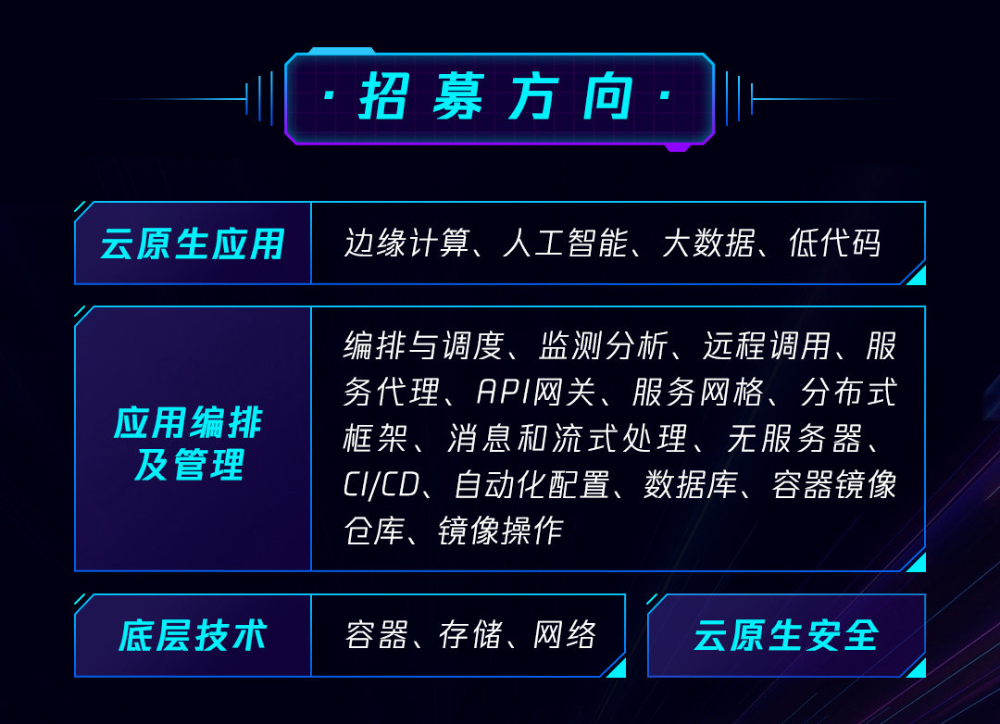
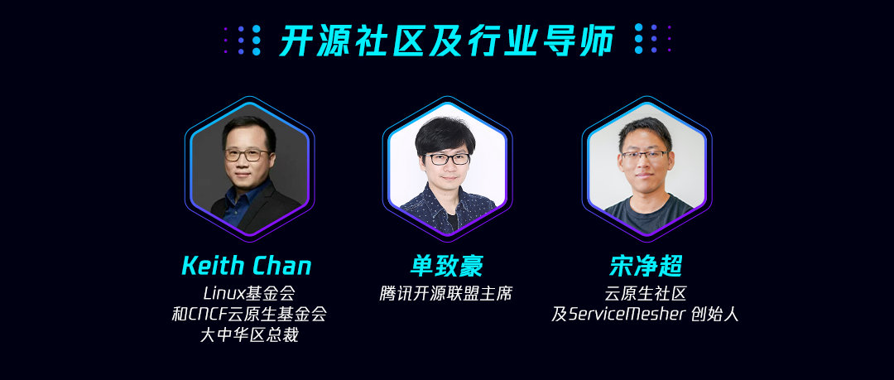
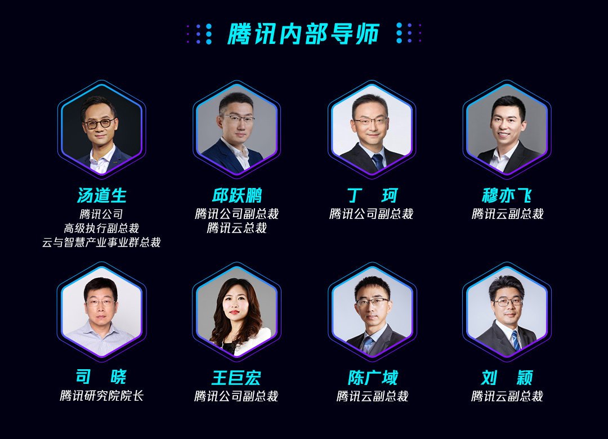

各位云原生领域的创业者，你们的机遇来啦！我有幸参与「[腾讯云原生加速器](https://mp.weixin.qq.com/s/miPjIuflbhDdbxkV8oU7gw)」，担任开源社区及行业导师，共30个成员名额，报名截止到4月20日。云原生社区将与腾讯一起共同推进腾讯云原生加速器。

---

近年来，以 “云原生” 为技术路线，构建信息化平台，已成为企业构建面向未来应用架构的首选。云原生凭借敏捷、开放、标准化的特点，将云计算的优势进一步拓宽，轻量化、松耦合、灵活的技术架构特点，有利于各企业在公有云、私有云和混合云等新型动态环境中，构建和运行可弹性扩展的应用。

3 月 10 日，腾讯正式发布国内首个云原生加速器，面向云原生应用、云原生应用编排及管理、云原生底层技术、云原生安全技术等四大方向开启招募，30 个加速席位虚位以待。

腾讯云原生加速器是腾讯产业加速器的重要组成部分，依托腾讯领先的科技能力、连接内外部资源、发挥技术创新优势，为入选成员提供技术、资金、品牌等层面的加速赋能与生态合作，加速云原生企业成长，促进 “云原生” 技术路线落地产业，共建云原生产业生态。

迎接云计算拐点，邀请合作伙伴共建云原生产业生态

云原生是面向云应用设计的思想理念，以容器、微服务、DevOps、持续集成与持续交付等技术为基础建立，能够发挥云效能的最佳实践路径，充分提升企业研发运维效率。近年来，随着新型 5G、工业互联网等 IT 基础设施的发展，云原生以其敏捷、开放、标准化的特点将云计算的优势进一步拓宽，迅速成为企业构建面向未来的应用架构的首选。中国信息通信研究院《中国云原生用户调查报告 2020》显示，2019 年中国云原生市场规模已达 350.2 亿元，云计算拐点已至，云原生成为驱动业务增长的重要引擎。

以产业生态模式，腾讯一直与生态伙伴 “共创” 跨产业、跨科技边界的融合创新。近年，腾讯不断加速拓展云原生应用场景，推动产业从线下走向云端。目前，腾讯云已打造了完备的云原生产品体系和架构，涵盖软件研发流程、计算资源、架构框架、数据存储和处理、安全等五大领域。截至 2020 年 12 月，腾讯云原生注册用户规模已达 100 + 万，覆盖政府、金融、文体、教育、能源、电商、互联网、游戏、LBS、IM、媒体、交通、影视等主流行业。

为进一步发挥产业互联网 “生态共创” 优势，全方位推动云原生生态进阶，腾讯发布云原生加速器，持续挖掘并扶持，具备高成长性、高协同价值的云原生生态合作伙伴，链接内外部资源进行赋能，发挥协同力量寻找企业云原生改造最佳实践路线，共建健康发展的云原生产业生态。

全链路整合腾讯优势，关键节点赋能入选成员

此次云原生加速器主要招募四大方向，并将为入选成员提供从热点底层技术，到行业创新应用，再到业务核心价值延展的持续赋能。

腾讯云原生加速器招募方向

在技术层面，云原生加速器将对接腾讯云原生、腾讯云计算、腾讯开源联盟、全球顶级开源社区，在关键节点与成员进行联合技术研发，提高存储及计算能力，共同推进云原生技术发展。

在资金层面，云原生加速器对接腾讯产业生态投资，联合一线 VC 机构，为成员提供多渠道资本扶持，提高资本对接效率。

在行业层面，腾讯云将提供 “商机 + 流量” 导入，为成员提供多元合作模式与商业机会，拓展云原生应用场景，加快更多行业向云原生环境迁移。

在资源层面，入选成员将成为腾讯云原生、腾讯云安全、腾讯 AI 实验室、边缘计算实验室、优图实验室等先进技术合作伙伴，收获更多合作机会。

跨行业邀请 19 位顶尖导师，全维度解读核心痛点

为给学员构建一个学习交流、业务合作的生态链接平台，腾讯云原生加速器共邀请来自开源社区、腾讯内部、VC 领域的 19 位顶尖导师，与学员共同探究云原生行业生态版图与业务应用。

其中，来自开源社区及行业的 3 位导师 ——Linux 基金会和 CNCF 云原生基金会大中华区总裁 Keith Chan, 腾讯开源联盟主席单致豪，云原生社区及 ServiceMesher 创始人宋净超，将针对开源社区及开源生态进行观点输出，助力成员拥抱开源生态，链接云原生技术社群。

腾讯云原生加速器开源社区及行业导师

此外，腾讯公司高级执行副总裁、云与智慧产业事业群总裁汤道生，腾讯公司副总裁、腾讯云总裁邱跃鹏，腾讯公司副总裁丁珂，腾讯云副总裁穆亦飞，腾讯研究院院长司晓，腾讯公司副总裁王巨宏，腾讯云副总裁陈广域，腾讯云副总裁刘颖将分别就云原生战略布局、生态共享、技术应用等话题进行分享，与学员共同探索云原生新课题与新机遇。

腾讯云原生加速器腾讯内部导师

腾讯云原生加速器获得了来自 VC 领域的多位导师支持。来自 IDG、红点中国、云启资本、斯道资本、晨晖创投、北极光、五源资本、宽带资本的合伙人与董事，将从投资角度出发，详解云原生产业发展的核心痛点与底层逻辑。

腾讯云原生加速器 VC 导师

除导师辅助外，入选成员还将获得一年期立体孵化，通过 4 次闭门交流 + 1 次海外产业探访 + N 次业务及资源对接，完成技术、资源与合作等全方位持续赋能。

随着数字化转型的加速，作为基础设施的云原生技术，日益成为构筑商业护城河的新入口。Gartner 曾做出预测：在 2020 年前，50% 的企业将业务工作流放到本地需要作为异常事件进行审批，公司 “无云” 的策略会和现在 “无网络” 的策略一样少。

在云时代，不仅需要夯实云原生技术底座，还需要通过生态合作与社区链接，完成云原生技术共建。腾讯云原生加速器将联结更多生态伙伴，基于云原生实践经验，共创云原生与业务融合的无限可能。

报名地址：[见腾讯问卷](https://wj.qq.com/s2/8134735/a817/)