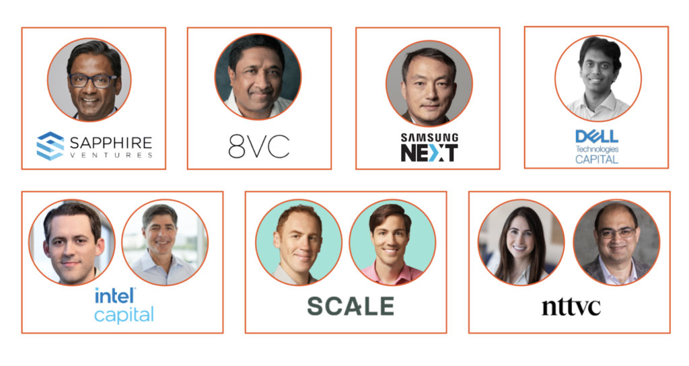

我所任职的公司 Tetrate，今日宣布获得 4000 万美元 B 轮融资。下面的公告来自 Tetrate 的 CEO Varun Talwar，[点击阅读原文](https://www.tetrate.io/blog/series-b-journey-next-steps/)。

---

我很高兴地宣布，Tetrate 获得 4000 万美元的 B 轮融资，由 [Sapphire Ventures](https://sapphireventures.com/) 领投，[Scale Venture Partners](https://www.scalevp.com/)、[NTTVC](https://nttvc.com/) 以及之前的投资者 [Dell Technologies Capital](https://cts.businesswire.com/ct/CT?id=smartlink&url=http%3A%2F%2Fwww.delltechcapital.com&esheet=51953871&newsitemid=20190313005213&lan=en-US&anchor=Dell+Technologies+Capital&index=2&md5=f840ab2ddc35ab4c1bce374f80f5a7a2)、[Intel Capital](https://cts.businesswire.com/ct/CT?id=smartlink&url=http%3A%2F%2Fwww.intelcapital.com%2F&esheet=51953871&newsitemid=20190313005213&lan=en-US&anchor=Intel+Capital&index=4&md5=61b620af4f7e536f666775ad0da478e0)、[8VC](https://cts.businesswire.com/ct/CT?id=smartlink&url=https%3A%2F%2F8vc.com&esheet=51953871&newsitemid=20190313005213&lan=en-US&anchor=8VC&index=3&md5=7a8ee558de22296c3c975a0b8ca03c5f) 和 [Samsung NEXT](https://cts.businesswire.com/ct/CT?id=smartlink&url=https%3A%2F%2Fsamsungnext.com&esheet=51953871&newsitemid=20190313005213&lan=en-US&anchor=Samsung+NEXT&index=6&md5=f5bfec71580bb455887d46463ebc80fd) 跟投。 在此，我要感谢我的同事（也就是 Tetrands）、投资人、客户、合作伙伴和朋友们一直以来的支持。

我们将使用这笔资金扩大我们的全球市场，在工程设计上加倍投入，以进一步支持我们的客户利用 [唯一的混合云应用网络平台 Tetrate Service Bridge](https://www.tetrate.io/tetrate-service-bridge/) 构建其连接结构。我们还会利用这笔资金将全新的 SaaS 产品 Tetrate Cloud 推向市场：一个基于 Istio 的完全托管的服务网格平台，以实现在任何云上的一致体验。

## 融资理由

当今的现代应用程序是一组相互关联的服务，并以容器的形式部署在多集群，有时甚至是多云环境中。在这种分布式动态应用的组合中，阻碍企业灵活性的是通过硬编码库、定制网关、负载均衡器和单片 API 网关实现应用网络和安全的传统模式。

这就是 Tetrate Service Bridge 的优势所在。

## Tetrate Service Bridge

Tetrate Service Bridge 是唯一的边缘到工作负载的服务网格管理平台，它为企业提供了一种统一、一致的方式，在复杂的异构部署环境中管理和保护传统和现代工作负载的服务。它是为多集群、多租户和多云部署而构建的，为客户在任何环境中提供一致的内置可观察性、运行时安全性和流量管理。此外，对于平台所有者来说，它可以管理 Istio 和 Envoy 在内部和云中的生命周期。

将应用网络和安全集中在一个结构中，便于应用开发者使用，这对企业的生产力，以及应用的可靠性和安全性都是一种变革。

Tetrate 是唯一一家为 Istio 提供商业支持的平台中立和云中立公司，也是唯一一家基于 Istio 和 Envoy 的服务网格平台的公司，其客户包括财富 200 强的金融服务、电信、零售、媒体和美国联邦政府机构。

## Tetrate 的发展历程

当我在 2018 年创办 Tetrate 时，我知道行业需要一个与云无关的服务网格平台来使应用具有弹性和安全性。Tetrate 的联合创始人 JJ 之前领导了 Twitter 的云基础设施管理团队，他在这个领域有着深厚的经验，共同的激情促使我们成立了 Tetrate。很快，我们的创始工程师也加入了。 Zack Butcher、周礼赞和吴晟 ——Istio、Envoy 和 Apache SkyWalking 背后的三巨头。

2019 年，我们成功完成了由 Dell Technologies Capital 领投的 [A 轮融资](https://www.businesswire.com/news/home/20190313005213/en/Key-Contributors-of-Envoy-and-Istio-Projects-Launch-Tetrate-with-12.5M-in-Funding-to-Create-Enterprise-Grade-Service-Mesh)，在得到早期客户的强烈验证后，我们打造了核心产品 Tetrate Service Bridge。我们还启动了与 NIST 的合作，共同制定服务网格的安全标准，并在我们的平台上使用 NGAC 以实现 ZTA。在 2020 年，我们迅速扩大了我们的客户群和收入；今年，B 轮融资标志着我们旅程中的一个重要里程碑 —— 为创纪录的财年度画上了句号，我们的团队扩大了一倍，客户群和收入增加了 10 倍以上。要了解更多关于我们迄今为止的历程，请查看我们的 [时间表](http://www.tetrate.io/about)。

我们很自豪，也很谦虚，因为我们获得了超额认购的融资，并且有这么多的投资者验证了我们在开源生态系统中的深厚根基、我们在服务网格领域的思想领导力，以及我们为客户解决问题的记录。

[在此观看](http://www.tetrate.io/about) 我们的投资者对他们投资 Tetrate 的原因和我们的愿景的看法。我们相信，我们才刚刚起步，最好的还在后面。我们期待着共同打造 Tetrate。

作者：Varun Talwar（Tetrate CEO）
