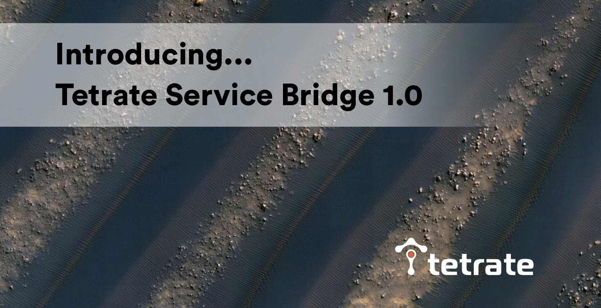
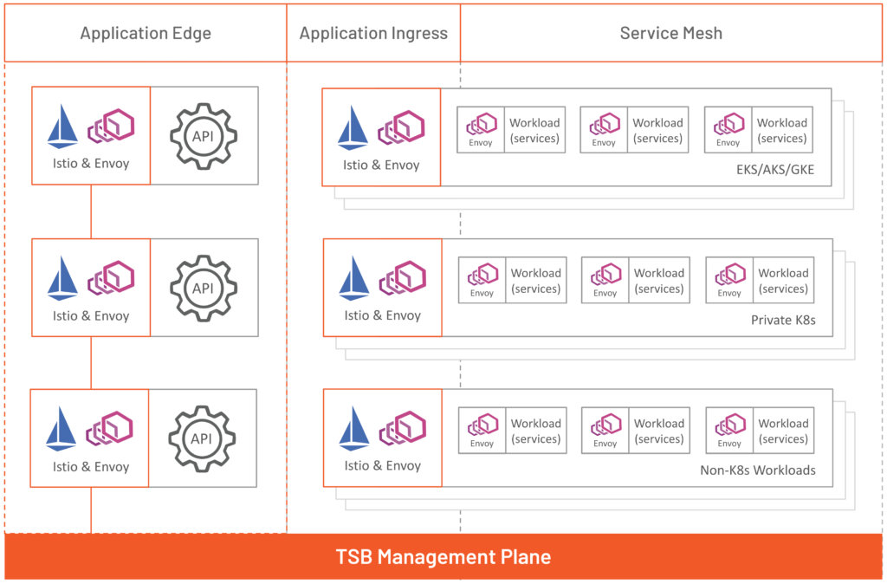
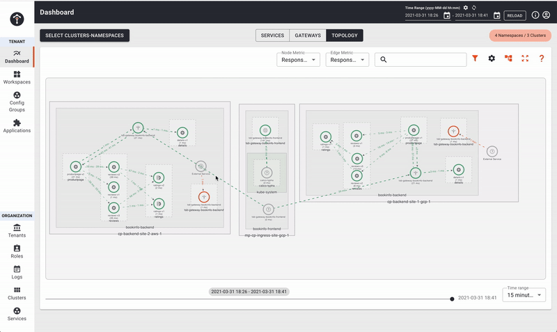
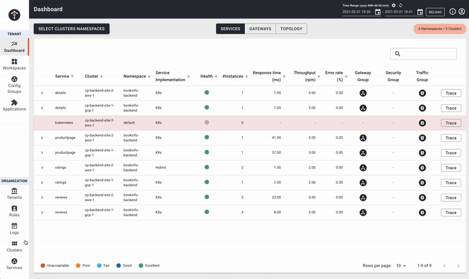

我们很高兴地宣布 [Tetrate Service Bridge](https://www.tetrate.io/tetrate-service-bridge/) 1.0（General Available）发布。Tetrate 的使命是解决应用网络的复杂性，使应用开发者和运维的工作变得简单。今天是我们发展道路上的一个重要里程碑。

## 初心

Tetrate 成立的初心是应用网络应与计算无关。我们相信，这是任何组织在构建和交付应用时实现敏捷性和速度的关键。这与当今的应用越来越相关，这些应用在多个云和内部基础设施的异构计算环境（如 Kubernetes 和虚拟机）上运行。如果不加以管理，这种蔓延会导致难以承受的运营成本和复杂性。企业需要一种一致的方式来配置、保护和观察他们的应用，并保持系统的弹性以满足 SLO。

## Tetrate Service Bridge

使用一流的开源项目：[Istio](https://istio.io/)、[Envoy Proxy](http://envoyproxy.io/) 和 [Apache SkyWalking](https://skywalking.apache.org/)（Tetrate 积极参与并维护这些项目），我们开始建立原型，以解决应用网络的挑战。我们与《财富》500 强企业密切合作，并得到他们出色的团队支持，以验证我们的想法和产品。他们一直并将继续帮助我们构建产品，他们所提供的在快速变化的环境中的真实用例为我们的产品构建发挥了重要作用。我们建立了一个平台，以帮助组织在多云和多集群环境的异构计算中管理其应用网络。这个平台能够满足企业的实际需求，使他们能够按照自己的节奏安全地、渐进地进行现代化和 / 或迁移。

我们将该平台命名为 Tetrate Service Bridge（TSB）。桥梁提供了一种连接方式，而这正是我们所实现的。TSB 是一座桥梁：

- 以实现企业应用的现代化。
- 从任何地方连接任何服务。
- 将不同的团队聚集在一起，管理和运维应用服务。

## 从边缘到工作负载的网络

Tetrate Service Bridge 的核心是提供一个单一的管理平面，以便在构成应用网络的三个层面上配置连接性、安全性和可靠性。

1. 应用程序边缘网关（Application Edge Gateway），作为传入流量的入口点，然后将流量分配到多个集群。
2. 应用程序入口网关（Application Ingress Gateway），作为进入单个集群的流量的入口点，并将流量分配给在该集群中运行的一个或多个工作负载。这还包括 API 网关功能，如认证、授权、速率限制等。
3. 服务网格 Sidecar，作为代理，允许工作负载之间的连接，控制服务访问，并收集指标和追踪，以提供全面的可观察性。

Tetrate Service Bridge 位于应用边缘、集群入口和集群内，可在 Kubernetes 集群和传统计算之间路由和负载平衡南北流量，并连接集群内的东西向工作负载。

## 一个适合多个团队的平台

在任何组织中，多个团队一起构建和交付应用程序，具体来说是：应用程序、平台和安全团队。这些团队中的每一个团队都会有不同的关注点和期望。

- 平台团队希望在其基础设施中提供多集群服务网格，并对其进行维护。
- 应用开发团队希望配置、观察和排除他们的应用程序和 API 的故障。
- 安全团队希望对用户和服务访问持续应用安全策略和工作流程。

我们建立了 Tetrate Service Bridge，以满足这些团队的要求，加速组织的成功。

## 提供和维护多集群服务网格

### 多集群、多云、混合云

通过 Tetrate Service Bridge，您可以跨集群、云和数据中心连接和管理应用程序。Tetrate Service Bridge 支持来自主要云供应商的任何 Kubernetes 上游合规发行版。这包括但不限于 Google Kubernetes Engine（GKE）、Amazon Elastic Kubernetes Service（EKS）、Azure Kubernetes Service（AKS）、Openshift 和 Mirantis Kubernetes Engine（MKE）。Tetrate Service Bridge 还支持将虚拟机（VM）和裸机工作负载接入网格。 

### 集群生命周期管理

Tetrate Service Bridge 提供了所有集群中运行的 Istio 和 Envoy 的可视性，包括部署的版本、每个集群的配置状态等信息。此外，您还可以使用 Tetrate Service Bridge 管理网格部署的完整清单，并放心地逐步升级，而不必担心停机。

## 配置和观察应用程序和 API

### 始终如一的安全体验

Tetrate Service Bridge 的管理平面为平台所有者和应用开发者提供了一致的体验，以控制任何环境中任何应用的连接性、安全性和可观察性。

Tetrate Service Bridge 还提供了更安全的配置模型，允许应用团队编写和验证 Istio 配置，通过构造确保正确性。服务级隔离和组织控制保证了只有正确的网格配置才能在运行时到达您的应用。

### 单一视图的可观察性

Tetrate Service Bridge 可收集、存储和汇总来自多个集群和环境的指标、追踪和代理日志，并提供单一界面查看服务的拓扑结构及其依赖关系，以便一目了然地了解应用健康状况。

### 扩展网格功能

Tetrate Service Bridge 为认证和授权、可观察性或通过 WASM 扩展对请求属性进行操作提供了一个可扩展点。这允许应用团队添加可根据组织特定需求定制的功能。

## 确保网格的安全

### 多租户

利用 Tetrate Service Bridge，您可以为您的团队和企业内部的工作空间创建租户，以定义细粒度的访问控制、编辑权限，并应用零信任标准。Tetrate Service Bridge 符合 NIST 微服务安全标准（SP800-204a 和 - 204b，由 Tetrate 工程师与 NIST 共同编写）和下一代访问控制（NGAC）的实现。

### 安全策略

Tetrate Service Bridge 允许您在网格中一致地应用安全策略，而不需应用开发人员操心。Tetrate Service Bridge 符合 NIST 微服务安全标准，并实现零信任。

## 下一步

要了解有关 Tetrate Service Bridge 的更多信息，请访问我们的[页面](https://www.tetrate.io/tetrate-service-bridge/)，并注册参加即将举行的网络研讨会，即 [TSB 介绍：连接和保护您的应用程序，无论它们在哪里运行](https://us02web.zoom.us/webinar/register/1716177543798/WN_JukXWVU-TP-68A6y-NAs6Q)。 [联系我们](https://www.tetrate.io/contact-us/)，获取 TSB 演示，了解 TSB 如何帮助您管理应用网络的复杂性。通往现代化的道路并不简单，但我们已准备好铺设桥梁，并为您提供每一步支持。