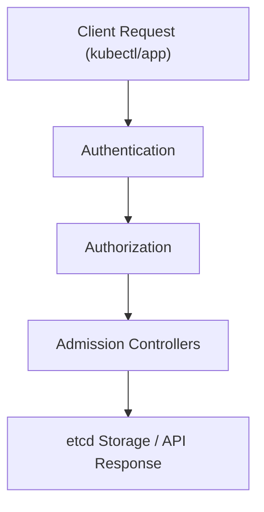
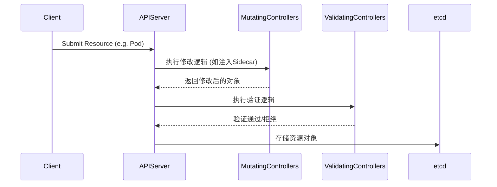

> 准入控制器是 Kubernetes 实现策略治理和安全合规的关键机制，通过内建插件与 Webhook 扩展，用户可灵活实现自动化、合规与安全控制。

## 概述

在 Kubernetes 的 API 请求生命周期中，请求从 `kubectl` 或客户端发出后，会先经过 **认证（Authentication）** 和 **鉴权（Authorization）** 阶段，然后进入到一个非常关键的环节——**准入控制（Admission Control）**。

**Admission Controller（准入控制器）** 是一组可插拔的拦截器（Interceptors），它们在请求到达 etcd 之前执行，用于：

- 验证请求是否合法；
- 自动修改请求（如填充默认值）；
- 实施安全、资源、合规策略；
- 触发外部逻辑（例如动态准入 Webhook）。

准入控制器是实现 Kubernetes 策略与治理（Policy & Governance）的核心组件之一。

## 请求流程与位置

下图展示了 API Server 处理请求的主要流程，准入控制器在认证与存储之间发挥作用。




{width=1920 height=4774}

准入控制器位于 **认证** 和 **存储** 之间，是修改与验证资源的最后关口。

## 准入控制器的类型

Kubernetes 的准入控制器分为两类：

- **MutatingAdmissionController（可变更）**：可以修改请求对象，例如为 Pod 自动注入默认字段、sidecar 容器等。
- **ValidatingAdmissionController（只验证）**：仅验证请求是否合法，例如拒绝不符合安全策略的 Pod。

API Server 依次执行 Mutating → Validating 控制器，顺序如下：

```text
Authentication → Authorization → Mutating Admission → Validating Admission → etcd
```

> **更新（2024）**  
>
> - 从 Kubernetes 1.22 起，`admissionregistration.k8s.io/v1beta1` API 已废弃，仅支持 v1。  
> - `PodSecurityPolicy`（PSP）已于 1.25 移除，推荐使用 `PodSecurity`（PSS）或第三方策略引擎（如 Kyverno、Gatekeeper）。

## 内建准入控制器插件

Kubernetes 内置了多种准入控制器插件，用于常见策略和安全控制。下表简要介绍常用插件及其功能。



| 控制器名称                   | 功能描述                            | 版本/状态           |
| ----------------------- | ------------------------------- | ------------------- |
| `NamespaceLifecycle`    | 防止删除系统命名空间或在删除中的命名空间中创建对象       | 推荐/长期支持        |
| `LimitRanger`           | 根据 LimitRange 为 Pod 设置默认资源请求/限制 | 推荐/长期支持        |
| `ServiceAccount`        | 自动为 Pod 分配 ServiceAccount       | 推荐/长期支持        |
| `ResourceQuota`         | 检查命名空间资源配额是否超限                  | 推荐/长期支持        |
| `NodeRestriction`       | 限制 kubelet 对 Node/Pod 对象的修改权限   | 推荐/长期支持        |
| `PodSecurity`           | 按照 Pod 安全标准（PSS）验证安全配置          | 推荐/替代 PSP        |
| `TaintNodesByCondition` | 为 Node 添加系统级污点                  | 推荐/长期支持        |
| `DefaultStorageClass`   | 自动为 PVC 绑定默认存储类                 | 推荐/长期支持        |
| `PodSecurityPolicy`     | Pod 安全策略（已废弃，1.25 移除）           | 已废弃/请勿再用      |



> **注意：**  
>
> - `PodSecurityPolicy` 已于 1.25 正式移除，建议迁移到 `PodSecurity` 或使用 Kyverno、Gatekeeper 等策略引擎。  
> - `PodSecurity`（PSS）自 1.23 起 GA，支持 namespace 级别安全策略。

启用和禁用内建插件时，可通过如下参数配置：

```bash
# 启用部分准入控制器插件
kube-apiserver \
  --enable-admission-plugins=NamespaceLifecycle,LimitRanger,ServiceAccount,ResourceQuota,PodSecurity

# 禁用指定插件
--disable-admission-plugins=PodSecurity
```

## 与准入 Webhook 的关系

虽然内建控制器功能丰富，但在企业自定义合规、动态安全扫描、自动注入 Sidecar 或对接外部策略引擎等场景下，灵活性有限。此时可通过 **Admission Webhook** 实现可扩展的准入控制。

两者主要区别如下：



| 对比项  | 内建准入控制器            | 准入 Webhook      |
| ---- | ------------------ | --------------- |
| 实现方式 | 编译进 kube-apiserver | 由用户自定义 HTTP 服务  |
| 修改能力 | 固定逻辑               | 用户可自定义逻辑        |
| 部署位置 | 集群内部               | 任意可访问的服务（常在集群内） |
| 可扩展性 | 有限                 | 极高              |
| 使用场景 | 通用系统策略             | 组织级定制、动态策略      |



两者是互补关系：

> 内建控制器负责通用策略，而 Admission Webhook 负责可编程扩展。

## 典型使用场景

准入控制器和 Webhook 在实际生产中有诸多典型应用，包括但不限于：

- **安全策略控制**  
  结合 `PodSecurity` 与 Webhook 实现企业安全标准，禁止特定镜像仓库的容器运行。
- **自动化默认值注入**  
  为 Pod 自动注入 Sidecar 容器（如 Istio、Linkerd），或为 Job/Deployment 添加调度策略。
- **资源管理与审计**  
  拒绝未打标签的资源，记录变更日志或审计请求来源。

## 典型执行顺序示意图

下图展示了准入控制器的典型执行顺序，便于理解 Mutating 与 Validating 阶段的流程。




{width=1920 height=726}

## 调试与配置

在实际运维中，常需查看和调试准入控制器配置。以下命令可用于相关操作：

```bash
# 查看当前启用的控制器
kubectl get --raw /configz | jq .admissionControlConfiguration

# 本地调试 Webhook
kubectl apply -f validating-webhook.yaml
kubectl apply -f mutating-webhook.yaml

# 查看 Webhook 状态
kubectl describe validatingwebhookconfiguration
```

> **调试提示（2024）**  
>
> - 使用 `kubectl get validatingwebhookconfigurations` 和 `kubectl get mutatingwebhookconfigurations` 查看所有 Webhook 配置。  
> - 推荐使用 `kubectl explain` 查看 Admission 相关资源的字段说明。

## 最佳实践

- **控制顺序：** 始终区分 Mutating 和 Validating 阶段，确保变更与验证分离。
- **高可用性：** Webhook 服务应启用多副本与健康检查，避免单点故障。
- **性能优化：** 使用 `failurePolicy=Ignore` 避免因 Webhook 故障阻塞 API Server。
- **安全性：** 启用 TLS 与服务端认证，保障数据传输安全。
- **可观测性：** 对 Webhook 请求进行监控与日志追踪，便于问题定位。
- **API 兼容性：** 所有 Admission Webhook 配置应使用 `admissionregistration.k8s.io/v1`，避免使用已废弃版本。

## 总结

准入控制器是 Kubernetes 实现“策略即代码”（Policy as Code）的核心机制。通过内建控制器可以实现基础治理，而通过 Admission Webhook，用户可以在集群请求路径中注入自定义逻辑，实现安全、合规、自动化的控制体系。

准入控制器是“API 扩展”体系的最后一道防线，与 CRD、Controller 一起构成了 Kubernetes 的可编程生态基础。

## 参考文献

1. [Kubernetes Admission Controllers - kubernetes.io](https://kubernetes.io/docs/reference/access-authn-authz/admission-controllers/)
2. [Dynamic Admission Control - kubernetes.io](https://kubernetes.io/docs/reference/access-authn-authz/extensible-admission-controllers/)
3. [Pod Security Admission - kubernetes.io](https://kubernetes.io/docs/concepts/security/pod-security-admission/)
4. [OPA Gatekeeper 项目 - github.com](https://github.com/open-policy-agent/gatekeeper)
5. [Kyverno Policy Engine - kyverno.io](https://kyverno.io/)
