> Kubernetes 工作负载管理的精髓在于灵活组合控制器与生命周期机制，实现应用的弹性、可靠与智能化运维。

本文系统梳理了 Kubernetes 工作负载管理的核心概念、主要控制器、生命周期管理与最佳实践，帮助读者理解如何高效部署和维护集群中的应用工作负载。

## 核心概念

Kubernetes 工作负载管理的核心是 Pod——Kubernetes 中最小的可部署单元。但实际生产中，Pod 通常由更高层级的控制器管理，这些控制器提供了扩缩容、滚动更新、自愈等能力。

### Pod：基础单元

Pod 是由一个或多个容器组成的组，容器间共享存储和网络资源。Pod 是所有工作负载的基础构建块。

{width=1920 height=1250}

### 工作负载资源层级

Kubernetes 提供多种控制器管理 Pod，适用于不同类型的工作负载。

{width=1920 height=1273}

## Deployment 控制器

Deployment 提供 Pod 和 ReplicaSet 的声明式更新。用户定义期望状态，Deployment 控制器以受控速率将实际状态调整为期望状态。

### Deployment 基础

Deployment 管理 ReplicaSet，ReplicaSet 再管理 Pod。这种所有权链条支持滚动更新和回滚等高级特性。

{width=1920 height=1286}

### 滚动更新流程

滚动更新时，Deployment 创建新 ReplicaSet 并逐步扩容，同时缩减旧 ReplicaSet，确保应用高可用。

{width=1920 height=1127}

## StatefulSet 控制器

StatefulSet 适用于需要以下特性的应用：

- 稳定、唯一的网络标识
- 稳定的持久化存储
- 有序、优雅的部署与扩缩容
- 有序、自动的滚动更新

### StatefulSet 结构

与 Deployment 不同，StatefulSet 为每个 Pod 保持粘性标识，提供稳定主机名和持久卷，Pod 重调度后依然保持数据和身份。

{width=1920 height=739}

### StatefulSet 与 Deployment 对比



| 特性         | StatefulSet                | Deployment              |
| ------------ | -------------------------- | ----------------------- |
| Pod 标识     | 稳定、有序（web-0, web-1） | 随机、临时              |
| 存储         | 稳定持久存储               | 临时或共享              |
| 扩缩容       | 有序、一次一个              | 可同时扩缩多个 Pod      |
| 更新         | 有序、受控                  | 可同时更新多个 Pod      |
| 典型场景     | 有状态应用（数据库等）      | 无状态应用              |



## Job 与 CronJob 控制器

Job 和 CronJob 创建会运行至完成的 Pod，而非长期运行。

### Job 类型与模式

Job 可配置为不同模式：

{width=1920 height=946}

### CronJob 定时调度

CronJob 按时间表创建 Job，类似于 Unix 的 cron 工具。

## DaemonSet 控制器

DaemonSet 确保所有（或部分）节点上都运行一份 Pod。节点加入集群时自动添加 Pod，节点移除时自动清理。

### DaemonSet 典型场景

DaemonSet 常用于：

- 集群存储守护进程
- 节点日志收集守护进程
- 节点监控守护进程

{width=1920 height=1368}

## ReplicaSet 控制器

ReplicaSet 用于维持指定数量的 Pod 副本，保证应用高可用。通常由 Deployment 管理，实现滚动更新和回滚。

### ReplicaSet 与 Deployment 关系

{width=1920 height=1097}

## 工作负载生命周期管理

高效的工作负载管理需理解 Pod 生命周期、健康检查与中断管理。

### Pod 生命周期

Pod 遵循明确的生命周期，从创建到终止经历多个阶段。

{width=1920 height=2501}

### 容器探针

Kubernetes 提供多种探针检测容器健康：



| 探针类型         | 作用                         | 失败时动作                   |
| ---------------- | ---------------------------- | ---------------------------- |
| Liveness Probe   | 检测容器是否存活             | 重启容器                     |
| Readiness Probe  | 检测容器是否可对外服务       | 从服务端点移除               |
| Startup Probe    | 检测应用是否已启动           | 延迟存活/就绪检查            |



### 水平 Pod 自动扩缩容

Horizontal Pod Autoscaler（HPA）可根据 CPU 或自定义指标自动扩缩 Deployment、ReplicaSet 或 StatefulSet 的 Pod 数量。

{width=1920 height=968}

## 高级工作负载模式

### Init 容器与 Sidecar 容器

Init 容器在主容器启动前依次运行并完成。Sidecar 容器与主容器并行运行，提供辅助功能。

{width=1920 height=316}

### Pod 中断管理

Pod Disruption Budget（PDB）限制应用可同时中断的 Pod 数，保障高可用。

{width=1920 height=654}

## 最佳实践

### 资源管理

始终为容器指定资源请求与限制，确保合理调度，防止资源争用。

### 高可用配置

对于关键工作负载，建议：

- 使用多副本 Deployment
- 配置 Pod Disruption Budget
- 配置 Liveness/Readiness 探针
- 使用 Pod 反亲和性分布副本
- 跨可用区部署实现地理冗余

### 扩缩容策略



| 扩缩容类型 | 控制器                  | 适用场景                       |
| ---------- | ----------------------- | ------------------------------ |
| 水平扩缩容 | HorizontalPodAutoscaler | 无状态应用、负载波动           |
| 垂直扩缩容 | VerticalPodAutoscaler   | 不能水平扩展的应用             |
| 集群扩缩容 | Cluster Autoscaler      | 整体集群容量自动管理           |



### Pod 生命周期管理

- 配置合适的启动、存活、就绪探针
- 设置 terminationGracePeriodSeconds 实现优雅关闭
- 应用需正确处理终止信号
- 使用 Init 容器处理依赖与启动需求
- 利用 preStop 钩子做清理操作

## 工作负载控制器选择指南

根据应用需求选择合适的控制器：

{width=1920 height=1736}

该流程图有助于根据实际需求选择最合适的工作负载控制器。

## 总结

Kubernetes 工作负载管理体系为应用的部署、扩缩容、高可用和生命周期管理提供了强大支撑。理解各类控制器的适用场景与特性，合理配置探针、资源和中断预算，是保障集群稳定与业务连续性的关键。通过最佳实践，用户可实现高效、自动化的工作负载运维管理。
