> 本文面向有 Kubernetes 基础的开发者，系统梳理生产级云原生应用的高级架构模式、API 扩展、现代开发实践与企业级运维，助力你掌握行业最佳实践与技术栈。

## 引言

本指南结合企业级应用的实际经验，涵盖微服务架构、DevOps 流程、安全加固、可观测性等关键领域，帮助你构建生产级的云原生应用程序。

通过本指南，你将学习到：

- 高级应用部署模式
- Kubernetes API 扩展与 Operator 实践
- 现代开发与运维最佳实践
- 多集群与安全加固方案

## 高级应用部署模式

Kubernetes 提供丰富的原语和架构模式，支持复杂企业级应用的高可用与弹性部署。以下内容结合行业实践，介绍常用的高级部署模式。

### 容器架构模式

下图展示了 Pod 内外常见的容器协作模式。


{width=1920 height=1413}

#### Sidecar 容器模式

Sidecar 容器用于分离关注点，提升可维护性和可观测性。

```yaml
# Sidecar 实践示例：日志收集与监控
apiVersion: apps/v1
kind: Deployment
metadata:
  name: web-app-with-sidecar
spec:
  replicas: 3
  template:
    spec:
      containers:
      - name: web-app
        image: nginx:1.21
        ports:
        - containerPort: 80
      - name: log-shipper
        image: fluent/fluent-bit:2.1
        volumeMounts:
        - name: log-volume
          mountPath: /var/log/app
        - name: config-volume
          mountPath: /fluent-bit/etc
      - name: metrics-exporter
        image: prometheus/blackbox-exporter:v0.24
        ports:
        - containerPort: 9115
      volumes:
      - name: log-volume
        emptyDir: {}
      - name: config-volume
        configMap:
          name: fluent-bit-config
```

实际应用场景包括日志聚合、监控代理、安全代理和数据同步等。

#### Init 容器高级用法

Init 容器用于准备运行环境，如依赖检查、数据迁移等。

```yaml
apiVersion: v1
kind: Pod
metadata:
  name: app-with-init
spec:
  initContainers:
  - name: wait-for-db
    image: busybox:1.36
    command: ['sh', '-c', 'until nslookup db-service; do echo waiting for db; sleep 2; done;']
  - name: db-migration
    image: myapp/migration:v1.2
    env:
    - name: DB_HOST
      value: "db-service"
  containers:
  - name: app
    image: myapp:v2.1
    readinessProbe:
      httpGet:
        path: /health
        port: 8080
```

### Pod 配置高级实践

合理配置亲和性、污点容忍和 Downward API，可提升调度效率和应用弹性。

#### 亲和性与反亲和性调度

```yaml
apiVersion: apps/v1
kind: Deployment
metadata:
  name: web-app
spec:
  replicas: 3
  template:
    spec:
      affinity:
        nodeAffinity:
          preferredDuringSchedulingIgnoredDuringExecution:
          - weight: 100
            preference:
              matchExpressions:
              - key: node-type
                operator: In
                values:
                - high-performance
        podAntiAffinity:
          requiredDuringSchedulingIgnoredDuringExecution:
          - labelSelector:
              matchLabels:
                app: web-app
            topologyKey: kubernetes.io/hostname
      containers:
      - name: web
        image: nginx:1.21
```

#### 污点容忍高级配置

```yaml
# 节点污点设置
kubectl taint nodes gpu-node-01 gpu=nvidia:NoSchedule
kubectl taint nodes gpu-node-01 workload=ai:PreferNoSchedule

# Pod 容忍配置
apiVersion: v1
kind: Pod
metadata:
  name: gpu-pod
spec:
  tolerations:
  - key: "gpu"
    operator: "Equal"
    value: "nvidia"
    effect: "NoSchedule"
  - key: "workload"
    operator: "Equal"
    value: "ai"
    effect: "PreferNoSchedule"
    tolerationSeconds: 300
  containers:
  - name: gpu-app
    image: nvidia/cuda:11.8-runtime-ubuntu20.04
    resources:
      limits:
        nvidia.com/gpu: 1
```

#### Downward API 生产实践

```yaml
apiVersion: v1
kind: Pod
metadata:
  name: app-with-metadata
  labels:
    app: my-app
    version: v1.2.3
spec:
  containers:
  - name: app
    image: myapp:v1.2.3
    env:
    - name: POD_NAME
      valueFrom:
        fieldRef:
          fieldPath: metadata.name
    - name: POD_NAMESPACE
      valueFrom:
        fieldRef:
          fieldPath: metadata.namespace
    - name: POD_IP
      valueFrom:
        fieldRef:
          fieldPath: status.podIP
    - name: NODE_NAME
      valueFrom:
        fieldRef:
          fieldPath: spec.nodeName
    volumeMounts:
    - name: pod-info
      mountPath: /etc/pod-info
  volumes:
  - name: pod-info
    downwardAPI:
      items:
      - path: "labels"
        fieldRef:
          fieldPath: metadata.labels
      - path: "annotations"
        fieldRef:
          fieldPath: metadata.annotations
```

### 高级工作负载控制器

合理配置 HPA、CronJob 等控制器，实现自动扩缩容与定时任务调度。

#### HorizontalPodAutoscaler (HPA) 增强配置

```yaml
apiVersion: autoscaling/v2
kind: HorizontalPodAutoscaler
metadata:
  name: web-app-hpa
spec:
  scaleTargetRef:
    apiVersion: apps/v1
    kind: Deployment
    name: web-app
  minReplicas: 3
  maxReplicas: 50
  metrics:
  - type: Resource
    resource:
      name: cpu
      target:
        type: Utilization
        averageUtilization: 70
  - type: Resource
    resource:
      name: memory
      target:
        type: Utilization
        averageUtilization: 80
  - type: Pods
    pods:
      metric:
        name: packets_per_second
      target:
        type: AverageValue
        averageValue: 1000
  - type: Object
    object:
      metric:
        name: requests_per_second
      describedObject:
        apiVersion: networking.k8s.io/v1
        kind: Ingress
        name: web-app-ingress
      target:
        type: Value
        value: "5000"
  behavior:
    scaleDown:
      stabilizationWindowSeconds: 300
      policies:
      - type: Percent
        value: 10
        periodSeconds: 60
    scaleUp:
      stabilizationWindowSeconds: 60
      policies:
      - type: Percent
        value: 50
        periodSeconds: 60
      - type: Pods
        value: 5
        periodSeconds: 60
```

#### CronJob 高级调度

```yaml
apiVersion: batch/v1
kind: CronJob
metadata:
  name: batch-job
spec:
  schedule: "0 */6 * * *"
  timeZone: "Asia/Shanghai"
  concurrencyPolicy: Forbid
  startingDeadlineSeconds: 300
  suspend: false
  successfulJobsHistoryLimit: 3
  failedJobsHistoryLimit: 1
  jobTemplate:
    spec:
      parallelism: 2
      completions: 2
      backoffLimit: 3
      activeDeadlineSeconds: 600
      template:
        spec:
          restartPolicy: OnFailure
          containers:
          - name: batch-processor
            image: myapp/batch:v1.0
            resources:
              requests:
                memory: "512Mi"
                cpu: "500m"
              limits:
                memory: "1Gi"
                cpu: "1000m"
```

### 多集群部署策略

多集群架构提升高可用性与灾备能力，常见同步机制包括 Federation、配置同步与服务发现同步。


{width=1920 height=939}

#### Karmada 多集群管理实践

Karmada 支持多集群资源调度与自定义扩展。

```yaml
apiVersion: config.karmada.io/v1alpha1
kind: ResourceInterpreterCustomization
metadata:
  name: workload-customization
spec:
  target:
    apiVersion: apps/v1
    kind: Deployment
  customizations:
    retention:
      luaScript: |
        function Retain(desired, observed)
          if observed.spec.replicas > desired.spec.replicas then
            desired.spec.replicas = observed.spec.replicas
          end
          return desired
        end
---
apiVersion: policy.karmada.io/v1alpha1
kind: PropagationPolicy
metadata:
  name: nginx-propagation
spec:
  resourceSelectors:
    - apiVersion: apps/v1
      kind: Deployment
      name: nginx
  placement:
    clusterAffinity:
      clusterNames:
      - cluster1
      - cluster2
    replicaScheduling:
      replicaSchedulingType: Divided
      replicaDivisionPreference: Weighted
      weightPreference:
        staticWeightList:
        - targetCluster:
            clusterNames:
            - cluster1
          weight: 2
        - targetCluster:
            clusterNames:
            - cluster2
          weight: 1
```

## Kubernetes API 扩展模式

Kubernetes 支持多种 API 扩展方式，满足复杂应用的自动化与智能化管理需求。

### Operator 模式：智能自动化

下图展示了 Operator 架构及其与核心资源的关系。


{width=1920 height=2004}

Operator 模式是主流的 Kubernetes API 扩展方式，支持应用生命周期自动化管理。

```yaml
# PostgreSQL Operator CRD 示例
apiVersion: postgresql.example.com/v1
kind: PostgreSQLCluster
metadata:
  name: prod-database
spec:
  version: "16"
  replicas: 3
  storage:
    size: 500Gi
    className: "fast-ssd"
  backup:
    schedule: "0 */6 * * *"
    retention: "30d"
  monitoring:
    enabled: true
```

Operator 开发工具栈涵盖 Go、Python、Java、Rust 等多语言生态。



{width=2003 height=742}

### CRD 最佳实践

合理设计 CRD Schema，提升 API 可用性与安全性。

```yaml
apiVersion: apiextensions.k8s.io/v1
kind: CustomResourceDefinition
metadata:
  name: myapps.example.com
spec:
  group: example.com
  versions:
  - name: v1
    served: true
    storage: true
    schema:
      openAPIV3Schema:
        type: object
        properties:
          spec:
            type: object
            properties:
              replicas:
                type: integer
                minimum: 1
                maximum: 10
              image:
                type: string
                pattern: '^[^:]+:[^:]+$'
            required:
            - replicas
            - image
          status:
            type: object
            properties:
              phase:
                type: string
                enum: ["Pending", "Running", "Failed"]
              conditions:
                type: array
                items:
                  type: object
                  properties:
                    type:
                      type: string
                    status:
                      type: string
                      enum: ["True", "False", "Unknown"]
                    lastTransitionTime:
                      type: string
                      format: date-time
                    reason:
                      type: string
                    message:
                      type: string
  scope: Namespaced
  names:
    plural: myapps
    singular: myapp
    kind: MyApp
    shortNames:
    - ma
```

### API 聚合层扩展

API 聚合适用于企业级复杂扩展，支持自定义 API Server 与统一入口。


{width=1920 height=1724}

## 现代开发实践

现代云原生开发强调自动化、声明式配置和服务治理，以下介绍主流实践。

### GitOps 工作流

GitOps 通过代码驱动基础设施变更，实现自动化部署与回滚。



{width=1920 height=3025}

#### ArgoCD 应用管理

```yaml
apiVersion: argoproj.io/v1alpha1
kind: Application
metadata:
  name: my-app
  namespace: argocd
spec:
  project: default
  source:
    repoURL: https://github.com/myorg/my-app
    targetRevision: HEAD
    path: helm
  destination:
    server: https://kubernetes.default.svc
    namespace: production
  syncPolicy:
    automated:
      prune: true
      selfHeal: true
    syncOptions:
    - CreateNamespace=true
    retry:
      limit: 5
      backoff:
        duration: 5s
        factor: 2
        maxDuration: 3m
```

### Service Mesh 集成

服务网格提升微服务治理能力，实现流量管理、安全加固与可观测性。


{width=1920 height=1622}

#### Istio 服务治理

```yaml
apiVersion: networking.istio.io/v1alpha3
kind: VirtualService
metadata:
  name: my-app-routing
spec:
  hosts:
  - my-app.example.com
  http:
  - match:
    - headers:
        x-user-type:
          exact: premium
    route:
    - destination:
        host: my-app
        subset: premium
  - route:
    - destination:
        host: my-app
        subset: standard
---
apiVersion: networking.istio.io/v1alpha3
kind: DestinationRule
metadata:
  name: my-app-subsets
spec:
  host: my-app
  subsets:
  - name: premium
    labels:
      version: v2
  - name: standard
    labels:
      version: v1
```

### Serverless 计算模式

Knative 支持事件驱动与自动扩缩容，适合函数即服务场景。



{width=1920 height=1507}

#### Knative 服务部署

```yaml
apiVersion: serving.knative.dev/v1
kind: Service
metadata:
  name: hello-world
spec:
  template:
    spec:
      containers:
      - image: gcr.io/knative-samples/helloworld-go
        env:
        - name: TARGET
          value: "Go Sample v1"
        resources:
          requests:
            cpu: 100m
            memory: 128Mi
          limits:
            cpu: 1000m
            memory: 512Mi
        autoscaling.knative.dev/minScale: "0"
        autoscaling.knative.dev/maxScale: "10"
        autoscaling.knative.dev/target: "80"
```

## 企业级运维实践

企业级运维关注可观测性、安全加固与灾难恢复，保障系统稳定与数据安全。

### 可观测性架构

下图展示了监控、日志与分布式追踪的整体架构。


{width=2259 height=662}

#### Prometheus 监控配置

```yaml
apiVersion: monitoring.coreos.com/v1
kind: PrometheusRule
metadata:
  name: myapp-alerts
  namespace: monitoring
spec:
  groups:
  - name: myapp
    rules:
    - alert: HighRequestLatency
      expr: histogram_quantile(0.95, rate(http_request_duration_seconds_bucket[5m])) > 0.5
      for: 10m
      labels:
        severity: warning
      annotations:
        summary: "高请求延迟"
        description: "95 分位请求延迟超过 500ms"
    - alert: PodCrashLooping
      expr: increase(kube_pod_container_status_restarts_total[10m]) > 5
      for: 5m
      labels:
        severity: critical
      annotations:
        summary: "Pod 重启循环"
        description: "Pod 在 10 分钟内重启超过 5 次"
```

### 安全加固实践

安全加固涵盖身份认证、网络安全与运行时安全，保障集群与数据安全。



{width=2387 height=380}

#### Pod 安全策略实施

```yaml
apiVersion: kyverno.io/v1
kind: ClusterPolicy
metadata:
  name: restrict-image-registries
spec:
  validationFailureAction: enforce
  rules:
  - name: validate-image-registry
    match:
      resources:
        kinds:
        - Pod
    validate:
      message: "只允许来自可信镜像仓库的容器镜像"
      pattern:
        spec:
          containers:
          - image: "registry.example.com/*"
  - name: require-security-context
    match:
      resources:
        kinds:
        - Pod
    validate:
      message: "必须设置安全上下文"
      pattern:
        spec:
          securityContext:
            runAsNonRoot: true
            runAsUser: ">999"
          containers:
          - securityContext:
              allowPrivilegeEscalation: false
              capabilities:
                drop:
                - ALL
```

### 灾难恢复与备份

灾备体系保障集群与数据的高可用与快速恢复。



{width=1920 height=2252}

#### Velero 备份配置

```yaml
apiVersion: velero.io/v1
kind: Backup
metadata:
  name: daily-app-backup
  namespace: velero
spec:
  includedNamespaces:
  - production
  - staging
  includedResources:
  - deployments
  - services
  - configmaps
  - secrets
  - persistentvolumeclaims
  excludedResources:
  - events
  - pods
  storageLocation: aws-s3-backup
  ttl: 720h0m0s
  schedule: "0 2 * * *"
  snapshotVolumes: true
  volumeSnapshotLocations:
  - aws-ebs-backup
---
apiVersion: velero.io/v1
kind: Schedule
metadata:
  name: weekly-full-backup
  namespace: velero
spec:
  schedule: "0 3 * * 0"
  template:
    includedNamespaces:
    - "*"
    storageLocation: aws-s3-backup
    ttl: 168h0m0s
```

## 总结

2025 年的高级 Kubernetes 开发已进入智能化、自动化和安全加固的新阶段。通过掌握 Operator 模式、GitOps 工作流、服务网格集成和企业级运维实践，开发者可构建真正生产级的云原生应用。

关键要点：

- Operator 模式实现应用生命周期自动化管理
- GitOps 实践推动声明式配置与自动化部署
- 可观测性架构保障系统稳定与故障定位
- 安全加固与灾备体系提升集群可靠性
- 多集群管理支持高可用与弹性扩展

持续学习与实践，将助力企业构建更可靠、可扩展和安全的 Kubernetes 应用生态系统。

## 参考资源

1. [Kubernetes 官方文档 - kubernetes.io](https://kubernetes.io/docs/)
2. [Operator SDK 官方文档 - sdk.operatorframework.io](https://sdk.operatorframework.io/)
3. [Karmada 多集群管理 - karmada.io](https://karmada.io/)
4. [ArgoCD GitOps - argoproj.github.io](https://argo-cd.readthedocs.io/)
5. [Istio 服务网格 - istio.io](https://istio.io/)
6. [Knative Serverless - knative.dev](https://knative.dev/)
7. [Prometheus 监控 - prometheus.io](https://prometheus.io/)
8. [Kyverno 策略引擎 - kyverno.io](https://kyverno.io/)
9. [Velero 灾备 - velero.io](https://velero.io/)
