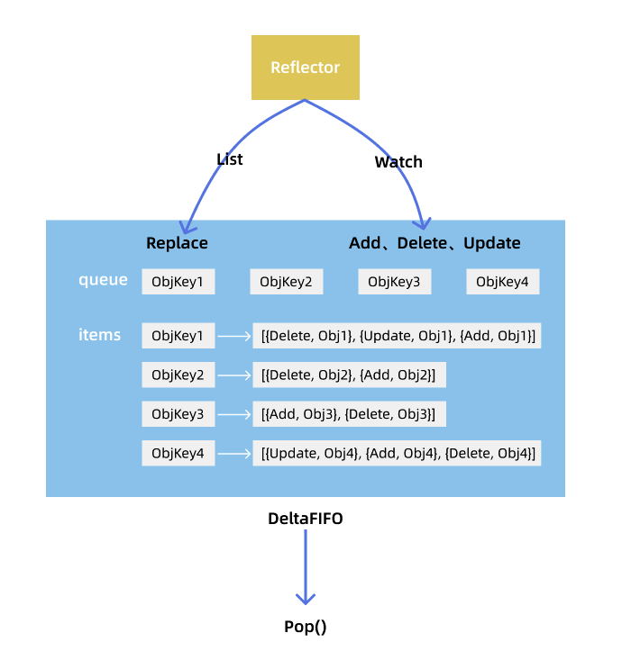
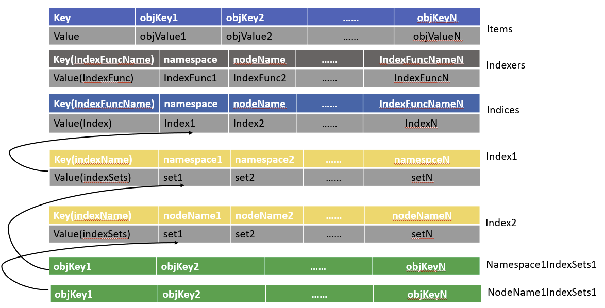

# client-go 中的 informer 源码分析

本文将以图文并茂的方式对 client-go 中的 informer 的源码分析，其整体流程图如下所示。


## 以deployment controller为例分析其中client-go informer的用法

```go
kubeInformerFactory := kubeinformers.NewSharedInformerFactory(kubeClient, time.Second*30)
controller := NewController(
   kubeClient, exampleClient,
   kubeInformerFactory.Apps().V1().Deployments())

kubeInformerFactory.Start(stopCh)

if err = controller.Run(2, stopCh); err != nil {
   klog.Fatalf("Error running controller: %s", err.Error())
}
```

### SharedInformerFactory结构

使用sharedInformerFactory的好处：比如很多个模块都需要使用pod对象，没必要都创建一个pod informer，用factor存储每种资源的一个informer，这里的informer实现是shareIndexInformer
NewSharedInformerFactory调用了NewSharedInformerFactoryWithOptions，将返回一个sharedInformerFactory对象。

> kubeClient:clientset
> defaultResync:30s，用于初始化持有的shareIndexInformer的resyncCheckPeriod和defaultEventHandlerResyncPeriod字段

```go
type sharedInformerFactory struct {
   client           kubernetes.Interface //clientset
   namespace        string //关注的namepace，可以通过WithNamespace Option配置
   tweakListOptions internalinterfaces.TweakListOptionsFunc
   lock             sync.Mutex
   defaultResync    time.Duration //前面传过来的时间，如30s
   customResync     map[reflect.Type]time.Duration //针对每一个informer，用户配置的resync时间，通过WithCustomResyncConfig这个Option配置，否则就用指定的defaultResync

   informers map[reflect.Type]cache.SharedIndexInformer //针对每种类型资源存储一个informer，informer的类型是ShareIndexInformer
   // startedInformers is used for tracking which informers have been started.
   // This allows Start() to be called multiple times safely.
   startedInformers map[reflect.Type]bool //每个informer是否都启动了
}
```

sharedInformerFactory对象的关键方法：

#### 创建一个sharedInformerFactory

```go
func NewSharedInformerFactoryWithOptions(client kubernetes.Interface, defaultResync time.Duration, options ...SharedInformerOption) SharedInformerFactory {
   factory := &sharedInformerFactory{
      client:           client,          //clientset，对deployment资源来说，这里就可以直接使用kube clientset
      namespace:        v1.NamespaceAll, //可以看到默认是监听所有ns下的指定资源
      defaultResync:    defaultResync,   //30s
      //以下初始化map结构
      informers:        make(map[reflect.Type]cache.SharedIndexInformer),
      startedInformers: make(map[reflect.Type]bool),
      customResync:     make(map[reflect.Type]time.Duration),
   }
   return factory
}
```

#### 启动factory下的所有informer

```go
func (f *sharedInformerFactory) Start(stopCh <-chan struct{}) {
   f.lock.Lock()
   defer f.lock.Unlock()

   for informerType, informer := range f.informers {
      if !f.startedInformers[informerType] {
         //直接起gorouting调用informer的Run方法，并且标记对应的informer已经启动
         go informer.Run(stopCh)
         f.startedInformers[informerType] = true
      }
   }
}
```

#### 等待ShareIndexInformer的cache被同步

等待每一个ShareIndexInformer的cache被同步，具体怎么算同步完成呢？

- sharedInformerFactory的WaitForCacheSync将会不断调用factory持有的所有informer的HasSynced方法，直到返回true

- 而informer的HasSynced方法调用的自己持有的controller的HasSynced方法（informer结构体包含controller对象，下文会分析informer的结构）

- informer中的controller的HasSynced方法则调用的是controller持有的deltaFIFO对象的HasSynced方法

也就说sharedInformerFactory的WaitForCacheSync方法判断informer的cache是否同步，看的是informer中的deltaFIFO是否同步了，deltaFIFO的结构下文将会分析

```go
func (f *sharedInformerFactory) WaitForCacheSync(stopCh <-chan struct{}) map[reflect.Type]bool {
   //获取每一个已经启动的informer
   informers := func() map[reflect.Type]cache.SharedIndexInformer {
      f.lock.Lock()
      defer f.lock.Unlock()

      informers := map[reflect.Type]cache.SharedIndexInformer{}
      for informerType, informer := range f.informers {
         if f.startedInformers[informerType] {
            informers[informerType] = informer
         }
      }
      return informers
   }()

   res := map[reflect.Type]bool{}
   // 等待他们的cache被同步，调用的是informer的HasSynced方法
   for informType, informer := range informers {
      res[informType] = cache.WaitForCacheSync(stopCh, informer.HasSynced)
   }
   return res
}
```

#### factory为自己添加informer

只有向factory中添加informer，factory才有意义，添加完成之后，上面factory的start方法就可以启动了

> obj:如deployment{}
> newFunc:一个可以用来创建指定informer的方法，k8s为每一个内置的对象都实现了这个方法，比如创建deployment的ShareIndexInformer的方法

```go
func (f *sharedInformerFactory) InformerFor(obj runtime.Object, newFunc internalinterfaces.NewInformerFunc) cache.SharedIndexInformer {
   f.lock.Lock()
   defer f.lock.Unlock()
   //根据对象类型判断factory中是否已经有对应informer
   informerType := reflect.TypeOf(obj)
   informer, exists := f.informers[informerType]
   if exists {
      return informer
   }
   //如果factory中已经有这个对象类型的informer，就不创建了
   resyncPeriod, exists := f.customResync[informerType]
   if !exists {
      resyncPeriod = f.defaultResync
   }
   //没有就根据newFunc创建一个，并存在map中
   informer = newFunc(f.client, resyncPeriod)
   f.informers[informerType] = informer

   return informer
}
```

##### deployment的shareIndexInformer对应的newFunc的实现

client-go中已经为所有内置对象都提供了NewInformerFunc

以deployment为例，通过调用factory.Apps().V1().Deployments()即可为factory添加一个deployment对应的shareIndexInformer的实现，具体过程如下：

- 调用factory.Apps().V1().Deployments()即会调用以下Deployments方法创建deploymentInformer对象

```go
func (v *version) Deployments() DeploymentInformer {
	return &deploymentInformer{factory: v.factory, namespace: v.namespace, tweakListOptions: v.tweakListOptions}
}
```

- 只要调用了factory.Apps().V1().Deployments()返回的deploymentInformer的Informer或Lister方法，就完成了向factory中添加deployment informer

```go
//即会调用以下Deployments方法创建deploymentInformer对象具有defaultInformer、Informer、Lister方法
//可以看到创建deploymentInformer时传递了一个带索引的缓存，附带了一个namespace索引，后面可以了解带索引的缓存实现，比如可以支持查询：某个namespace下的所有pod
//用于创建对应的shareIndexInformer，该方法提供给factory的InformerFor方法
func (f *deploymentInformer) defaultInformer(client kubernetes.Interface, resyncPeriod time.Duration) cache.SharedIndexInformer {
	return NewFilteredDeploymentInformer(client, f.namespace, resyncPeriod, cache.Indexers{cache.NamespaceIndex: cache.MetaNamespaceIndexFunc}, f.tweakListOptions)
}
//向factor中添加dpeloyment的shareIndexInformer并返回
func (f *deploymentInformer) Informer() cache.SharedIndexInformer {
	return f.factory.InformerFor(&appsv1.Deployment{}, f.defaultInformer)
}
//返回dpeloyment的lister对象，该lister中持有上面创建出的shareIndexInformer的cache的引用，方便通过缓存获取对象
func (f *deploymentInformer) Lister() v1.DeploymentLister {
	return v1.NewDeploymentLister(f.Informer().GetIndexer())
}
```

- deploymentInformer的defaultInformer方法将会创建出一个shareIndexInformer

```go
// 可先看看下面的shareIndexInformer结构
func NewFilteredDeploymentInformer(client kubernetes.Interface, namespace string, resyncPeriod time.Duration, indexers cache.Indexers, tweakListOptions internalinterfaces.TweakListOptionsFunc) cache.SharedIndexInformer {
   return cache.NewSharedIndexInformer(
      //定义对象的ListWatch方法，这里直接用的是clientset中的方法
      &cache.ListWatch{
         ListFunc: func(options v1.ListOptions) (runtime.Object, error) {
            if tweakListOptions != nil {
               tweakListOptions(&options)
            }
            return client.AppsV1beta1().Deployments(namespace).List(options)
         },
         WatchFunc: func(options v1.ListOptions) (watch.Interface, error) {
            if tweakListOptions != nil {
               tweakListOptions(&options)
            }
            return client.AppsV1beta1().Deployments(namespace).Watch(options)
         },
      },
      &appsv1beta1.Deployment{},
      resyncPeriod, //创建factory是制定的时间，30s
      indexers,
   )
}
```

### shareIndexInformer结构

> indexer：底层缓存，其实就是一个map记录对象，再通过一些其他map在插入删除对象是根据索引函数维护索引key如ns与对象pod的关系
> controller：informer内部的一个controller，这个controller包含reflector：根据用户定义的ListWatch方法获取对象并更新增量队列DeltaFIFO
> processor：知道如何处理DeltaFIFO队列中的对象，实现是sharedProcessor{}
> listerWatcher：知道如何list对象和watch对象的方法
> objectType：deployment{}
> resyncCheckPeriod: 给自己的controller的reflector每隔多少s<尝试>调用listener的shouldResync方法
> defaultEventHandlerResyncPeriod：通过AddEventHandler方法给informer配置回调时如果没有配置的默认值，这个值用在processor的listener中判断是否需要进行resync，最小1s

两个字段的默认值都是来自创建factory时指定的defaultResync，当resyncPeriod < s.resyncCheckPeriod时，如果informer已经启动了才添加的EventHandler，那么调整resyncPeriod为resyncCheckPeriod，否则调整resyncCheckPeriod为resyncPeriod


```go
type sharedIndexInformer struct {
   indexer    Indexer //informer中的底层缓存cache
   controller Controller //持有reflector和deltaFIFO对象，reflector对象将会listWatch对象添加到deltaFIFO，同时更新indexer cahce，更新成功则通过sharedProcessor触发用户配置的Eventhandler

   processor             *sharedProcessor //持有一系列的listener，每个listener对应用户的EventHandler
   cacheMutationDetector MutationDetector //可以先忽略，这个对象可以用来监测local cache是否被外部直接修改

   // This block is tracked to handle late initialization of the controller
   listerWatcher ListerWatcher //deployment的listWatch方法
   objectType    runtime.Object

   // resyncCheckPeriod is how often we want the reflector's resync timer to fire so it can call
   // shouldResync to check if any of our listeners need a resync.
   resyncCheckPeriod time.Duration
   // defaultEventHandlerResyncPeriod is the default resync period for any handlers added via
   // AddEventHandler (i.e. they don't specify one and just want to use the shared informer's default
   // value).
   defaultEventHandlerResyncPeriod time.Duration
   // clock allows for testability
   clock clock.Clock

   started, stopped bool
   startedLock      sync.Mutex

   // blockDeltas gives a way to stop all event distribution so that a late event handler
   // can safely join the shared informer.
   blockDeltas sync.Mutex
}
```

sharedIndexInformer对象的关键方法：

#### sharedIndexInformer的Run方法

前面factory的start方法就是调用了这个Run方法

该方法初始化了controller对象并启动，同时调用processor.run启动所有的listener，用于回调用户配置的EventHandler

具体sharedIndexInformer中的processor中的listener是怎么添加的，看下文shareProcessor的分析

```go
func (s *sharedIndexInformer) Run(stopCh <-chan struct{}) {
   defer utilruntime.HandleCrash()
   //创建一个DeltaFIFO，用于shareIndexInformer.controller.reflector
   //可以看到这里把indexer即本地缓存传入，用来初始化deltaFIFO的knownObject字段
   fifo := NewDeltaFIFO(MetaNamespaceKeyFunc, s.indexer)
   //shareIndexInformer中的controller的配置
   cfg := &Config{
      Queue:            fifo,
      ListerWatcher:    s.listerWatcher,
      ObjectType:       s.objectType,
      FullResyncPeriod: s.resyncCheckPeriod,
      RetryOnError:     false,
      ShouldResync:     s.processor.shouldResync, // 这个shouldResync方法将被用在reflector ListAndWatch方法中判断定时时间resyncCheckPeriod到了之后该不该进行resync动作
      //一个知道如何处理从informer中的controller中的deltaFIFO pop出来的对象的方法
      Process: s.HandleDeltas,
   }

   func() {
      s.startedLock.Lock()
      defer s.startedLock.Unlock()
      // 这里New一个具体的controller
      s.controller = New(cfg)
      s.controller.(*controller).clock = s.clock
      s.started = true
   }()

   // Separate stop channel because Processor should be stopped strictly after controller
   processorStopCh := make(chan struct{})
   var wg wait.Group
   defer wg.Wait()              // Wait for Processor to stop
   defer close(processorStopCh) // Tell Processor to stop
   // 调用processor.run启动所有的listener，回调用户配置的EventHandler
   wg.StartWithChannel(processorStopCh, s.processor.run)

   // 启动controller
   s.controller.Run(stopCh)
}
```

#### 为shareIndexInformer创建controller

创建Controller的New方法会生成一个controller对象，只初始化controller的config成员，controller的reflector成员是在Run的时候初始化：

- 通过执行reflector.Run方法启动reflector，开启对指定对象的listAndWatch过程，获取的对象将添加到reflector的deltaFIFO中

- 通过不断执行processLoop方法，从DeltaFIFO pop出对象，再调用reflector的Process（就是shareIndexInformer的HandleDeltas方法）处理

```go
func New(c *Config) Controller {
   ctlr := &controller{
      config: *c,
      clock:  &clock.RealClock{},
   }
   return ctlr
}
//更多字段的配置是在Run的时候
func (c *controller) Run(stopCh <-chan struct{}) {
   // 使用config创建一个Reflector
   r := NewReflector(
      c.config.ListerWatcher, // deployment的listWatch方法
      c.config.ObjectType, // deployment{}
      c.config.Queue, //DeltaFIFO
      c.config.FullResyncPeriod, //30s
   )
   r.ShouldResync = c.config.ShouldResync //来自sharedProcessor的方法
   r.clock = c.clock

   c.reflectorMutex.Lock()
   c.reflector = r
   c.reflectorMutex.Unlock()

   var wg wait.Group
   defer wg.Wait()
   // 启动reflector，执行ListWatch方法
   wg.StartWithChannel(stopCh, r.Run)
   // 不断执行processLoop，这个方法其实就是从DeltaFIFO pop出对象，再调用reflector的Process（其实是shareIndexInformer的HandleDeltas方法）处理
   wait.Until(c.processLoop, time.Second, stopCh)
}
```

#### controller的processLoop方法

不断执行processLoop，这个方法其实就是从DeltaFIFO pop出对象，再调用reflector的Process（其实是shareIndexInformer的HandleDeltas方法）处理

```
func (c *controller) processLoop() {
   for {
      obj, err := c.config.Queue.Pop(PopProcessFunc(c.config.Process))
      if err != nil {
         if err == ErrFIFOClosed {
            return
         }
         if c.config.RetryOnError {
            // This is the safe way to re-enqueue.
            c.config.Queue.AddIfNotPresent(obj)
         }
      }
   }
}
```

#### deltaFIFO pop出来的对象处理逻辑

先看看controller怎么处理DeltaFIFO中的对象，需要注意DeltaFIFO中的Deltas的结构，是一个slice，保存同一个对象的所有增量事件



sharedIndexInformer的HandleDeltas处理从deltaFIFO pod出来的增量时，先尝试更新到本地缓存cache，更新成功的话会调用processor.distribute方法向processor中的listener添加notification，listener启动之后会不断获取notification回调用户的EventHandler方法

- Sync: reflector list到对象时Replace到deltaFIFO时daltaType为Sync或者resync把localstrore中的对象加回到deltaFIFO
- Added、Updated: reflector watch到对象时根据watch event type是Add还是Modify对应deltaType为Added或者Updated
- Deleted: reflector watch到对象的watch event type是Delete或者re-list Replace到deltaFIFO时local store多出的对象以Delete的方式加入deltaFIFO
```go
func (s *sharedIndexInformer) HandleDeltas(obj interface{}) error {
   s.blockDeltas.Lock()
   defer s.blockDeltas.Unlock()

   // from oldest to newest
   for _, d := range obj.(Deltas) {
      switch d.Type {
      case Sync, Added, Updated:
         isSync := d.Type == Sync
         // 对象先通过shareIndexInformer中的indexer更新到缓存
         if old, exists, err := s.indexer.Get(d.Object); err == nil && exists {
            if err := s.indexer.Update(d.Object); err != nil {
               return err
            }
            // 如果informer的本地缓存更新成功，那么就调用shareProcess分发对象给用户自定义controller处理
            // 可以看到，对EventHandler来说，本地缓存已经存在该对象就认为是update
            s.processor.distribute(updateNotification{oldObj: old, newObj: d.Object}, isSync)
         } else {
            if err := s.indexer.Add(d.Object); err != nil {
               return err
            }
            s.processor.distribute(addNotification{newObj: d.Object}, isSync)
         }
      case Deleted:
         if err := s.indexer.Delete(d.Object); err != nil {
            return err
         }
         s.processor.distribute(deleteNotification{oldObj: d.Object}, false)
      }
   }
   return nil
}
```


前面描述了shareIndexInformer内部如何从deltaFIFO取出对象更新缓存并通过processor回调用户的EventHandler，那deltaFIFO中的增量事件是怎么加进入的呢？先看看shareIndexInformer中controller中的reflector实现

#### reflector.run发起ListWatch

reflector.run将会调用指定资源的ListAndWatch方法，注意这里什么时候可能发生re-list或者re-watch：因为是通过wait.Util不断调用ListAndWatch方法，所以只要该方法return了，那么就会发生re-list，watch过程则被嵌套在for循环中

- 以ResourceVersion=0开始首次的List操作获取指定资源的全量对象，并通过reflector的syncWith方法将所有对象批量插入deltaFIFO
- List完成之后将会更新ResourceVersion用户Watch操作，通过reflector的watchHandler方法把watch到的增量对象加入到deltaFIFO

```go
func (r *Reflector) ListAndWatch(stopCh <-chan struct{}) error {
   // 以版本号ResourceVersion=0开始首次list
   options := metav1.ListOptions{ResourceVersion: "0"}

   if err := func() error {
      initTrace := trace.New("Reflector ListAndWatch", trace.Field{"name", r.name})
      var list runtime.Object
      go func() {
         // 获取list的结果
         list, err = pager.List(context.Background(), options)
         close(listCh)
      }()
      listMetaInterface, err := meta.ListAccessor(list)
      // 根据结果更新版本号，用于接下来的watch
      resourceVersion = listMetaInterface.GetResourceVersion()
      items, err := meta.ExtractList(list)
      // 这里的syncWith是把首次list到的结果通过DeltaFIFO的Replce方法批量添加到队列
      // 队列提供了Resync方法用于判断Replace批量插入的对象是否都pop出去了，factory/informer的WaitForCacheSync就是调用了DeltaFIFO的的Resync方法
      if err := r.syncWith(items, resourceVersion); err != nil {
         return fmt.Errorf("%s: Unable to sync list result: %v", r.name, err)
      }
      r.setLastSyncResourceVersion(resourceVersion)
   }(); err != nil {
      return err
   }

  
  // 以list对象中获取的ResourceVersion不断watch
   for {
      start := r.clock.Now()
      w, err := r.listerWatcher.Watch(options)
      // watchhandler处理watch到的数据，即把对象根据watch.type增加到DeltaFIFO中
      if err := r.watchHandler(start, w, &resourceVersion, resyncerrc, stopCh); err != nil {
         if err != errorStopRequested {
            switch {
            case apierrs.IsResourceExpired(err):
               klog.V(4).Infof("%s: watch of %v ended with: %v", r.name, r.expectedType, err)
            default:
               klog.Warningf("%s: watch of %v ended with: %v", r.name, r.expectedType, err)
            }
         }
         return nil
      }
   }
}
```

##### list出的对象批量插入deltaFIFO

> 可以看到是syncWith方法是通过调用deltaFIFO的Replace实现批量插入，具体实现见下文中deltaFIFO的实现描述

```go
func (r *Reflector) syncWith(items []runtime.Object, resourceVersion string) error {
	found := make([]interface{}, 0, len(items))
	for _, item := range items {
		found = append(found, item)
	}
	return r.store.Replace(found, resourceVersion)
}
```

##### watch出的增量对象插入到deltaFIFO

> watch到的对象直接根据watch到的事件类型eventType更新store（即deltaFIFO），注意这个event是api直接返回的，watch event type可能是Added、Modifyed、Deleted

```go
// watchHandler watches w and keeps *resourceVersion up to date.
func (r *Reflector) watchHandler(start time.Time, w watch.Interface, resourceVersion *string, errc chan error, stopCh <-chan struct{}) error {
	for {
		select {
		case <-stopCh:
			return errorStopRequested
		case err := <-errc:
			return err
		case event, ok := <-w.ResultChan():
			switch event.Type {
			case watch.Added:
				err := r.store.Add(event.Object)
			case watch.Modified:
				err := r.store.Update(event.Object)
			case watch.Deleted:
				err := r.store.Delete(event.Object)
			case watch.Bookmark:
				// A `Bookmark` means watch has synced here, just update the resourceVersion
			default:
				utilruntime.HandleError(fmt.Errorf("%s: unable to understand watch event %#v", r.name, event))
			}
			*resourceVersion = newResourceVersion
			r.setLastSyncResourceVersion(newResourceVersion)
		}
	}
}
```

##### 定时触发resync

在ListAndWatch中还起了一个gorouting定时的进行resync动作

```go
	resyncerrc := make(chan error, 1)
	cancelCh := make(chan struct{})
	defer close(cancelCh)
	go func() {
    //获取一个定时channel，定时的时间是创建informer factory时传入的resyncPeriod
		resyncCh, cleanup := r.resyncChan()
		defer func() {
			cleanup() // Call the last one written into cleanup
		}()
		for {
			select {
			case <-resyncCh:
			case <-stopCh:
				return
			case <-cancelCh:
				return
			}
			if r.ShouldResync == nil || r.ShouldResync() {
				klog.V(4).Infof("%s: forcing resync", r.name)
				if err := r.store.Resync(); err != nil {
					resyncerrc <- err
					return
				}
			}
			cleanup()
			resyncCh, cleanup = r.resyncChan()
		}
	}()
```

调用deltaFIFO的Resync方法，把底层缓存的对象全部重新添加到deltaFIFO中

```go
func (f *DeltaFIFO) Resync() error {
   f.lock.Lock()
   defer f.lock.Unlock()

   if f.knownObjects == nil {
      return nil
   }

   keys := f.knownObjects.ListKeys()
   for _, k := range keys {
      if err := f.syncKeyLocked(k); err != nil {
         return err
      }
   }
   return nil
}
```

需要注意的是，在添加对象到deltaFIFO时会检查该队列中有没有增量没有处理完的，如果有则忽略这个对象的此次resync

```go
func (f *DeltaFIFO) syncKeyLocked(key string) error {
   obj, exists, err := f.knownObjects.GetByKey(key)
   if err != nil {
      klog.Errorf("Unexpected error %v during lookup of key %v, unable to queue object for sync", err, key)
      return nil
   } else if !exists {
      klog.Infof("Key %v does not exist in known objects store, unable to queue object for sync", key)
      return nil
   }

   // If we are doing Resync() and there is already an event queued for that object,
   // we ignore the Resync for it. This is to avoid the race, in which the resync
   // comes with the previous value of object (since queueing an event for the object
   // doesn't trigger changing the underlying store <knownObjects>.
   id, err := f.KeyOf(obj)
   if err != nil {
      return KeyError{obj, err}
   }
   // 如果deltaFIFO中该对象还有增量没有处理，则忽略以避免冲突，原因如上面注释：在同一个对象的增量列表中，排在后面的增量的object相比前面的增量应该更新才是合理的
   if len(f.items[id]) > 0 {
      return nil
   }
  // 跟deltaFIFO的Replace方法一样，都是添加一个Sync类型的增量
   if err := f.queueActionLocked(Sync, obj); err != nil {
      return fmt.Errorf("couldn't queue object: %v", err)
   }
   return nil
}
```

### 底层缓存的实现

shareIndexInformer中带有一个缓存indexer，是一个支持索引的map，优点是支持快速查询，参考类图，我们可以知道：

- Indexer、Queue接口和cache结构体都实现了顶层的Store接口
- cache结构体持有threadSafeStore对象，该结构体是线程安全的，具备索引查找能力的map

threadSafeMap的结构如下：

> items:存储具体的对象，比如key为ns/podName，value为pod{}
> Indexers:一个map[string]IndexFunc结构，其中key为索引的名称，如’namespace’字符串，value则是一个具体的索引函数
> Indices:一个map[string]Index结构，其中key也是索引的名称，value是一个map[string]sets.String结构，其中key是具体的namespace，如default这个ns，vlaue则是这个ns下的按照索引函数求出来的值的集合，比如default这个ns下的所有pod对象名称

通过在向items插入对象的过程中，遍历所有的Indexers中的索引函数，根据索引函数存储索引key到value的集合关系，以下图式结构可以很好的说明



```go
type threadSafeMap struct {
   lock  sync.RWMutex
   items map[string]interface{}

   // indexers maps a name to an IndexFunc
   indexers Indexers
   // indices maps a name to an Index
   indices Indices
}

// Indexers maps a name to a IndexFunc
type Indexers map[string]IndexFunc

// Indices maps a name to an Index
type Indices map[string]Index
type Index map[string]sets.String
```

#### 缓存中增加对象

以向上面的结构中增加一个对象为例

> 所谓带索引的缓存，其实就是在crud对象的时候，维护对应的索引结构

```go
func (c *threadSafeMap) Add(key string, obj interface{}) {
   c.lock.Lock()
   defer c.lock.Unlock()
   oldObject := c.items[key]
   //存储对象
   c.items[key] = obj
   //更新索引
   c.updateIndices(oldObject, obj, key)
}

// updateIndices modifies the objects location in the managed indexes, if this is an update, you must provide an oldObj
// updateIndices must be called from a function that already has a lock on the cache
func (c *threadSafeMap) updateIndices(oldObj interface{}, newObj interface{}, key string) {
   // if we got an old object, we need to remove it before we add it again
   if oldObj != nil {
      // 这是一个更新操作，先删除原对象的索引记录
      c.deleteFromIndices(oldObj, key)
   }
   // 枚举所有添加的索引函数
   for name, indexFunc := range c.indexers {
      //根据索引函数计算obj对应的
      indexValues, err := indexFunc(newObj)
      if err != nil {
         panic(fmt.Errorf("unable to calculate an index entry for key %q on index %q: %v", key, name, err))
      }
      index := c.indices[name]
      if index == nil {
         index = Index{}
         c.indices[name] = index
      }
      //索引函数计算出多个value，也可能是一个，比如pod的ns就只有一个值，pod的label可能就有多个值
      for _, indexValue := range indexValues {
         //比如namespace索引，根据indexValue=default，获取default对应的ji he再把当前对象插入
         set := index[indexValue]
         if set == nil {
            set = sets.String{}
            index[indexValue] = set
         }
         set.Insert(key)
      }
   }
}
```

#### MetaNamespaceIndexFunc索引函数

一个典型的索引函数MetaNamespaceIndexFunc，方便查询时可以根据namespace获取该namespace下的所有对象

```go
// MetaNamespaceIndexFunc is a default index function that indexes based on an object's namespace
func MetaNamespaceIndexFunc(obj interface{}) ([]string, error) {
   meta, err := meta.Accessor(obj)
   if err != nil {
      return []string{""}, fmt.Errorf("object has no meta: %v", err)
   }
   return []string{meta.GetNamespace()}, nil
}
```

#### Index方法利用索引查找对象

提供利用索引来查询的能力，Index方法可以根据索引名称和对象，查询所有的关联对象

> 例如通过
>
> Index(“namespace”, &metav1.ObjectMeta{Namespace: namespace})
>
> 获取指定ns下的所有对象，具体可以参考tools/cache/listers.go#ListAllByNamespace

```go
func (c *threadSafeMap) Index(indexName string, obj interface{}) ([]interface{}, error) {
   c.lock.RLock()
   defer c.lock.RUnlock()

   indexFunc := c.indexers[indexName]
   if indexFunc == nil {
      return nil, fmt.Errorf("Index with name %s does not exist", indexName)
   }

   indexKeys, err := indexFunc(obj)
   if err != nil {
      return nil, err
   }
   index := c.indices[indexName]

   var returnKeySet sets.String
   //例如namespace索引
   if len(indexKeys) == 1 {
      // In majority of cases, there is exactly one value matching.
      // Optimize the most common path - deduping is not needed here.
      returnKeySet = index[indexKeys[0]]
   //例如label索引
   } else {
      // Need to de-dupe the return list.
      // Since multiple keys are allowed, this can happen.
      returnKeySet = sets.String{}
      for _, indexKey := range indexKeys {
         for key := range index[indexKey] {
            returnKeySet.Insert(key)
         }
      }
   }

   list := make([]interface{}, 0, returnKeySet.Len())
   for absoluteKey := range returnKeySet {
      list = append(list, c.items[absoluteKey])
   }
   return list, nil
}
```

### deltaFIFO实现

shareIndexInformer.controller.reflector中的deltaFIFO实现

> items：记录deltaFIFO中的对象，注意map的value是一个Delta slice
> queue：记录上面items中的key
> populated：队列中是否填充过数据，LIST时调用Replace或调用Delete/Add/Update都会置为true
> initialPopulationCount：前面首次List的时候获取到的数据就会调用Replace批量增加到队列，同时设置initialPopulationCount为List到的对象数量，每次Pop出来会减一，由于判断是否把首次批量插入的数据都POP出去了
> keyFunc：知道怎么从对象中解析出对应key的函数
> knownObjects：这个其实就是shareIndexInformer中的indexer底层缓存的引用，可以认为和etcd中的数据一致

```go
type DeltaFIFO struct {
   // lock/cond protects access to 'items' and 'queue'.
   lock sync.RWMutex
   cond sync.Cond

   // We depend on the property that items in the set are in
   // the queue and vice versa, and that all Deltas in this
   // map have at least one Delta.
   // 这里的Deltas是[]Delta类型
   items map[string]Deltas
   queue []string

   // populated is true if the first batch of items inserted by Replace() has been populated
   // or Delete/Add/Update was called first.
   populated bool
   // initialPopulationCount is the number of items inserted by the first call of Replace()
   initialPopulationCount int

   // keyFunc is used to make the key used for queued item
   // insertion and retrieval, and should be deterministic.
   keyFunc KeyFunc

   // knownObjects list keys that are "known", for the
   // purpose of figuring out which items have been deleted
   // when Replace() or Delete() is called.
   // 这个其实就是shareIndexInformer中的indexer底层缓存的引用
   knownObjects KeyListerGetter

   // Indication the queue is closed.
   // Used to indicate a queue is closed so a control loop can exit when a queue is empty.
   // Currently, not used to gate any of CRED operations.
   closed     bool
   closedLock sync.Mutex
}

type Delta struct {
   Type   DeltaType
   Object interface{}
}

// Deltas is a list of one or more 'Delta's to an individual object.
// The oldest delta is at index 0, the newest delta is the last one.
type Deltas []Delta
```

DeltaFIFO关键的方法：

#### 向deltaFIFO批量插入对象

批量向队列插入数据的方法，注意knownObjects是本地缓存indexer的引用

这里会更新deltaFIFO的initialPopulationCount为Replace list的对象总数加上list中相比knownObjects多出的对象数量。
因为Replace方法可能是reflector发生re-list的时候再次调用，这个时候就会出现knownObjects中存在的对象不在Replace list的情况（比如watch的delete事件丢失了），这个时候是把这些对象筛选出来，封装成DeletedFinalStateUnknown对象以Delete type类型再次加入到deltaFIFO中，这样最终从detaFIFO处理这个DeletedFinalStateUnknown 增量时就可以更新本地缓存并且触发reconcile。
因为这个对象最终的结构确实找不到了，所以只能用knownObjects里面的记录来封装，所以叫做FinalStateUnknown。


```go
func (f *DeltaFIFO) Replace(list []interface{}, resourceVersion string) error {
   f.lock.Lock()
   defer f.lock.Unlock()
   keys := make(sets.String, len(list))

   for _, item := range list {
      key, err := f.KeyOf(item)
      if err != nil {
         return KeyError{item, err}
      }
      keys.Insert(key)
      // 通过Replace添加到队列的Delta type都是Sync
      if err := f.queueActionLocked(Sync, item); err != nil {
         return fmt.Errorf("couldn't enqueue object: %v", err)
      }
   }

// 底层的缓存不应该会是nil
   if f.knownObjects == nil {
      // Do deletion detection against our own list.
      queuedDeletions := 0
      for k, oldItem := range f.items {
         if keys.Has(k) {
            continue
         }
         // 当knownObjects为空时，如果item中存在对象不在新来的list中，那么该对象被认为要被删除
         var deletedObj interface{}
         if n := oldItem.Newest(); n != nil {
            deletedObj = n.Object
         }
         queuedDeletions++
         if err := f.queueActionLocked(Deleted, DeletedFinalStateUnknown{k, deletedObj}); err != nil {
            return err
         }
      }

      if !f.populated {
         f.populated = true
         // While there shouldn't be any queued deletions in the initial
         // population of the queue, it's better to be on the safe side.
         f.initialPopulationCount = len(list) + queuedDeletions
      }

      return nil
   }

   // Detect deletions not already in the queue.
   knownKeys := f.knownObjects.ListKeys()
   // 记录这次替换相当于在缓存中删除多少对象
   queuedDeletions := 0
   // 枚举每一个缓存对象的key，看看在不在即将用来替换delta队列的list中
   for _, k := range knownKeys {
      if keys.Has(k) {
         continue
      }
      // 对象在缓存，但不在list中，说明替换操作完成后，这个对象相当于被删除了
     // 注意这里的所谓替换，对deltaFIFO来说，是给队列中的对应对象增加一个delete增量queueActionLocked(Deleted, DeletedFinalStateUnknown{k, deletedObj})
   // 真正删除缓存是在shareIndexInformer中的HandleDeltas中
      deletedObj, exists, err := f.knownObjects.GetByKey(k)
      if err != nil {
         deletedObj = nil
         klog.Errorf("Unexpected error %v during lookup of key %v, placing DeleteFinalStateUnknown marker without object", err, k)
      } else if !exists {
         deletedObj = nil
         klog.Infof("Key %v does not exist in known objects store, placing DeleteFinalStateUnknown marker without object", k)
      }
      queuedDeletions++
      if err := f.queueActionLocked(Deleted, DeletedFinalStateUnknown{k, deletedObj}); err != nil {
         return err
      }
   }
     // 设置f.initialPopulationCount，大于0表示首次插入的对象还没有全部pop出去
   if !f.populated {
      f.populated = true
      f.initialPopulationCount = len(list) + queuedDeletions
   }

   return nil
}
```


#### 从deltaFIFO pop出对象

从队列中Pop出一个方法，并由函数process来处理，就是shareIndexInformer的HandleDeltas

> 每次从DeltaFIFO Pop出一个对象，f.initialPopulationCount会减一，初始值为List时的对象数量
> 前面的Informer的WaitForCacheSync最终就是调用了这个HasSynced方法
>
> 因为前面Pop出对象的处理方法HandleDeltas中，会先调用indexder把对象存起来，所以这个HasSynced相当于判断本地缓存是否首次同步完成

```go
func (f *DeltaFIFO) Pop(process PopProcessFunc) (interface{}, error) {
   f.lock.Lock()
   defer f.lock.Unlock()
   for {
      for len(f.queue) == 0 {
         // When the queue is empty, invocation of Pop() is blocked until new item is enqueued.
         // When Close() is called, the f.closed is set and the condition is broadcasted.
         // Which causes this loop to continue and return from the Pop().
         if f.IsClosed() {
            return nil, ErrFIFOClosed
         }

         f.cond.Wait()
      }
      //取出队首元素
      id := f.queue[0]
      //去掉队首元素
      f.queue = f.queue[1:]
      //首次填充的对象数减一
      if f.initialPopulationCount > 0 {
         f.initialPopulationCount--
      }
      item, ok := f.items[id]
      if !ok {
         // Item may have been deleted subsequently.
         continue
      }
      delete(f.items, id)
      //处理增量对象
      err := process(item)
      // 如果没有处理成功，那么就会重新加到deltaFIFO队列中
      if e, ok := err.(ErrRequeue); ok {
         f.addIfNotPresent(id, item)
         err = e.Err
      }
      // Don't need to copyDeltas here, because we're transferring
      // ownership to the caller.
      return item, err
   }
}
```


#### deltaFIFO是否同步完成

对应到前面遗留的没有串起来的问题：factory的WaitForCacheSync是如何等待缓存同步完成：

> factory的WaitForCacheSync方法调用informer的HasSync方法，继而调用deltaFIFO的HasSync方法，也就是判断从reflector list到的数据是否pop完

```go
func (f *DeltaFIFO) HasSynced() bool {
   f.lock.Lock()
   defer f.lock.Unlock()
   return f.populated && f.initialPopulationCount == 0
}
```

#### deltaFIFO增加一个对象

```go
//在队列中给指定的对象append一个Delta
func (f *DeltaFIFO) queueActionLocked(actionType DeltaType, obj interface{}) error {
   id, err := f.KeyOf(obj)
   if err != nil {
      return KeyError{obj, err}
   }

   newDeltas := append(f.items[id], Delta{actionType, obj})
   newDeltas = dedupDeltas(newDeltas)

   if len(newDeltas) > 0 {
      if _, exists := f.items[id]; !exists {
         f.queue = append(f.queue, id)
      }
      f.items[id] = newDeltas
      f.cond.Broadcast()
   } else {
      // We need to remove this from our map (extra items in the queue are
      // ignored if they are not in the map).
      delete(f.items, id)
   }
   return nil
}
```

#### Resync方法

> 所谓的resync，其实就是把knownObjects即缓存中的对象全部再通过queueActionLocked(Sync, obj)加到队列

```go
func (f *DeltaFIFO) Resync() error {
   f.lock.Lock()
   defer f.lock.Unlock()

   if f.knownObjects == nil {
      return nil
   }

   keys := f.knownObjects.ListKeys()
   for _, k := range keys {
      if err := f.syncKeyLocked(k); err != nil {
         return err
      }
   }
   return nil
}

func (f *DeltaFIFO) syncKeyLocked(key string) error {
   obj, exists, err := f.knownObjects.GetByKey(key)

   // If we are doing Resync() and there is already an event queued for that object,
   // we ignore the Resync for it. This is to avoid the race, in which the resync
   // comes with the previous value of object (since queueing an event for the object
   // doesn't trigger changing the underlying store <knownObjects>.
   id, err := f.KeyOf(obj)
   if err != nil {
      return KeyError{obj, err}
   }
   // 如上述注释，在resync时，如果deltaFIFO中该对象还存在其他delta没处理，那么忽略这次的resync
   // 因为调用queueActionLocked是增加delta是通过append的，且处理对象的增量delta时，是从oldest到newdest的
   // 所以如果某个对象还存在增量没处理，再append就可能导致后处理的delta是旧的对象
   if len(f.items[id]) > 0 {
      return nil
   }

   if err := f.queueActionLocked(Sync, obj); err != nil {
      return fmt.Errorf("couldn't queue object: %v", err)
   }
   return nil
}
```

### 

### shareProcess的实现

shareIndexInformer中具有一个shareProcess结构，用于分发deltaFIFO的对象，调用用户配置的EventHandler处理

可以看到shareIndexInformer中的process直接通过&sharedProcessor{clock: realClock}初始化
如下为sharedProcessor结构：

> listenersStarted：listeners中包含的listener是否都已经启动了
> listeners：已添加的listener列表，用来处理watch到的数据
> syncingListeners：已添加的listener列表，用来处理list到的数据

```go
// NewSharedIndexInformer creates a new instance for the listwatcher.
func NewSharedIndexInformer(lw ListerWatcher, objType runtime.Object, defaultEventHandlerResyncPeriod time.Duration, indexers Indexers) SharedIndexInformer {
   realClock := &clock.RealClock{}
   sharedIndexInformer := &sharedIndexInformer{
      processor:                       &sharedProcessor{clock: realClock},
      indexer:                         NewIndexer(DeletionHandlingMetaNamespaceKeyFunc, indexers),
      listerWatcher:                   lw,
      objectType:                      objType,
      resyncCheckPeriod:               defaultEventHandlerResyncPeriod,
      defaultEventHandlerResyncPeriod: defaultEventHandlerResyncPeriod,
      cacheMutationDetector:           NewCacheMutationDetector(fmt.Sprintf("%T", objType)),
      clock:                           realClock,
   }
   return sharedIndexInformer
}

type sharedProcessor struct {
   listenersStarted bool
   listenersLock    sync.RWMutex
   listeners        []*processorListener
   syncingListeners []*processorListener
   clock            clock.Clock
   wg               wait.Group
}
```

#### 为sharedProcessor添加listener

在sharedProcessor中添加一个listener

```go
func (p *sharedProcessor) addListenerLocked(listener *processorListener) {
   // 同时添加到listeners和syncingListeners列表，但其实添加的是同一个对象的引用
   p.listeners = append(p.listeners, listener)
   p.syncingListeners = append(p.syncingListeners, listener)
}
```

#### 启动sharedProcessor中的的listener

sharedProcessor启动所有的listener
是通过调用listener.run和listener.pop来启动一个listener，两个方法具体作用看下文processorListener说明

```go
func (p *sharedProcessor) run(stopCh <-chan struct{}) {
   func() {
      p.listenersLock.RLock()
      defer p.listenersLock.RUnlock()
      for _, listener := range p.listeners {
         p.wg.Start(listener.run)
         p.wg.Start(listener.pop)
      }
      p.listenersStarted = true
   }()
   <-stopCh
   p.listenersLock.RLock()
   defer p.listenersLock.RUnlock()
   for _, listener := range p.listeners {
      close(listener.addCh) // Tell .pop() to stop. .pop() will tell .run() to stop
   }
   p.wg.Wait() // Wait for all .pop() and .run() to stop
}
```

#### sharedProcessor分发对象

distribute方法是在前面介绍[deltaFIFO pop出来的对象处理逻辑]时提到的，把notification事件添加到listener中，listener如何pop出notification回调EventHandler见下文listener分析

```go
func (p *sharedProcessor) distribute(obj interface{}, sync bool) {
   p.listenersLock.RLock()
   defer p.listenersLock.RUnlock()
   // 如果是通过reflector list Replace到deltaFIFO的对象，那么distribute到syncingListeners
   if sync {
      for _, listener := range p.syncingListeners {
         listener.add(obj)
      }
   } else {
      for _, listener := range p.listeners {
         listener.add(obj)
      }
   }
}
```

### processorListener结构

sharedProcessor中的listener具体的类型：运转逻辑就是把用户通过addCh增加的事件发送到nextCh供run方法取出回调Eventhandler，因为addCh和nectCh都是无缓冲channel，所以中间引入ringBuffer做缓存

> processorListener是sharedIndexInformer调用AddEventHandler时创建并添加到sharedProcess
> 对于一个Informer，可以多次调用AddEventHandler来添加多个listener，但我们的一般的使用场景应该都只会添加一个，作用都是类似enqueue到workQueue
> addCh和nextCh：都将被初始化为无缓冲的chan
> pendingNotifications：一个无容量限制的环形缓冲区，可以理解为可以无限存储的队列，用来存储deltaFIFO分发过来的消息

```go
type processorListener struct {
   nextCh chan interface{}
   addCh  chan interface{}

   handler ResourceEventHandler

   // pendingNotifications is an unbounded ring buffer that holds all notifications not yet distributed.
   // There is one per listener, but a failing/stalled listener will have infinite pendingNotifications
   // added until we OOM.
   // TODO: This is no worse than before, since reflectors were backed by unbounded DeltaFIFOs, but
   // we should try to do something better.
   pendingNotifications buffer.RingGrowing

   // requestedResyncPeriod is how frequently the listener wants a full resync from the shared informer
   requestedResyncPeriod time.Duration
   // resyncPeriod is how frequently the listener wants a full resync from the shared informer. This
   // value may differ from requestedResyncPeriod if the shared informer adjusts it to align with the
   // informer's overall resync check period.
   resyncPeriod time.Duration
   // nextResync is the earliest time the listener should get a full resync
   nextResync time.Time
   // resyncLock guards access to resyncPeriod and nextResync
   resyncLock sync.Mutex
}
```

#### 在listener中添加事件

shareProcessor中的distribute方法调用的是listener的add来向addCh增加消息，注意addCh是无缓冲的chan，依赖pop不断从addCh取出数据

```go
func (p *processorListener) add(notification interface{}) {
   p.addCh <- notification
}
```

#### 判断是否需要resync

前面reflector中会调用这个shouldResync方法根据每个listener的resyncPeriod判断是否需要resync

```go
// shouldResync queries every listener to determine if any of them need a resync, based on each
// listener's resyncPeriod.
func (p *sharedProcessor) shouldResync() bool {
   p.listenersLock.Lock()
   defer p.listenersLock.Unlock()

   p.syncingListeners = []*processorListener{}

   resyncNeeded := false
   now := p.clock.Now()
   for _, listener := range p.listeners {
      // need to loop through all the listeners to see if they need to resync so we can prepare any
      // listeners that are going to be resyncing.
      if listener.shouldResync(now) {
         resyncNeeded = true
         p.syncingListeners = append(p.syncingListeners, listener)
         listener.determineNextResync(now)
      }
   }
   return resyncNeeded
}
```

#### listener的run方法回调EventHandler

listener的run方法不断的从nextCh中获取notification，并根据notification的类型来调用用户自定的EventHandler

```go
func (p *processorListener) run() {
   // this call blocks until the channel is closed.  When a panic happens during the notification
   // we will catch it, **the offending item will be skipped!**, and after a short delay (one second)
   // the next notification will be attempted.  This is usually better than the alternative of never
   // delivering again.
   stopCh := make(chan struct{})
   wait.Until(func() {
      // this gives us a few quick retries before a long pause and then a few more quick retries
      err := wait.ExponentialBackoff(retry.DefaultRetry, func() (bool, error) {
         for next := range p.nextCh {
            switch notification := next.(type) {
            case updateNotification:
               p.handler.OnUpdate(notification.oldObj, notification.newObj)
            case addNotification:
               p.handler.OnAdd(notification.newObj)
            case deleteNotification:
               p.handler.OnDelete(notification.oldObj)
            default:
               utilruntime.HandleError(fmt.Errorf("unrecognized notification: %T", next))
            }
         }
         // the only way to get here is if the p.nextCh is empty and closed
         return true, nil
      })

      // the only way to get here is if the p.nextCh is empty and closed
      if err == nil {
         close(stopCh)
      }
   }, 1*time.Minute, stopCh)
}
```

#### addCh到nextCh的对象传递

listener中pop方法的逻辑相对比较绕，最终目的就是把分发到addCh的数据从nextCh或者pendingNotifications取出来

> notification变量记录下一次要被放到p.nextCh供pop方法取出的对象
> 开始seletct时必然只有case2可能ready
> Case2做的事可以描述为：从p.addCh获取对象，如果临时变量notification还是nil，说明需要往notification赋值，供case1推送到p.nextCh
> 如果notification已经有值了，那个当前从p.addCh取出的值要先放到环形缓冲区中

> Case1做的事可以描述为：看看能不能把临时变量notification推送到nextCh（nil chan会阻塞在读写操作上），可以写的话，说明这个nextCh是p.nextCh，写成功之后，需要从缓存中取出一个对象放到notification为下次执行这个case做准备，如果缓存是空的，通过把nextCh chan设置为nil来禁用case1，以便case2位notification赋值

```go
func (p *processorListener) pop() {
   defer utilruntime.HandleCrash()
   defer close(p.nextCh) // Tell .run() to stop

   //nextCh没有利用make初始化，将阻塞在读和写上
   var nextCh chan<- interface{}
   //notification初始值为nil
   var notification interface{}
   for {
      select {
      // 执行这个case，相当于给p.nextCh添加来自p.addCh的内容
      case nextCh <- notification:
         // Notification dispatched
         var ok bool
         //前面的notification已经加到p.nextCh了， 为下一次这个case再次ready做准备
         notification, ok = p.pendingNotifications.ReadOne()
         if !ok { // Nothing to pop
            nextCh = nil // Disable this select case
         }
      //第一次select只有这个case ready
      case notificationToAdd, ok := <-p.addCh:
         if !ok {
            return
         }
         if notification == nil { // No notification to pop (and pendingNotifications is empty)
            // Optimize the case - skip adding to pendingNotifications
            //为notification赋值
            notification = notificationToAdd
            //唤醒第一个case
            nextCh = p.nextCh
         } else { // There is already a notification waiting to be dispatched
            //select没有命中第一个case，那么notification就没有被消耗，那么把从p.addCh获取的对象加到缓存中
            p.pendingNotifications.WriteOne(notificationToAdd)
         }
      }
   }
}
```
