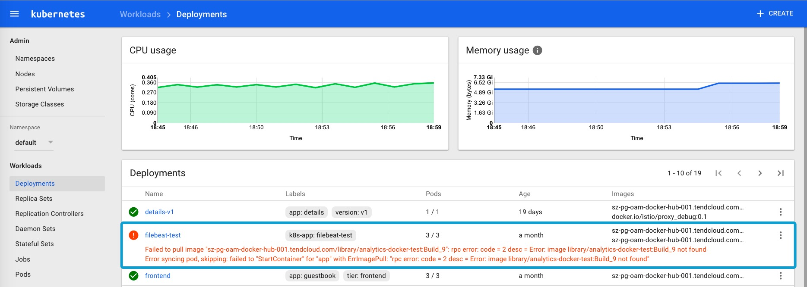

访问 kubernetes 集群有以下几种方式：

| 方式                                                         | 特点                                                         | 支持者   |
| :----------------------------------------------------------- | :----------------------------------------------------------- | :------- |
| Kubernetes dashboard                                         | 直接通过 Web UI 进行操作，简单直接，可定制化程度低           | 官方支持 |
| kubectl                                                      | 命令行操作，功能最全，但是比较复杂，适合对其进行进一步的分装，定制功能，版本适配最好 | 官方支持 |
| [client-go](https://github.com/kubernetes/client-go)         | 从 kubernetes 的代码中抽离出来的客户端包，简单易用，但需要小心区分 kubernetes 的 API 版本 | 官方支持 |
| [client-python](https://github.com/kubernetes-incubator/client-python) | python 客户端，kubernetes-incubator                          | 官方支持 |
| [Java client](https://github.com/fabric8io/kubernetes-client) | fabric8 中的一部分，kubernetes 的 java 客户端                | Red Hat  |

下面，我们基于 [client-go](https://github.com/kubernetes/client-go)，对 Deployment 升级镜像的步骤进行了定制，通过命令行传递一个 Deployment 的名字、应用容器名和新 image 名字的方式来升级。

[kubernetes-client-go-sample](https://github.com/rootsongjc/kubernetes-client-go-sample) 项目的 `main.go` 代码如下：

```go
package main

import (
	"flag"
	"fmt"
	"os"
	"path/filepath"

	"k8s.io/apimachinery/pkg/api/errors"
	metav1 "k8s.io/apimachinery/pkg/apis/meta/v1"
	"k8s.io/client-go/kubernetes"
	"k8s.io/client-go/tools/clientcmd"
)

func main() {
	var kubeconfig *string
	if home := homeDir(); home != "" {
		kubeconfig = flag.String("kubeconfig", filepath.Join(home, ".kube", "config"), "(optional) absolute path to the kubeconfig file")
	} else {
		kubeconfig = flag.String("kubeconfig", "", "absolute path to the kubeconfig file")
	}
	deploymentName := flag.String("deployment", "", "deployment name")
	imageName := flag.String("image", "", "new image name")
	appName := flag.String("app", "app", "application name")

	flag.Parse()
	if *deploymentName == "" {
		fmt.Println("You must specify the deployment name.")
		os.Exit(0)
	}
	if *imageName == "" {
		fmt.Println("You must specify the new image name.")
		os.Exit(0)
	}
	// use the current context in kubeconfig
	config, err := clientcmd.BuildConfigFromFlags("", *kubeconfig)
	if err != nil {
		panic(err.Error())
	}

	// create the clientset
	clientset, err := kubernetes.NewForConfig(config)
	if err != nil {
		panic(err.Error())
	}
	deployment, err := clientset.AppsV1beta1().Deployments("default").Get(*deploymentName, metav1.GetOptions{})
	if err != nil {
		panic(err.Error())
	}
	if errors.IsNotFound(err) {
		fmt.Printf("Deployment not found\n")
	} else if statusError, isStatus := err.(*errors.StatusError); isStatus {
		fmt.Printf("Error getting deployment%v\n", statusError.ErrStatus.Message)
	} else if err != nil {
		panic(err.Error())
	} else {
		fmt.Printf("Found deployment\n")
		name := deployment.GetName()
		fmt.Println("name ->", name)
		containers := &deployment.Spec.Template.Spec.Containers
		found := false
		for i := range *containers {
			c := *containers
			if c[i].Name == *appName {
				found = true
				fmt.Println("Old image ->", c[i].Image)
				fmt.Println("New image ->", *imageName)
				c[i].Image = *imageName
			}
		}
		if found == false {
			fmt.Println("The application container not exist in the deployment pods.")
			os.Exit(0)
		}
		_, err := clientset.AppsV1beta1().Deployments("default").Update(deployment)
		if err != nil {
			panic(err.Error())
		}
	}
}

func homeDir() string {
	if h := os.Getenv("HOME"); h != "" {
		return h
	}
	return os.Getenv("USERPROFILE") // windows
}
```

我们使用 `kubeconfig` 文件认证连接 Kubernetes 集群，该文件默认的位置是 `$HOME/.kube/config`。

该代码编译后可以直接在 Kubernetes 集群之外，任何一个可以连接到 API server 的机器上运行。

**编译运行**

```bash
$ go get github.com/rootsongjc/kubernetes-client-go-sample
$ cd $GOPATH/src/github.com/rootsongjc/kubernetes-client-go-sample
$ go build main.go
```

该命令的用法如下。

```bash
 $ ./main
  -app string
    	application name (default "app")
  -deployment string
    	deployment name
  -image string
    	new image name
  -kubeconfig string
    	(optional) absolute path to the kubeconfig file (default "/Users/jimmy/.kube/config")
```

**使用不存在的 image 更新**

```bash
 $ ./main -deployment filebeat-test -image harbor-001.jimmysong.io/library/analytics-docker-test:Build_9 
Found deployment
name -> filebeat-test
Old image -> harbor-001.jimmysong.io/library/analytics-docker-test:Build_8
New image -> harbor-001.jimmysong.io/library/analytics-docker-test:Build_9
```

查看 Deployment 的 event。

```bash
$ kubectl describe deployment filebeat-test   
Name:			filebeat-test
Namespace:		default
CreationTimestamp:	Fri, 19 May 2017 15:12:28 +0800
Labels:			k8s-app=filebeat-test
Selector:		k8s-app=filebeat-test
Replicas:		2 updated | 3 total | 2 available | 2 unavailable
StrategyType:		RollingUpdate
MinReadySeconds:	0
RollingUpdateStrategy:	1 max unavailable, 1 max surge
Conditions:
  Type		Status	Reason
  ----		------	------
  Available 	True	MinimumReplicasAvailable
  Progressing 	True	ReplicaSetUpdated
OldReplicaSets:	filebeat-test-2365467882 (2/2 replicas created)
NewReplicaSet:	filebeat-test-2470325483 (2/2 replicas created)
Events:
  FirstSeen	LastSeen	Count	From				SubObjectPath	Type		ReasoMessage
  ---------	--------	-----	----				-------------	--------	------------
  2h		1m		3	{deployment-controller }			Normal		ScalingReplicaSet	Scaled down replica set filebeat-test-2365467882 to 2
  1m		1m		1	{deployment-controller }			Normal		ScalingReplicaSet	Scaled up replica set filebeat-test-2470325483 to 1
  1m		1m		1	{deployment-controller }			Normal		ScalingReplicaSet	Scaled up replica set filebeat-test-2470325483 to 2
```

可以看到老的 ReplicaSet 从 3 个 replica 减少到了 2 个，有 2 个使用新配置的 replica 不可用，目前可用的 replica 是 2 个。

这是因为我们指定的镜像不存在，查看 Deployment 的 pod 的状态。

```bash
$ kubectl get pods -l k8s-app=filebeat-test
NAME                             READY     STATUS             RESTARTS   AGE
filebeat-test-2365467882-4zwx8   2/2       Running            0          33d
filebeat-test-2365467882-rqskl   2/2       Running            0          33d
filebeat-test-2470325483-6vjbw   1/2       ImagePullBackOff   0          4m
filebeat-test-2470325483-gc14k   1/2       ImagePullBackOff   0          4m
```

我们可以看到有两个 pod 正在拉取 image。

**还原为原先的镜像**

将 image 设置为原来的镜像。

```bash
$ ./main -deployment filebeat-test -image harbor-001.jimmysong.io/library/analytics-docker-test:Build_8
Found deployment
name -> filebeat-test
Old image -> harbor-001.jimmysong.io/library/analytics-docker-test:Build_9
New image -> harbor-001.jimmysong.io/library/analytics-docker-test:Build_8
```

现在再查看 Deployment 的状态。

```bash
$ kubectl describe deployment filebeat-test   
Name:			filebeat-test
Namespace:		default
CreationTimestamp:	Fri, 19 May 2017 15:12:28 +0800
Labels:			k8s-app=filebeat-test
Selector:		k8s-app=filebeat-test
Replicas:		3 updated | 3 total | 3 available | 0 unavailable
StrategyType:		RollingUpdate
MinReadySeconds:	0
RollingUpdateStrategy:	1 max unavailable, 1 max surge
Conditions:
  Type		Status	Reason
  ----		------	------
  Available 	True	MinimumReplicasAvailable
  Progressing 	True	NewReplicaSetAvailable
OldReplicaSets:	<none>
NewReplicaSet:	filebeat-test-2365467882 (3/3 replicas created)
Events:
  FirstSeen	LastSeen	Count	From				SubObjectPath	Type		ReasoMessage
  ---------	--------	-----	----				-------------	--------	------------
  2h		8m		3	{deployment-controller }			Normal		ScalingReplicaSet	Scaled down replica set filebeat-test-2365467882 to 2
  8m		8m		1	{deployment-controller }			Normal		ScalingReplicaSet	Scaled up replica set filebeat-test-2470325483 to 1
  8m		8m		1	{deployment-controller }			Normal		ScalingReplicaSet	Scaled up replica set filebeat-test-2470325483 to 2
  2h		1m		3	{deployment-controller }			Normal		ScalingReplicaSet	Scaled up replica set filebeat-test-2365467882 to 3
  1m		1m		1	{deployment-controller }			Normal		ScalingReplicaSet	Scaled down replica set filebeat-test-2470325483 to 0
```

可以看到 available 的 replica 个数恢复成 3 了。

其实在使用该命令的过程中，通过 kubernetes dashboard 的页面上查看 Deployment 的状态更直观，更加方便故障排查。



这也是 dashboard 最大的优势，简单、直接、高效。
