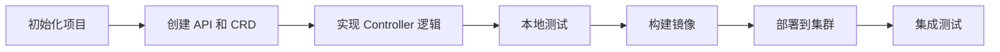

Kubebuilder 是用于构建 Kubernetes API 的 SDK，基于 CRD（Custom Resource Definition）来构建 API、Controller 和 Admission Webhook，是 Kubernetes 官方推荐的 Operator 开发框架。

## 概述

### 什么是 Kubebuilder

Kubebuilder 是一个使用 CRD 构建 Kubernetes API 的框架，可以帮助开发者：

- 快速创建和管理 CRD
- 生成 Controller 代码框架
- 提供测试和部署工具
- 集成 Webhook 和 RBAC

### 核心优势

与其他 Kubernetes API 扩展方案相比，Kubebuilder 具有以下优势：

- **简单易用**：提供命令行工具快速生成代码框架
- **社区支持**：Kubernetes 官方维护，社区活跃
- **最佳实践**：内置 Kubernetes 开发最佳实践
- **完整工具链**：从开发到部署的完整解决方案

## 设计原则

Kubebuilder 遵循以下设计哲学：

1. **库优于代码生成** - 优先使用 Go 接口和库
2. **代码生成优于样板代码** - 必要时使用代码生成而非重复样板
3. **一次性脚手架** - 避免 fork 和修改样板代码
4. **清晰的抽象** - 提供基于 godoc 的清晰库抽象

## 工作流程

典型的 Kubebuilder 开发流程：



1. **项目初始化** - 创建项目结构和配置
2. **API 定义** - 创建 CRD 和资源类型
3. **Controller 开发** - 实现业务逻辑和协调循环
4. **本地测试** - 在本地环境测试功能
5. **镜像构建** - 构建 Operator 容器镜像
6. **集群部署** - 部署到 Kubernetes 集群
7. **集成测试** - 验证完整功能

## 环境准备

### 系统要求

本教程使用的环境配置：

| 组件 | 版本 | 说明 |
|------|------|------|
| Kubernetes | v1.28+ | 推荐使用 kind 或 minikube |
| Go | 1.21+ | 支持 Go modules |
| Kubebuilder | v3.14+ | 最新稳定版本 |
| Docker | 20.10+ | 容器运行时 |
| kubectl | v1.28+ | Kubernetes 命令行工具 |

### 安装 Kubebuilder

**Linux/macOS**

```bash
# 下载并安装最新版本
curl -L -o kubebuilder "https://go.kubebuilder.io/dl/latest/$(go env GOOS)/$(go env GOARCH)"
chmod +x kubebuilder && sudo mv kubebuilder /usr/local/bin/
```

**验证安装**

```bash
kubebuilder version
```

### 准备 Kubernetes 集群

**使用 kind（推荐）**

```bash
# 安装 kind
go install sigs.k8s.io/kind@latest

# 创建集群
kind create cluster --name kubebuilder-demo
```

**使用 minikube**

```bash
# 启动 minikube
minikube start --kubernetes-version=v1.28.0

# 解决 DNS 问题（如需要）
minikube ssh
sudo sed -i 's/#DNS=/DNS=8.8.8.8/g' /etc/systemd/resolved.conf
sudo systemctl restart systemd-resolved
exit
```

## 核心概念

在开始实践前，了解以下核心概念：

- **CRD（Custom Resource Definition）**：自定义资源定义，扩展 Kubernetes API 的机制
- **CR（Custom Resource）**：使用 CRD 创建的自定义资源实例
- **Controller**：监听资源变化并执行协调逻辑的控制器
- **Reconcile**：协调函数，Controller 的核心业务逻辑
- **Manager**：管理多个 Controller 的组件

## 快速开始

### 1. 创建项目

```bash
# 创建项目目录
mkdir guestbook-operator && cd guestbook-operator

# 初始化项目
kubebuilder init --domain example.com --repo github.com/example/guestbook-operator
```

### 2. 创建 API

```bash
# 创建 API 和 Controller
kubebuilder create api --group webapp --version v1 --kind Guestbook
# 选择 y 创建 resource 和 controller
```

项目结构：

```
.
├── Dockerfile
├── Makefile
├── PROJECT
├── api/
│   └── v1/
│       ├── guestbook_types.go      # CRD 定义
│       └── zz_generated.deepcopy.go
├── bin/
├── config/                         # Kubernetes 配置文件
│   ├── crd/
│   ├── default/
│   ├── manager/
│   ├── rbac/
│   └── samples/
├── internal/controller/            # Controller 实现
│   └── guestbook_controller.go
├── cmd/
│   └── main.go
└── test/
```

### 3. 定义 CRD 结构

编辑 `api/v1/guestbook_types.go`：

```go
// GuestbookSpec 定义期望状态
type GuestbookSpec struct {
  // +kubebuilder:validation:Required
  // +kubebuilder:validation:MinLength=1
  Name string `json:"name"`
  
  // +kubebuilder:validation:Optional
  Message string `json:"message,omitempty"`
  
  // +kubebuilder:validation:Minimum=1
  // +kubebuilder:default=1
  Replicas int32 `json:"replicas,omitempty"`
}

// GuestbookStatus 定义观察到的状态
type GuestbookStatus struct {
  // +kubebuilder:validation:Optional
  Phase string `json:"phase,omitempty"`
  
  // +kubebuilder:validation:Optional
  ReadyReplicas int32 `json:"readyReplicas,omitempty"`
  
  // +kubebuilder:validation:Optional
  Conditions []metav1.Condition `json:"conditions,omitempty"`
}

// +kubebuilder:object:root=true
// +kubebuilder:subresource:status
// +kubebuilder:subresource:scale:specpath=.spec.replicas,statuspath=.status.readyReplicas
// +kubebuilder:printcolumn:name="Phase",type="string",JSONPath=".status.phase"
// +kubebuilder:printcolumn:name="Ready",type="integer",JSONPath=".status.readyReplicas"
// +kubebuilder:printcolumn:name="Age",type="date",JSONPath=".metadata.creationTimestamp"

// Guestbook 是 Guestbook API 的 Schema
type Guestbook struct {
  metav1.TypeMeta   `json:",inline"`
  metav1.ObjectMeta `json:"metadata,omitempty"`

  Spec   GuestbookSpec   `json:"spec,omitempty"`
  Status GuestbookStatus `json:"status,omitempty"`
}
```

### 4. 实现 Controller 逻辑

编辑 `internal/controller/guestbook_controller.go`：

```go
func (r *GuestbookReconciler) Reconcile(ctx context.Context, req ctrl.Request) (ctrl.Result, error) {
  log := log.FromContext(ctx)

  // 获取 Guestbook 实例
  var guestbook webappv1.Guestbook
  if err := r.Get(ctx, req.NamespacedName, &guestbook); err != nil {
    if apierrors.IsNotFound(err) {
      log.Info("Guestbook resource not found, probably deleted")
      return ctrl.Result{}, nil
    }
    log.Error(err, "Failed to get Guestbook")
    return ctrl.Result{}, err
  }

  log.Info("Reconciling Guestbook", "name", guestbook.Name, "namespace", guestbook.Namespace)

  // 更新状态
  guestbook.Status.Phase = "Running"
  guestbook.Status.ReadyReplicas = guestbook.Spec.Replicas

  if err := r.Status().Update(ctx, &guestbook); err != nil {
    log.Error(err, "Failed to update Guestbook status")
    return ctrl.Result{}, err
  }

  return ctrl.Result{RequeueAfter: time.Minute * 5}, nil
}

// SetupWithManager 设置 Controller
func (r *GuestbookReconciler) SetupWithManager(mgr ctrl.Manager) error {
  return ctrl.NewControllerManagedBy(mgr).
    For(&webappv1.Guestbook{}).
    Complete(r)
}
```

### 5. 测试和部署

**安装 CRD**

```bash
make install
```

**本地运行 Controller**

```bash
make run
```

**创建测试资源**

编辑 `config/samples/webapp_v1_guestbook.yaml`：

```yaml
apiVersion: webapp.example.com/v1
kind: Guestbook
metadata:
  name: guestbook-sample
  namespace: default
spec:
  name: "Hello Kubebuilder"
  message: "Welcome to Kubebuilder!"
  replicas: 3
```

应用资源：

```bash
kubectl apply -f config/samples/webapp_v1_guestbook.yaml
```

**查看结果**

```bash
# 查看 CRD
kubectl get crd

# 查看 Guestbook 资源
kubectl get guestbooks

# 查看详细信息
kubectl describe guestbook guestbook-sample
```

**部署到集群**

```bash
# 构建并推送镜像
make docker-build docker-push IMG=your-registry/guestbook-operator:latest

# 部署到集群
make deploy IMG=your-registry/guestbook-operator:latest
```

## 高级特性

### Webhook

添加验证和变更 Webhook：

```bash
kubebuilder create webhook --group webapp --version v1 --kind Guestbook --defaulting --programmatic-validation
```

### 多版本支持

```bash
kubebuilder create api --group webapp --version v2 --kind Guestbook
```

### 性能优化

在 `main.go` 中配置 Controller 选项：

```go
if err = (&controller.GuestbookReconciler{
  Client: mgr.GetClient(),
  Scheme: mgr.GetScheme(),
}).SetupWithManager(mgr, controller.GuestbookReconcilerOptions{
  MaxConcurrentReconciles: 2,
}); err != nil {
  setupLog.Error(err, "unable to create controller", "controller", "Guestbook")
  os.Exit(1)
}
```

## 最佳实践

### 1. 错误处理

```go
// 使用适当的错误类型
if apierrors.IsNotFound(err) {
  // 资源不存在，可能已被删除
  return ctrl.Result{}, nil
}

if apierrors.IsConflict(err) {
  // 资源冲突，需要重试
  return ctrl.Result{RequeueAfter: time.Second * 5}, nil
}
```

### 2. 状态管理

```go
// 使用 Conditions 记录状态变化
meta.SetStatusCondition(&guestbook.Status.Conditions, metav1.Condition{
  Type:    "Ready",
  Status:  metav1.ConditionTrue,
  Reason:  "GuestbookReady",
  Message: "Guestbook is ready",
})
```

### 3. 日志记录

```go
// 使用结构化日志
log.Info("Reconciling resource", 
  "guestbook", guestbook.Name,
  "namespace", guestbook.Namespace,
  "generation", guestbook.Generation)
```

### 4. 测试

编写单元测试和集成测试：

```go
// 使用 envtest 进行集成测试
var _ = Describe("Guestbook Controller", func() {
  Context("When creating a Guestbook", func() {
    It("Should update the status", func() {
      // 测试逻辑
    })
  })
})
```

## 故障排查

### 常见问题

1. **CRD 安装失败**

   ```bash
   kubectl get crd | grep guestbook
   kubectl describe crd guestbooks.webapp.example.com
   ```

2. **Controller 启动失败**

   ```bash
   kubectl logs -n system deployment/controller-manager
   ```

3. **权限问题**
   检查 RBAC 配置，确保 ServiceAccount 有足够权限

### 调试技巧

1. **增加日志级别**

   ```bash
   make run ARGS="--zap-log-level=debug"
   ```

2. **使用 kubectl events**

   ```bash
   kubectl get events --sort-by=.metadata.creationTimestamp
   ```

## 总结

Kubebuilder 提供了完整的 Kubernetes Operator 开发体验，从项目初始化到生产部署。通过本教程，你已经学会了：

- Kubebuilder 的核心概念和工作流程
- 如何创建和定义 CRD
- 如何实现 Controller 业务逻辑
- 如何测试和部署 Operator
- 最佳实践和故障排查方法

继续深入学习可以探索更高级的特性，如 Webhook、多版本支持、性能优化等。

## 参考资料

- [Kubebuilder 官方文档](https://book.kubebuilder.io/)
- [Kubernetes API 扩展](https://kubernetes.io/docs/concepts/extend-kubernetes/api-extension/)
- [Controller Runtime](https://github.com/kubernetes-sigs/controller-runtime)
- [Operator Pattern](https://kubernetes.io/docs/concepts/extend-kubernetes/operator/)
- [Kind 快速开始](https://kind.sigs.k8s.io/docs/user/quick-start/)
