> Minikube 是本地开发和测试 Kubernetes 应用的理想工具，支持多平台、多驱动和丰富插件，极大简化了集群搭建与管理流程。本文系统梳理 Minikube 的架构、安装、配置、常用命令及最佳实践，助你高效掌握本地 K8s 环境。

## Minikube 简介

Minikube 是一个开源工具，支持在 macOS、Linux 和 Windows 上本地运行单节点 Kubernetes 集群。它让开发者无需访问完整集群即可便捷测试和开发 Kubernetes 应用。

Minikube 的主要目标包括：

- 成为本地 Kubernetes 应用开发的最佳工具
- 支持所有适合本地环境的 Kubernetes 特性

**最新版本**：v1.37.0（2025 年 9 月 9 日发布）  
[更新日志](https://github.com/kubernetes/minikube/blob/master/CHANGELOG.md)

## 系统要求

在安装 Minikube 前，请确保系统满足以下要求：

- **macOS**：10.12 (Sierra) 或更高版本
- **内存**：至少 2GB 可用内存
- **CPU**：支持虚拟化的处理器
- **磁盘空间**：至少 20GB 可用磁盘空间

## 架构与核心组件

Minikube 采用分层架构，通过抽象不同组件，为多平台和多虚拟化技术提供一致体验。


{width=1920 height=2065}

### 驱动系统

Minikube 通过驱动接口抽象机器配置，支持多种虚拟化和容器化技术。


{width=2074 height=810}

KIC（Kubernetes in Container）通过专用基础镜像在容器中运行 Kubernetes。

### 容器运行时支持

Minikube 支持多种容器运行时，便于模拟生产环境。



{width=1920 height=1443}

### 插件系统

Minikube 通过插件系统扩展功能，便于集群内部署常用组件。


{width=1920 height=7869}

插件可包含 RBAC 资源，保障集群安全。

## 主要特性

下表总结了 Minikube 的核心特性及相关命令标志：



| 特性             | 描述                         | 相关标志                           |
| ---------------- | ---------------------------- | ---------------------------------- |
| 多集群支持       | 运行多个独立集群             | `-p, --profile`                    |
| 多 Kubernetes 版本 | 运行特定 Kubernetes 版本     | `--kubernetes-version`             |
| 容器运行时选择   | 支持 Docker、containerd、CRI-O | `--container-runtime`              |
| 资源自定义       | 配置 CPU、内存和磁盘资源     | `--cpus`, `--memory`, `--disk-size`|
| 自定义镜像仓库   | 支持替代注册表               | `--image-repository`               |
| GPU 直通         | NVIDIA/AMD GPU 支持          | `--gpus`                           |
| 仅下载模式       | 预加载镜像不启动集群         | `--download-only`                  |
| 文件系统挂载     | 本地目录挂载到集群           | `--mount`                          |
| CNI 网络         | 支持多种网络实现             | `--cni`                            |



## 内部机制

### 基础镜像与依赖

KIC 驱动使用预装依赖的基础镜像，便于快速启动。


{width=1920 height=443}

## 安装与配置

### 安装 Minikube

#### Homebrew 安装（推荐）

```bash
brew install minikube
minikube version
```

#### 手动安装

```bash
curl -LO https://storage.googleapis.com/minikube/releases/latest/minikube-darwin-amd64
sudo install minikube-darwin-amd64 /usr/local/bin/minikube
minikube version
```

### 安装 kubectl

#### Homebrew 安装（推荐）

```bash
brew install kubectl
```

#### 手动安装

```bash
curl -LO "https://dl.k8s.io/release/$(curl -L -s https://dl.k8s.io/release/stable.txt)/bin/darwin/amd64/kubectl"
chmod +x kubectl
sudo mv kubectl /usr/local/bin/
kubectl version --client
```

## 启动与配置 Minikube

### 基本启动

```bash
minikube start
minikube start --memory=4096 --cpus=2
```

### macOS 特定配置

推荐使用 HyperKit 或 Krunkit 驱动：

```bash
brew install hyperkit
minikube start --driver=hyperkit
minikube start --driver=krunkit
```

### Docker 驱动

如已安装 Docker Desktop：

```bash
minikube start --driver=docker
```

启动成功后，minikube 会自动配置 kubectl 上下文，可直接使用 kubectl 操作集群。

## 验证安装

```bash
minikube status
kubectl get nodes
kubectl cluster-info
```

## 常用操作命令

### 集群管理

```bash
minikube start
minikube stop
minikube start
minikube delete
minikube pause
minikube unpause
```

### 集群信息

```bash
minikube status
minikube ip
minikube ssh
minikube kubectl version
```

### 插件管理

```bash
minikube addons list
minikube addons enable dashboard
minikube addons disable dashboard
```

### 服务访问

```bash
minikube dashboard
minikube service <service-name> --url
minikube service <service-name>
```

## 故障排除

### 常见问题

- 启动失败：检查虚拟化是否启用
- 网络问题：配置代理或使用镜像源
- 资源不足：增加内存和 CPU 配置

### 清理与重置

```bash
minikube delete --all --purge
rm -rf ~/.minikube
```

## 最佳实践

- 资源配置：根据开发需求合理分配内存和 CPU
- 驱动选择：macOS 推荐 HyperKit 或 Krunkit，其他系统可选 VirtualBox 或 Docker
- GPU 支持：AI/ML 工作负载建议用 `--gpus` 启用 GPU
- 网络配置：企业环境注意配置代理
- 定期更新：保持 Minikube 和 kubectl 版本最新

## 总结

Minikube 为本地 Kubernetes 开发和测试提供了极致便捷的体验。通过多驱动、多运行时和丰富插件支持，开发者可快速搭建与生产环境高度一致的集群，灵活模拟各种场景。掌握 Minikube 的架构、安装、配置和常用命令，将极大提升本地 K8s 开发效率。

## 参考文献

1. [Minikube 官方文档 - minikube.sigs.k8s.io](https://minikube.sigs.k8s.io/docs/)
2. [kubectl 安装指南 - kubernetes.io](https://kubernetes.io/docs/tasks/tools/install-kubectl/)
3. [Kubernetes 官方教程 - kubernetes.io](https://kubernetes.io/docs/tutorials/)
