> Operator SDK 作为 Kubernetes Operator 开发的核心工具，极大简化了 Operator 的创建、测试与打包流程，助力开发者高效实现复杂应用的自动化运维。

## 什么是 Operator SDK

[Operator SDK](https://github.com/operator-framework/operator-sdk) 是由 Red Hat 开源的用于构建 Kubernetes Operator 的开发框架。它提供了工具、库和标准化模式，帮助开发者高效、一致地创建、测试和打包能够自动化管理 Kubernetes 上复杂应用程序的 Operator。

Operator SDK 基于 Kubernetes controller-runtime 库构建，并通过与 Operator Lifecycle Manager (OLM) 的无缝集成，为 Operator 特定的工具和抽象提供了扩展支持。

在阅读本文前，建议你先了解 [Operator 的基本概念](../operator/)。

## 为什么需要 Operator SDK

在 Kubernetes 上部署和管理复杂有状态应用时，常常面临生命周期管理复杂、运维门槛高、自动化程度低等挑战。Operator SDK 通过将运维知识编码为软件、提供声明式 API 以及与 kubectl 的一致体验，有效解决了这些问题。

- 将运维专家的知识编码到软件中
- 提供声明式 API 来管理复杂应用
- 支持使用 `kubectl` 操作自定义资源，保持一致的用户体验

## 核心架构

Operator SDK 的架构基于 controller-runtime，并通过插件和 OLM 集成实现多样化 Operator 支持。



{width=1920 height=984}

## 安装 Operator SDK

在开始开发前，需要先安装 Operator SDK。以下为主流安装方式及前置条件说明。

### 前置条件

- Go 1.21+
- Docker 20.10+ 或 Podman
- kubectl v1.26.0+
- 访问 Kubernetes 集群 (v1.26+)
- make (用于构建)

### 安装方式

#### 方式一：使用二进制文件（推荐）

```bash
# 设置版本和架构 (2025年最新版本 v1.35.0)
export ARCH=$(case $(uname -m) in x86_64) echo -n amd64 ;; aarch64) echo -n arm64 ;; *) echo -n $(uname -m) ;; esac)
export OS=$(uname | awk '{print tolower($0)}')
export OPERATOR_SDK_DL_URL=https://github.com/operator-framework/operator-sdk/releases/download/v1.35.0

# 下载二进制文件
curl -LO ${OPERATOR_SDK_DL_URL}/operator-sdk_${OS}_${ARCH}

# 验证下载的二进制文件
curl -LO ${OPERATOR_SDK_DL_URL}/checksums.txt
gpg --verify checksums.txt.asc checksums.txt 2>/dev/null || sha256sum -c checksums.txt --ignore-missing

# 安装
chmod +x operator-sdk_${OS}_${ARCH}
sudo mv operator-sdk_${OS}_${ARCH} /usr/local/bin/operator-sdk
```

#### 方式二：使用 Homebrew (macOS)

```bash
brew install operator-sdk
```

#### 验证安装

```bash
operator-sdk version
```

## CLI 插件系统

Operator SDK CLI 采用模块化、插件化架构，支持多种 Operator 类型和技术。下图展示了插件系统的结构：


{width=4264 height=560}

每个插件包负责为特定的 Operator 实现类型（Go、Ansible 或 Helm）提供功能。核心命令与所有 Operator 类型配合，提供一致的功能体验。

## CLI 命令结构

Operator SDK CLI 提供了完整的 Operator 开发生命周期命令集。下表简要说明各命令用途：



| 命令                | 目的                                   |
|---------------------|----------------------------------------|
| `init`              | 初始化新的 Operator 项目               |
| `create api`        | 创建 Kubernetes API 或 Webhook         |
| `bundle`            | 管理 Operator bundle 元数据            |
| `generate`          | 生成各种制品（CRD、manifests）         |
| `run`               | 在不同环境中运行 Operator              |
| `scorecard`         | 根据最佳实践测试 Operator bundle       |
| `olm`               | 管理 OLM 安装和集成                    |
| `cleanup`           | 清理使用 `run` 命令部署的 Operator     |
| `pkgman-to-bundle`  | 从包 manifests 迁移到 bundles          |



## 创建第一个 Operator 项目

通过以下步骤可以快速初始化并开发一个 Operator 项目。

### 初始化项目

```bash
# 创建项目目录
mkdir -p ~/projects/memcached-operator
cd ~/projects/memcached-operator

# 初始化项目
operator-sdk init --domain example.com --repo github.com/example/memcached-operator
```

### 创建 API

```bash
operator-sdk create api --group cache --version v1alpha1 --kind Memcached --resource --controller
```

该命令会自动生成自定义资源定义（CRD）、控制器逻辑及相关测试文件。

## Operator 实现类型

Operator SDK 支持三种主要实现方式，适配不同场景和技术栈。

### Go-based Operators

基于 Go 的 Operator 直接使用 controller-runtime，适合复杂业务逻辑和高度自定义需求。

### Ansible-based Operators

Ansible Operator 利用 Ansible playbook 和角色，无需 Go 编程，适合已有自动化脚本的场景。

### Helm-based Operators

Helm Operator 基于现有 Helm charts，适合已有 Helm charts 的应用，快速实现 Operator 化。

### 项目结构说明

以下为典型 Operator 项目结构：

```text
├── api/
│   └── v1alpha1/          # API 定义
├── config/
│   ├── crd/              # CRD 配置
│   ├── default/          # 默认配置
│   ├── manager/          # Manager 配置
│   ├── rbac/             # RBAC 配置
│   └── samples/          # 示例资源
├── controllers/          # 控制器逻辑
├── Dockerfile           # 容器镜像构建文件
├── Makefile            # 构建和部署命令
├── PROJECT             # 项目元数据
└── main.go             # 主入口文件
```

## Operator Lifecycle Manager 集成

Operator SDK 与 OLM 深度集成，实现 Operator 的打包、部署和生命周期管理。下图展示了典型的集成流程：



{width=2764 height=761}

## 开发工作流

Operator SDK 推荐的开发流程如下：


{width=1991 height=77}

## 开发 Operator

开发 Operator 主要包括 API 定义、控制器实现、构建测试等环节。

### 定义 API

编辑 `api/v1alpha1/memcached_types.go` 文件，定义自定义资源：

```go
type MemcachedSpec struct {
    // Size is the size of the memcached deployment
    Size int32 `json:"size"`

    // Resources defines the resource requirements
    Resources corev1.ResourceRequirements `json:"resources,omitempty"`
}

type MemcachedStatus struct {
    // Nodes are the names of the memcached pods
    Nodes []string `json:"nodes"`

    // Conditions represent the latest available observations
    Conditions []metav1.Condition `json:"conditions,omitempty"`
}
```

### 实现控制器逻辑

编辑 `controllers/memcached_controller.go` 文件，实现核心协调逻辑：

```go
func (r *MemcachedReconciler) Reconcile(ctx context.Context, req ctrl.Request) (ctrl.Result, error) {
    log := log.FromContext(ctx)

    // 获取自定义资源
    memcached := &cachev1alpha1.Memcached{}
    if err := r.Get(ctx, req.NamespacedName, memcached); err != nil {
        return ctrl.Result{}, client.IgnoreNotFound(err)
    }

    // 实现协调逻辑
    // 1. 检查当前状态
    // 2. 计算期望状态
    // 3. 执行必要的更改
    // 4. 更新状态

    return ctrl.Result{}, nil
}
```

### 构建和测试

```bash
# 生成代码 (kubebuilder 生成器)
make generate

# 生成 manifests (RBAC, CRD 等)
make manifests

# 运行单元测试
make test

# 构建多架构镜像
make docker-buildx IMG=controller:latest

# 本地运行 (开发环境)
make run

# 部署到集群
make deploy IMG=controller:latest
```

## 部署 Operator

Operator 支持 OLM Bundle 部署和传统部署两种方式。

### Bundle 管理和 OLM 部署

#### 创建 Operator Bundle

```bash
# 生成 bundle 元数据
make bundle IMG=<registry>/memcached-operator:v0.1.0

# 构建 bundle 镜像
make bundle-build BUNDLE_IMG=<registry>/memcached-operator-bundle:v0.1.0

# 推送 bundle 镜像
make bundle-push BUNDLE_IMG=<registry>/memcached-operator-bundle:v0.1.0
```

#### 使用 OLM 部署

```bash
# 运行 bundle (开发环境)
operator-sdk run bundle <registry>/memcached-operator-bundle:v0.1.0

# 验证部署
kubectl get csv -n <operator-namespace>
```

### 传统部署方式

#### 安装 CRD

```bash
make install
```

#### 本地运行 (开发)

```bash
make run
```

#### 部署到集群

```bash
# 构建并推送镜像
make docker-buildx docker-push IMG=<registry>/memcached-operator:v0.1.0

# 部署 Operator
make deploy IMG=<registry>/memcached-operator:v0.1.0
```

## 依赖关系和兼容性

Operator SDK 依赖 controller-runtime、kubebuilder、kustomize、OLM 及 Helm/Ansible 等关键组件。兼容性详情可参考[官方文档](https://sdk.operatorframework.io/docs/overview#kubernetes-version-compatibility)。

## 最佳实践（2025 年更新）

为确保 Operator 高质量、可维护，建议遵循以下最佳实践。

### 开发最佳实践

- **选择合适的实现类型**：Go 适合复杂逻辑，Ansible 适合声明式自动化，Helm 适合已有 charts。
- **API 设计原则**：采用语义化版本，定义清晰状态条件，合理默认值与校验。
- **控制器实现**：幂等操作、事件记录、优雅关闭。
- **安全考虑**：最小权限 RBAC、输入校验、基础镜像定期更新。

### 测试策略



{width=1920 height=939}

### 打包和分发

- 生成完整的 ClusterServiceVersion (CSV)，包含所有必要的 RBAC 和 CRD。
- 使用 scorecard 验证最佳实践，运行自动化测试，进行安全扫描。
- 采用语义化版本，维护兼容性，提供迁移指南。

### 监控和可观测性

- 暴露 Prometheus 指标，记录协调循环延迟，监控资源使用。
- 结构化日志，包含上下文，避免敏感信息泄露。
- 实现 readiness/liveness probes，监控控制器状态，提供诊断端点。

## 总结

Operator SDK 通过模块化插件架构、多实现类型支持及与 OLM 的深度集成，极大简化了 Operator 的开发、测试与部署流程。它为开发者提供了一致的工作流和最佳实践，是构建生产级 Kubernetes Operator 的首选工具。随着云原生生态发展，Operator SDK 也在不断演进，持续赋能开发者。

## 参考资源

1. [Operator SDK 官方文档 - sdk.operatorframework.io](https://sdk.operatorframework.io/)
2. [Kubernetes Operator 模式 - kubernetes.io](https://kubernetes.io/docs/concepts/extend-kubernetes/operator/)
3. [Controller Runtime - pkg.go.dev](https://pkg.go.dev/sigs.k8s.io/controller-runtime)
4. [CNCF Operator 白皮书 - github.com](https://github.com/cncf/tag-app-delivery/blob/main/operator-wg/whitepaper/Operator-WhitePaper_v1-0.md)
5. [Operator Hub - operatorhub.io](https://operatorhub.io/)
6. [Artifact Hub - artifacthub.io](https://artifacthub.io/)
7. [Operator 教程 - sdk.operatorframework.io](https://sdk.operatorframework.io/docs/building-operators/golang/tutorial/)
8. [Operator 最佳实践 - cloud.redhat.com](https://cloud.redhat.com/blog/best-practices-for-kubernetes-operators)
9. [Awesome Operators - github.com](https://github.com/operator-framework/awesome-operators)
10. [Kubebuilder - book.kubebuilder.io](https://book.kubebuilder.io/)
11. [Operator Lifecycle Manager - olm.operatorframework.io](https://olm.operatorframework.io/)
12. [Scorecard - github.com](https://github.com/operator-framework/operator-sdk/blob/master/website/content/en/docs/advanced-topics/scorecard/)
