> Kubernetes Operator 通过将运维专家的领域知识编码为软件，实现了复杂有状态应用的自动化部署与运维，极大提升了云原生平台的可扩展性和智能化水平。

## 引言

本文系统梳理了 Kubernetes Operator 的原理、架构、典型应用场景、开发最佳实践及生态现状，帮助读者全面理解 Operator 在现代云原生体系中的价值与落地方式。

## 什么是 Operator

Kubernetes Operator 是一种扩展 Kubernetes API 的方法，用于自动化复杂应用程序的部署、管理和运维操作。通过将运维专家的领域知识编码为软件，Operator 可以像 Kubernetes 原生资源一样管理复杂的有状态应用。

### 核心特点

- 应用特定的控制器：针对特定应用程序定制的自动化逻辑
- 有状态应用管理：专门处理数据库、缓存、消息队列等复杂场景
- 领域知识编码：将运维专家的经验转化为可执行的代码
- 声明式管理：基于期望状态进行自动化操作
- 自愈能力：自动检测和修复偏离期望状态的情况
- 生命周期管理：涵盖应用的完整生命周期从部署到销毁

## 架构原理

下图展示了 Operator 的核心架构组成：


{width=1920 height=642}

### 控制器模式详解

Operator 本质上是实现了“控制循环”（Control Loop）的软件。下图展示了其典型工作流程：


{width=1920 height=1071}

### 工作流程

Operator 的工作流程遵循经典的“调谐循环”（Reconciliation Loop）模式：

1. 监听阶段：控制器通过 Informer 机制监听自定义资源的变化
2. 分析阶段：比较当前状态与期望状态的差异（Diff）
3. 执行阶段：调用 Kubernetes API 创建、修改或删除相关资源
4. 反馈阶段：更新自定义资源的状态字段，记录操作结果
5. 重试机制：处理临时失败，支持指数退避重试策略

## 应用场景

Operator 适用于多种自动化运维场景。下图总结了典型用例与 Operator 能力的关系：



{width=2590 height=473}

- 自动化部署：一键部署复杂的分布式应用栈
- 数据备份恢复：自动化数据库备份、灾难恢复和跨区域复制
- 版本升级：安全地执行应用程序升级和数据库 schema 迁移
- 服务发现：为传统应用提供云原生服务注册和发现
- 故障注入：模拟网络分区、节点故障进行混沌工程测试
- 主节点选举：为分布式系统提供高可用的领导者选举
- 智能扩缩容：基于业务指标的自动扩缩容决策
- 可观测性集成：深度集成日志、指标和分布式追踪

### 实践示例：PostgreSQL Operator

以下 YAML 展示了 PostgreSQL Operator 的完整生命周期管理配置：

```yaml
apiVersion: postgresql.example.com/v1
kind: PostgreSQLCluster
metadata:
  name: prod-database
  namespace: database
spec:
  # 集群配置
  replicas: 3
  version: "16"
  storage:
    size: 500Gi
    className: "fast-ssd"

  # 安全配置
  security:
    tls:
      enabled: true
      secretName: postgres-tls
    authentication:
      scram-sha-256: true

  # 备份配置
  backup:
    schedule: "0 */6 * * *"
    retention: "30d"
    destination: "s3://postgres-backups"

  # 监控配置
  monitoring:
    enabled: true
    prometheusRule: true
    grafanaDashboard: true

  # 资源配置
  resources:
    requests:
      memory: "2Gi"
      cpu: "1000m"
    limits:
      memory: "4Gi"
      cpu: "2000m"
```

下图展示了 PostgreSQL Operator 的自动化操作流程：


{width=1920 height=2771}

## 开发最佳实践

本节介绍 Operator 设计原则、主流技术栈及现代开发流程。

### 设计原则


{width=3047 height=369}

- 单一职责：每个 Operator 专注于特定应用的生命周期管理
- 向后兼容：确保新版本能处理旧版本创建的资源，支持渐进式迁移
- 幂等操作：重复执行相同操作应产生相同结果，避免副作用
- 优雅降级：Operator 停止时提供降级模式，不影响已管理的应用实例
- 可观测性：提供结构化日志、自定义指标和健康检查
- 安全性优先：实施最小权限原则，启用安全配置和审计
- 测试驱动：编写单元测试、集成测试和端到端测试

### 技术栈选择

下图展示了主流 Operator 技术栈及其生态关系：



{width=2355 height=952}



| 工具 | 语言 | 特点 | 适用场景 |
|------|------|------|----------|
| Operator SDK v1.35+ | Go/Ansible/Helm | Red Hat 官方，成熟生态 | 企业级生产 Operator |
| Kubebuilder v4.x | Go | Kubernetes SIG 项目，高度可定制 | 复杂业务逻辑 |
| Kopf v1.37+ | Python | 轻量级，装饰器模式 | 快速原型和脚本化 |
| Crossplane v1.16+ | Go/YAML | 平台抽象，多云支持 | 基础设施即代码 |
| Capsule v0.7+ | Go | 多租户 Operator | SaaS 平台 |
| KUDO v1.4+ | YAML | 声明式，无代码开发 | 非开发者用户 |



### 开发步骤

以下流程图展示了 Operator SDK 的现代化开发步骤：


{width=1920 height=2417}

以下为主要命令及操作说明：

```bash
# 1. 初始化项目
operator-sdk init \
  --domain=example.com \
  --repo=github.com/example/my-operator \
  --owner="Example Team" \
  --description="My Application Operator" \
  --skip-go-version-check

# 2. 创建 API
operator-sdk create api \
  --group=apps \
  --version=v1 \
  --kind=MyApp \
  --resource \
  --controller \
  --namespaced \
  --generate-playbook=false

# 3. 实现业务逻辑（controllers/myapp_controller.go）

# 4. 添加 Webhook（可选）
operator-sdk create webhook \
  --group=apps \
  --version=v1 \
  --kind=MyApp \
  --defaulting \
  --validation \
  --conversion

# 5. 生成 RBAC 和安装配置
make generate manifests

# 6. 编写测试
make test

# 7. 构建多架构镜像
make docker-buildx IMG=myregistry/my-operator:v1.0.0

# 8. 部署到测试集群
make deploy IMG=myregistry/my-operator:v1.0.0

# 9. 运行端到端测试
operator-sdk run bundle \
  --install-mode=AllNamespaces \
  --index-image=quay.io/operator-framework/opm:v1.36.0 \
  --container-tool=docker \
  --timeout=10m0s
```

### 测试策略

下图展示了 Operator 测试金字塔及主流测试工具：



{width=1920 height=1008}

- 单元测试：使用 `envtest` 模拟 Kubernetes API，测试控制器逻辑
- 集成测试：使用 `kind` 创建临时集群，验证组件间交互
- 端到端测试：使用 `KUTTL` 进行声明式测试，覆盖完整用户流程
- 混沌测试：集成 Chaos Mesh 验证故障场景下的弹性

## 生态系统

本节梳理了主流 Operator 项目及其应用领域。

### 知名 Operator 项目



{width=2396 height=951}

**数据库系统**

- **PostgreSQL**：[CloudNativePG](https://cloudnative-pg.io/) (CNPG) - 云原生 PostgreSQL，[Zalando Postgres Operator](https://github.com/zalando/postgres-operator)
- **MySQL**：[PlanetScale MySQL Operator](https://github.com/planetscale/vitess-operator)、[Percona XtraDB Cluster](https://github.com/percona/percona-xtradb-cluster-operator)
- **MongoDB**：[MongoDB Community Operator](https://github.com/mongodb/mongodb-kubernetes-operator)、[MongoDB Atlas Operator](https://github.com/mongodb/mongodb-atlas-kubernetes)
- **Redis**：[Redis Operator](https://github.com/spotahome/redis-operator)、[KubeDB Redis](https://github.com/kubedb/redis)

**消息队列与事件流**

- **Kafka**：[Strimzi](https://strimzi.io/) (Red Hat 官方)、[Redpanda Operator](https://docs.redpanda.com/current/deploy/deployment-option/self-hosted/kubernetes/)
- **RabbitMQ**：[RabbitMQ Cluster Operator](https://github.com/rabbitmq/cluster-operator)、[KubeDB RabbitMQ](https://github.com/kubedb/rabbitmq)
- **Pulsar**：[StreamNative Pulsar Operator](https://github.com/streamnative/pulsar-operator)、[Kopernikus](https://github.com/Orange-OpenSource/Kopernikus)

**监控与可观测性**

- **Prometheus**：[kube-prometheus-stack](https://github.com/prometheus-community/helm-charts)、[VictoriaMetrics Operator](https://github.com/VictoriaMetrics/operator)
- **Grafana**：[Grafana Operator](https://github.com/grafana-operator/grafana-operator)、[Grafana Tempo](https://github.com/grafana/tempo)
- **Jaeger**：[Jaeger Operator](https://github.com/jaegertracing/jaeger-operator)、[OpenTelemetry](https://opentelemetry.io/)

**存储与数据管理**

- **对象存储**：[MinIO Operator](https://github.com/minio/operator)、[Rook Ceph](https://rook.io/)
- **块存储**：[Longhorn](https://longhorn.io/)、[OpenEBS](https://openebs.io/)
- **备份恢复**：[Velero](https://velero.io/)、[Kasten K10](https://kasten.io/)

**AI/ML 工作负载**

- **Kubeflow**：[Kubeflow Pipelines](https://www.kubeflow.org/docs/components/pipelines/)、[KServe](https://kserve.github.io/website/)
- **Ray**：[Ray Operator](https://docs.ray.io/en/latest/cluster/kubernetes.html)、[KubeRay](https://github.com/ray-project/kuberay)
- **Spark**：[Spark Operator](https://github.com/GoogleCloudPlatform/spark-on-k8s-operator)

**平台抽象与策略**

- **Crossplane**：[Crossplane](https://crossplane.io/) - 基础设施即代码
- **Kyverno**：[Kyverno](https://kyverno.io/) - Kubernetes 原生策略引擎
- **Capsule**：[Capsule](https://capsule.clastix.io/) - 多租户命名空间管理
- **Gatekeeper**：[OPA Gatekeeper](https://open-policy-agent.github.io/gatekeeper/) - 策略准入控制器



{width=1920 height=553}

- **[OperatorHub.io](https://operatorhub.io/)** - Red Hat 官方认证 Operator 市场
- **[Artifact Hub](https://artifacthub.io/)** - CNCF 项目聚合的云原生应用市场
- **[Red Hat Connect](https://connect.redhat.com/)** - 企业级认证 Operator
- **[Operator SDK](https://sdk.operatorframework.io/)** - 官方开发工具包
- **[Awesome Operators](https://github.com/operator-framework/awesome-operators)** - 社区精选 Operator 列表
- **[CNCF Landscape](https://landscape.cncf.io/)** - 云原生技术全景图

## 运维考虑

本节介绍 Operator 运维中的监控、调试、安全与高可用等关键实践。

### 现代化监控和调试

下图展示了 Operator 可观测性与调试工具体系：



{width=2201 height=730}

#### 监控和诊断命令

以下命令用于常见运维监控与调试场景：

```bash
kubectl get deployments -n operator-system
kubectl get pods -n operator-system -o wide
kubectl logs -f deployment/my-operator-controller-manager -n operator-system --tail=100
kubectl get myapps -A
kubectl describe myapp my-instance -n my-namespace
kubectl auth can-i get myapps --as=system:serviceaccount:operator-system:default
kubectl get validatingwebhookconfigurations
kubectl get mutatingwebhookconfigurations
kubectl top pods -n operator-system
kubectl get events -n operator-system --sort-by=.metadata.creationTimestamp
kubectl get myapp my-instance -o yaml
kubectl get events --field-selector involvedObject.name=my-instance
```

### 安全配置

下图总结了 Operator 关键安全配置：



{width=3154 height=373}

- 最小权限原则：使用精确的 RBAC 规则，只授予必要权限
- 网络隔离：实施 NetworkPolicy 限制 Operator 与其他服务的通信
- 安全上下文：启用 Pod Security Standards，运行在非特权模式
- 证书管理：使用 cert-manager 自动处理 TLS 证书生命周期
- 镜像安全：定期扫描容器镜像漏洞，签名验证
- 机密管理：使用外部密钥管理服务，启用静态加密
- 审计日志：启用 Kubernetes 审计日志，记录所有 API 操作
- 合规检查：定期运行 CIS Kubernetes Benchmark 等安全基准测试

### 高可用性和弹性

- 多副本部署：Operator 控制器运行多个副本
- 领导者选举：使用 Lease 资源协调多个控制器实例
- 故障转移：自动检测和切换故障实例
- 优雅关闭：实现 SIGTERM 处理程序，确保清理资源

### 升级和回滚策略

- 渐进式升级：使用 Operator Lifecycle Manager (OLM) 管理版本
- 数据迁移：自动处理 CRD 版本间的数据转换
- 回滚能力：保持历史版本镜像，支持快速回滚
- 兼容性保证：确保新版本能处理旧版本创建的资源

## 总结

Kubernetes Operator 通过声明式 API 和自动化控制循环，实现了复杂有状态应用的全生命周期管理。结合现代开发工具链与最佳实践，Operator 已成为云原生平台智能化运维的核心能力。未来，随着生态的不断丰富和标准的完善，Operator 将在多云、AI、数据等领域持续发挥关键作用。

## 参考文献

1. [Operator Pattern - kubernetes.io](https://kubernetes.io/docs/concepts/extend-kubernetes/operator/)
2. [Operator Framework 官网 - operatorframework.io](https://operatorframework.io/)
3. [CNCF Operator 白皮书 - github.com](https://github.com/cncf/tag-app-delivery/blob/main/operator-wg/whitepaper/Operator-WhitePaper_v1-0.md)
4. [Red Hat Operator 最佳实践 - cloud.redhat.com](https://cloud.redhat.com/blog/best-practices-for-kubernetes-operators)
5. [Operator SDK 文档 - sdk.operatorframework.io](https://sdk.operatorframework.io/)
6. [Kubebuilder 手册 - book.kubebuilder.io](https://book.kubebuilder.io/)
7. [OperatorHub 贡献指南 - operatorhub.io](https://operatorhub.io/contribute)
8. [Crossplane 文档 - docs.crossplane.io](https://docs.crossplane.io/)
