> Kubernetes 开发不仅是技术的革新，更是云原生思维与工程实践的深度融合之路。

## Kubernetes 开发生态全景

Kubernetes 作为云原生应用的首选平台，为开发者提供了丰富的开发工具和扩展机制。从简单的应用部署到复杂的分布式系统管理，Kubernetes 开发涵盖了从基础设施到应用的全栈开发能力。



{width=1920 height=1228}

## 核心开发理念

Kubernetes 的开发理念贯穿声明式配置、控制器模式和可扩展架构，为应用的自动化和弹性管理奠定基础。

### 声明式配置

Kubernetes 的核心设计理念是**声明式配置**，开发者描述期望状态而非具体执行步骤：

```yaml
# 声明式配置示例
apiVersion: apps/v1
kind: Deployment
metadata:
  name: my-app
spec:
  replicas: 3
  selector:
    matchLabels:
      app: my-app
  template:
    metadata:
      labels:
        app: my-app
    spec:
      containers:
      - name: app
        image: myapp:v1.0
        ports:
        - containerPort: 8080
```



| 方面       | 声明式开发           | 命令式开发           |
|------------|---------------------|---------------------|
| 关注点     | 期望结果            | 执行步骤            |
| 优势       | 自愈能力、幂等性    | 精确控制、调试友好  |
| 适用场景   | 长期运行的服务      | 一次性任务、调试    |
| 工具       | YAML 配置、Helm     | kubectl 命令、脚本  |



### 控制器模式

Kubernetes 的核心是**控制循环（Control Loop）**，控制器持续监控实际状态与期望状态的差异，并自动调整：



{width=1920 height=2523}

### 可扩展架构

Kubernetes 的可扩展性体现在 API、调度、网络和运行时等多个层面，支持多样化的企业需求。



{width=1920 height=917}

## 开发工具链

Kubernetes 提供多样化的开发工具，覆盖命令行、SDK、自动化框架和包管理等场景。

### 核心工具

#### kubectl - 开发者入口

kubectl 是 Kubernetes 开发者的主要工具，支持资源管理、调试和监控。

```bash
# 开发常用命令
kubectl create -f deployment.yaml    # 创建资源
kubectl apply -f deployment.yaml     # 声明式更新
kubectl get pods -w                  # 实时监控
kubectl logs -f deployment/my-app    # 查看日志
kubectl exec -it pod/my-pod -- /bin/bash  # 调试容器
kubectl port-forward svc/my-service 8080:80  # 端口转发
```

#### client-go - Go 开发 SDK

client-go 是 Kubernetes 官方的 Go 客户端库，适合自动化和扩展开发。

```go
package main

import (
    "context"
    "fmt"
    metav1 "k8s.io/apimachinery/pkg/apis/meta/v1"
    "k8s.io/client-go/kubernetes"
    "k8s.io/client-go/rest"
)

func main() {
    // 创建客户端配置
    config, err := rest.InClusterConfig()
    if err != nil {
        panic(err.Error())
    }

    // 创建客户端
    clientset, err := kubernetes.NewForConfig(config)
    if err != nil {
        panic(err.Error())
    }

    // 列出所有 Pod
    pods, err := clientset.CoreV1().Pods("").List(context.TODO(), metav1.ListOptions{})
    if err != nil {
        panic(err.Error())
    }

    fmt.Printf("There are %d pods in the cluster\n", len(pods.Items))
}
```

### 开发框架

#### Operator SDK - 自动化开发

Operator SDK 简化了 Operator 的创建、测试与打包流程。

```bash
# 初始化项目
operator-sdk init --domain example.com --repo github.com/example/my-operator

# 创建API
operator-sdk create api --group apps --version v1 --kind MyApp --resource --controller

# 构建和部署
make docker-build docker-push IMG=myregistry/my-operator:v1.0.0
make deploy IMG=myregistry/my-operator:v1.0.0
```

#### Kubebuilder - 高级开发框架

Kubebuilder 提供项目脚手架和代码生成，适合高级 Operator 开发。

```bash
# 初始化项目
kubebuilder init --domain example.com --repo github.com/example/my-controller

# 创建API
kubebuilder create api --group apps --version v1 --kind MyApp --resource --controller

# 运行测试
make test
```

## 开发模式演进

Kubernetes 开发模式经历了从传统单体到云原生、再到平台工程的演变。


{width=1920 height=683}

### 2025 年发展趋势

随着 AI/ML 原生集成和多云混合云架构的普及，Kubernetes 开发正迈向智能化和平台化。

#### AI/ML 原生集成

Kubernetes 支持 AI/ML 工作负载的模型服务、推理优化和分布式训练。



{width=1920 height=774}

#### 多云和混合云开发

现代应用需要在多个云环境和混合基础设施上运行，提升弹性与可用性。


{width=1920 height=1657}

## 开发环境配置

Kubernetes 支持本地和云端多种开发环境，便于快速迭代和测试。

### 本地开发环境

#### Minikube - 单节点集群

```bash
# 启动Minikube
minikube start --driver=docker --kubernetes-version=v1.28.0

# 启用插件
minikube addons enable ingress
minikube addons enable dashboard

# 获取集群信息
kubectl cluster-info
```

#### Kind - 多节点本地集群

```yaml
# kind-config.yaml
kind: Cluster
apiVersion: kind.x-k8s.io/v1alpha4
nodes:
- role: control-plane
  kubeadmConfigPatches:
  - |
    kind: InitConfiguration
    nodeRegistration:
      kubeletExtraArgs:
        node-labels: "ingress-ready=true"
  extraPortMappings:
  - containerPort: 80
    hostPort: 80
    protocol: TCP
  - containerPort: 443
    hostPort: 443
    protocol: TCP
- role: worker
- role: worker
```

```bash
# 创建集群
kind create cluster --config kind-config.yaml --name my-cluster

# 加载镜像到集群
kind load docker-image my-app:latest --name my-cluster
```

### 云端开发环境

#### GitHub Codespaces

```json
// .devcontainer/devcontainer.json
{
  "name": "Kubernetes Development",
  "image": "mcr.microsoft.com/devcontainers/go:1.21",
  "features": {
    "ghcr.io/devcontainers/features/docker-in-docker:2": {},
    "ghcr.io/devcontainers/features/kubectl-helm-minikube:1": {}
  },
  "customizations": {
    "vscode": {
      "extensions": [
        "ms-kubernetes-tools.vscode-kubernetes-tools",
        "ms-vscode.vscode-json",
        "golang.Go"
      ]
    }
  },
  "postCreateCommand": "minikube start"
}
```

## 开发最佳实践

合理的代码组织和测试策略是高质量 Kubernetes 项目的基础。

### 代码组织

```text
├── api/
│   └── v1alpha1/          # API 定义
├── controllers/           # 控制器逻辑
├── config/               # 配置管理
│   ├── crd/             # CRD 定义
│   ├── rbac/            # RBAC 配置
│   └── manager/         # Manager 配置
├── hack/                # 构建脚本
├── internal/            # 内部包
├── pkg/                 # 可重用包
├── test/                # 测试代码
│   ├── e2e/            # 端到端测试
│   └── integration/    # 集成测试
├── Dockerfile          # 容器构建
├── Makefile           # 构建配置
├── go.mod             # Go 模块
└── main.go            # 程序入口
```

### 测试策略

测试分层有助于保障系统稳定性和可维护性。



{width=1920 height=890}

### 版本管理和发布

采用语义化版本和标准发布流程，确保项目可维护和可追溯。

```yaml
# Chart.yaml
apiVersion: v2
name: my-operator
description: A Kubernetes operator for managing MyApp
type: application
version: 1.2.3          # Chart 版本
appVersion: "v1.2.3"    # 应用版本
```


{width=1922 height=172}

## 学习路径

Kubernetes 学习分为初学者、中级和高级三个阶段，建议循序渐进。

### 初学者路径

- 理解 Pod、Service、Deployment 的核心概念
- 掌握基本的 kubectl 命令和操作
- 学习 Kubernetes 资源的声明式配置
- 使用 Minikube 搭建开发环境

### 中级开发者路径

- 深入理解控制循环和调谐机制
- 学习 CRD 和自定义控制器的开发
- 使用 Operator SDK 构建自动化组件
- 掌握 CNI 和 CSI 的扩展机制

### 高级开发者路径

- 构建内部开发平台和自助服务
- 学习 Karmada 和 Crossplane 的使用
- 实施企业级安全策略和审计
- 掌握大规模集群的性能调优

## 社区和生态

Kubernetes 社区活跃，支持多种贡献和学习方式，助力开发者成长。

### 开源贡献

贡献路径涵盖文档、代码、测试和设计讨论，社区活动丰富。


{width=1920 height=1343}

### 学习资源

官方文档、开发工具和社区资源为学习 Kubernetes 提供坚实基础。

#### 官方文档

- **[Kubernetes 官方文档](https://kubernetes.io/docs/)** - 完整的概念和 API 参考
- **[kubectl 文档](https://kubectl.docs.kubernetes.io/)** - 命令行工具使用指南
- **[API 参考](https://kubernetes.io/docs/reference/)** - 详细的 API 规范

#### 开发工具

- **[client-go](https://github.com/kubernetes/client-go)** - Go 客户端库
- **[sample-controller](https://github.com/kubernetes/sample-controller)** - 控制器示例
- **[kubebuilder](https://book.kubebuilder.io/)** - 开发框架手册

#### 社区资源

- **[Kubernetes Slack](https://slack.k8s.io/)** - 实时社区讨论
- **[Stack Overflow](https://stackoverflow.com/questions/tagged/kubernetes)** - 问题解答
- **[CNCF Landscape](https://landscape.cncf.io/)** - 云原生生态全景

## 总结

Kubernetes 开发是一个不断演进的领域，从简单的应用部署到复杂的平台工程，开发者需要掌握声明式配置、控制器模式、可扩展架构等核心理念。2025 年的 Kubernetes 开发正处于激动人心的阶段，随着 AI/ML 工作负载的普及、多云架构的成熟，以及平台工程理念的推广，开发者将迎来更多的机遇和挑战。通过系统性的学习和实践，开发者可以构建更加可靠、可扩展和智能的云原生应用，为数字化转型贡献力量。

## 参考文献

1. [Kubernetes 官方文档 - kubernetes.io](https://kubernetes.io/docs/)
2. [kubectl 文档 - kubectl.docs.kubernetes.io](https://kubectl.docs.kubernetes.io/)
3. [API 参考 - kubernetes.io](https://kubernetes.io/docs/reference/)
4. [client-go - github.com](https://github.com/kubernetes/client-go)
5. [sample-controller - github.com](https://github.com/kubernetes/sample-controller)
6. [kubebuilder - book.kubebuilder.io](https://book.kubebuilder.io/)
7. [Kubernetes Slack - slack.k8s.io](https://slack.k8s.io/)
8. [Stack Overflow - stackoverflow.com](https://stackoverflow.com/questions/tagged/kubernetes)
9. [CNCF Landscape - landscape.cncf.io](https://landscape.cncf.io/)
