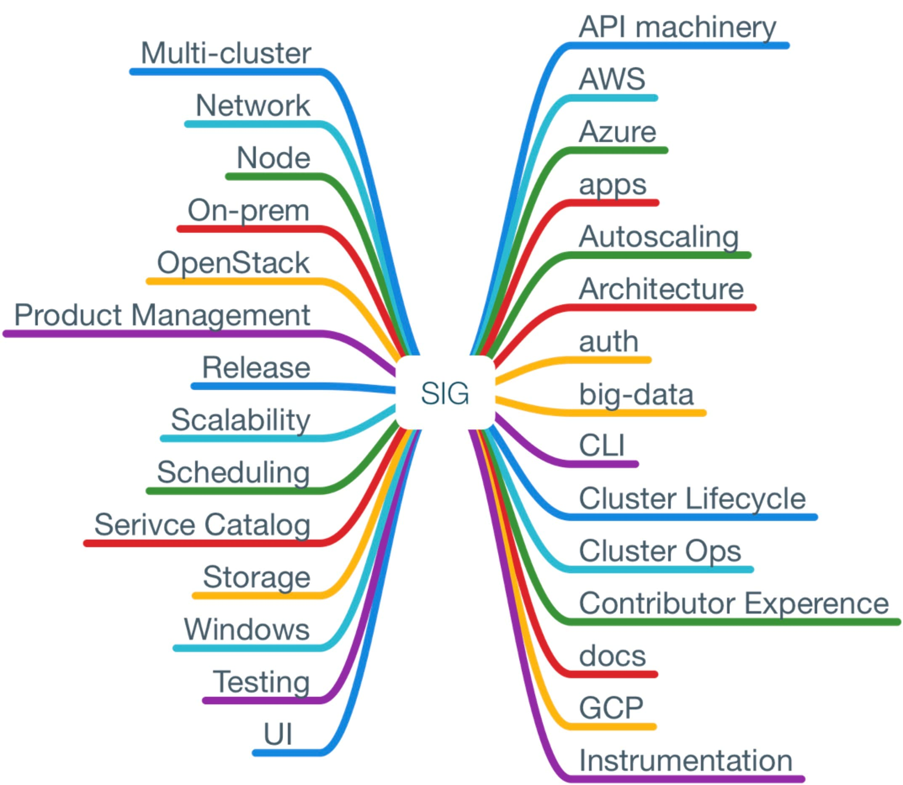

Kubernetes 的社区是以 SIG（Special Interest Group 特别兴趣小组）和工作组的形式组织起来的，每个工作组都会定期召开视频会议。

所有的 SIG 和工作组都使用 slack 和邮件列表沟通。

## 主要 SIG 列表

- **api-machinery**：所有 API 级别的功能，包括了 API server、API 注册和发现、通用的 API CRUD 语义，准入控制，编码 / 解码，转换，默认值，持久化层（etcd），OpenAPI，第三方资源，垃圾回收（gc）和客户端库的方方面面。
- **aws**：如何在 AWS 上支持和使用 kubernetes。
- **apps**：在 kubernetes 上部署和运维应用程序。关注开发者和 DevOps 在 kubernetes 上运行应用程序的体验。
- **architecture**：维持 kubernetes 在架构设计上的一致性和原则。
- **auth**：kubernetes 的认证授权、权限管理和安全性策略。
- **autoscaling**：集群的自动缩放，pod 的水平和垂直自动缩放，pod 的资源初始化，pod 监控和指标收集等主题。
- **azure**：如何在 Azure 上支持和使用 kubernetes。
- **big-data**：在 kubernetes 上部署和运行大数据应用，如 Spark、Kafka、Hadoop、Flink、Storm 等。
- **CLI**：kubectl 和相关工具。
- **cluster-lifecycle**：部署和升级 kubernetes 集群。
- **cluster-ops**：促进 kubernetes 集群本身的可操作性和集群间的互操作性，使不同的运营商之间协调一致。
- **contributor-experience**：维持良好的开发者社区。
- **docs**：文档，流程和出版物。
- **GCP**：在 Google Cloud Platform 上使用 kubernetes。
- **instrumentation**：集群可观测性的最佳实践，包括指标设置、日志收集、事件等。
- **multicluster**：多 kubernetes 集群的用例和工具。
- **network**：kubernetes 集群的网络。
- **node**：node 节点、kubelet。
- **onprem**：在非云供应商的环境下运行 kubernetes，例如 on premise、裸机等环境。
- **openstack**：协调跨 OpenStack 和 Kubernetes 社区的努力。
- **product-management**：侧重于产品管理方面。
- **release**：发布、PR 和 bug 提交等。
- **scalability**：负责回答可伸缩性相关的问题。
- **scheduling**：资源调度。
- **service-catalog**：为 CNCF service broker 和 Kubernetes broker 实现开发 API。
- **storage**：存储和 volume 插件。
- **testing**：测试。
- **ui**：与 UI 相关的话题。
- **windows**：在 kubernets 上运行 Windows Server Container。

## 工作组列表

- **App Def**：改进 API 中的声明性原语、客户端库、工具的用户体验。
- **Cloud Provider**：云供应商工作组。
- **Cluster API**：定义一个代表 Kubernetes 集群的可移植 API。API 将包含控制平面及其配置和底层基础设施（节点，节点池等）。
- **Container Identity**：确保容器能够获得安全的身份认证并与外部连通的解决方案。
- **Kubeadm Adoption**：提高 kubeadm 工具的采用率。
- **Resource Management**J：资源隔离和提高资源利用率。

详细信息请参考 <https://github.com/kubernetes/community/blob/master/sig-list.md>
