Kubernetes 社区通过 SIG（特别兴趣小组）和工作组的分布式治理模式，推动项目持续创新与健康发展。本文系统梳理 2025 年社区组织架构、主要 SIG/WG 列表、参与路径及资源，帮助读者高效融入全球云原生生态。

## 社区组织架构

Kubernetes 社区采用多层次治理结构，确保决策分布、协作透明和社区包容。

{width=1920 height=1279}

### 治理原则

Kubernetes 社区治理遵循以下原则，保障开放与可持续发展：

- **分布式决策**：权力分散到各个 SIG，避免单点故障。
- **透明协作**：所有讨论公开，决策过程可追溯。
- **包容性**：欢迎来自不同背景的贡献者参与。
- **可持续性**：确保社区健康发展和知识传承。

### 沟通方式

社区采用多元化沟通渠道，支持同步与异步协作。

{width=2141 height=705}

- **会议平台**：主要使用 Zoom/Google Meet，支持实时字幕和录制。
- **即时通讯**：Slack 为主，Discord 为补充，支持语音频道。
- **异步讨论**：GitHub Discussions 替代传统邮件，Zulip 用于结构化对话。
- **文档协作**：Google Docs/Microsoft Teams，支持实时协作。
- **视频存档**：YouTube 频道存储会议录像，便于后续查看。

## 主要 SIG 列表

Kubernetes 社区 SIG 覆盖核心基础设施、应用、网络、云平台、开发工具、运维、社区等多个领域。

{width=4876 height=1268}

**核心基础设施**

- **api-machinery**：API 服务器、注册发现、CRUD 语义、准入控制、编码解码、持久化层（etcd）、OpenAPI 规范  
  - 领导者：Jordan Liggitt (Google)
  - 会议：每周二 9:00 PST

- **architecture**：维护 Kubernetes 架构设计的一致性和原则  
  - 领导者：Stephen Augustus (Cisco)
  - 会议：每月第二个周三

- **auth**：认证、授权、权限管理和安全策略  
  - 领导者：Jordan Liggitt (Google)
  - 会议：每周四 9:00 PST

- **etcd**：etcd 数据库的维护和改进  
  - 领导者：Marek Siarkowicz (Google)
  - 会议：每月第一个周二

- **instrumentation**：可观测性最佳实践，包括指标、日志、事件和追踪  
  - 领导者：Han Kang (Google)
  - 会议：每周三 8:00 PST

**应用和工作负载**

- **apps**：应用部署和运维，关注开发者和 DevOps 体验  
  - 领导者：Maciej Szulik (Red Hat)
  - 会议：每周五 10:00 PST

- **batch**：批处理工作负载，如 Job 和 CronJob  
  - 领导者：Michael Michael (Red Hat)
  - 会议：每月第三个周四

- **autoscaling**：集群自动扩缩容、Pod 水平/垂直扩缩容、资源管理  
  - 领导者：Viji Sarathy (Google)
  - 会议：每周二 9:00 PST

- **serving**：服务化工作负载，包括 Knative 和模型服务  
  - 领导者：Kendall Nelson (Google)
  - 会议：每周四 9:00 PST

- **ai-ml**：AI/ML 工作负载集成和最佳实践 *(2025 年新增)*  
  - 领导者：Kubeflow 社区联合领导
  - 会议：每周三 8:00 PST

**网络和存储**

- **network**：网络策略、CNI、服务发现、负载均衡  
  - 领导者：Tim Hockin (Google)
  - 会议：每周三 14:00 PST

- **storage**：存储卷、CSI 插件、存储类和持久化  
  - 领导者：Saad Ali (Google)
  - 会议：每周四 14:00 PST

- **multicluster**：多集群管理、服务网格、跨集群通信  
  - 领导者：Jeremy Olmsted-Thompson (Google)
  - 会议：每周五 9:00 PST

**云平台支持**

- **cloud-provider**：云提供商集成和支持  
  - 领导者：Andrew Sy Kim (Google)
  - 会议：每周二 15:00 PST

- **cluster-api**：声明式集群生命周期管理 API  
  - 领导者：Vince Prignano (VMware)
  - 会议：每周四 10:00 PST

**工具和开发体验**

- **cli**：kubectl 和其他命令行工具  
  - 领导者：Maciej Szulik (Red Hat)
  - 会议：每月第二个周二

- **testing**：测试框架、CI/CD 流程  
  - 领导者：Steve Kuznetsov (Red Hat)
  - 会议：每周五 10:00 PST

- **release**：版本发布、质量控制、发布流程  
  - 领导者：Sascha Grunert (SUSE)
  - 会议：每周二 13:00 PST

- **dev-tools**：开发工具链和 SDK *(2025 年新增)*  
  - 领导者：开源社区联合领导
  - 会议：每月第三个周五

**运维和部署**

- **cluster-lifecycle**：集群部署、升级和生命周期管理  
  - 领导者：Fabrizio Pandini (VMware)
  - 会议：每周三 10:00 PST

- **node**：节点管理、kubelet、容器运行时  
  - 领导者：Dawn Chen (Google)
  - 会议：每周五 9:00 PST

- **scheduling**：资源调度算法和策略  
  - 领导者：Kensei Nakada (Tetrate)
  - 会议：每周三 9:00 PST

**社区和文档**

- **contributor-experience**：贡献者体验和社区健康  
  - 领导者：Nabarun Pal (Microsoft)
  - 会议：每月第一个周三

- **docs**：文档维护、翻译和发布流程  
  - 领导者：Tim Bannister (The Scale Factory)
  - 会议：每周四 8:00 PST

**平台特定和新兴技术**

- **windows**：Windows 容器支持  
  - 领导者：Mark Rossetti (Microsoft)
  - 会议：每周五 15:00 PST

- **iot-edge**：物联网和边缘计算场景  
  - 领导者：Jorge Alarcon (Red Hat)
  - 会议：每月第四个周四

- **wasm**：WebAssembly 工作负载支持 *(2025 年新增)*  
  - 领导者：开源社区联合领导
  - 会议：每月第二个周五

- **serverless**：Serverless 计算模式 *(2025 年新增)*  
  - 领导者：Knative 社区联合领导
  - 会议：每周五 11:00 PST

- **security**：安全专项和最佳实践 *(2025 年新增)*  
  - 领导者：Tabitha Sable (Google)
  - 会议：每周一 14:00 PST

## 工作组列表

工作组（WG）是跨 SIG 的临时性组织，专注于特定短期目标和新兴技术领域。

{width=1962 height=422}

### 活跃工作组详情

- **Data Protection**：数据保护和备份恢复解决方案  
  - 牵头 SIG：storage, apps
  - 目标：标准化 Kubernetes 数据保护 API
  - 状态：活跃，计划 2026 年转为 SIG

- **Multicluster**：多集群管理和集群联邦化  
  - 牵头 SIG：multicluster, cluster-api
  - 目标：统一多集群管理接口
  - 状态：活跃，与 SIG-multicluster 密切合作

- **AI/ML**：人工智能和机器学习工作负载 *(2025 年新增)*  
  - 牵头 SIG：ai-ml, serving
  - 目标：定义 AI/ML 工作负载标准和最佳实践
  - 状态：高度活跃，社区关注度高

- **Security**：安全专项和最佳实践 *(2025 年重组)*  
  - 牵头 SIG：security, auth
  - 目标：建立全面的安全框架和指南
  - 状态：战略级重要性

- **Serverless**：无服务器计算模式  
  - 牵头 SIG：serverless, serving
  - 目标：标准化 Serverless 工作负载
  - 状态：与 Knative 社区深度合作

- **WASM**：WebAssembly 工作负载支持 *(2025 年新增)*  
  - 牵头 SIG：wasm, node
  - 目标：在 Kubernetes 中运行 WASM 应用
  - 状态：快速发展中

- **Edge**：边缘计算和物联网场景  
  - 牵头 SIG：iot-edge, network
  - 目标：边缘部署和管理的标准化
  - 状态：工业物联网应用驱动

## 如何参与

想要参与 Kubernetes 社区，可以按照以下流程逐步深入：

{width=1920 height=2598}

### 参与步骤

1. **发现兴趣领域**  
   浏览 [SIG 列表](https://github.com/kubernetes/community/blob/master/sig-list.md)、参加社区办公时间（Office Hours）、阅读 [贡献者指南](https://kubernetes.io/docs/contribute/)。

2. **选择合适的 SIG/WG**  
   根据技术专长匹配，查看会议日历和活跃度，加入相关 Slack 频道（#sig-xxx, #wg-xxx）。

3. **开始参与**  
   订阅邮件列表（kubernetes-sig-xxx@googlegroups.com），观看会议录像了解讨论内容，在 GitHub 上关注相关仓库。

4. **贡献内容**  
   从小任务开始：文档修复、测试编写，参与代码审查和设计讨论，提交功能增强和 bug 修复。

5. **职业发展**  
   成为 SIG 成员和 Reviewer，参与技术决策和架构设计，晋升为 Approver 和 Maintainer。

### 贡献者级别

- **新手贡献者**：修复文档、编写测试、报告问题
- **活跃贡献者**：提交 PR、参与代码审查
- **评审者 (Reviewer)**：批准 PR、指导新人
- **批准者 (Approver)**：最终批准变更、维护代码质量
- **维护者 (Maintainer)**：架构决策、技术指导

### 社区礼仪

- **尊重多样性**：包容不同背景和观点
- **建设性反馈**：提供具体、可操作的建议
- **及时响应**：在合理时间内回复讨论
- **透明沟通**：公开讨论技术决策

## 社区活动和事件

Kubernetes 社区每年举办多种线上线下活动，促进技术交流与合作。

### 年度盛会

- **KubeCon + CloudNativeCon**：全球最大云原生大会
- **Kubernetes Contributor Summit**：贡献者年度峰会
- **Regional Meetups**：各地社区聚会

### 在线活动

- **Office Hours**：每周社区问答时间
- **SIG 会议**：各 SIG 定期技术讨论
- **Community Bridge**：开源项目资助计划

## 总结

Kubernetes 社区通过分布式治理、SIG 和工作组的协同创新，持续引领云原生技术发展。无论你是开发者、运维工程师还是技术爱好者，都能在这里找到适合自己的成长路径。积极参与社区，不仅能提升技术能力，还能与全球顶尖工程师共创云计算未来。

## 参考资源

以下资源有助于进一步了解 Kubernetes 社区治理与参与方式：

1. [Kubernetes Community - github.com](https://github.com/kubernetes/community)
2. [SIG 列表 - github.com](https://github.com/kubernetes/community/blob/master/sig-list.md)
3. [贡献者指南 - kubernetes.io](https://kubernetes.io/docs/contribute/)
4. [社区日历 - calendar.google.com](https://calendar.google.com/calendar/embed?src=kubernetes.io)
5. [CNCF 培训 - training.linuxfoundation.org](https://training.linuxfoundation.org/training/kubernetes-training/)
6. [Kubernetes 文档 - kubernetes.io](https://kubernetes.io/docs/)
7. [Awesome Kubernetes - github.com](https://github.com/ramitsurana/awesome-kubernetes)
8. [GitHub - github.com](https://github.com/kubernetes)
9. [Slack - slack.k8s.io](https://slack.k8s.io/)
10. [Discuss - discuss.kubernetes.io](https://discuss.kubernetes.io/)
11. [YouTube - youtube.com](https://www.youtube.com/c/KubernetesCommunity)
12. [CNCF Landscape - landscape.cncf.io](https://landscape.cncf.io/)
13. [OperatorHub - operatorhub.io](https://operatorhub.io/)
14. [Artifact Hub - artifacthub.io](https://artifacthub.io/)
